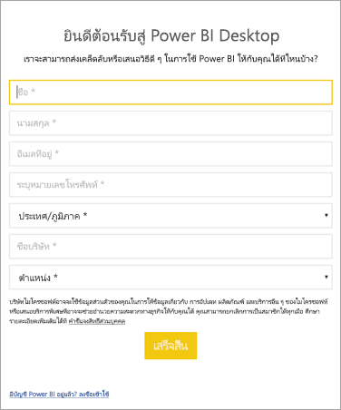

# <a name="administrators-manage-the-power-bi-desktop-sign-in-form"></a>ผู้ดูแลระบบ: จัดการแบบฟอร์มการลงชื่อเข้าใช้ Power BI Desktop
ในครั้งแรกที่ Power BI Desktop เปิดตัว แบบฟอร์มการลงชื่อเข้าใช้จะปรากฏขึ้น สามารถกรอกข้อมูล หรือลงชื่อเข้าใช้ Power BI เพื่อดำเนินการต่อได้ ผู้ดูแลระบบจัดการแบบฟอร์มนี้โดยใช้รีจิสทรีคีย์ 



ผู้ดูแลระบบใช้รีจิสทรีคีย์ต่อไปนี้เพื่อปิดการใช้งานแบบฟอร์มลงชื่อเข้าใช้ ซึ่งยังสามารถใช้กับทั้งองค์กรโดยใช้นโยบายส่วนกลาง

```
Key: HKEY_CURRENT_USER\SOFTWARE\Policies\Microsoft\Microsoft Power BI Desktop
valueName: ShowLeadGenDialog
```
คุณยังสามารถลองใช้คีย์ต่อไปนี้ซึ่งสามารถทำงานได้ดีกับลูกค้าบางรายตามการกำหนดค่าของพวกเขา:

```
Key: HKEY_CURRENT_USER\SOFTWARE\Microsoft\Microsoft Power BI Desktop
valueName: ShowLeadGenDialog
```

ค่าของ 0 จะปิดการใช้งานกล่องโต้ตอบ


มีคำถามเพิ่มเติมหรือไม่ [ลองถามชุมชน Power BI](https://community.powerbi.com/)

