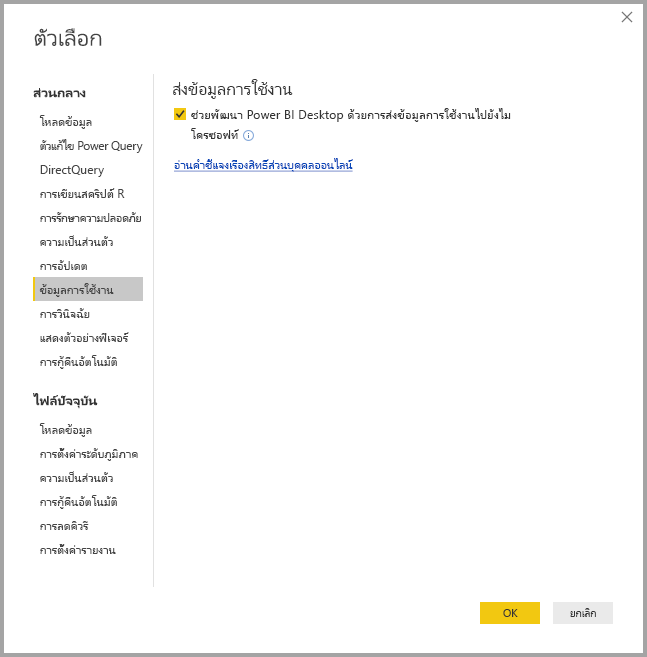

# ระดับความเป็นส่วนตัวของ Power BI Desktop

ที่ Microsoft เราทำงานอย่างหนักเพื่อปกป้องความเป็นส่วนตัวของคุณขณะกำลังแสดงผลิตภัณฑ์ที่ให้คุณมีประสิทธิภาพการทำงาน ความสามารถ และความสะดวกที่คุณต้อง การ Microsoft รวบรวมข้อมูลบางอย่างเกี่ยวกับการใช้งาน Power BI Desktop ของคุณเพื่อช่วยในการวินิจฉัยปัญหา และการปรับปรุงผลิตภัณฑ์ สำหรับรายละเอียดเพิ่มเติมเกี่ยวกับแนวทางปฏิบัติความเป็นส่วนตัวของ Microsoft โปรดตรวจทานคำชี้แจงสิทธิ์ส่วนบุคคลของ Microsoft ซึ่งมันถูกนำไปใช้กับข้อมูลเราเก็บรวบรวมจากการใช้งาน**Power BI Desktop**
 
ข้อมูลที่เราเก็บรวบรวมจากผู้ใช้ **Power BI Desktop** สามารถรวมข้อมูลบนระบบปฏิบัติการ ข้อมูล Power BI Desktop และ รุ่นของ Internet Explorer ได้ 
 
ถ้าคุณต้องการปฏิเสธเข้าร่วมการรวบรวมข้อมูลนี้ คุณสามารถไปที่**ไฟล์ > ตัวเลือกและการตั้งค่า > ตัวเลือก**และคง**ข้อมูลการใช้งาน**แท็บ ยกเลิกเลือก**ส่งข้อมูลการใช้งาน**กล่องกาเครื่องหมาย ดังที่แสดงในรูปต่อไปนี้

## ส่งข้อมูลเพิ่มเติม

ถ้าคุณพบปัญหาการหยุดทำงาน หรือปัญหาอื่น ๆ คุณสามารถเลือกที่จะส่งรายงานข้อผิดพลาด และข้อมูลเพิ่มเติมที่อาจช่วยให้เราแก้ไขปัญหาในรุ่นต่อ ๆ ไปในอนาคตได้ เรายังรวบรวมข้อมูลเกี่ยวกับสถานะของการ**Power BI Desktop**ไฟล์ที่คุณกำลังทำงานอยู่ เช่น ตำแหน่งที่ตั้งของเอกสาร คุณลักษณะตัวอย่างที่จะเปิดใช้งาน และโหมดที่เก็บ ซึ่งสามารถรวมภาพถ่ายหน้าจอ ข้อความข้อผิดพลาด และสูตรจากแบบจำลองของคุณ รายการเหล่านี้อาจรวมถึงเนื้อหาของไฟล์ที่คุณกำลังใช้อยู่เมื่อเกิดข้อผิดพลาด ดังนั้นคุณควรตรวจทานก่อนที่ส่ง เราแจ้งเตือนคุณก่อนที่จะส่ง ซึ่งคุณสามารถเลือกข้อมูลที่จะส่งไปยัง Microsoft  
 
ถ้าคุณไม่ต้องการส่งข้อมูลนี้ คุณสามารถคลิก**ปิด**เมื่อมีข้อผิดพลาดเกิดขึ้น หรือปฏิเสธการส่งข้อมูลการใช้งานตามที่อธิบายไว้ข้างต้นได้ 

