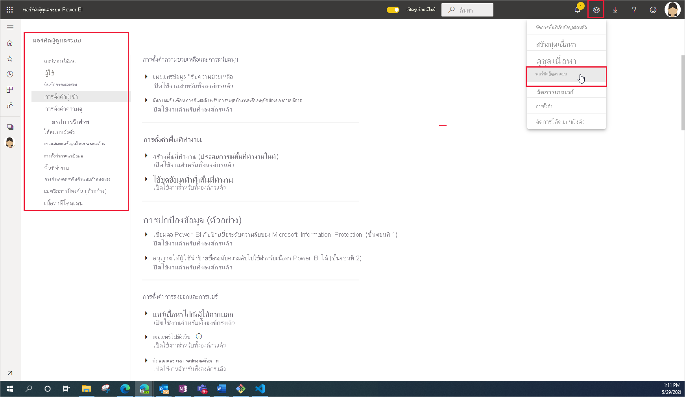

# การดูแลระบบ Power BI คืออะไร

การดูแลระบบ Power BI คือการจัดการการตั้งค่าทั้งองค์กรที่ควบคุมวิธีการทำงานของ Power BI ผู้ใช้ที่ได้รับมอบหมายบทบาทผู้ดูแลระบบกำหนดค่า ตรวจสอบ และเตรียมใช้งานทรัพยากรขององค์กร บทความนี้ให้ภาพรวมของบทบาทการดูแล งาน และเครื่องมือต่าง ๆ เพื่อช่วยคุณเริ่มต้น

## บทบาทผู้ดูแลระบบที่เกี่ยวข้องกับ Power BI

มีบทบาทหลายอย่างที่ทำงานร่วมกันเพื่อดูแล Power BI สำหรับองค์กรของคุณ มีการมอบหมายบทบาทผู้ดูแลระบบส่วนใหญ่ในศูนย์การจัดการ Microsoft 365 หรือโดยใช้ PowerShell มีการมอบหมายบทบาทผู้ดูแลระบบ Power BI Premium Capacity และ Power BI Embedded Capacity เมื่อสร้างความจุ หากต้องการเรียนรู้เพิ่มเติมเกี่ยวกับบทบาทผู้ดูแลระบบแต่ละคน โปรดดู [เกี่ยวกับบทบาทผู้ดูแลระบบ](https://docs.microsoft.com/microsoft-365/admin/add-users/about-admin-roles?view=o365-worldwide) เมื่อต้องการเรียนรู้วิธีการกำหนดบทบาทผู้ดูแลระบบ ให้ดู [กำหนดบทบาทผู้ดูแลระบบ](https://docs.microsoft.com/microsoft-365/admin/add-users/assign-admin-roles?view=o365-worldwide)

| **ชนิดของผู้ดูแลระบบ** | **ขอบเขตการดูแลระบบ** | **งาน Power BI** |
| --- | --- | --- |
| ผู้ดูแลระบบส่วนกลาง | Microsoft 365 | มีการเข้าถึงคุณลักษณะการจัดการทั้งหมดสำหรับองค์กรได้ไม่จำกัด |
| | | มอบหมายบทบาทให้กับผู้ใช้อื่น |
| ผู้ดูแลการเรียกเก็บเงิน | Microsoft 365 | จัดการการสมัครใช้งาน |
| | | ซื้อสิทธิการใช้งาน |
| ผู้ดูแลสิทธิการใช้งาน | Microsoft 365 | มอบหมายหรือลบสิทธิการใช้งาน |
| ผู้ดูแลระบบผู้ใช้ | Microsoft 365 | สร้างและจัดการผู้ใช้และกลุ่ม |
| | | รีเซ็ตรหัสผ่านของผู้ใช้ |
| ผู้ดูแลระบบ Power BI | บริการ Power BI | การเข้าถึงงานการจัดการ Power BI แบบเต็มรูปแบบ|
| | | เปิดและปิดใช้งานคุณลักษณะของ Power BI |
| | | รายงานการใช้งานและประสิทธิภาพ |
| | | ตรวจทานและจัดการการตรวจสอบ |
| ผู้ดูแลระบบ Power BI Premium Capacity | ความจุ Premium เดียว | กำหนดพื้นที่ทำงานสำหรับความจุ|
| | | จัดการสิทธิ์ของผู้ใช้ไปยังความจุ |
| | | จัดการปริมาณงานเพื่อกำหนดค่าการใช้หน่วยความจำ |
| | | รีสตาร์ทความจุ |
| ผู้ดูแลระบบ Power BI Embedded Capacity | ความจุ Embedded เดียว | กำหนดพื้นที่ทำงานสำหรับความจุ|
| | | จัดการสิทธิ์ของผู้ใช้ไปยังความจุ |
| | | จัดการปริมาณงานเพื่อกำหนดค่าการใช้หน่วยความจำ |
| | | รีสตาร์ทความจุ |

## งานและเครื่องมือดูแลระบบ

ผู้ดูแลระบบ Power BI ทำงานส่วนใหญ่ในพอร์ทัลผู้ดูแลระบบ Power BI อย่างไรก็ตาม คุณควรคุ้นเคยกับเครื่องมือที่เกี่ยวข้องและศูนย์การจัดการ ดูตารางด้านบนเพื่อกำหนดบทบาทที่ต้องใช้ในการทำงานโดยใช้เครื่องมือที่แสดงไว้ที่นี่

| **เครื่องมือ** | **งานที่ทำทั่วไป** |
| --- | --- |
| [พอร์ทัลผู้ดูแล Power BI](https://app.powerbi.com/admin-portal) | จัดหา และทำงานกับความจุพรีเมียม |
| | รักษาคุณภาพของบริการ |
| | จัดการพื้นที่ทำงาน |
| | เผยแพร่วิชวล Power BI |
| | ตรวจสอบรหัสที่ใช้การฝัง Power BI ในแอปพลิเคชันอื่น ๆ |
| | แก้ไขปัญหาการเข้าถึงข้อมูลและปัญหาอื่น ๆ |
| [ศูนย์การจัดการ Microsoft 365](https://admin.microsoft.com) | จัดการผู้ใช้และกลุ่ม |
| | ซื้อและกำหนดสิทธิการใช้งาน |
| | บล็อกผู้ใช้จากการเข้าถึง Power BI |
| [ศูนย์การรักษาความปลอดภัยและการปฏิบัติตามนโยบาย Microsoft 365](https://protection.office.com) | ตรวจทานและจัดการการตรวจสอบ |
| | การติดตามและการจัดประเภทข้อมูล |
| | นโยบายการป้องกันการสูญหายของข้อมูล |
| | การกำกับดูแลข้อมูล |
| [Azure Active Directory (AAD) ในพอร์ทัล Azure](https://aad.portal.azure.com) | กำหนดค่าเงื่อนไขการเข้าถึงแหล่งข้อมูล Power BI |
| | เตรียมใช้งานความจุ Power BI Embedded |
| [cmdlets ของ PowerShell](https://docs.microsoft.com/powershell/power-bi/overview) | จัดการพื้นที่ทำงานและลักษณะอื่น ๆ ของ Power BI ผ่านสคริปต์ |
| [Api และ SDK การดูแลระบบ](service-admin-reference.md) | สร้างเครื่องมือผู้ดูแลระบบแบบกำหนดเอง ตัวอย่างเช่น Power BI Desktop สามารถใช้ API เหล่านี้เพื่อสร้างรายงานจากข้อมูลที่เกี่ยวข้องกับการดูแลระบบ |

## ขั้นตอนถัดไป

เมื่อคุณทราบพื้นฐานของสิ่งที่เกี่ยวข้องกับการดูแลระบบ Power BI แล้ว ให้ศึกษาบทความเหล่านี้เพื่อเรียนรู้เพิ่มเติม:

- [ใช้พอร์ทัลผู้ดูแล Power BI](service-admin-portal.md)
- [คำแนะนำเกี่ยวกับการตั้งค่าผู้ดูแลระบบของผู้เช่า](../guidance/admin-tenant-settings.md)
- [ใช้ PowerShell cmdlets](https://docs.microsoft.com/powershell/power-bi/overview)
- [การดูแล Power BI คำถามที่ถามบ่อย](service-admin-faq.md)
- [การให้สิทธิการใช้งานบริการ Power BI สำหรับผู้ที่อยู่ในองค์กรของคุณ](service-admin-licensing-organization.md)
- มีคำถามหรือไม่ [ลองถามชุมชน Power BI](https://community.powerbi.com/)
- มีข้อเสนอแนะไหม [สนับสนุนแนวคิดในการปรับปรุง Power BI](https://ideas.powerbi.com/)
