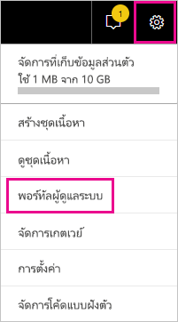

# <a name="track-user-activities-in-power-bi"></a>ติดตามกิจกรรมของผู้ใช้ใน Power BI

การทราบว่าใครกำลังดำเนินการอะไร และในรายการใดใน Power BI ของคุณ เป็นสิ่งสำคัญที่สามารถช่วยให้องค์กรของคุณปฏิบัติตามข้อกำหนดได้ เช่น การปฏิบัติตามข้อบังคับการประชุมและการจัดการบันทึกต่าง ๆ เมื่อใช้ Power BI คุณมีสองตัวเลือกในการติดตามกิจกรรมของผู้ใช้: [บันทึกกิจกรรมของ Power BI](#use-the-activity-log) และ [บันทึกการตรวจสอบแบบรวม](#use-the-audit-log) บันทึกเหล่านี้ทั้งคู่ประกอบด้วยสำเนาทั้งหมดของ [ข้อมูลการตรวจสอบ Power BI](#operations-available-in-the-audit-and-activity-logs) แต่มีความแตกต่างที่สำคัญหลายอย่างตามที่สรุปในตารางต่อไปนี้

| **บันทึกการตรวจสอบแบบรวม** | **บันทึกกิจกรรม Power BI** |
| --- | --- |
| รวมเหตุการณ์จาก SharePoint Online, Exchange Online, Dynamics 365 และบริการอื่นๆ นอกเหนือจากเหตุการณ์การตรวจสอบ Power BI | รวมเฉพาะเหตุการณ์การตรวจสอบ Power BI |
| เฉพาะผู้ใช้ที่มีสิทธิ์ในการบันทึกการตรวจสอบหรือบันทึกการตรวจสอบแบบดูเท่านั้นที่สามารถเข้าถึงได้ เช่น ผู้ดูแลระบบและผู้สอบบัญชีส่วนกลาง | ผู้ดูแลระบบส่วนกลางและผู้ดูแลระบบบริการของ Power BI มีสิทธิ์เข้าถึง |
| ผู้ดูแลระบบส่วนกลางและผู้ตรวจสอบสามารถค้นหาบันทึกการตรวจสอบแบบรวมได้โดยใช้ศูนย์การรักษาความปลอดภัย Microsoft 365 และศูนย์การปฏิบัติตามข้อบังคับ Microsoft 365 | ยังไม่มีอินเทอร์เฟซผู้ใช้ในการค้นหาบันทึกกิจกรรม |
| ผู้ดูแลระบบส่วนกลางและผู้ตรวจสอบสามารถดาวน์โหลดรายการบันทึกการตรวจสอบได้โดยใช้ API การจัดการของ Microsoft 365 และ cmdlets | ผู้ดูแลระบบส่วนกลางและผู้ดูแลระบบบริการของ Power BI สามารถดาวน์โหลดบันทึกรายการกิจกรรมโดยใช้ Power BI REST API และ cmdlet การจัดการ |
| เก็บข้อมูลการตรวจสอบเป็นเวลา 90 วัน | เก็บข้อมูลกิจกรรมเป็นเวลา 30 วัน (มุมมองสาธารณะ) |
| เก็บรักษาข้อมูลการตรวจสอบแม้ว่าผู้เช่าจะถูกย้ายไปยังภูมิภาค Azure อื่นก็ตาม | ไม่เก็บรักษาข้อมูลการตรวจสอบเมื่อผู้เช่าถูกย้ายไปยังภูมิภาค Azure อื่น |


## <a name="use-the-activity-log"></a>ใช้บันทึกกิจกรรม

ในฐานะผู้ดูแลระบบบริการ Power BI คุณสามารถวิเคราะห์การใช้งานสำหรับทรัพยากร Power BI ทั้งหมดที่ระดับผู้เช่าโดยใช้รายงานแบบกำหนดเองโดยยึดตามบันทึกกิจกรรมของ Power BI คุณสามารถดาวน์โหลดกิจกรรมโดยใช้ REST API หรือ PowerShell cmdlet คุณยังสามารถกรองข้อมูลกิจกรรมตามช่วงวันที่ ผู้ใช้และประเภทกิจกรรมได้

### <a name="activity-log-requirements"></a>ข้อกำหนดของบันทึกกิจกรรม

คุณต้องตรงตามข้อกำหนดเหล่านี้เพื่อเข้าถึงบันทึกกิจกรรมของ Power BI:

- คุณต้องเป็นผู้ดูแลระบบส่วนกลางหรือผู้ดูแลระบบบริการของ Power BI
- คุณได้ติดตั้ง [cmdlets การจัดการ Power BI](https://www.powershellgallery.com/packages/MicrosoftPowerBIMgmt) ไว้ในเครื่องหรือใช้ cmdlets การจัดการ Power BI ใน Azure Cloud Shell

### <a name="activityevents-rest-api"></a>ActivityEvents REST API

คุณสามารถใช้แอปพลิเคชันการดูแลระบบที่อาศัย Power BI REST API เพื่อส่งออกเหตุการณ์กิจกรรมลงในที่เก็บ blob หรือฐานข้อมูล SQL จากนั้นคุณสามารถสร้างรายงานการใช้งานแบบกำหนดเองที่ด้านบนของข้อมูลที่ส่งออก ในการเรียกใช้ **ActivityEvents** REST API คุณต้องระบุวันที่เริ่มต้นและวันที่สิ้นสุดและตัวกรองที่เป็นตัวเลือกเสริมเพื่อเลือกกิจกรรมตามประเภทกิจกรรมหรือ ID ผู้ใช้ เนื่องจากบันทึกกิจกรรมอาจประกอบด้วยข้อมูลจำนวนมาก **ActivityEvents** API ในขณะนี้รองรับการดาวน์โหลดข้อมูลสูงสุดหนึ่งวันต่อการร้องขอหนึ่งครั้ง หรืออีกนัยหนึ่งคือต้องระบุวันที่เริ่มต้นและวันที่สิ้นสุดเป็นวันเดียวกัน ตามตัวอย่างต่อไปนี้ ตรวจสอบให้แน่ใจว่าคุณระบุค่าวันที่เวลาในรูปแบบเวลามาตรฐานสากล

```
https://api.powerbi.com/v1.0/myorg/admin/activityevents?startDateTime='2019-08-31T00:00:00'&endDateTime='2019-08-31T23:59:59'
```

หากจำนวนของรายการมีขนาดใหญ่ **ActivityEvents** API จะส่งกลับรายการและโทเค็นต่อเนื่องเพียงประมาณ 5,000 ถึง 10,000 รายการเท่านั้น เรียกใช้ **ActivityEvents** API อีกครั้งด้วยโทเค็นต่อเนื่องเพื่อรับรายการชุดต่อไป และถัดไปเรื่อย ๆ จนกระทั้งคุณได้รับรายการทั้งหมดและไม่ได้รับโทเค็นต่อเนื่องอีกต่อไป ตัวอย่างต่อไปนี้แสดงวิธีการใช้โทเค็นต่อเนื่อง

```
https://api.powerbi.com/v1.0/myorg/admin/activityevents?continuationToken='%2BRID%3ARthsAIwfWGcVAAAAAAAAAA%3D%3D%23RT%3A4%23TRC%3A20%23FPC%3AARUAAAAAAAAAFwAAAAAAAAA%3D'
```

โดยไม่คำนึงถึงจำนวนของรายการที่ส่งกลับ หากผลลัพธ์มีโทเค็นต่อเนื่อง ตรวจสอบให้แน่ใจว่าคุณเรียกใช้ API อีกครั้งโดยใช้โทเค็นนั้นเพื่อรับข้อมูลที่เหลือ จนกระทั่งไม่มีโทเค็นส่งกลับมาอีก ทั้งนี้อาจเกิดกรณีที่การโทรส่งโทเค็นต่อเนื่องกลับมาโดยไม่มีรายการเหตุการณ์ใดๆ ตัวอย่างต่อไปนี้แสดงวิธีการวนรอบกับโทเค็นการต่อเนื่องที่ส่งกลับมา:

```
while(response.ContinuationToken != null)
{
   // Store the activity event results in a list for example
    completeListOfActivityEvents.AddRange(response.ActivityEventEntities);

    // Make another call to the API with continuation token
    response = GetPowerBIActivityEvents(response.ContinuationToken)
}
completeListOfActivityEvents.AddRange(response.ActivityEventEntities);
```
> [!NOTE]
> ซึ่งอาจใช้เวลาสูงถึง 24 ชั่วโมงกว่าที่เหตุการณ์ทั้งหมดจะปรากฏขึ้น แต่โดยทั่วไปข้อมูลแบบเต็มจะพร้อมใช้งานเร็วกว่ามาก
>
>
### <a name="get-powerbiactivityevent-cmdlet"></a>Get-PowerBIActivityEvent cmdlet

ดาวน์โหลดเหตุการณ์กิจกรรมโดยใช้ cmdlet ของ Power BI Management สำหรับ PowerShell **Get-PowerBIActivityEvent** cmdlet จัดการโทเค็นความต่อเนื่องให้คุณโดยอัตโนมัติ **Get-PowerBIActivityEvent** cmdlet ใช้พารามิเตอร์ StartDateTime และ EndDateTime ด้วยข้อจำกัดเดียวกันกับ **ActivityEvents** REST API กล่าวคือวันที่เริ่มต้นและวันที่สิ้นสุดต้องอ้างอิงค่าวันที่เดียวกันเนื่องจากคุณสามารถเรียกใช้ข้อมูลกิจกรรมได้ครั้งละหนึ่งวันเท่านั้น

สคริปต์ต่อไปนี้สาธิตวิธีการดาวน์โหลดกิจกรรม Power BI ทั้งหมด คำสั่งแปลงผลลัพธ์จาก JSON ลงในอ็อปเจ็กต์ .NET เพื่อให้เข้าถึงแต่ละคุณสมบัติกิจกรรมได้โดยตรง ตัวอย่างเหล่านี้แสดงการประทับเวลาที่น้อยที่สุดและมากที่สุดเท่าที่เป็นไปได้สำหรับหนึ่งวันเพื่อให้แน่ใจว่าไม่พลาดเหตุการณ์ใดเลย

```powershell
Login-PowerBI

$activities = Get-PowerBIActivityEvent -StartDateTime '2019-08-31T00:00:00' -EndDateTime '2019-08-31T23:59:59' | ConvertFrom-Json

$activities.Count
$activities[0]

```

### <a name="filter-activity-data"></a>กรองข้อมูลกิจกรรม

คุณสามารถกรองเหตุการณ์กิจกรรมตามประเภทกิจกรรมและ ID ผู้ใช้ สคริปต์ต่อไปนี้สาธิตวิธีการดาวน์โหลดเฉพาะข้อมูลเหตุการณ์สำหรับกิจกรรม **ViewDashboard** สำหรับข้อมูลเพิ่มเติมเกี่ยวกับพารามิเตอร์ที่รองรับ ให้ใช้คำสั่ง `Get-Help Get-PowerBIActivityEvent`

```powershell
Login-PowerBI

$activities = Get-PowerBIActivityEvent -StartDateTime '2019-08-31T00:00:00' -EndDateTime '2019-08-31T23:59:59' -ActivityType 'ViewDashboard' | ConvertFrom-Json

$activities.Count
$activities[0]

```

## <a name="use-the-audit-log"></a>ใช้บันทึกการตรวจสอบ

หากงานของคุณคือการติดตามกิจกรรมผู้ใช้ทั่วทั้ง Power BI และ Microsoft 365 ให้คุณทำงานด้วยการตรวจสอบในศูนย์การรักษาความปลอดภัยและการปฏิบัติตามข้อบังคับ Office 365 หรือใช้ PowerShell การตรวจสอบขึ้นอยู่กับหน้าที่การใช้งานใน Exchange Online ซึ่งถูกเตรียมพร้อมใช้งานมาโดยอัตโนมัติเพื่อรองรับ Power BI

คุณสามารถกรองข้อมูลการตรวจสอบภายในได้ตามช่วงวัน ผู้ใช้ แดชบอร์ด รายงาน ชุดข้อมูล และประเภทกิจกรรมได้ นอกจากนี้ คุณยังสามารถดาวน์โหลดกิจกรรมในรูปแบบไฟล์ csv (คั่นด้วยจุลภาคค่า) เพื่อทำการวิเคราะห์แบบออฟไลน์ได้

### <a name="audit-log-requirements"></a>ข้อกำหนดบันทึกการตรวจสอบ

คุณต้องตรงตามข้อกำหนดเหล่านี้เพื่อเข้าถึงบันทึกการตรวจสอบ:

- การเข้าถึงบันทึกการตรวจสอบใน Exchange Online ได้คุณจะต้องได้รับการแต่งตั้งให้เป็นผู้ดูแลระบบส่วนกลาง, ได้รับมอบหมายให้เข้าถึงบันทึกการตรวจสอบหรือได้รับอนุญาตให้สามารถเข้าดูข้อมูลได้อย่างเดียวเท่านั้น ตามค่าเริ่มต้น กลุ่มจัดการปฏิบัติตามกฎระเบียบและการจัดการองค์กรบนหน้ามีหน้าที่กำหนด**สิทธิ์**ให้กับในศูนย์การจัดการ Exchange

    เมื่อต้องการให้ผู้ใช้ที่ไม่ใช่ผู้ดูแลระบบเข้าถึงบันทึกการตรวจสอบบัญชี ให้เพิ่มผู้ใช้คนนั้นให้เป็นสมาชิกของกลุ่มที่มีหน้าที่เหล่านี้ อีกวิธีหนึ่งคือ คุณสามารถสร้างกลุ่มแบบกำหนดหน้าที่เองในศูนย์การจัดการ Exchange และกำหนดหน้าที่ให้เข้าถึงบันทึกการตรวจสอบหรือดูบันทึกการตรวจสอบได้เท่านั้นให้กับกลุ่มนี้ จากนั้นเพิ่มบัญชีผู้ไม่ใช่คนดูแลระบบเข้าไปยังกลุ่มใหม่นี้ สำหรับข้อมูลเพิ่มเติม ดูได้ที่[การจัดการหน้าที่ให้กับกลุ่มใน Exchange Online](/Exchange/permissions-exo/role-groups)

    หากคุณไม่สามารถเข้าไปที่ศูนย์การจัดการ Exchange จากศูนย์การจัดการ Microsoft 365 ได้ให้ไปที่ https://outlook.office365.com/ecp และลงชื่อเข้าโดยใช้ข้อมูลประจำตัวของคุณ

- ถ้าคุณมีสิทธิ์เข้าถึงบันทึกการตรวจสอบภายใจ แต่ไม่ใช่ผู้ดูแลระบบส่วนกลางหรือผู้ดูแลระบบบริการ Power BI คุณจะไม่สามารถเข้าถึงพอร์ทัล Power BI ผู้ดูแลระบบได้ ในกรณีนี้ ให้ใช้ลิงก์ตรงไปยัง [ศูนย์การรักษาความปลอดภัยและการปฏิบัติตามนโยบาย Office 365](https://sip.protection.office.com/#/unifiedauditlog)

### <a name="access-your-audit-logs"></a>เข้าถึงบันทึกการตรวจสอบของคุณ

หากต้องการเข้าถึงรายการบันทึก ก่อนอื่นให้ตรวจสอบให้แน่ใจว่าได้เปิดใช้งานการบันทึกใน Power BI สามารถดูข้อมูลเพิ่มเติมได้ที่ [บันทึกการตรวจสอบ](service-admin-portal.md#audit-logs) ในเอกสารประกอบของพอร์ทัลผู้ดูแลระบบ สามารถมีการหน่วงเวลาสูงสุด 48 ชั่วโมง ตั้งแต่การเปิดใช้งานการตรวจสอบ จนสามารถดูข้อมูลการตรวจสอบได้ ถ้าคุณยังไม่เห็นข้อมูลในทันที ดูบันทึกการตรวจสอบในภายหลัง อาจมีความล่าช้าแบบเดียวกันระหว่าง เวลาที่ได้รับสิทธิ์ในการดูบันทึกการตรวจสอบ จนถึงเวลาที่สามารถเข้าถึงแฟ้มบันทึก

บันทึกการตรวจสอบ Power BI จะพร้อมใช้งานโดยตรงผ่าน [ศูนย์การรักษาความปลอดภัยและการปฏิบัติตามนโยบาย Office 365](https://sip.protection.office.com/#/unifiedauditlog) และยังมีลิงก์จากพอร์ทัลผู้ดูแลระบบ Power BI:

1. ใน Power BI เลือก **ไอคอนเฟือง** มุมขวาด้านบน จากนั้นเลือก **พอร์ทัลผู้ดูแลระบบ**

   

1. เลือก**บันทึกการตรวจสอบ**

1. เลือก**ไปที่ศูนย์ผู้ดูแลระบบ O365**

   

### <a name="search-only-power-bi-activities"></a>ค้นหากิจกรรม Power BI เท่านั้น

จำกัดผลลัพธ์เป็นกิจกรรม Power BI เท่านั้น โดยปฏิบัติตามขั้นตอนต่อไปนี้ สำหรับรายการของกิจกรรม โปรดดูรายการของ [กิจกรรมที่ตรวจสอบโดย Power BI](#operations-available-in-the-audit-and-activity-logs) ภายหลังในบทความนี้

1. ที่หน้า **ค้นหาบันทึกการตรวจสอบ** ใต้ **ค้นหา** เลือกรายการดรอปดาวน์สำหรับ **กิจกรรม**

2. เลือก **กิจกรรม Power BI**

   

3. เลือกที่ได้ก็ได้ภายนอกกล่องการเลือกเพื่อปิด

การค้นหาของคุณจะส่งค่ากลับมายัง Power BI เท่านั้น

### <a name="search-the-audit-logs-by-date"></a>ค้นหาบันทึกการตรวจสอบตามวัน

คุณสามารถค้นหาบันทึกตามช่วงวันที่ได้โดยใช้เขตข้อมูล **วันเริ่มต้น** และ **วันที่สิ้นสุด** การตั้งค่าเริ่มต้นผ่านมาแล้วเมื่อเจ็ดวันที่ผ่านมา วันและเวลาจะแสดงในรูปแบบเวลามาตรฐานสากล (UTC) ช่วงวันที่สูงสุดที่คุณสามารถระบุได้คือ 90 วัน 

จะมีข้อผิดพลาดแสดงถ้าเลือกช่วงวันมีค่ามากกว่า 90 วัน หากคุณกำลังใช้ช่วงวันที่สูงสุด 90 วัน เลือกเวลาปัจจุบันสำหรับ **วันเริ่มต้น** มิฉะนั้น คุณจะได้รับข้อผิดพลาดที่ระบุว่า วันที่เริ่มต้นเร็วกว่าวันที่สิ้นสุด หากคุณเปิดการตรวจสอบภายในช่วง 90 วันที่ผ่านมา ช่วงวันที่จะไม่สามารถเริ่มก่อนวันที่ที่เปิดใช้งานการตรวจสอบ


### <a name="search-the-audit-logs-by-users"></a>ค้นหาบันทึกการตรวจสอบตามผู้ใช้งาน

คุณสามารถค้นหารายการบันทึกการตรวจสอบสำหรับกิจกรรมต่าง ๆ ที่ดำเนินการโดยผู้ใช้ที่ระบุได้ ให้ใส่ชื่อผู้ใช้อย่างน้อยหนึ่งชื่อในเขตข้อมูล **ผู้ใช้** ชื่อผู้ใช้มีลักษณะเหมือนกับที่อยู่อีเมล ซึ่งเป็นบัญชีผู้ใช้ที่เข้าสู่ระบบ Power BI ด้วย ปล่อยให้กล่องนี้ว่างไว้เพื่อกลับไปยังรายการสำหรับผู้ใช้ทั้งหมด (และบัญชีบริการ) ในองค์กรของคุณ


### <a name="view-search-results"></a>ดูผลลัพธ์การค้นหา

หลังจากที่คุณเลือก**ค้นหา**ระบบจะโหลดผลลัพธ์การค้นหา หลังจากนั้นสักครู่ระบบจะแสดง**ผลลัพธ์** เมื่อเสร็จสิ้นการค้นหา จำนวนของผลลัพธ์ที่พบจะแสดงขึ้น **การค้นหาในบันทึกการตรวจสอบ**แสดงค่าสูงสุดของ 1000 เหตุการณ์ ถ้ามีเหตุการณ์มากกว่า 1000 เหตุการณ์ตรงกับเกณฑ์การค้นหาแอปจะแสดงเหตุการณ์ 1000 เหตุการณ์ใหม่ล่าสุด

#### <a name="view-the-main-results"></a>ดูผลลัพธ์หลัก

พื้นที่ **ผลลัพธ์** ประกอบด้วยข้อมูลต่อไปนี้สำหรับแต่ละเหตุการณ์ที่ส่งกลับโดยการค้นหา เลือกส่วนหัวของคอลัมน์ใต้ **ผลลัพธ์** เพื่อเรียงลำดับผลลัพธ์

| **คอลัมน์** | **คำนิยาม** |
| --- | --- |
| วันที่ |วันและเวลา (ในรูปแบบ UTC) ที่เกิดเหตุการณ์ |
| ที่อยู่ IP |IP แอดเดรสของอุปกรณ์ที่ใช้สำหรับการเข้าสู่ระบบ แอปจะแสดง IP  address ในรูปแบบที่อยู่ IPv4 หรือ IPv6 |
| ผู้ใช้ |ผู้ใช้ (หรือบัญชีบริการ) ซึ่งเป็นผู้ที่ดำเนินการกระทำที่ก่อให้เกิดเหตุการณ์ |
| กิจกรรม |กิจกรรมที่กระทำโดยผู้ใช้ ค่านี้สอดคล้องกับกิจกรรมที่คุณเลือกไว้ในรายการดรอปดาวน์ของ **กิจกรรม** สำหรับเหตุการณ์จากบันทึกการตรวจสอบผู้ดูแลระบบ Exchange ค่าในคอลัมน์นี้เป็น cmdlet Exchange |
| รายการ |ออบเจ็กต์จะถูกสร้างขึ้นหรือปรับเปลี่ยนแปลงเพราะผลลัพธ์ของกิจกรรมที่สอดคล้องกัน ตัวอย่างเช่นไฟล์ที่ดูหรือปรับเปลี่ยนหรือบัญชีผู้ใช้ที่อัปเดตแล้ว กิจกรรมบางอย่างอาจไม่มีค่าในคอลัมน์นี้ |
| รายละเอียด |รายละเอียดเพิ่มเติมเกี่ยวกับกิจกรรม ไม่ใช่ทุกกิจกรรมมีค่านี้ |

#### <a name="view-the-details-for-an-event"></a>ดูรายละเอียดสำหรับเหตุการณ์

หากต้องการดูรายละเอียดเพิ่มเติมเกี่ยวกับเหตุการณ์ ให้เลือกบันทึกเหตุการณ์ในรายการผลลัพธ์การค้นหา หน้า **รายละเอียด** จะแสดงขึ้น ซึ่งประกอบด้วยคุณสมบัติโดยละเอียดจากบันทึกเหตุการณ์ หน้า **รายละเอียด** จะปรากฏคุณสมบัติขึ้นอยู่กับบริการ Microsoft 365 ที่เหตุการณ์นั้นเกิดขึ้น

หากต้องการให้แสดงรายละเอียดเพิ่มเติม ให้เลือก **ข้อมูลเพิ่มเติม** รายการ Power BI ทั้งหมดมีค่า 20 สำหรับคุณสมบัติ RecordType สำหรับข้อมูลเกี่ยวกับคุณสมบัติอื่น ๆ ดู [คุณสมบัติโดยละเอียดในบันทึกการตรวจสอบ](/office365/securitycompliance/detailed-properties-in-the-office-365-audit-log/)

   

### <a name="export-search-results"></a>ส่งออกผลลัพธ์การค้นหา

หากต้องการส่งออกบันทึกการตรวจสอบ Power BI เป็นไฟล์ csv ให้ปฏิบัติตามขั้นตอนดังต่อไปนี้

1. เลือก**ส่งออกผลลัพธ์**

1. เลือก**บันทึกผลลัพธ์ที่โหลด**หรือ**ดาวน์โหลดผลลัพธ์ทั้งหมด** อย่างใดอย่างหนึ่ง

    

### <a name="use-powershell-to-search-audit-logs"></a>ใช้ PowerShell เพื่อค้นหาบันทึกการตรวจสอบ

คุณยังสามารถใช้ PowerShell เพื่อเข้าถึงบันทึกการตรวจสอบโดยยึดตามการเข้าสู่ระบบของคุณได้ ตัวอย่างต่อไปนี้แสดงวิธีการเชื่อมต่อไปยัง Exchange Online PowerShell และใช้คำสั่ง [Search-UnifiedAuditLog](/powershell/module/exchange/policy-and-compliance-audit/search-unifiedauditlog?view=exchange-ps/) เพื่อดึงรายการบันทึกการตรวจสอบ Power BI หากต้องการเรียกใช้สคริปต์ ผู้ดูแลระบบต้องกำหนดสิทธิ์ให้คุณอย่างเหมาะสม ตามที่อธิบายไว้ในการส่วนของ [ข้อกำหนดบันทึกการตรวจสอบ](#audit-log-requirements)

```powershell
Set-ExecutionPolicy RemoteSigned

$UserCredential = Get-Credential

$Session = New-PSSession -ConfigurationName Microsoft.Exchange -ConnectionUri https://outlook.office365.com/powershell-liveid/ -Credential $UserCredential -Authentication Basic -AllowRedirection

Import-PSSession $Session
Search-UnifiedAuditLog -StartDate 9/11/2018 -EndDate 9/15/2018 -RecordType PowerBI -ResultSize 1000 | Format-Table | More
```

### <a name="use-powershell-to-export-audit-logs"></a>ใช้ PowerShell เพื่อส่งออกบันทึกการตรวจสอบ

นอกจากนี้คุณยังสามารถใช้ PowerShell เพื่อส่งออกผลลัพธ์การค้นหาของบันทึกการตรวจสอบของคุณ ตัวอย่างต่อไปนี้แสดงวิธีการส่งจากคำสั่ง [Search-UnifiedAuditLog](/powershell/module/exchange/policy-and-compliance-audit/search-unifiedauditlog?view=exchange-ps/) และส่งออกผลลัพธ์โดยใช้ [Export-Csv](/powershell/module/microsoft.powershell.utility/export-csv) cmdlet หากต้องการเรียกใช้สคริปต์ ผู้ดูแลระบบต้องกำหนดสิทธิ์ให้คุณอย่างเหมาะสม ตามที่อธิบายไว้ในการส่วนของ [ข้อกำหนดบันทึกการตรวจสอบ](#audit-log-requirements)

```powershell
$UserCredential = Get-Credential

$Session = New-PSSession -ConfigurationName Microsoft.Exchange -ConnectionUri https://outlook.office365.com/powershell-liveid/ -Credential $UserCredential -Authentication Basic -AllowRedirection

Import-PSSession $Session
Search-UnifiedAuditLog -StartDate 9/11/2019 -EndDate 9/15/2019 -RecordType PowerBI -ResultSize 5000 |
Export-Csv -Path "c:\temp\PowerBIAuditLog.csv" -NoTypeInformation

Remove-PSSession $Session
```

สำหรับข้อมูลเกี่ยวกับการเชื่อมต่อกับ Exchange Online ให้ดู [เชื่อมต่อกับ Exchange Online PowerShell](/powershell/exchange/exchange-online/connect-to-exchange-online-powershell/connect-to-exchange-online-powershell/) ตัวอย่างอื่นของการใช้ PowerShell ด้วยบันทึกการตรวจสอบ ดู [การใช้บันทึกการตรวจสอบโดยใช้ Power BI และ PowerShell เพื่อกำหนดสิทธิ์การใช้งาน Power BI Pro](https://powerbi.microsoft.com/blog/using-power-bi-audit-log-and-powershell-to-assign-power-bi-pro-licenses/)

## <a name="operations-available-in-the-audit-and-activity-logs"></a>การดำเนินการที่พร้อมใช้งานในบันทึกการตรวจสอบและกิจกรรม

การดำเนินการต่อไปนี้พร้อมใช้งานทั้งในบันทึกการตรวจสอบและกิจกรรม

| ชื่อที่เรียกง่าย                                     | ชื่อการดำเนินการ                              | บันทึกย่อ                                  |
|---------------------------------------------------|---------------------------------------------|------------------------------------------|
| เข้าถึงตารางที่แนะนำของ Power BI ใน Excel | AnalyzedByExternalApplication |    |
| เพิ่มแหล่งข้อมูลไปยังเกตเวย์ Power BI แล้ว             | AddDatasourceToGateway                      |                                          |
| เพิ่มการเข้าถึงโฟลเดอร์ Power BI แล้ว                      | AddFolderAccess                             | ยังไม่ได้ใช้ในปัจจุบัน                       |
| เพิ่มสมาชิกกลุ่ม Power BI แล้ว                      | AddGroupMembers                             |                                          |
| ผู้ดูแลระบบแนบบัญชีเก็บข้อมูลกระแสข้อมูลไปยังผู้เช่า | AdminAttachedDataflowStorageAccountToTenant | ยังไม่ได้ใช้ในปัจจุบัน                       |
| ชุดข้อมูล Power BI ที่วิเคราะห์แล้ว                         | AnalyzedByExternalApplication               |                                          |
| วิเคราะห์รายงาน Power BI แล้ว                          | AnalyzeInExcel                              | สร้างขึ้นเมื่อผู้ใช้โต้ตอบกับบริการ การดาวน์โหลดไฟล์ `*.odc` ไม่ได้สร้างเหตุการณ์การตรวจสอบ                                         |
| แนบบัญชีที่จัดก็บข้อมูลกระแสข้อมูลแล้ว                 | AttachedDataflowStorageAccount              |                                          |
| ผูกชุดข้อมูล Power BI ไปยังเกตเวย์แล้ว                | BindToGateway                               |                                          |
| รีเฟรชกระแสข้อมูลที่ยกเลิกแล้ว                        | CancelDataflowRefresh                       |                                          |
| เปลี่ยนแปลงสถานะความจุแล้ว                            | ChangeCapacityState                         |                                          |
| เปลี่ยนแปลงการกำหนดผู้ใช้ความจุแล้ว                  | UpdateCapacityUsersAssignment               |                                          |
| เปลี่ยนแปลงการเชื่อมต่อชุดข้อมูล Power BI แล้ว              | SetAllConnections                           |                                          |
| เปลี่ยนผู้ดูแลระบบเกตเวย์ Power BI แล้ว                   | ChangeGatewayAdministrators                 |                                          |
| เปลี่ยนผู้ใช้แหล่งข้อมูลเกตเวย์ Power IB แล้ว        | ChangeGatewayDatasourceUsers                |                                          |
| สร้างชุดเนื้อหา Power BI ขององค์กรแล้ว      | CreateOrgApp                                |                                          |
| สร้างแอป Power BI แล้ว                              | CreateApp                                   |                                          |
| สร้างแดชบอร์ด Power BI แล้ว                        | CreateDashboard                             |                                          |
| สร้างกระแสข้อมูล Power BI แล้ว                         | CreateDataflow                              |                                          |
| สร้างชุดข้อมูล Power BI แล้ว                          | CreateDataset                               |                                          |
| สร้างการสมัครใช้งานอีเมล Power BI แล้ว               | CreateEmailSubscription                     |                                          |
| สร้างโฟลเดอร์ Power BI แล้ว                           | CreateFolder                                |                                          |
| เกตเวย์ Power BI ที่สร้างขึ้น                          | CreateGateway                               |                                          |
| สร้างกลุ่ม Power BI แล้ว                            | CreateGroup                                 |                                          |
| สร้างรายงาน Power BI แล้ว                           | CreateReport <sup>1</sup>                                |                                          |
| กระแสข้อมูลที่ย้ายไปยังบัญชีเก็บข้อมูลภายนอก     | DataflowMigratedToExternalStorageAccount    | ยังไม่ได้ใช้ในปัจจุบัน                       |
| การให้สิทธิ์กระแสข้อมูลที่เพิ่มเข้าไป                        | DataflowPermissionsAdded                    | ยังไม่ได้ใช้ในปัจจุบัน                       |
| การให้สิทธิ์กระแสข้อมูลที่ถูกลบ                      | DataflowPermissionsRemoved                  | ยังไม่ได้ใช้ในปัจจุบัน                       |
| ลบชุดเนื้อหา Power BI ขององค์กรแล้ว      | DeleteOrgApp                                |                                          |
| ลบข้อคิดเห็น Power BI แล้ว                          | DeleteComment                               |                                          |
| ลบแดชบอร์ด Power BI แล้ว                        | DeleteDashboard                             | ยังไม่ได้ใช้ในปัจจุบัน                       |
| ลบกระแสข้อมูล Power BI แล้ว                         | DeleteDataflow                              | ยังไม่ได้ใช้ในปัจจุบัน                       |
| ลบชุดข้อมูล Power BI แล้ว                          | DeleteDataset                               |                                          |
| ลบการสมัครใช้งานอีเมล Power BI แล้ว               | DeleteEmailSubscription                     |                                          |
| ลบโฟลเดอร์ Power BI แล้ว                           | DeleteFolder                                |                                          |
| ลบการเข้าถึงโฟลเดอร์ Power BI แล้ว                    | DeleteFolderAccess                          | ยังไม่ได้ใช้ในปัจจุบัน                       |
| เกตเวย์ Power BI ที่ตรวจพบ                          | DeleteGateway                               |                                          |
| ลบกลุ่ม Power BI แล้ว                            | DeleteGroup                                 |                                          |
| ลบรายงาน Power BI แล้ว                           | DeleteReport                                |                                          |
| ค้นพบแหล่งข้อมูลสำหรับชุดข้อมูล Power BI แล้ว          | GetDatasources                              |                                          |
| รายงาน Power BI ที่ดาวน์โหลด                        | DownloadReport                              |                                          |
| แก้ไขคุณสมบัติของกระแสข้อมูลแล้ว                        | EditDataflowProperties                      |                                          |
| แก้ไขการให้สิทธิ์ใบรับรอง Power BI แล้ว          | EditCertificationPermission                 | ยังไม่ได้ใช้ในปัจจุบัน                       |
| แก้ไขแดชบอร์ด Power BI แล้ว                         | EditDashboard                               | ยังไม่ได้ใช้ในปัจจุบัน                       |
| แก้ไขชุดข้อมูล Power BI แล้ว                           | EditDataset                                 |                                          |
| แก้ไขคุณสมบัติของชุดข้อมูล Power BI แล้ว                | EditDatasetProperties                       | ยังไม่ได้ใช้ในปัจจุบัน                       |
| แก้ไขรายงาน Power BI แล้ว                            | EditReport                                  |                                          |
| ส่งออกกระแสข้อมูล Power BI แล้ว                        | ExportDataflow                              |                                          |
| ส่งออกข้อมูลภาพรายงาน Power BI แล้ว              | ExportReport                                |                                          |
| ส่งออกข้อมูลไทล์ Power BI แล้ว                       | ExportTile                                  |                                          |
| การเพิ่มสิทธิ์กระแสข้อมูลล้มเหลว                | FailedToAddDataflowPermissions              | ยังไม่ได้ใช้ในปัจจุบัน                       |
| การลบสิทธิ์กระแสข้อมูลล้มเหลว             | FailedToRemoveDataflowPermissions           | ยังไม่ได้ใช้ในปัจจุบัน                       |
| สร้างโทเค็น SAS ของกระแสข้อมูล Power BI แล้ว             | GenerateDataflowSasToken                    |                                          |
| สร้างโทเค็นแบบฝังตัวของ Power BI แล้ว                    | GenerateEmbedToken                          |                                          |
| นำเข้าไฟล์ไปยัง Power BI แล้ว                         | นำเข้า                                      |                                          |
| ติดตั้ง Power BI แล้ว                            | InstallApp                                  |                                          |
| โยกย้ายพื้นที่ทำงานของแอปไปยังความจุแล้ว                  | MigrateWorkspaceIntoCapacity                |                                          |
| โพสต์ข้อคิดเห็น Power BI แล้ว                           | PostComment                                 |                                          |
| พิมพ์แดชบอร์ด Power BI แล้ว                        | PrintDashboard                              |                                          |
| พิมพ์หน้ารายงาน Power BI แล้ว                      | PrintReport                                 |                                          |
| เผยแพร่รายงาน Power BI ไปยังเว็บแล้ว                  | PublishToWebReport <sup>2</sup>                         |                                          |
| ตารางที่แนะนำที่เผยแพร่หรือปรับปรุงแล้ว | UpdateFeaturedTables <sup>3</sup>   | |
| ได้รับข้อมูลลับสำหรับกระแสข้อมูล Power BI จาก Key Vault แล้ว  | ReceiveDataflowSecretFromKeyVault           |                                          |
| ลบแหล่งข้อมูลออกจากเกตเวย์ Power BI แล้ว         | RemoveDatasourceFromGateway                 |                                          |
| ลบสมาชิกกลุ่ม Power BI แล้ว                    | DeleteGroupMembers                          |                                          |
| ลบพื้นที่ทำงานออกจากความจุแล้ว                 | RemoveWorkspacesFromCapacity                |                                          |
| เปลี่ยนชื่อแดชบอร์ด Power BI แล้ว                        | RenameDashboard                             |                                          |
| ร้องขอการรีเฟรชกระแสข้อมูล Power BI แล้ว               | RequestDataflowRefresh                      | ยังไม่ได้ใช้ในปัจจุบัน                       |
| ร้องขอการรีเฟรชชุดข้อมูล Power BI แล้ว                | RefreshDataset                              |                                          |
| เรียกคืนพื้นที่ทำงาน Power BI แล้ว                     | GetWorkspaces                               |                                          |
| ตั้งค่าตำแหน่งที่จัดเก็บกระแสข้อมูลสำหรับพื้นที่ทำงาน     | SetDataflowStorageLocationForWorkspace      |                                          |
| ตั้งค่าการรีเฟรชตามกำหนดเวลาบนกระแสข้อมูล Power BI        | SetScheduledRefreshOnDataflow               |                                          |
| ตั้งค่าการรีเฟรชตามกำหนดเวลาบนชุดข้อมูล Power BI         | SetScheduledRefresh                         |                                          |
| แชร์แดชบอร์ด Power BI แล้ว                         | ShareDashboard                              |                                          |
| แชร์รายงาน Power BI แล้ว                            | ShareReport                                 |                                          |
| เริ่มใช้งาน Power BI เวอร์ชั่นทดลองใช้ที่ขยายเวลา                   | OptInForExtendedProTrial                    | ยังไม่ได้ใช้ในปัจจุบัน                       |
| เริ่มต้นใช้งานเวอร์ชันทดลองของ Power BI แล้ว                            | OptInForProTrial                            |                                          |
| เข้าควบคุมแหล่งข้อมูล Power BI แล้ว                   | TakeOverDataset                          |                                          |
| เข้าควบคุมชุดข้อมูล Power BI แล้ว                        | TakeOverDataset                             |                                          |
| เข้าควบคุมกระแสข้อมูล Power BI แล้ว                     | TookOverDataflow                             |                                          |
| ยกเลิกเผยแพร่แอป Power BI แล้ว                          | UnpublishApp                                |                                          |
| อัปเดตการตั้งค่าการกำกับดูแลทรัพยากรความจุ      | UpdateCapacityResourceGovernanceSettings    | ปัจจุบันไม่อยู่ในศูนย์การจัดการ Microsoft 365 |
| อัปเดตผู้ดูแลความจุแล้ว                            | UpdateCapacityAdmins                        |                                          |
| อัปเดตชื่อที่แสดงความจุแล้ว                     | UpdateCapacityDisplayName                   |                                          |
| ปรับปรุงสิทธิ์การกำหนดที่จัดเก็บกระแสข้อมูลแล้ว   | UpdatedDataflowStorageAssignmentPermissions |                                          |
| อัปเดตการตั้งค่า Power BI ขององค์กรแล้ว          | UpdatedAdminFeatureSwitch                   |                                          |
| อัปเดตแอป Power BI แล้ว                              | UpdateApp                                   |                                          |
| อัปเดตกระแสข้อมูล Power BI แล้ว                         | UpdateDataflow                              |                                          |
| อัปเดตแหล่งข้อมูลสำหรับชุดข้อมูล Power BI แล้ว             | UpdateDatasources                           |                                          |
| อัปเดตพารามิเตอร์สำหรับชุดข้อมูล Power BI แล้ว               | UpdateDatasetParameters                     |                                          |
| อัปเดตการสมัครใช้งานอีเมล Power BI แล้ว               | UpdateEmailSubscription                     |                                          |
| อัปเดตโฟลเดอร์ Power BI แล้ว                           | UpdateFolder                                |                                          |
| อัปเดตการเข้าถึงโฟลเดอร์ Power BI แล้ว                    | UpdateFolderAccess                          |                                          |
| อัปเดตข้อมูลประจำตัวแหล่งข้อมูลเกตเวย์ Power IB แล้ว  | UpdateDatasourceCredentials                 |                                          |
| ดูแดชบอร์ด Power BI แล้ว                         | ViewDashboard                               |                                          |
| ดูกระแสข้อมูล Power BI แล้ว                          | ViewDataflow                                |                                          |
| ดูรายงาน Power BI แล้ว                            | ViewReport                                  |                                          |
| ดูไทล์ Power BI แล้ว                              | ViewTile                                    |                                          |
| ดูเมตริกการใช้งาน Power BI แล้ว                     | ViewUsageMetrics                            |                                          |
|                                                   |                                             |                                          |

<sup>1</sup> การเผยแพร่จาก Power BI Desktop ไปยังบริการคือเหตุการณ์ CreateReport ในบริการ

<sup>2</sup> PublishtoWebReport อ้างอิงถึงคุณลักษณะ [เผยแพร่ไปยังเว็บ](../collaborate-share/service-publish-to-web.md)

<sup>3</sup> UpdateFeaturedTables อ้างอิงถึง [ตารางที่แนะนำของ Power BI ใน Excel](../collaborate-share/service-excel-featured-tables.md)

## <a name="next-steps"></a>ขั้นตอนถัดไป

[การดูแลระบบ Power BI คืออะไร?](service-admin-administering-power-bi-in-your-organization.md)  

[พอร์ทัลผู้ดูแล Power BI](service-admin-portal.md)  

มีคำถามเพิ่มเติมหรือไม่ [ลองถามชุมชน Power BI](https://community.powerbi.com/)
