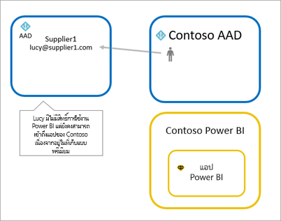
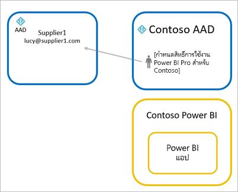

# กระจายเนื้อหา Power BI ไปยังผู้ใช้ที่เป็นผู้เยี่ยมชมจากภายนอกด้วย Azure AD B2B

Power BI เปิดใช้งานการแชร์เนื้อหากับผู้ใช้ที่เป็นผู้เยี่ยมชมภายนอกผ่านทาง Azure Active Directory Business-to-business (Azure AD B2B) เมื่อใช้ Microsoft Azure Active Directory B2B องค์กรของคุณจะเปิดใช้และควบคุมการแชร์กับผู้ใช้ภายนอกในส่วนกลาง ตามค่าเริ่มต้น ผู้เยี่ยมชมภายนอกจะมีประสบการณ์การใช้งานแบบรับชมเท่านั้น นอกจากนี้ คุณสามารถอนุญาตผู้ใช้เป็นผู้เยี่ยมชมภายนอกองค์กรของคุณเพื่อแก้ไข และจัดการเนื้อหาภายในองค์กรของคุณได้

บทความนี้ให้คำแนะนำเบื้องต้นเกี่ยวกับ Azure AD B2B ใน Power BI สำหรับข้อมูล ศึกษา[กระจายเนื้อหา Power BI ให้กับผู้ใช้ที่เป็นผู้เยี่ยมชมภายนอก โดยใช้ Azure Active Directory B2B](../guidance/whitepaper-azure-b2b-power-bi.md)

## เปิดใช้งานการเข้าถึง

ตรวจสอบให้แน่ใจว่าคุณเปิดใช้งานคุณลักษณะ [แบ่งปันเนื้อหากับผู้ใช้ภายนอก](service-admin-portal.md#export-and-sharing-settings) ในพอร์ทัลผู้ดูแลระบบ Power BI ก่อนเชิญผู้ใช้ที่เป็นผู้เยี่ยมชม แม้เมื่อเปิดใช้งานตัวเลือกนี้แล้ว ผู้ใช้จะต้องได้รับบทบาท Guest Inviter ใน Azure Active Directory เพื่อเชิญผู้ใช้ที่เป็นผู้เยี่ยมชม

ตัวเลือก [อนุญาตผู้ใช้เป็นผู้เยี่ยมชมภายนอกองค์กรเพื่อแก้ไข และจัดการเนื้อหาภายในองค์กร](service-admin-portal.md#allow-external-guest-users-to-edit-and-manage-content-in-the-organization) ช่วยให้คุณมอบความสามารถของผู้ใช้ที่เป็นผู้เยี่ยมชมดูและสร้างเนื้อหาในพื้นที่ทำงาน รวมถึงการเรียกดู Power BI ขององค์กรของคุณ

> [!NOTE]
> การตั้งค่า [แชร์เนื้อหากับผู้ใช้ภายนอก](service-admin-portal.md#export-and-sharing-settings) ควบคุมว่า Power BI อนุญาตการเชิญผู้ใช้ภายนอกไปยังองค์กรของคุณ หลังจากผู้ใช้ภายนอกยอมรับการเชิญแล้ว พวกเขาจะเปลี่ยนสถานะเป็นผู้ใช้ที่เป็นผู้เยี่ยมชมของ Azure AD B2B ในองค์กรของคุณ พวกเขาจะปรากฏอยู่ในตัวเลือกบุคคลตลอดประสบการณ์ใน Power BI หากการตั้งค่าถูกปิดใช้งานอยู่ ผู้ใช้ที่เป็นผู้เยี่ยมชมในองค์กรของคุณจะยังคงสามารถเข้าถึงรายการใดก็ตามที่พวกเขาได้เคยเข้าถึง และยังคงอยู่ในรายการประสบการณ์ของตัวเลือกบุคคล นอกจากนี้ ถ้าผู้ใช้ได้รับการเพิ่มเข้าผ่านวิธีการ[เชิญที่วางแผนไว้](#planned-invites) พวกเขาจะปรากฏในตัวเลือกบุคคลเช่นกัน เพื่อป้องกันไม่ให้ผู้ใช้ที่เป็นผู้เยี่ยมชมเข้าถึง Power BI ได้ ให้ใช้นโยบายการเข้าถึงแบบมีเงื่อนไขของ Microsoft Azure Active Directory

## คุณสามารถเชิญใครได้บ้าง

ที่อยู่อีเมลส่วนใหญ่สามารถรองรับการเชิญผู้ใช้แบบผู้เยี่ยมชม ซึ่งรวมถึงบัญชีอีเมลส่วนตัว เช่น gmail.com outlook.com และ hotmail.com ใน Azure AD B2B ที่อยู่เหล่านี้จะเรียกว่า *ข้อมูลประจำตัวเครือข่ายสังคม*

คุณไม่สามารถเชิญผู้ใช้ที่เชื่อมโยงกับระบบคลาวด์ของภาครัฐ เช่น [Power BI สำหรับส่วนราชการสหรัฐ](service-govus-overview.md) ได้

## เชิญผู้ใช้เป็นผู้เยี่ยมชม

เฉพาะผู้ใช้ที่เป็นผู้เยี่ยมชมเท่านั้นที่ต้องมีคำเชิญเป็นครั้งแรกที่คุณเชิญพวกเขาไปยังองค์กรของคุณ หากต้องการเชิญผู้ใช้ ให้ใช้คำเชิญที่วางแผนไว้หรือแบบเฉพาะกิจ

หากต้องการใช้คำเชิญเฉพาะกิจ ให้ใช้ความสามารถดังต่อไปนี้:

* การแชร์รายงานและแดชบอร์ด
* รายการการเข้าถึงแอป

คำเชิญเฉพาะกิจไม่ได้รับการสนับสนุนในรายการเข้าถึงพื้นที่ใช้งาน ใช้[วิธีการคำเชิญที่วางแผน](#planned-invites) เพื่อเพิ่มผู้ใช้เหล่านี้ลงในองค์กรของคุณ หลังจากผู้ใช้ภายนอกกลายเป็นผู้เยี่ยมชมในองค์กรของคุณแล้ว ให้เพิ่มพวกเขาลงในรายการเข้าถึงพื้นที่ทำงาน

### คำเชิญเข้าร่วมแผน

ใช้คำเชิญเข้าร่วมแผนหากคุณทราบว่าต้องการเชิญผู้ใด พอร์ทัล Microsoft Azure หรือ PowerShell ช่วยให้คุณสามารถส่งคำเชิญได้ คุณต้องได้รับมอบหมายบทบาทผู้ดูแลระบบของจึงจะสามารถเชิญผู้คนได้

ให้ปฏิบัติตามขั้นตอนเหล่านี้เพื่อส่งคำเชิญในพอร์ทัล Azure

1. ใน [พอร์ทัล Azure](https://portal.azure.com) เลือก **Azure Active Directory**

1. ภายใต้ **จัดการ** ให้ **ผู้ใช้** > **ผู้ใช้ทั้งหมด** > **ผู้ใช้ที่เป็นผู้เยี่ยมชมใหม่**

    

1. ใส่ **ที่อยู่อีเมล** และ **ข้อความส่วนบุคคล**

    

1. เลือก**เชิญ**

หากต้องการเชิญผู้ใช้ที่เป็นผู้เยี่ยมชมมากกว่าหนึ่งราย ให้ใช้ PowerShell หรือสร้างคำเชิญจำนวนมากใน Azure AD หากต้องการใช้ PowerShell สำหรับคำเชิญจำนวนมาก ให้ทำตามขั้นตอนใน [บทช่วยสอน: ใช้ PowerShell เพื่อเชิญผู้ใช้งานการทำงานร่วมกันของ Azure AD B2B จำนวนมาก](/azure/active-directory/b2b/bulk-invite-powershell/) หากต้องการใช้พอร์ทัล Azure สำหรับการเชิญจำนวนมาก ให้ทำตามขั้นตอนในบทช่วยสอน [: การเชิญผู้ใช้งานการทำงานร่วมกันของ Azure AD B2B จำนวนมาก](/azure/active-directory/b2b/tutorial-bulk-invite/)

ผู้ใช้ที่เป็นผู้เยี่ยมชมต้องเลือก **เริ่มต้น** ในคำเชิญทางอีเมลที่พวกเขาได้รับ จากนั้นผู้ใช้ที่เป็นผู้เยี่ยมชมจึงจะได้รับการเพิ่มไปยังองค์กร

### คำเชิญเฉพาะกิจ

หากต้องการเชิญผู้ใช้ภายนอกตลอดเวลา ให้เพิ่มผู้ใช้ภายนอกไปยังแดชบอร์ดหรือรายงานของคุณผ่านคุณลักษณะ หรือแอปที่ใช้ร่วมกันของคุณผ่านทางหน้าการเข้าถึง นี่คือตัวอย่างของสิ่งที่ต้องทำเมื่อเชิญผู้ใช้ภายนอกเข้ามาใช้แอป

ผู้ใช้ที่เป็นผู้เยี่ยมชมจะได้รับอีเมลที่ระบุว่าคุณแชร์แอปกับพวกเขา

ผู้ใช้ที่เป็นผู้เยี่ยมชมต้องลงชื่อเข้าใช้ด้วยที่อยู่อีเมลขององค์กรของพวกเขา พวกเขาจะได้รับพร้อมท์ให้ยอมรับคำเชิญหลังจากลงชื่อเข้าใช้ หลังจากลงชื่อเข้าใช้ แอปจะเปิดขึ้นสำหรับผู้ใช้เป็นผู้เยี่ยมชม หากต้องการกลับไปยังแอป ผู้ใช้ควรบุ๊กมาร์กลิงก์ หรือบันทึกอีเมล

## สิทธิ์การใช้งาน

ผู้ใช้ที่เป็นผู้เยี่ยมชมจำเป็นต้องมีสิทธ์การใช้งานที่ถูกต้องในการดูเนื้อหาที่ใช้ร่วมกัน มีสามวิธีในการตรวจสอบให้แน่ใจว่าผู้ใช้มีสิทธิการใช้งานที่ถูกต้อง: ใช้ Power BI Premium, มอบสิทธิการใช้งาน Power BI Pro หรือใช้สิทธิการใช้งาน Power BI Pro ของผู้เยี่ยมชม

[ผู้ใช้ที่เป็นผู้เยี่ยมชมที่สามารถแก้ไขและจัดการเนื้อหาในองค์กร](service-admin-portal.md#allow-external-guest-users-to-edit-and-manage-content-in-the-organization) จำเป็นต้องมีสิทธิ์ใช้งาน Power BI Pro เพื่อสนับสนุนเนื้อหาไปยังพื้นที่ทำงานหรือแบ่งปันเนื้อหากับผู้อื่น

### ใช้ Power BI Premium

การกำหนดพื้นที่ทำงานใน [ความจุของ Power BI Premium](service-premium-what-is.md) จะอนุญาตให้ผู้ใช้ที่เป็นผู้เยี่ยมชมสามารถเข้าใช้แอปได้โดยไม่จำเป็นต้องมีสิทธิ์การใช้งาน Power BI Pro Power BI Premium ยังอนุญาตให้แอปใช้ประโยชน์จากความสามารถอื่น ๆ อีกด้วย เช่น อัตราการรีเฟรชเพิ่ม, ความจุเฉพาะ และขนาดของแบบจำลองขนาดใหญ่

### กำหนดสิทธิ์การใช้งาน Power BI Pro ให้แก่ผู้ใช้ที่เป็นผู้เยี่ยมชม

การกำหนดสิทธิ์ใช้งาน Power BI Pro จากองค์กรของคุณให้แก่ผู้ใช้ที่เป็นผู้เยี่ยมชมจะทำให้ผู้ใช้ดังกล่าวสามารถดูเนื้อหาที่แชร์กับพวกเขาได้ สำหรับข้อมูลเพิ่มเติมเกี่ยวกับวิธีการกำหนดสิทธิ์การใช้งาน ให้ดู [กำหนดสิทธิ์การใช้งานให้ผู้ใช้ในหน้าสิทธิการใช้งาน](/office365/admin/manage/assign-licenses-to-users#assign-licenses-to-users-on-the-licenses-page) ก่อนที่จะกำหนดสิทธิ์การใช้งาน Pro ให้แก่ผู้เยี่ยมชม ให้ติดต่อเจ้าหน้าที่บัญชี Microsoft ของคุณเพื่อตรวจสอบให้แน่ใจว่าคุณได้ปฏิบัติตามข้อกำหนดของข้อตกลงของคุณกับ Microsoft

### ผู้ใช้ที่เป็นผู้เยี่ยมชมนำสิทธิ์การใช้งาน Power BI Pro ของพวกเขามาใช้

ผู้ใช้ที่เป็นผู้เยี่ยมชมอาจมีสิทธิ์ใช้งาน Power BI Pro ที่ได้รับมอบหมายผ่านองค์กรของตนเองอยู่แล้ว

## ผู้ใช้ที่เป็นผู้เยี่ยมชมที่สามารถแก้ไข และจัดการเนื้อหา

เมื่อใช้คุณลักษณะ [อนุญาตให้ผู้ใช้ที่เป็นผู้เยี่ยมชมภายนอกแก้ไขและจัดการเนื้อหาในองค์กร](service-admin-portal.md#allow-external-guest-users-to-edit-and-manage-content-in-the-organization) ผู้ใช้ที่เป็นผู้เยี่ยมชมที่ระบุจะได้รับสิทธิการเข้าถึง Power BI ขององค์กรของคุณ ผู้เยี่ยมชมที่ได้รับอนุญาตสามารถดูเนื้อหาที่พวกเขามีสิทธิ์ได้ อีกทั้งสามารถเข้าถึงหน้าแรก เรียกดูพื้นที่ทำงาน ติดตั้งแอป ตรวจสอบว่าตำแหน่งของพวกเขาในรายการเข้าถึง และมีส่วนร่วมในการสร้างเนื้อหาไปยังพื้นที่ทำงาน พวกเขาสามารถสร้างหรือเป็นผู้ดูแลระบบของพื้นที่ทำงานที่ใช้ประสบการณ์พื้นที่ทำงานใหม่ ใช้ข้อจำกัดบางอย่าง ส่วนข้อควรพิจารณาและขีดจำกัดจะระบุรายการข้อจำกัดเหล่านั้น

เพื่อช่วยให้ผู้เยี่ยมชมที่ได้รับอนุญาตลงชื่อเข้าใช้ Power BI ให้ระบุ URL ของผู้เช่า เมื่อต้องการค้นหา URL ของผู้เช่า กรุณาทำตามขั้นตอนเหล่านี้

1. ในบริการของ Power BI ในเมนูส่วนหัว เลือกการช่วยเหลือ ( **?** ) จากนั้นเลือก **เกี่ยวกับ Power BI**

2. ค้นหาค่าที่อยู่ถัดจาก **URL ของผู้เช่า** แชร์ URL ของผู้เช่ากับผู้ใช้ที่เป็นผู้เยี่ยมชมที่ได้รับอนุญาตของคุณ

    

## ข้อควรพิจารณาและข้อจำกัด

* ตามค่าเริ่มต้น Azure AD B2B ภายนอกจะจำกัดผู้เยี่ยมชมในการใช้เนื้อหาเท่านั้น ผู้เยี่ยมชม Azure AD B2B ภายนอกสามารถดูแอป แดชบอร์ด รายงาน ข้อมูลการส่งออก และสร้างการสมัครใช้งานอีเมลสำหรับแดชบอร์ดและรายงานได้ แต่ไม่สามารถเข้าถึงพื้นที่ทำงาน หรือเผยแพร่เนื้อหาของพวกเขา เพื่อนำข้อจำกัดเหล่านี้ออก คุณสามารถใช้คุณลักษณะ [อนุญาตให้ผู้ใช้ที่เป็นผู้เยี่ยมชมภายนอกแก้ไขและจัดการเนื้อหาในองค์กร](service-admin-portal.md#allow-external-guest-users-to-edit-and-manage-content-in-the-organization)

* ในการเชิญผู้ใช้ที่เป็นผู้เยี่ยมชม จำเป็นต้องต้องมีสิทธิ์ใช้งาน Power BI Pro ผู้ใช้ Pro รุ่นทดลองไม่สามารถเชิญผู้ใช้ที่เป็นผู้เยี่ยมชมใน Power BI ได้

* ประสบการณ์บางอย่างไม่พร้อมใช้งานสำหรับ[ผู้ใช้ที่เป็นผู้เยี่ยมชมซึ่งสามารถแก้ไขและจัดการเนื้อหาในองค์กร](service-admin-portal.md#allow-external-guest-users-to-edit-and-manage-content-in-the-organization) ในการอัปเดตหรือเผยแพร่รายงาน ผู้ใช้ที่เป็นผู้เยี่ยมชมต้องใช้บริการ Power BI รวมถึงรับข้อมูลเพื่ออัปโหลดไฟล์ Power BI Desktop  ประสบการณ์การใช้งานต่อไปนี้ไม่ได้รับการสนับสนุน:
  * เผยแพร่จาก Power BI desktop ไปยังบริการ Power BI โดยตรง
  * ผู้ใช้ที่เป็นผู้เยี่ยมชมไม่สามารถใช้ Power BI desktop เพื่อเชื่อมต่อกับชุดข้อมูลบริการในบริการ Power BI ได้
  * พื้นที่ทำงานแบบคลาสสิกที่ผูกกับ Microsoft 365 Groups
    * ผู้ใช้ที่เป็นผู้เยี่ยมชมไม่สามารถสร้างหรือเป็นผู้ดูแลระบบของพื้นที่ทำงานเหล่านี้ได้
    * ผู้ใช้ที่เป็นผู้เยี่ยมชมสามารถเป็นสมาชิกได้
  * การส่งคำเชิญเข้าร่วมเฉพาะกิจไม่ได้รับการสนับสนุนสำหรับรายการการเข้าถึงพื้นที่ทำงาน
  * Power BI Publisher สำหรับ Excel ไม่ได้รับการสนับสนุนสำหรับผู้ใช้ที่เป็นผู้เยี่ยมชม
  * ผู้ใช้ที่เป็นผู้เยี่ยมชมไม่สามารถติดตั้ง Power BI Gateway และเชื่อมต่อเกตเวย์กับองค์กรของคุณ
  * ผู้ใช้ที่เป็นผู้เยี่ยมชมไม่สามารถติดตั้งแอปที่เผยแพร่ไปยังทั้งองค์กร
  * ผู้ใช้ที่เป็นผู้เยี่ยมชมไม่สามารถใช้ สร้าง อัปเดต หรือติดตั้งชุดเนื้อหาองค์กร
  * ผู้ใช้ที่เป็นผู้เยี่ยมชมไม่สามารถใช้การวิเคราะห์ใน Excel
  * ผู้ใช้ที่เป็นผู้เยี่ยมชมไม่สามารถ @mentioned ในการแสดงข้อคิดเห็น
  * ผู้ใช้ที่เป็นผู้เยี่ยมชมไม่สามารถใช้การสมัครใช้งาน
  * ผู้ใช้ที่เป็นผู้เยี่ยมชมที่ใช้ความสามารถนี้ควรมีบัญชีของที่ทำงานหรือโรงเรียน

* ผู้ใช้ที่เป็นผู้เยี่ยมชมซึ่งใช้ข้อมูลประจำตัวเครือข่ายสังคม จะพบข้อจำกัดมากกว่าเนื่องด้วยข้อจำกัดการลงชื่อเข้าใช้
  * พวกเขาสามารถใช้ประสบการณ์การใช้งานในบริการของ Power BI ผ่านเว็บเบราว์เซอร์
  * พวกเขาไม่สามารถใช้แอป Power BI สำหรับอุปกรณ์เคลื่อนที่ได้
  * พวกเขาจะไม่สามารถลงชื่อเข้าใช้ในกรณีที่จำเป็นต้องมีบัญชีที่ทำงานหรือโรงเรียน

* คุณลักษณะนี้ยังไม่มีให้ใช้กับ web part รายงาน Power BI SharePoint Online

* มีการตั้งค่า Azure Active Directory ที่สามารถจำกัดสิ่งที่ผู้ใช้ที่เป็นผู้เยี่ยมชมภายนอกสามารถทำได้ภายในองค์กรโดยรวมของคุณ การตั้งค่าเหล่านั้นยังนำไปใช้กับสภาพแวดล้อม Power BI ของคุณด้วย เอกสารต่อไปนี้อธิบายถึงการตั้งค่า:
  * [จัดการการตั้งค่าการทำงานร่วมกันภายนอก](/azure/active-directory/b2b/delegate-invitations#configure-b2b-external-collaboration-settings)
  * [อนุญาตหรือบล็อกคำเชิญให้ผู้ใช้ B2B จากองค์กรที่เฉพาะเจาะจง](https://docs.microsoft.com/azure/active-directory/b2b/allow-deny-list)
  * [ใช้การเข้าถึงแบบมีเงื่อนไขเพื่ออนุญาตหรือบล็อกการเข้าถึง](/azure/active-directory/conditional-access/concept-conditional-access-cloud-apps)

* คุณสามารถแชร์เนื้อหาจากระบบคลาวด์ของภาครัฐเช่น GCC ไปยังผู้ใช้ระบบคลาวด์เชิงพาณิชย์ภายนอกได้ อย่างไรก็ตาม ผู้ใช้ที่เป็นผู้เยี่ยมชมไม่สามารถใช้สิทธิ์การใช้งานของตนเองได้ เนื้อหาต้องอยู่ในความจุที่กำหนดให้กับ Premium เพื่อเปิดใช้งานการเข้าถึง หรือคุณสามารถกำหนดสิทธิ์การใช้งาน Power BI Pro ให้กับบัญชีผู้เยี่ยมชมได้

* การแชร์ภายนอกองค์กรของคุณไม่ได้รับการสนับสนุนสำหรับระบบคลาวด์ระดับชาติ เช่น ประเทศเยอรมนีหรืออินสแตนซ์คลาวด์ของจีน อย่างได้ก็ตาม สามารถสร้างบัญชีผู้ใช้ในองค์กรของคุณที่ผู้ใช้ภายนอกสามารถใช้เพื่อเข้าถึงเนื้อหาได้

* หากคุณแชร์ไปยังผู้ใช้ที่เป็นผู้เยี่ยมชมโดยตรง Power BI จะส่งอีเมลที่มีลิงก์ดังกล่าวให้กับพวกเขา เพื่อหลีกเลี่ยงการส่งอีเมล ให้เพิ่มผู้ใช้ที่เป็นผู้เยี่ยมชมไปยังกลุ่มความปลอดภัย และแชร์ไปยังกลุ่มความปลอดภัย  

## ขั้นตอนถัดไป

เพื่อศึกษาข้อมูลรายละเอียดเพิ่มเติม รวมถึงวิธีการทำงานของความปลอดภัยระดับแถว โปรดดูที่เอกสารทางเทคนิค: [กระจายเนื้อหา Power BI ไปยังผู้ใช้ซึ่งเป็นผู้เยี่ยมชมจากภายนอกด้วย Azure AD B2B](https://aka.ms/powerbi-b2b-whitepaper)

สามารถดูข้อมูลเพิ่มเติมเกี่ยวกับ Azure AD B2B ได้ที่ [การทำงานร่วมกันของ Azure AD B2B คืออะไร?](/azure/active-directory/active-directory-b2b-what-is-azure-ad-b2b/)
