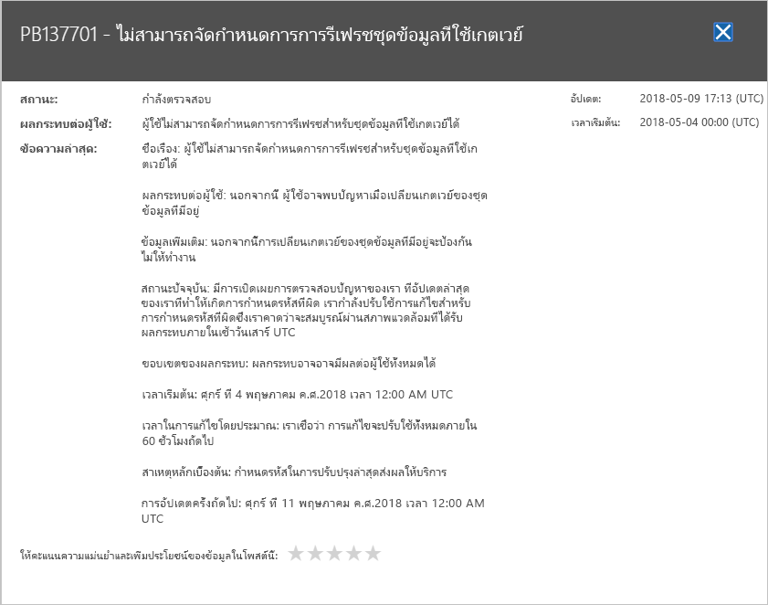

# ติดตามสถานภาพบริการ Power BI ใน Microsoft 365

ศูนย์การจัดการ Microsoft 365 มีเครื่องมือที่สำคัญสำหรับผู้ดูแลระบบ Power BI เครื่องมือนี้รวมข้อมูลปัจจุบันและอดีตเกี่ยวกับสุขภาพบริการ หากต้องการเข้าถึงข้อมูลบริการสุขภาพ คุณต้องได้รับหน้าที่เป็นหนึ่งในตำแหน่งต่อไปนี้:

* ผู้ดูแลระบบบริการ Power BI

* ผู้ดูแลระบบส่วนกลาง

สำหรับข้อมูลเพิ่มเติมเกี่ยวกับบทบาท ดู[บทบาทผู้ดูแลระบบที่เกี่ยวข้องกับ Power BI](service-admin-administering-power-bi-in-your-organization.md#administrator-roles-related-to-power-bi)

1. ลงชื่อเข้าใช้ [ศูนย์การจัดการ Microsoft 365](https://portal.office.com/adminportal)

1. จากบานหน้าต่างนำทาง ให้เลือก**แสดง** > **บริการสุขภาพ** > **ทั้งหมด** หน้าบริการสุขภาพจะปรากฏ:

    

1. จากรายการ **บริการทั้งหมด**ให้เลือก**คำแนะนำ** หรือ **เหตุการณ์**และตรวจสอบผลลัพธ์ ในสกรีนช็อตด้านล่าง คุณจะเห็นหนึ่งในสามคำแนะนำที่ใช้งานอยู่

    

1. เมื่อต้องการดูข้อมูลเพิ่มเติม เลือก**แสดงรายละเอียด**สำหรับรายการ ในสกรีนช็อตด้านล่าง คุณจะเห็นรายละเอียดเพิ่มเติม รวมถึงการปรับปรุงสถานะล่าสุดด้วย

    

    เลื่อนลงเพื่อดูข้อมูลเพิ่มเติม จากนั้นปิดบานหน้าต่างเมื่อคุณทำเสร็จแล้ว

1. ในการดูข้อมูลในอดีตทั่วทั้งบริการ ที่มุมบนขวาของ**หน้าบริการสุขภาพ** เลือก**ดูประวัติ** จากนั้นเลือก **7 วันที่ผ่าน**หรือ **30 วันที่ผ่าน** 

1. เมื่อต้องการกลับไปยังสถานภาพบริการปัจจุบัน เลือก**ดูสถานะปัจจุบัน**