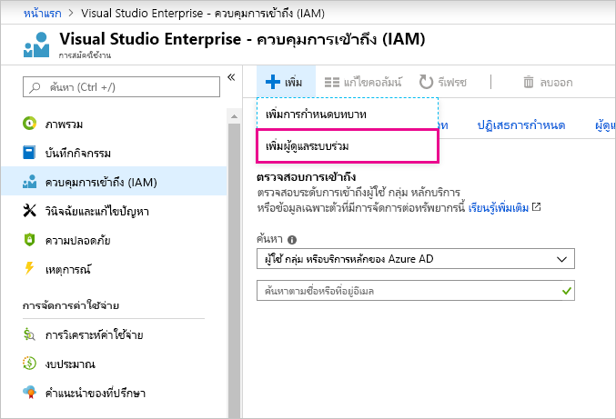

# การใช้บัญชีเดียวกันสำหรับ Power BI และ Azure

ถ้าคุณเป็นทั้งผู้ใช้ Power BI และ Azure คุณอาจต้องการใช้บัญชีเดียวกันสำหรับเข้าสู่ระบบทั้งสอง เพื่อคุณจะได้ไม่เป็นต้องพิมพ์รหัสผ่านของคุณซ้ำสองครั้ง

Power BI ลงชื่อคุณเข้าใช้ ด้วยบัญชีองค์กรของคุณ ซึ่งเชื่อมโยงกับที่อยู่อีเมลงานหรือโรงเรียนของคุณ  Azure ลงชื่อคุณเข้าใช้ ด้วยบัญชี Microsoft หรือบัญชีองค์กรของคุณ

ถ้าคุณต้องการใช้บัญชีเดียวกันสำหรับทั้ง Azure และ Power BI ให้แน่ใจว่าได้ลงชื่อเข้าใช้ Azure ด้วยบัญชีองค์กรของคุณ

**เกิดอะไรขึ้นถ้าฉันลงชื่อเข้าใช้ Azure ด้วยบัญชี Microsoft ของฉันไปแล้ว?**

คุณสามารถเพิ่มบัญชีผู้ใช้องค์กรของคุณเป็นผู้ดูแลร่วมใน Azure โดยทำตามขั้นตอนเหล่านี้

1. ลงชื่อเข้าใช้ไปยัง [พอร์ทัล Azure](https://portal.azure.com/) ถ้าคุณเป็นผู้ใช้ในหลายไดเรกทอรีใน Azure เลือก **การสมัครใช้งาน** และกรองเพื่อดูเฉพาะไดเรกทอรีและการสมัครใช้งานที่คุณต้องการแก้ไข

1. ในบานหน้าต่างการนำทาง ให้เลือก **ตัวควบคุมการเข้าถึง (IAM)** จากนั้นจึงเลือก **เพิ่ม** \> **เพิ่มผู้ดูแลระบบร่วม**

    

1. ใส่ที่อยู่อีเมลที่เชื่อมโยงกับบัญชีองค์กรของคุณ และเลือก **เพิ่ม**

1. ครั้งถัดไปที่คุณลงชื่อเข้าใช้ใน ฃพอร์ทัล Azure ให้ใช้ที่อยู่อีเมลองค์กรของคุณ

มีคำถามเพิ่มเติมหรือไม่ [ลองไปที่ชุมชน Power BI](https://community.powerbi.com/)
