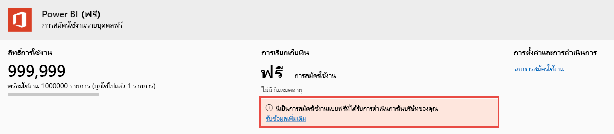

# ดูและจัดการใบอนุญาตของผู้ใช้ Power BI

บทความนี้อธิบายว่าผู้ดูแลระบบสามารถใช้ศูนย์การจัดการ Microsoft 365 หรือพอร์ทัล Azure เพื่อดูและจัดการใบอนุญาตของผู้ใช้สำหรับบริการ Power BI ได้อย่างไร

> [!NOTE]
>
>เป็นไปได้สำหรับผู้ใช้ที่มีทั้งสิทธิการใช้งาน Power BI (ฟรี) และ Power BI Pro ที่มอบหมาย ซึ่งสามารถเกิดขึ้นได้เมื่อผู้ใช้ลงทะเบียนสำหรับสิทธิการใช้งานฟรี และจากนั้นจะถูกมอบหมายสิทธิการใช้งาน Power BI Pro ให้ในภายหลัง ระดับสิทธิ์ใช้งานสูงสุดจะมีผลในกรณีนี้
>

## ดูการสมัครใช้งานของคุณ

หากต้องการดูการสมัครใช้งาน Power BI ที่องค์กรของคุณมี ให้ทำตามขั้นตอนเหล่านี้

1. ลงชื่อเข้าใช้ [ศูนย์การจัดการ Microsoft 365](https://admin.microsoft.com)
2. บนเมนูการนำทาง ให้เลือก **การเรียกเก็บเงิน** > **ผลิตภัณฑ์และบริการ**

การสมัครใช้งาน Power BI ที่ใช้งานของคุณจะแสดงอยู่ในรายการพร้อมกับการสมัครใช้งานอื่น ๆ ที่คุณมี คุณอาจเห็นการสมัครใช้งานที่ไม่คาดคิดสำหรับ Power BI (ฟรี) ดังที่แสดงไว้ที่นี่

  

การสมัครใช้งานประเภทนี้จะถูกสร้างขึ้นสำหรับคุณเมื่อผู้ใช้ใช้ประโยชน์จากการลงทะเบียนแบบบริการตนเอง หากต้องการอ่านเพิ่มเติม โปรดดู [Power BI ในองค์กรของคุณ](https://docs.microsoft.com/microsoft-365/admin/misc/power-bi-in-your-organization?view=o365-worldwide)

## จัดการสิทธิการใช้งานผู้ใช้ใน Microsoft 365

หากต้องการใช้ศูนย์การจัดการ Microsoft 365 เพื่อจัดการสิทธิ์ใช้งานผู้ใช้ โปรดดู [เอกสารประกอบการสมัครสมาชิกธุรกิจและการเรียกเก็บเงิน](https://docs.microsoft.com/microsoft-365/commerce/?view=o365-worldwide)

## จัดการสิทธิการใช้งานผู้ใช้ในพอร์ทัล Azure

ทำตามขั้นตอนเหล่านี้เพื่อดูและกำหนดสิทธิ์ใช้งาน Power BI โดยใช้พอร์ทัล Azure

1. ลงชื่อเข้าใช้ไปยัง [พอร์ทัล Azure](https://portal.azure.com)

2. ค้นหาและเลือก **Azure Active Directory**

3. ในส่วน **จัดการ** บนเมนูแหล่งข้อมูล Azure Active Directory ให้เลือก**สิทธิการใช้งาน**

4. เลือก**ผลิตภัณฑ์ทั้งหมด** จากเมนูแหล่งข้อมูล จากนั้นเลือกประเภทสิทธิการใช้งาน Power BI เพื่อแสดงรายการของผู้ใช้ที่มีสิทธิการใช้งาน

5. ในการกำหนดสิทธิการใช้งาน ให้เลือก **+มอบสิทธิ์** จากแถบคำสั่ง บนหน้า **มอบสิทธิการใช้งาน** ให้เลือกผู้ใช้ จากนั้นเลือก **ตัวเลือกการมอบสิทธิ์** เพื่อเปิดสิทธิการใช้งาน Power BI สำหรับบัญชีผู้ใช้ที่เลือก

6. เมื่อต้องการลบสิทธิการใช้งานออก ให้เลือกกล่องกาเครื่องหมายที่อยู่ถัดจากชื่อของผู้ใช้ จากนั้นเลือก **ลบสิทธิการใช้งาน**

## ขั้นตอนถัดไป

- [ซื้อ Power BI Pro](service-admin-purchasing-power-bi-pro.md)
- [การให้สิทธิ์สำหรับองค์กรของคุณ](service-admin-licensing-organization.md)
