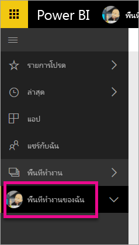

# ladakจัดการที่เก็บข้อมูลในพื้นที่ทำงานบน Power BI

เรียนรู้วิธีจัดการที่เก็บข้อมูลของคุณ หรือของพื้นที่ทำงาน เพื่อให้คุณสามารถเผยแพร่รายงานและชุดข้อมูลต่อไปได้

## ขีดจำกัดความจุ

ข้อจำกัดที่เก็บข้อมูลพื้นที่ทำงาน ไม่ว่าจะสำหรับพื้นที่ทำงานของฉันหรือพื้นที่ทำงานของแอป ทั้งนี้ขึ้นอยู่กับว่าพื้นที่ทำงานอยู่ใน [ความจุแบบใช้ร่วมกันหรือความจุพรีเมี่ยม](../fundamentals/service-basic-concepts.md#capacities)

### ขีดจำกัดความจุแบบใช้ร่วมกัน
สำหรับพื้นที่ทำงานในความจุที่ใช้ร่วมกัน: 

- มีขีดจำกัดสำหรับพื้นที่เก็บข้อมูลตามพื้นที่ทำงานอยุ่ที่ 100 GB
- สำหรับพื้นที่ทำงานของแอป การใช้งานทั้งหมดจะต้องไม่เกิน 10 GB คูณด้วยจำนวนสิทธิ์ใช้งาน Pro ในผู้เช่า

### ขีดจำกัดความจุแบบพรีเมียม
สำหรับพื้นที่ทำงานในความจุแบบพรีเมียม
- มีขีดจำกัด 100 TB ต่อความจุแบบพรีเมียม
- ไม่มีขีดจำกัดพื้นที่เก็บข้อมูลต่อผู้ใช้

อ่านเกี่ยวกับคุณลักษณะอื่น ๆ ของ[รูปแบบการกำหนดราคา Power BI](https://powerbi.microsoft.com/pricing)

## มีอะไรรวมอยู่ในพื้นที่เก็บข้อมูลบ้าง

ที่รวมอยู่ในที่เก็บข้อมูลของคุณ ได้แก่ ชุดข้อมูลและรายงาน Excel ของคุณเอง และรายการเหล่านั้นที่มีคนแชร์ให้คุณ ชุดข้อมูลเป็นแหล่งข้อมูลใด ๆ ที่คุณอัปโหลดหรือเชื่อมต่อ แหล่งข้อมูลเหล่านี้รวมถึงไฟล์ Power BI Desktop และสมุดงาน Excel ที่คุณกำลังใช้งาน ต่อไปนี้ยังรวมอยู่ในความจุข้อมูลของคุณด้วย

* ช่วงของข้อมูลใน Excel ที่ปักหมุดไปยังแดชบอร์ด
* การแสดงภาพภายในองค์กรของ Reporting Services ที่ปักหมุดไปยังแดชบอร์ด Power BI
* รูปภาพที่ถูกอัปโหลด

ขนาดของแดชบอร์ดที่คุณแชร์จะแตกต่างกัน ทั้งนี้ขึ้นอยู่กับว่ามีอะไรปักหมุดอยู่ข้างในบ้าง ตัวอย่างเช่น ถ้าคุณปักหมุดรายการจากรายงานสองฉบับที่เป็นส่วนหนึ่งของชุดข้อมูลที่แตกต่างกันสองชุด ขนาดจะรวมชุดข้อมูลทั้งสองชุด

<a name="manage"/>

## จัดการรายการที่คุณเป็นเจ้าของ

ดูว่าคุณกำลังใช้พื้นที่จัดเก็บข้อมูลเท่าไรในบัญชีของคุณ Power BI และจัดการบัญชีของคุณ

1. เพื่อจัดการพื้นที่เก็บข้อมูลของคุณเอง ให้ไปที่ **พื้นที่งานของฉัน** ในบานหน้าต่างนำทาง
   
    

2. เลือกไอคอนรูปเฟือง  ในมุมบนขวา \> **จัดการที่เก็บข้อมูลส่วนตัว**
   
    แถบด้านบนแสดงให้เห็นว่า คุณได้ใช้ที่เก็บข้อมูลมากแค่ไหน
   
    
   
    ชุดข้อมูลและรายงานจะถูกแบ่งออกเป็นสองแท็บ:
   
    **ฉันเป็นเจ้าของ:** คุณได้อัปโหลดรายงานและชุดข้อมูลเหล่านี้ไปยังบัญชี Power BI ของคุณ รวมถึงชุดข้อมูลบริการ เช่น Salesforce และ Dynamics CRM  

    **ผู้อื่นเป็นเจ้าของ:** ผู้อื่นได้แชร์รายงานและชุดข้อมูลเหล่านี้ให้กับคุณ
1. เมื่อต้องการลบชุดข้อมูลหรือรายงาน ให้เลือกไอคอนรูปถังขยะ .

โปรดทราบว่า คุณหรือบุคคลอื่นอาจมีรายงานและแดชบอร์ดที่ขึ้นกับชุดข้อมูลหนึ่ง ๆ ถ้าคุณลบชุดข้อมูล รายงานและแดชบอร์ดเหล่านั้นจะไม่ทำงานอีกต่อไป

## จัดการพื้นที่ทำงานของคุณ
1. เลือกลูกศรที่อยู่ถัดจาก **พื้นที่ทำงาน** \> เลือกชื่อของพื้นที่ทำงาน
   
    
2. เลือกไอคอนรูปเฟือง  ในมุมบนขวา \> **จัดการที่เก็บข้อมูลกลุ่ม**
   
    แถบด้านบนแสดงให้เห็นว่า มีการใช้ที่เก็บข้อมูลกลุ่มมากแค่ไหน
   
    
   
    ชุดข้อมูลและรายงานจะถูกแบ่งออกเป็นสองแท็บ:
   
    **เราเป็นเจ้าของ:** คุณหรือผู้อื่นได้อัปโหลดรายงานและชุดข้อมูลเหล่านี้ไปยังบัญชี Power BI ของกลุ่ม รวมถึงชุดข้อมูลบริการ เช่น Salesforce และ Dynamics CRM

    **ผู้อื่นเป็นเจ้าของ:** ผู้อื่นได้แชร์รายงานและชุดข้อมูลเหล่านี้ให้กับคุณ

3. เมื่อต้องการลบชุดข้อมูลหรือรายงาน ให้เลือกไอคอนรูปถังขยะ .
   
   > [!NOTE]
   > โปรดทราบว่า คุณหรือบุคคลอื่นในกลุ่มอาจมีรายงานและแดชบอร์ดที่ขึ้นกับชุดข้อมูลหนึ่ง ๆ ถ้าคุณลบชุดข้อมูล รายงานและแดชบอร์ดเหล่านั้นจะไม่ทำงานอีกต่อไป
   
   สมาชิกใดก็ตามในพื้นที่ทำงานที่มีบทบาทผู้ดูแลระบบ สมาชิก หรือผู้สนับสนุนมีสิทธิ์ในการลบชุดข้อมูลและรายงานออกจากพื้นที่ทำงาน

## ขีดจำกัดของชุดข้อมูล
มีขีดจำกัด 1 GB ต่อชุดข้อมูลที่นำเข้าไปใน Power BI ถ้าคุณเลือกที่จะเก็บประสบการณ์ Excel แทนที่จะนำเข้าข้อมูล ซึ่งจะถูกจำกัดที่ 250 MB สำหรับชุดข้อมูล

## เกิดอะไรขึ้นเมื่อคุณถึงขีดจำกัด
เมื่อคุณถึงขีดจำกัดความจุข้อมูลของคุณ คุณจะเห็นพร้อมท์ภายในบริการ 

เมื่อคุณเลือกไอคอนรูปเฟือง , คุณจะเห็นแถบสีแดงซึ่งระบุว่า คุณกำลังใช้งานเกินขีดจำกัดความจุของข้อมูลของคุณ

ขีดจำกัดนี้ยังระบุไว้ภายใน **จัดการที่เก็บข้อมูลส่วนบุคคล**อีกด้วย

 

 เมื่อคุณพยายามที่จะดำเนินการใด ๆ ที่ทำให้ถึงขีดจำกัดเหล่านี้ คุณจะเห็นข้อความที่ระบุว่า คุณกำลังใช้เกินขีดจำกัด คุณสามารถ[จัดการ](#manage)ที่เก็บข้อมูลของคุณเพื่อลดปริมาณข้อมูล และผ่านข้อจำกัดดังกล่าว

 

 ## ขั้นตอนถัดไป

 มีคำถามเพิ่มเติมหรือไม่ [ลองถามชุมชน Power BI](https://community.powerbi.com/)
