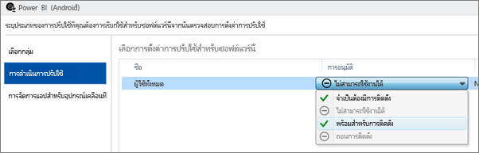
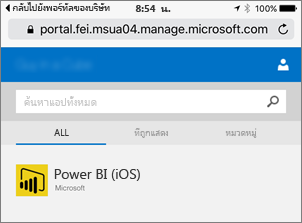

# กำหนดค่าแอปฯมือถือโดยใช้ Microsoft Intune

Microsoft Intune ช่วยให้องค์กรต่าง ๆ สามารถจัดการอุปกรณ์ต่าง ๆ และแอปพลิเคชันได้ แอปพลิเคชันสำหรับอุปกรณ์เคลื่อนที่ของ Power BI สำหรับ iOS และ Android รวมกับ Intune การรวมนี้ช่วยให้คุณจัดการแอปพลิเคชันบนอุปกรณ์ของคุณ และ ควบคุมการรักษาความปลอดภัย ด้วยนโยบายการกำหนดค่า คุณสามารถควบคุมรายการ เช่น การบังคับใช้ PIN เพื่อเข้าใช้งาน, วิธีจัดการกับข้อมูลโดยแอปพลิเคชัน หรือแม้แต่การเข้ารหัสลับข้อมูลแอปพลิเคชันเมื่อไม่ได้ใช้งาน

## การกำหนดค่าการจัดการอุปกรณ์เคลื่อนที่ทั่วไป

บทความนี้ถือว่ามีการกำหนดค่า Intune อย่างถูกต้อง และคุณมีอุปกรณ์ที่ลงทะเบียนกับ Intune เรีบบร้อยแล้ว บทความนี้ไม่ใช่แนวทางฉบับสมบูรณ์สำหรับการกำหนดค่า Microsoft Intune สำหรับข้อมูลเพิ่มเติมเกี่ยวกับ Intune ดู [Intune คืออะไร?](/intune/introduction-intune/)

Microsoft Intune สามารถมีร่วมกับการจัดการอุปกรณ์เคลื่อน (Mobile Device Management: MDM) ภายใน Microsoft 365 ได้ หากคุณกำลังใช้ MDM อุปกรณ์จะแสดงการลงทะเบียนภายใน MDM แต่จะพร้อมใช้งานการจัดการภายใน Intune

> [!NOTE]
> หลังจากที่คุณกำหนดค่า Intune การรีเฟรชข้อมูลพื้นหลังจะถูกปิดใช้งานสำหรับแอปสำหรับอุปกรณ์เคลื่อนที่ Power BI บนอุปกรณ์ iOS หรือ Android ของคุณ Power BI จะรีเฟรชข้อมูลจากบริการของ Power BI บนเว็บเมื่อคุณเข้าแอป

## ขั้นตอนที่ 1: รับ URL สำหรับแอปพลิเคชัน

ก่อนที่เราจะสร้างแอปพลิเคชันภายใน Intune เราต้องรับ URL สำหรับแอป สำหรับ iOS เราจะดาวน์โหลดแอปฯนี้จาก iTunes สำหรับ Android คุณสามารถดาวน์โหลดได้จากหน้าของ Power BI สำหรับมือถือ

บันทึก URL เนื่องจากคุณต้องใช้ข้อมูลนี้ตอนสร้างแอปพลิเคชัน

### รับ URL ของ iOS

หากต้องการ URL ของแอปสำหรับ iOS ต้องดาวน์โหลดจาก iTunes

1. เปิด iTunes

1. ค้นหา*Power BI*

1. คุณจะเห็น**Microsoft Power BI**ในรายการใต้**แอปฯ iPhone**และ**แอปฯ iPad** คุณสามารถใช้ได้อย่างใดอย่างหนึ่งเนื่องจากคุณจะได้ URL เดียวกัน

1. เลือก**รับ** เมนูเบบเลื่อนลง และเลือก**คัดลอกลิงก์**

    

ซึ่งควรมีลักษณะคล้ายต่อไปนี้: *https://itunes.apple.com/us/app/microsoft-power-bi/id929738808?mt=8*

### รับ URL ของ Android

คุณสามารถรับ URL สำหรับ Google Play ได้จาก [หน้าอุปกรณ์เคลื่อนที่ Power BI](https://powerbi.microsoft.com/mobile/) เลือก **ดาวน์โหลดจาก Google Play** ระบบจะนำคุณไปยังหน้าแอป คุณสามารถคัดลอก URL จากแถบที่อยู่เบราว์เซอร์ ซึ่งควรมีลักษณะคล้ายต่อไปนี้: *https://play.google.com/store/apps/details?id=com.microsoft.powerbim*

## ขั้นตอนที่ 2: สร้างนโยบายการจัดการแอปพลิเคชันสำหรับอุปกรณ์เคลื่อนที่

นโยบายการจัดการแอปพลิเคชันมือถือช่วยให้คุณสามารถบังคับใช้รายการต่าง ๆ เช่น PIN การเข้าถึงได้ ซึ่งคุณสามารถสร้างได้ภายในพอร์ทัล Intune

คุณสามารถสร้างแอปพลิเคชันดังกล่าว หรือนโยบายก่อนได้ ลำดับของรายการที่เพิ่มเข้ามาเหล่านี้ไม่มีความสำคัญ เนื่องจากเพียงแค่จำเป็นให้มีอยู่สำหรับขั้นตอนการปรับใช้

1. ในพอร์ทัล Intune ให้เลือก **นโยบาย** > **นโยบายการกำหนดค่า**

    

1. เลือก**เพิ่ม...**

1. ใต้**ซอฟต์แวร์** คุณสามารถเลือกการจัดการแอปพลิเคชันมือถือ (Mobile Application Management) สำหรับ Android หรือ iOS ได้ เมื่อต้องการเริ่มต้นใช้งานได้อย่างรวดเร็ว คุณสามารถเลือก**สร้างนโยบายด้วยการตั้งค่าที่แนะนำ** หรือคุณสามารถสร้างนโยบายกำหนดเองได้

1. แก้ไขนโยบายเพื่อกำหนดค่าข้อจำกัดที่คุณต้องการบนแอปพลิเคชัน

## ขั้นตอนที่ 3: สร้างแอปพลิเคชัน

แอปพลิเคชันเป็นอ้างอิงหรือแพคเกจที่ถูกบันทึกลงใน Intune เพื่อการใช้งาน เราจะต้องสร้างแอปพลิเคชัน และอ้างอิง URL แอปที่ได้รับมาจาก Google Play หรือ iTunes

คุณสามารถสร้างแอปพลิเคชันดังกล่าว หรือนโยบายก่อนได้ ลำดับของรายการที่เพิ่มเข้ามาเหล่านี้ไม่มีความสำคัญ เนื่องจากเพียงแค่จำเป็นให้มีอยู่สำหรับขั้นตอนการปรับใช้

1. ไปยังพอร์ทัล Intune และเลือก**แอปฯ**จากเมนูทางด้านซ้าย

1. เลือก**เพิ่มแอปฯ** ซึ่งจะเปิดขึ้นในแอปพลิเคชัน**เพิ่มซอฟต์แวร์**

### สร้างสำหรับ iOS

1. เลือก**จัดการแอปฯ iOS จาก App Store**จากรายการแบบเลื่อนลง

1. ใส่ URL ของแอปที่ได้จาก[ขั้นตอนที่ 1](#step-1-get-the-url-for-the-application) และเลือก **ถัดไป**

    

1. ใส่**ผู้ตีพิมพ์** **ชื่อ** และ**คำอธิบาย** นอกจากนี้ คุณยังสามารถเลือกใส่**ไอคอน**ได้ **ประเภท**มีไว้สำหรับแอปฯ Company Portal เมื่อคุณทำเสร็จแล้ว เลือก**ถัดไป**

1. คุณสามารถตัดสินใจว่าคุณต้องการเผยแพร่ในแอปฯเป็น**ใด ๆ** (ค่าเริ่มต้น) **iPad** หรือ**iPhone**ได้ การตั้งเป็นค่าเริ่มต้น ส่วนนี้จะแสดงเป็น**ใด ๆ**และจะสามารถใช้งานได้กับอุปกรณ์ทั้งสองชนิด แอป Power BI มี URL เดียวกันสำหรับทั้ง iPhone และ iPad เลือก **ถัดไป**

1. เลือก**อัปโหลด**

1. หากคุณไม่เห็นแอปในรายการ ให้รีเฟรชหน้า: ไปที่ **ภาพรวม** จากนั้นกลับไปยัง **แอป**

    

### สร้างสำหรับ Android

1. เลือก**เชื่อมโยงภายนอก**จากรายการแบบเลื่อนลง

1. ใส่ URL ของแอปที่ได้จาก[ขั้นตอนที่ 1](#step-1-get-the-url-for-the-application) และเลือก **ถัดไป**

    

1. ใส่**ผู้ตีพิมพ์** **ชื่อ** และ**คำอธิบาย** นอกจากนี้ คุณยังสามารถเลือกใส่**ไอคอน**ได้ **ประเภท**มีไว้สำหรับแอปฯ Company Portal เมื่อคุณทำเสร็จแล้ว เลือก**ถัดไป**

1. เลือก**อัปโหลด**

1. หากคุณไม่เห็นแอปในรายการ ให้รีเฟรชหน้า: ไปที่ **ภาพรวม** จากนั้นกลับไปยัง **แอป**

    

## ขั้นตอนที่ 4: ใช้งานแอปพลิเคชัน

หลังจากที่คุณเพิ่มแอปพลิเคชันแล้ว คุณจะต้องนำแอปฯดังกล่าวมาใช้เพื่อให้พร้อมใช้งานสำหรับผู้ใช้ของคุณ นี่คือขั้นตอนที่คุณจะผสานรวมนโยบายที่คุณสร้างขึ้นด้วยแอปฯเข้าด้วยกัน

### ปรับใช้สำหรับ iOS

1. บนหน้าจอแอปฯ เลือกแอปฯที่คุณสร้างขึ้น จากนั้นเลือกลิงก์**จัดการการปรับใช้...**

    

1. ที่หน้าจอ**เลือกกลุ่ม** คุณสามารถเลือกกลุ่มที่คุณต้องการปรับใช้แอปฯนี้ เลือก **ถัดไป**

1. ที่หน้าจอ**การดำเนินการปรับใช้** คุณสามารถเลือกวิธีที่คุณต้องการปรับใช้แอปฯนี้ได้ การเลือก**ติดตั้งพร้อมใช้งาน**หรือ**จำเป็นต้องติดตั้ง** จะทำให้แอปฯพร้อมใช้งานใน Company Portal สำหรับผู้ใช้เพื่อทำการติดตั้งตามความต้องการ หลังจากที่คุณได้ทำการเลือกแล้ว เลือก**ถัดไป**

    

1. ที่หน้าจอ**การจัดการแอปฯอุปกรณ์เคลื่อนที่** คุณสามารถเลือกนโยบายการจัดการแอปฯอุปกรณ์เคลื่อนที่ที่เราสร้างขึ้นใน[ขั้นตอนที่ 2](#step-2-create-a-mobile-application-management-policy)ได้ ซึ่งจะเป็นค่าเริ่มต้นสำหรับนโยบายที่คุณได้ทำไว้ ถ้านั่นคือนโยบาย iOS เดียวที่พร้อมใช้งาน เลือก **ถัดไป**

    

1. ในหน้าจอ**โพรไฟล์ VPN** คุณสามารถเลือกนโยบายได้ถ้าคุณมีสำหรับองค์กรของคุณ ซึ่งค่าเริ่มต้นเป็น**ไม่มี** เลือก **ถัดไป**

1. ที่หน้าจอ**กำหนดค่าแอปฯอุปกรณ์เคลื่อนที่** คุณสามารถเลือกข้อ**นโยบายการกำหนดค่าแอปฯ**ได้ถ้าคุณได้สร้างไว้ ซึ่งค่าเริ่มต้นเป็น**ไม่มี** ข้อมูลนี้ไม่จำเป็น เลือก**เสร็จสิ้น**

หลังจากที่คุณมีการปรับใช้แอปฯดังกล่าวแล้ว แอปฯควรแสดง**ใช่**สำหรับการปรับใช้บนหน้าแอปฯ

### ปรับใช้สำหรับ Android

1. บนหน้าจอแอปฯ เลือกแอปฯที่คุณสร้างขึ้น จากนั้นเลือกลิงก์**จัดการการปรับใช้...**

    
1. ที่หน้าจอ**เลือกกลุ่ม** คุณสามารถเลือกกลุ่มที่คุณต้องการปรับใช้แอปฯนี้ เลือก **ถัดไป**

1. ที่หน้าจอ**การดำเนินการปรับใช้** คุณสามารถเลือกวิธีที่คุณต้องการปรับใช้แอปฯนี้ได้ การเลือก**ติดตั้งพร้อมใช้งาน**หรือ**จำเป็นต้องติดตั้ง** จะทำให้แอปฯพร้อมใช้งานใน Company Portal สำหรับผู้ใช้เพื่อทำการติดตั้งตามความต้องการ หลังจากที่คุณได้ทำการเลือกแล้ว เลือก**ถัดไป**

    

1. ที่หน้าจอ**การจัดการแอปฯอุปกรณ์เคลื่อนที่** คุณสามารถเลือกนโยบายการจัดการแอปฯอุปกรณ์เคลื่อนที่ที่เราสร้างขึ้นใน[ขั้นตอนที่ 2](#step-2-create-a-mobile-application-management-policy)ได้ ซึ่งจะเป็นค่าเริ่มต้นสำหรับนโยบายที่คุณได้ทำไว้ ถ้านั่นคือนโยบาย Android เดียวที่พร้อมใช้งาน เลือก**เสร็จสิ้น**

    

หลังจากที่คุณมีการปรับใช้แอปฯดังกล่าวแล้ว แอปฯควรแสดง**ใช่**สำหรับการปรับใช้บนหน้าแอปฯ

## ขั้นตอนที่ 5: ติดตั้งแอปพลิเคชันบนอุปกรณ์

คุณจะติดตั้งแอปพลิเคชันผ่านแอป *Company Portal* ถ้าคุณยังไม่ได้ติดตั้ง Company Portal คุณสามารถรับได้ผ่าน App Store บนแพลตฟอร์ม Android หรือ iOS คุณจะลงชื่อเข้าใช้ Company Portal ด้วยการเข้าสู่ระบบขององค์กรของคุณ

1. เปิดแอปฯ Company Portal

1. ถ้าคุณไม่เห็นแอปฯ Power BI แสดงเป็นแอปฯแนะนำ ให้เลือก**แอปฯบริษัท**

    

1. เลือกแอปฯ Power BI ที่คุณนำไปใช้

    

1. เลือก**ติดตั้ง**

    

1. ถ้าคุณอยู่ใช้ iOS นั่นจะช่วยส่งแอปฯให้คุณ เลือก**ติดตั้ง**ที่กล่องโต้ตอบพุช

    

1. หลังจากติดตั้งแอป คุณจะเห็นว่า **แอปนี้จัดการโดยบริษัทของคุณ** ถ้าคุณเปิดใช้งานการเข้าถึงด้วย PIN คุณจะเห็นรายการต่อไปนี้ในนโยบาย

    

## ขั้นตอนถัดไป

[กำหนดค่าและปรับใช้นโยบายการจัดการแอปพลิเคชันมือถือในคอนโซล Microsoft Intune](/intune/app-protection-policies/)  

[แอปฯ Power BI สำหรับอุปกรณ์เคลื่อนที่](../consumer/mobile/mobile-apps-for-mobile-devices.md)  

มีคำถามเพิ่มเติมหรือไม่ [ลองถามชุมชน Power BI](https://community.powerbi.com/)  
