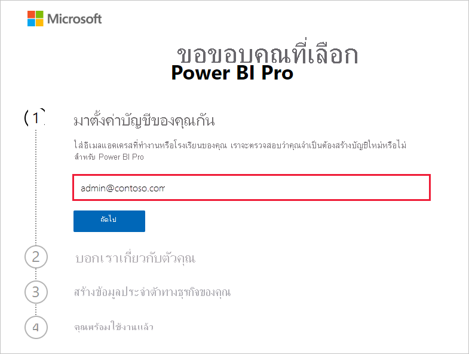
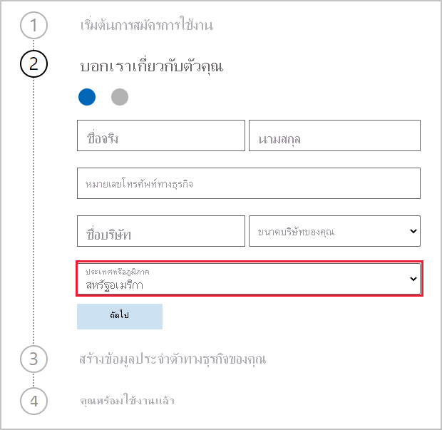

# รับการสมัครใช้งาน Power BI สำหรับองค์กรของคุณ

ผู้ดูแลระบบสามารถลงทะเบียนสำหรับ Power BI ผ่านหน้า **บริการสั่งซื้อ** บนศูนย์การจัดการ Microsoft 365 ได้ เมื่อผู้ดูแลระบบลงทะเบียนสำหรับ Power BI พวกเขาสามารถกำหนดสิทธิการใช้งานไปยังผู้ใช้ที่ควรมีสิทธิ์เข้าใช้งานได้

ผู้ใช้ในองค์กรของคุณสามารถลงทะเบียนสำหรับ Power BI ได้ผ่านเว็บไซต์ Power BI เมื่อผู้ใช้ในองค์กรของคุณลงทะเบียนสำหรับ Power BI จะมีการกำหนดสิทธิ์การใช้งาน Power BI ให้ผู้ใช้เหล่านั้นโดยอัตโนมัติ ถ้าคุณต้องการปิดใช้งานความสามารถของการบริการตนเอง ให้ทำตามขั้นตอนใน [เปิดใช้งานหรือปิดใช้งานการลงทะเบียนและการซื้อแบบบริการตนเอง](service-admin-disable-self-service.md)

## ลงทะเบียนผ่าน Microsoft 365

ถ้าคุณเป็นผู้ดูแลระบบส่วนกลางหรือผู้ดูแลระบบการเรียกเก็บเงิน คุณจะได้รับการสมัครใช้งาน Power BI สำหรับองค์กรของคุณ สำหรับข้อมูลเพิ่มเติม โปรดดู [ใครสามารถซื้อและกำหนดสิทธิการใช้งานได้บ้าง](service-admin-licensing-organization.md#who-can-purchase-and-assign-licenses)

> [!NOTE]
>
> การสมัครใช้งาน Microsoft 365 E5 มีสิทธิการใช้งาน Power BI Pro อยู่แล้ว เมื่อต้องการเรียนรู้วิธีการจัดการสิทธิการใช้งาน โปรดดู [ดูและจัดการสิทธิการใช้งานของผู้ดูแล](service-admin-manage-licenses.md)
>
>

ทำตามขั้นตอนเหล่านี้เพื่อซื้อสิทธิ์การใช้งาน Power BI Pro ในศูนย์การจัดการ Microsoft 365:

1. ลงชื่อเข้าใช้ [ศูนย์การจัดการ Microsoft 365](https://admin.microsoft.com)

2. บนเมนูการนำทาง เลือก **การเรียกเก็บเงิน** > **การซื้อบริการ**
  
   

3. ค้นหาหรือเลื่อนเพื่อค้นหาการสมัครใช้งานที่คุณต้องการซื้อ คุณจะพบ **Power BI** ภายใต้ **ประเภทอื่นๆ ที่คุณอาจสนใจ**  ใกล้กับด้านล่างของหน้า เลือกลิงก์เพื่อดูการสมัครใช้งาน Power BI ที่มีให้สำหรับองค์กรของคุณ

4. เลือกข้อเสนอ เช่น Power BI Pro

5. บนหน้า **การซื้อบริการ** เลือก **ซื้อ** หากคุณไม่เคยใช้งานมาก่อน คุณสามารถเริ่มการสมัครใช้งาน Power BI Pro รุ่นทดลองใช้ฟรี ซึ่งประกอบด้วยสิทธิการใช้งาน 25 สิทธิและหมดอายุในหนึ่งเดือน

   

6. เลือก **ชำระเงินรายเดือน** หรือ **ชำระเงินสำหรับทั้งปี** ตามลักษณะการเรียกเก็บเงินที่คุณต้องการ

7. ในส่วน **คุณต้องการจำนวนผู้ใช้กี่ราย** ให้กรอกจำนวนสิทธิ์การเข้าถึงที่ต้องการซื้อ จากนั้นเลือก **ชำระเงินตอนนี้** เพื่อเสร็จสิ้นการทำธุรกรรม

8. หากต้องการตรวจสอบการซื้อของคุณ ให้ไปที่ **การเรียกเก็บเงิน** > **ผลิตภัณฑ์และบริการ** และค้นหา **Power BI Pro**

หากต้องการอ่านข้อมูลเพิ่มเติมเกี่ยวกับวิธีที่องค์กรของคุณสามารถควบคุมและรับบริการ Power BI โปรดดู [Power BI ในองค์กรของคุณ](https://docs.microsoft.com/microsoft-365/admin/misc/power-bi-in-your-organization?view=o365-worldwide)

## วิธีการอื่น ๆ ในการรับ Power BI สำหรับองค์กรของคุณ

ถ้าคุณยังไม่ได้เป็นสมาชิก Microsoft 365 ให้ใช้ขั้นตอนด้านล่างเพื่อรับรุ่นทดลองใช้ Power BI Pro สำหรับองค์กรของคุณ หรือคุณสามารถ [ลงทะเบียนสำหรับรุ่นทดลองใช้ Microsoft 365 ใหม่](service-admin-signing-up-for-power-bi-with-a-new-office-365-trial.md) จากนั้นเพิ่ม Power BI ได้โดยทำตามขั้นตอนในส่วนก่อนหน้า

คุณจะต้องมีบัญชีที่ทำงานหรือโรงเรียนเพื่อลงทะเบียนสำหรับการสมัครใช้งาน Power BI เราไม่สนับสนุนที่อยู่อีเมลที่ให้บริการอีเมลผู้บริโภคหรือผู้ให้บริการโทรคมนาคม ถ้าคุณยังไม่มีบัญชีที่ทำงานหรือโรงเรียน คุณสามารถสร้างบัญชีหนึ่งในระหว่างการลงทะเบียนได้

ทำตามขั้นตอนเหล่านี้เพื่อลงทะเบียน:

1. ไปที่ [การลงทะเบียน Power BI Pro ](https://signup.microsoft.com/create-account/signup?OfferId=d59682f3-3e3b-4686-9c00-7c7c1c736085&ali=1&products=d59682f3-3e3b-4686-9c00-7c7c1c736085) 

2. ป้อนที่อยู่อีเมลที่ทำงานหรือโรงเรียนของคุณ จากนั้นเลือก **ถัดไป** ไม่เป็นไรหากคุณใส่ที่อยู่อีเมลที่ไม่ได้ถือว่าเป็นที่อยู่อีเมลที่ทำงานหรือโรงเรียน เราจะได้รับการตั้งค่าบัญชีใหม่สำหรับคุณเมื่อคุณสร้างข้อมูลประจำตัวทางธุรกิจของคุณ

   

3. เราเรียกใช้การตรวจสอบอย่างรวดเร็วเพื่อดูว่าคุณจำเป็นต้องสร้างบัญชีใหม่หรือไม่ เลือก **ตั้งค่าบัญชี**เพื่อดำเนินการต่อด้วยกระบวนการลงทะเบียน

   > [!NOTE]
   >ถ้าที่อยู่อีเมลของคุณมีการใช้งานกับบริการอื่น ๆ ของ Microsoft แล้วคุณสามารถ **ลงชื่อเข้าใช้** หรือ **สร้างบัญชีใหม่แทนได้** ถ้าคุณเลือกที่จะสร้างบัญชีใหม่ ให้ทำตามขั้นตอนเหล่านี้เพื่อรับการตั้งค่า
>
>
 
4. กรอกแบบฟอร์มเพื่อแจ้งให้เราทราบเกี่ยวกับตัวคุณ ตรวจสอบให้แน่ใจว่าได้เลือกประเทศหรือภูมิภาคที่ถูกต้อง ประเทศที่คุณเลือกจะกำหนดตำแหน่งที่จัดเก็บข้อมูลของคุณตามที่อธิบายไว้ใน [วิธีการกำหนดตำแหน่งที่ผู้เช่า Power BI ของคุณอยู่](service-admin-where-is-my-tenant-located.md#how-to-determine-where-your-power-bi-tenant-is-located)

   

5. เลือก **ถัดไป** เราจำเป็นต้องส่งรหัสการตรวจสอบความถูกต้องเพื่อตรวจสอบข้อมูลประจำตัวของคุณ ระบุหมายเลขโทรศัพท์ที่เราสามารถส่งข้อความหรือโทรหาคุณได้ จากนั้นเลือก **ส่งรหัสการตรวจสอบความถูกต้อง**

6. ป้อนรหัสการตรวจสอบความถูกต้อง จากนั้นดำเนินการต่อเพื่อ **สร้างข้อมูลประจำตัวทางธุรกิจของคุณ**

   

    ใส่ชื่อย่อสำหรับธุรกิจของคุณ และเราจะตรวจสอบให้แน่ใจว่าชื่อนั้นสามารถใช้งานได้ เราใช้ชื่อย่อนี้เพื่อสร้างชื่อองค์กรของคุณในศูนย์ข้อมูลในฐานะที่เป็นโดเมนย่อยของ onmicrosoft.com คุณสามารถเพิ่มโดเมนธุรกิจของคุณเองได้ในภายหลัง ไม่ต้องกังวลถ้ามีการใช้ชื่อย่อนั้น บางคนที่มีแนวโน้มที่จะใช้ชื่อธุรกิจคล้ายกัน เลือกชื่อย่อเดียวกัน - เพียงแค่ลองใช้การเปลี่ยนแปลงที่แตกต่างกัน เลือก **ถัดไป**
    
7. สร้าง ID ผู้ใช้และรหัสผ่านของคุณเพื่อลงชื่อเข้าใช้บัญชีของคุณ เลือก **ลงทะเบียน**และคุณจะต้องตั้งค่าทั้งหมด

บัญชีที่คุณสร้างอยู่ในขณะนี้เป็นบัญชีผู้ดูแลระบบส่วนกลางของผู้เช่ารุ่นทดลองใช้ Power BI Pro ใหม่ คุณสามารถลงชื่อเข้าใช้ [ศูนย์การจัดการ Microsoft 365](https://admin.microsoft.com) เพื่อเพิ่มผู้อื่น ให้ตั้งค่าโดเมนแบบกำหนดเอง ซื้อบริการเพิ่มเติม และจัดการการสมัครใช้งาน Power BI ของคุณ

## ขั้นตอนถัดไป

- [ดูและจัดการสิทธิการใช้งานของผู้ใช้](service-admin-manage-licenses.md)
- [เปิดใช้งานหรือปิดใช้งานการลงทะเบียนและการซื้อแบบบริการตนเอง](service-admin-disable-self-service.md)
- [เอกสารประกอบการสมัครสมาชิกธุรกิจและการเรียกเก็บเงิน](https://docs.microsoft.com/microsoft-365/commerce/?view=o365-worldwide)
