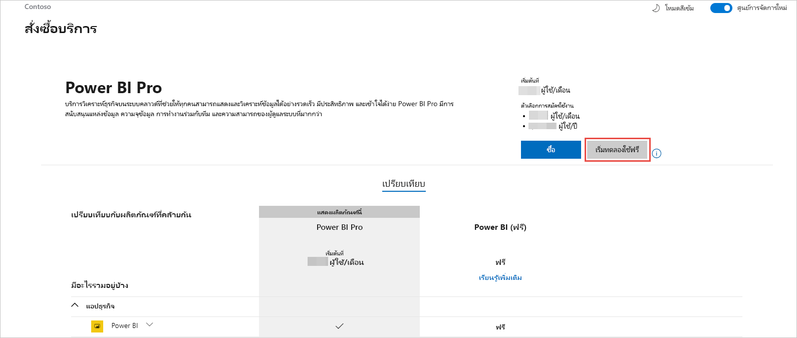

# รับการสมัครใช้งาน Power BI สำหรับองค์กรของคุณ

ในฐานะผู้ดูแลระบบ คุณสามารถลงทะเบียนสำหรับ Power BI ได้ผ่าน[เว็บไซต์ Power BI](https://powerbi.microsoft.com) นอกจากนี้ คุณยังสามารถลงทะเบียนผ่านหน้าบริการซื้อขายบนศูนย์การดูแลระบบ Microsoft 365 ได้ เมื่อผู้ดูแลระบบลงทะเบียนสำหรับ Power BI พวกเขาสามารถกำหนดสิทธิการใช้งานไปยังผู้ใช้ที่ควรมีสิทธิ์เข้าใช้งานได้

นอกจากนี้ ผู้ใช้งานแต่ละคนในองค์กรของคุณอาจสามารถลงทะเบียนสำหรับ Power BI ผ่านเว็บไซต์ Power BI ได้ เมื่อผู้ใช้ในองค์กรของคุณลงทะเบียนสำหรับ Power BI จะมีการกำหนดสิทธิ์การใช้งาน Power BI ให้ผู้ใช้รายนั้นโดยอัตโนมัติ ถ้าคุณต้องการปิดใช้งานความสามารถนี้ ให้ทำตามขั้นตอนใน [เปิดใช้งานหรือปิดใช้งานการลงทะเบียนและการซื้อแบบบริการตนเอง](service-admin-disable-self-service.md)

## ลงทะเบียนผ่าน Power BI

คุณจะต้องมีบัญชีที่ทำงานหรือโรงเรียนเพื่อลงทะเบียนสำหรับการสมัครใช้งาน Power BI เราไม่สนับสนุนที่อยู่อีเมลที่ให้บริการอีเมลผู้บริโภคหรือผู้ให้บริการโทรคมนาคม

ทำตามขั้นตอนเหล่านี้เพื่อลงทะเบียน:

1. ไปที่ [เว็บไซต์ Power BI](https://powerbi.microsoft.com) เลือก **ลองฟรี**
2. ป้อนที่อยู่อีเมลงานของคุณ จากนั้นเลือก**ลงทะเบียน**

   

3. ตรวจสอบข้อมูลประจำตัวของคุณ เราจะโทรหรือส่งข้อความถึงคุณเพื่อใช้รหัสการตรวจสอบความถูกต้อง
4. เลือก **ใช่** เพื่อยืนยันว่าคุณกำลังใช้ที่อยู่อีเมลที่คุณได้รับจากบริษัทของคุณ
5. สร้างบัญชีของคุณ เราส่งรหัสการตรวจสอบความถูกต้องไปยังที่อยู่อีเมลของคุณเพื่อดำเนินการลงทะเบียนให้เสร็จสมบูรณ์

   

## ลงทะเบียนผ่าน Microsoft 365

ถ้าคุณเป็นผู้ดูแลระบบส่วนกลาง Microsoft 365 หรือผู้ดูแลระบบการเรียกเก็บเงิน คุณจะได้รับการสมัครใช้งาน Power BI สำหรับองค์กรของคุณ สำหรับข้อมูลเพิ่มเติม โปรดดู [ใครสามารถซื้อและกำหนดสิทธิการใช้งานได้บ้าง](../service-admin-licensing-organization.md#who-can-purchase-and-assign-licenses)

> [!NOTE]
>
> การสมัครใช้งาน Microsoft 365 E5 มีสิทธิการใช้งาน Power BI Pro อยู่แล้ว เมื่อต้องการเรียนรู้วิธีการจัดการสิทธิการใช้งาน โปรดดู [ดูและจัดการสิทธิการใช้งานของผู้ดูแล](service-admin-manage-licenses.md)
>
>

ทำตามขั้นตอนเหล่านี้เพื่อซื้อสิทธิ์การใช้งาน Power BI Pro ในศูนย์การจัดการ Microsoft 365:

1. ลงชื่อเข้าใช้ [ศูนย์การจัดการ Microsoft 365](https://admin.microsoft.com)

2. บนเมนูการนำทาง เลือก **การเรียกเก็บเงิน** > **การซื้อบริการ**
  
   

3. ค้นหาหรือเลื่อนเพื่อค้นหาการสมัครใช้งานที่คุณต้องการซื้อ คุณจะพบ **Power BI** ภายใต้ **ประเภทอื่นๆ ที่คุณอาจสนใจ**  ใกล้กับด้านล่างของหน้า เลือกลิงก์เพื่อดูการสมัครใช้งาน Power BI ที่มีให้สำหรับองค์กรของคุณ

4. เลือกข้อเสนอ เช่น Power BI Pro

5. บนหน้า **การซื้อบริการ** เลือก **ซื้อ** หากคุณไม่เคยใช้งานมาก่อน คุณสามารถเริ่มการสมัครใช้งาน Power BI Pro รุ่นทดลองใช้ฟรี ซึ่งประกอบด้วยสิทธิการใช้งาน 25 สิทธิและหมดอายุในหนึ่งเดือน

   

6. เลือก **ชำระเงินรายเดือน** หรือ **ชำระเงินสำหรับทั้งปี** ตามลักษณะการเรียกเก็บเงินที่คุณต้องการ

7. ในส่วน **คุณต้องการจำนวนผู้ใช้กี่ราย** ให้กรอกจำนวนสิทธิ์การเข้าถึงที่ต้องการซื้อ จากนั้นเลือก **ชำระเงินตอนนี้** เพื่อเสร็จสิ้นการทำธุรกรรม

8. หากต้องการตรวจสอบการซื้อของคุณ ให้ไปที่ **การเรียกเก็บเงิน** > **ผลิตภัณฑ์และบริการ** และค้นหา **Power BI Pro** 

หากต้องการอ่านข้อมูลเพิ่มเติมเกี่ยวกับวิธีที่องค์กรของคุณรับบริการ Power BI โปรดดู [Power BI ในองค์กรของคุณ](https://docs.microsoft.com/microsoft-365/admin/misc/power-bi-in-your-organization?view=o365-worldwide)

## ขั้นตอนถัดไป

- [ดูและจัดการสิทธิการใช้งานของผู้ใช้](service-admin-manage-licenses.md)
- [เปิดใช้งานหรือปิดใช้งานการลงทะเบียนและการซื้อแบบบริการตนเอง](service-admin-disable-self-service.md)
- [เอกสารประกอบการสมัครสมาชิกธุรกิจและการเรียกเก็บเงิน](https://docs.microsoft.com/microsoft-365/commerce/?view=o365-worldwide)
