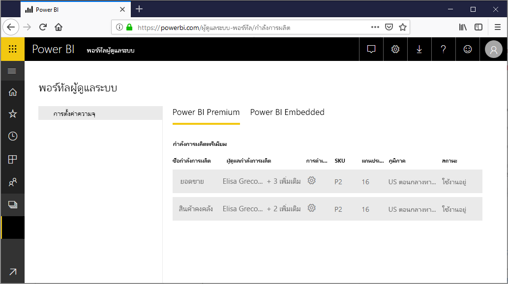
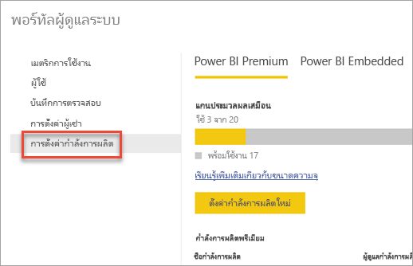
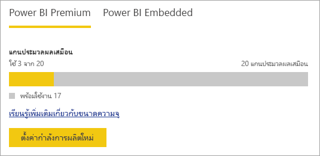
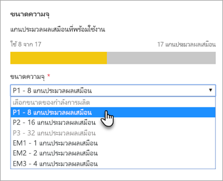
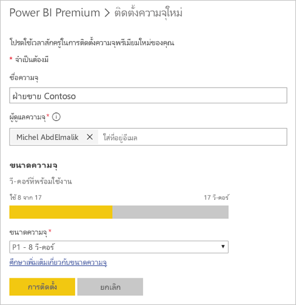
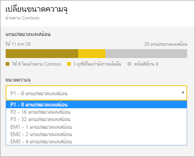
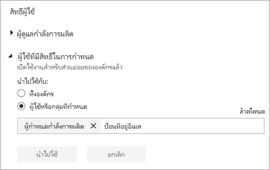
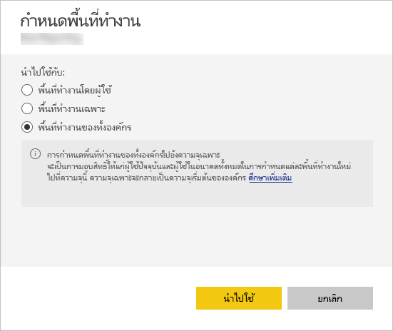
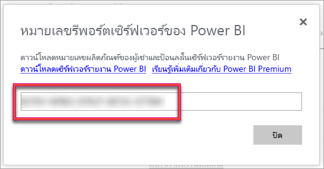

# กำหนดค่าและจัดการความจุใน Power BI Premium

การจัดการ Power BI Premium เกี่ยวข้องกับ การสร้าง การจัดการ และการตรวจสอบความจุแบบพรีเมียม บทความนี้ให้คำแนะนำทีละขั้นตอน สำหรับภาพรวมของความจุ .ให้ดูที่[การจัดการความ](service-premium-capacity-manage.md)จุพรีเมียม

เรียนรู้วิธีการจัดการ Power BI Premium และความจุ Power BI Embedded ซึ่งมีแหล่งข้อมูลเฉพาะสำหรับเนื้อหาของคุณ

*ความจุ* คือหัวใจสำคัญของข้อเสนอ Power BI Premium และ Power BI Embedded ความจุคือชุดของทรัพยากรที่สงวนไว้สำหรับการใช้เฉพาะองค์กรของคุณ โดยการมีค่าความจุเฉพาะนี้ช่วยให้คุณสามารถเผยแพร่แดชบอร์ด รายงาน และชุดข้อมูลไปยังผู้ใช้ทั่วทั้งองค์กรของคุณ โดยไม่ต้องซื้อสิทธิ์การใช้งานต่อผู้ใช้ นอกจากนี้ยังมีความน่าเชื่อถือ ความสอดคล้องของประสิทธิภาพการทำงานสำหรับเนื้อหาที่โฮสต์ในความจุ สำหรับข้อมูลเพิ่มเติม ให้ดู [อะไรคือ Power BI Premium](service-premium-what-is.md)

## จัดการความจุ

หลังจากที่คุณได้ซื้อโหนดความจุใน Microsoft 365 แล้ว ให้คุณตั้งค่าความจุในพอร์ทัลผู้ดูแลระบบของ Power BI คุณจัดการความจุ Power BI Premium ในส่วน **การตั้งค่าความจุ** ของพอร์ทัล

คุณจัดการความจุ โดยการเลือกชื่อของความจุ ซึ่งนำคุณไปยังหน้าจอการจัดการความจุ

หากไม่ได้กำหนดพื้นที่ทำงานไว้ในความจุ คุณจะเห็นข้อความเกี่ยวกับ [การกำหนดพื้นที่ทำงานให้กับความจุ](#assign-a-workspace-to-a-capacity)

### การตั้งค่าความจุใหม่ (Power BI Premium)

พอร์ทัลของผู้ดูแลระบบแสดงจำนวน *แกนเสมือน* (v-cores) ที่คุณใช้และคุณยังมีอยู่ จำนวน v-cores ทั้งหมดขึ้นอยู่กับ SKU ระดับ Premium ที่คุณซื้อ ตัวอย่างเช่น ซื้อแบบ P3 และ P2 ส่งผลให้มี 48 core ที่ใช้ได้ 32 cores จาก P3 และ 16 cores จาก P2

ถ้าคุณมี v-cores ให้ตั้งความจุใหม่ของคุณโดยทำตามขั้นตอนต่อไปนี้

1. เลือก**ตั้งค่าความจุใหม่**

1. ตั้งชื่อความจุของคุณ

1. กำหนดว่าใครจะเป็นผู้ดูแลสำหรับความจุนี้

1. เลือกขนาดของความจุ ตัวเลือกที่พร้อมใช้งานจะขึ้นอยู่กับจำนวน v-cores ที่คุณมี คุณไม่สามารถเลือกตัวเลือกที่มีขนาดใหญ่กว่าสิ่งที่คุณมีพร้อมใช้งานได้

    

1. เลือก**ตั้งค่า**

    

ผู้ดูแลความจุ รวมถึงผู้ดูแลระบบ Power BI และผู้ดูแลระบบส่วนกลาง จากนั้นดูความจุที่ระบุในพอร์ทัลผู้ดูแลระบบ

### การตั้งค่าความจุ

1. ในหน้าจอการจัดการความจุระดับพรีเมี่ยม ภายใต้ **การดำเนินการ** ให้เลือก **ไอคอนฟันเฟือง** เพื่อทบทวนและอัปเดตการตั้งค่า 

    

1. คุณสามารถดูว่าใครคือผู้ดูแลระบบบริการ SKU/ขนาด ความจุของใคร ความจุของภูมิภาคใดที่อยู่ในนั้น

    

1. นอกจากนี้คุณยังสามารถเปลี่ยนชื่อหรือลบความจุได้

    

> [!NOTE]
> คุณสามารถจัดการการตั้งค่าความจุ Power BI Embedded ในพอร์ทัล Microsoft Azure

### เปลี่ยนขนาดความจุ

ผู้ดูแลระบบ Power BI และผู้ดูแลระบบส่วนกลางสามารถเปลี่ยนแปลงความจุ Power BI Premium ได้ ผู้ดูแลความจุที่ไม่ใช่ผู้ดูแลระบบ Power BI หรือผู้ดูแลระบบส่วนกลางจะไม่มีตัวเลือกนี้

1. เลือก **เปลี่ยนขนาดความจุ**.

    

1. ในหน้าจอ **เปลี่ยนขนาดความจุ** ปรับเพิ่มหรือปรับลดความจุของคุณตามความเหมาะสม

    

    ผู้ดูแลมีอิสระที่จะสร้าง การปรับขนาด และลบโหนด ดังนั้นตราบใดที่พวกเขามีจำนวน v-cores

    คุณไม่สามารถปรับลด P SKU ให้เป็น EM SKUs ได้ คุณสามารถเลื่อนเมาส์ไปวางเหนือตัวเลือกที่ถูกปิดใช้งานเพื่อดูคำอธิบาย

> [!IMPORTANT]
> ถ้าความจุ Power BI Premium ของคุณกำลังประสบปัญหาการใช้ทรัพยากรสูงจนส่งผลให้เกิดปัญหาด้านประสิทธิภาพการทำงานหรือความมั่นคง คุณสามารถรับอีเมลแจ้งเตือนเพื่อทราบปัญหาและแก้ไขปัญหาได้ คุณสามารถศึกษาข้อมูลเพิ่มเติมได้ที่[ความจุและการแจ้งเตือนความมั่นคง](service-interruption-notifications.md#capacity-and-reliability-notifications)

### จัดการสิทธิ์ผู้ใช้

คุณสามารถมอบหมายผู้ดูแลความจุเพิ่มเติม และกำหนดผู้ใช้ที่มีสิทธิ์ *การกำหนดความจุ* ได้ ผู้ใช้ที่มีสิทธิ์ในการกำหนดอาจกำหนดพื้นที่ทำงานไปยังความจุใดความจุหนึ่ง ถ้าพวกเขาเป็นผู้ดูแลระบบของพื้นที่ทำงานนั้น พวกเขายังสามารถกำหนด*My Workspace*ส่วนบุคคลของพวกเขาให้ความจุได้ ผู้ใช้ที่มีสิทธิ์ในการกำหนดจะไม่เข้าถึงพอร์ทัลผู้ดูแล

> [!NOTE]
> สำหรับ Power BI Embedded ผู้ดูแลความจุจะถูกกำหนดในพอร์ทัล Microsoft Azure

ภายใต้หน้าจอ **สิทธิ์ผู้ใช้** ขยายตัวเลือก **ผู้ใช้ที่ มีสิทธิ์ในการกำหนด** จากนั้นเพิ่มผู้ใช้หรือกลุ่มตามความเหมาะสม

## กำหนดพื้นที่ทำงานของแอปไปยังความจุ

มีสองวิธีในการกำหนดพื้นที่ทำงานไปยังความจุ: ในพอร์ทัลผู้ดูแลระบบ และจากพื้นที่ทำงาน

### กำหนดจากพอร์ทัลผู้ดูแล

ผู้ดูแลความจุ พร้อมกับผู้ดูแลระบบ Power BI และผู้ดูแลระบบส่วนกลาง สามารถกำหนดพื้นที่ทำงานที่ละหลาย ๆ ตัว ในส่วนการจัดการความจุพรีเมียมของพอร์ทัลผู้ดูแลระบบ เมื่อคุณจัดการความจุ คุณจะเห็นส่วน**พื้นที่ทำงาน**ที่ช่วยให้คุณสามารถกำหนดพื้นที่ทำงานได้

1. เลือก**กำหนดพื้นที่ทำงาน** ตัวเลือกนี้จะพร้อมใช้งานในหลายตำแหน่ง

1. เลือกตัวเลือกสำหรับ**นำไปใช้**

    

   | การเลือก | คำอธิบาย |
   | --- | --- |
   | **พื้นที่ทำงานโดยผู้ใช้** | เมื่อคุณกำหนดพื้นที่ทำงาน ตามผู้ใช้หรือตามกลุ่ม พื้นที่ทำงานทั้งหมดที่ผู้ใช้เหล่านั้นเป็นเจ้าของ จะถูกกำหนดให้กับความจุพรีเมียม รวมถึงพื้นที่ทำงานส่วนบุคคลของผู้ใช้ด้วย ลูกค้าที่ถูกบอกจะถูกำหนดการอนุญาตของพื้นที่ทำงาน ซึ่งรวมถึงพื้นที่ทำงานที่ถูกกำหนดให้กับความจุอื่น |
   | **พื้นที่ทำงานเฉพาะ** | ป้อนชื่อของพื้นที่ทำงานเฉพาะเมื่อต้องกำหนดความจุที่เลือก |
   | **พื้นที่ทำงานของทั้งองค์กร** | การกำหนดพื้นที่ทำงานของทั้งองค์กรไปยังความจุระดับพรีเมี่ยม จะกำหนดพื้นที่ทำงานและพื้นที่ทำงานของฉันทั้งหมดในองค์กรของคุณ ไปยังความจุระดับพรีเมี่ยมนี้ นอกจากนี้ ผู้ใช้ปัจจุบันและในอนาคตทั้งหมดจะมีสิทธิ์ในการกำหนดพื้นที่ทำงานของแต่ละคนให้ความจุนี้ |
   | | |

1. เลือก**นำไปใช้**

### กำหนดจากการตั้งค่าพื้นที่ทำงาน

คุณยังสามารถกำหนดพื้นที่ทำงานเป็นความจุพรีเมียมจากการตั้งค่าของพื้นที่การทำงานนั้น เมื่อต้องการย้ายพื้นที่ทำงานไปสู่ความจุ คุณต้องมีสิทธิ์ของผู้ดูแลระบบในพื้นที่ทำงานนั้นและยังต้องมีสิทธิ์ในการกำหนดความจุไปยังความจุดังกล่าวด้วย โปรดทราบว่าผู้ดูแลระบบผู้ดูแลระบบพื้นที่ทำงานสามารถลบพื้นที่ทำงานออกจากความจุระดับพรีเมี่ยมได้

1. แก้ไขพื้นที่ทำงานโดยเลือกจุดไข่ปลา **(...)** แล้วเลือก **แก้ไขพื้นที่ทำงาน**

    

1. ภายใต้ **แก้ไขพื้นที่ทำงาน** ขยาย **ขั้นสูง**

1. เลือกความจุที่คุณต้องการกำหนดพื้นที่ทำงานนี้ไปยัง

    

1. เลือก**บันทึก**

เมื่อคุณบันทึก พื้นที่ทำงานและเนื้อหาทั้งหมด จะถูกย้ายไปยังความจุระดับพรีเมียมโดยไม่ทำให้เกิดปัญหากับผู้ใช้ปลายทาง

## คีย์ผลิตภัณฑ์เซิร์ฟเวอร์รายงาน Power BI

ในแท็บ **การตั้งค่าความจุ** ของพอร์ทัลผู้ดูแลระบบ Power BI คุณจะสามารถเข้าถึงคีย์ผลิตภัณฑ์เซิร์ฟเวอร์รายงาน Power BI ของคุณ ซึ่งจะพร้อมใช้งานสำหรับผู้ดูแลระบบสากล หรือผู้ใช้ที่ได้รับการกำหนดบทบาทเป็นผู้ดูแลระบบ Power BI Premium SKU

โดยเลือก**คีย์เซิร์ฟเวอร์รายงาน Power BI**จะแสดงกล่องโต้ตอบที่มีคีย์ผลิตภัณฑ์ของคุณ คุณสามารถคัดลอกและใช้กับการติดตั้ง

สำหรับข้อมูลเพิ่มเติม ให้ดู[ติดตั้งเซิร์ฟเวอร์รายงาน Power BI](../report-server/install-report-server.md)

## ขั้นตอนถัดไป

[การจัดการความจุแบบพรีเมียม](service-premium-capacity-manage.md)

มีคำถามเพิ่มเติมหรือไม่ [ลองถามชุมชน Power BI](https://community.powerbi.com/)
