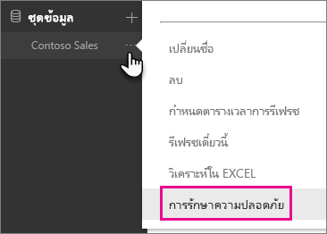
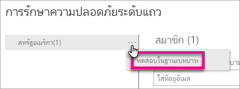
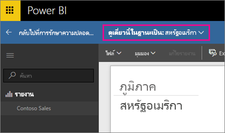
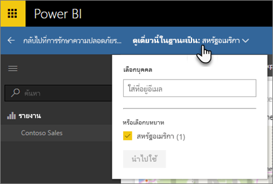

# Row-level security (RLS) กับ Power BI

Row-level security (RLS) ด้วย Power BI สามารถใช้เพื่อจำกัดการเข้าถึงข้อมูลสำหรับผู้ใช้ที่กำหนด ตัวกรองจำกัดการเข้าถึงข้อมูลในระดับแถว และคุณสามารถกำหนดตัวกรองภายในบทบาทได้ โปรดทราบว่า ในบริการ Power BI สมาชิกของพื้นที่ทำงานจะเข้าถึงชุดข้อมูลในพื้นที่ทำงานได้ RLS ไม่จำกัดการเข้าถึงข้อมูลนี้

คุณสามารถกำหนดค่า RLS สำหรับแบบจำลองข้อมูลที่นำเข้าไปยัง Power BI ด้วย Power BI Desktop และคุณยังสามารถกำหนดค่า RLS บนชุดข้อมูลที่กำลังใช้ DirectQuery เช่น SQL Server ก่อนหน้านี้ คุณสามารถใช้ได้เฉพาะ RLS ภายในแบบจำลองภายในองค์กรของ Analysis Services ภายนอก Power BI เท่านั้น สำหรับการเชื่อมต่อสดของ Analysis Services หรือ Azure Analysis Services คุณกำหนดค่าการรักษาความปลอดภัยระดับแถวในแบบจำลอง ไม่ใช่ใน Power BI Desktop ตัวเลือกความปลอดภัยจะไม่แสดงสำหรับชุดข้อมูลแบบการเชื่อมต่อสด

[!INCLUDE [include-short-name](../includes/rls-desktop-define-roles.md)]

ตามค่าเริ่มต้น การกรอง row-level security จะใช้ตัวกรองทิศทางเดียว โดยไม่คำนึงว่าการตั้งค่าความสัมพันธ์เป็นแบบทิศทางเดียวหรือสองทิศทาง คุณสามารถเปิดใช้ตัวกรองไขว้แบบสองทิศทางด้วย row-level security ได้ด้วยตนเองโดยการเลือกความสัมพันธ์ และทำเครื่องหมายในกล่อง**ใช้ตัวกรองความปลอดภัยในทั้งสองทิศทาง** คุณควรทำเครื่องหมายที่ช่องนี้เมื่อคุณได้ใช้การรักษาความปลอดภัยระดับแถวแบบไดนามิกในระดับเซิร์ฟเวอร์ โดยที่การรักษาความปลอดภัยระดับแถวจะขึ้นอยู่กับชื่อผู้ใช้หรือรหัสการเข้าสู่ระบบ

สำหรับข้อมูลเพิ่มเติม ดูที่[ตัวกรองไขว้แบบสองทิศทางที่ใช้ DirectQuery ใน Power BI Desktop](../transform-model/desktop-bidirectional-filtering.md)และบทความเชิงเทคนิคของ[การรักษาความปลอดภัยแบบลำจองภาษา BI แบบตาราง](https://download.microsoft.com/download/D/2/0/D20E1C5F-72EA-4505-9F26-FEF9550EFD44/Securing%20the%20Tabular%20BI%20Semantic%20Model.docx)

[!INCLUDE [include-short-name](../includes/rls-desktop-view-as-roles.md)]

## จัดการความปลอดภัยบนแบบจำลองของคุณ

เมื่อต้องจัดการความปลอดภัยบนแบบจำลองข้อมูลของคุณ คุณจะต้องทำสิ่งต่อไปนี้

1. เลือก**จุดไข่ปลา (...)** สำหรับชุดข้อมูล
2. เลือก**ความปลอดภัย**
   
   

ซึ่งจะนำคุณไปยังหน้า RLS เพื่อให้คุณเพิ่มสมาชิกให้กับบทบาทที่คุณสร้างไว้ใน Power BI Desktop เฉพาะเจ้าของชุดข้อมูลเท่านั้นที่จะเห็นความปลอดภัยที่มีอยู่ ถ้าชุดข้อมูลอยู่ใน ‘กลุ่ม’ จะมีเพียง ‘ผู้ดูแล’ ของกลุ่มเท่านั้นที่จะเห็นตัวเลือกความปลอดภัย 

คุณสามารถสร้างหรือแก้ไขบทบาทภายใน Power BI Desktop

## ทำงานกับสมาชิก

### เพิ่มสมาชิก

คุณสามารถเพิ่มสมาชิกให้กับบทบาทโดยการพิมพ์ลงในที่อยู่อีเมล์หรือชื่อของผู้ใช้ หรือพิมพ์ลงในกลุ่มความปลอดภัยหรือรายการแจกจ่ายที่คุณต้องการเพิ่มได้ คุณไม่สามารถเพิ่ม ’กลุ่ม’ ที่สร้างขึ้นภายใน Power BI คุณสามารถเพิ่มสมาชิก[ภายนอกองค์กรของคุณ](../guidance/whitepaper-azure-b2b-power-bi.md#data-security-for-external-partners)ได้

คุณยังสามารถดูจำนวนสมาชิกที่เป็นส่วนหนึ่งของบทบาทจากเป็นตัวเลขในวงเล็บที่อยู่ถัดจากชื่อบทบาท หรือถัดจาก ‘สมาชิก’

### ลบสมาชิก

คุณสามารถลบสมาชิกได้โดยการเลือก X ที่อยู่ถัดจากชื่อของพวกเขา 

## การตรวจสอบบทบาทภายใน บริการ Power BI

คุณสามารถตรวจสอบว่าบทบาทที่คุณกำหนดทำงานถูกต้องหรือไม่ได้โดยการทดสอบบทบาท 

1. เลือก **ตัวเลือกเพิ่มเติม** (...) ที่อยู่ถัดจากบทบาท
2. เลือก**ทดสอบข้อมูลแบบเป็นบทบาท**

จากนั้นคุณจะเห็นรายงานที่พร้อมใช้งานสำหรับบทบาทนี้ แดชบอร์ดจะไม่แสดงในมุมมองนี้ ในแถบสีน้ำเงินด้านบน คุณจะเห็นสิ่งที่จะถูกนำไปใช้

คุณสามารถทดสอบบทบาทหรือการรวมบทบาทอื่นๆได้โดยการเลือก**ดูเป็น**เดี๋ยวนี้

คุณสามารถเลือกเพื่อดูข้อมูลเป็นรายบุคคลหรือคุณสามารถเลือกการรวมบทบาทที่พร้อมใช้งานเพื่อตรวจสอบว่ากำลังทำงานอยู่หรือไม่ 

เมื่อต้องการกลับไปยังมุมมองปกติ เลือก **กลับไปยัง Row-Level Security**

[!INCLUDE [include-short-name](../includes/rls-usernames.md)]

## ใช้ RLS กับพื้นที่ทำงานใน Power BI

ถ้าคุณเผยแพร่รายงาน Power BI Desktop ของคุณไปยังพื้นที่ทำงานภายในบริการ Power BI บทบาทดังกล่าวจะถูกนำไปใช้กับสมาชิกแบบอ่านอย่างเดียว คุณจะต้องระบุว่าเฉพาะสมาชิกเท่านั้นที่สามารถดูเนื้อหา Power BI ภายในการตั้งค่าพื้นที่ทำงาน

> [!WARNING]
> ถ้าคุณกำหนดค่าพื้นที่ทำงานเพื่อให้สมาชิกมีสิทธิ์ในการแก้ไข บทบาท RLS จะไม่ถูกนำไปใช้กับพื้นที่ทำงานนั้นได้ ผู้ใช้จะสามารถดูข้อมูลทั้งหมด

[!INCLUDE [include-short-name](../includes/rls-limitations.md)]

[!INCLUDE [include-short-name](../includes/rls-faq.md)]

## ขั้นตอนถัดไป

สำหรับข้อมูลเพิ่มเติมที่เกี่ยวข้องกับบทความนี้ โปรดดูทรัพยากรต่อไปนี้:

- [จำกัดการเข้าถึงข้อมูลด้วยการรักษาความปลอดภัยระดับแถว (RLS) สำหรับ Power BI Desktop](../create-reports/desktop-rls.md)
- [คำแนะนำการรักษาความปลอดภัยระดับแถว (RLS) ใน Power BI Desktop](../guidance/rls-guidance.md)
- มีคำถามหรือไม่ [ลองถามชุมชน Power BI](https://community.powerbi.com/)
- มีข้อเสนอแนะไหม [สนับสนุนแนวคิดในการปรับปรุง Power BI](https://ideas.powerbi.com/)
