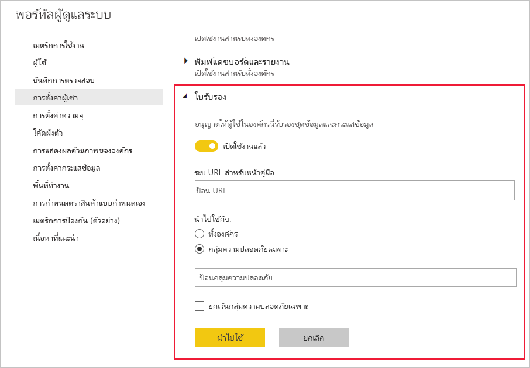

# ตั้งค่าการรับรองชุดข้อมูลและกระแสข้อมูล (ตัวอย่าง)

องค์กรของคุณสามารถรับรองชุดข้อมูลและกระแสข้อมูลที่เป็นแหล่งข้อมูลที่เชื่อถือได้สำหรับข้อมูลสำคัญ

ในฐานะผู้ดูแลระบบของผู้เช่า Power BI คุณมีหน้าที่รับผิดชอบสำหรับการตั้งค่ากระบวนการรับรองสำหรับองค์กรของคุณ ซึ่งหมายถึง:
* การเปิดใช้งานการรับรองบนผู้เช่าของคุณ
* การกำหนดรายการกลุ่มและผู้ใช้ที่ได้รับอนุญาตอย่างเป็นทางการเพื่อรับรองชุดข้อมูลและกระแสข้อมูล
* สำหรับชุดข้อมูล การระบุ URL ของนโยบายการรับรองชุดข้อมูลขององค์กร หากมีอยู่

การรับรองชุดข้อมูลและกระแสข้อมูลเป็นส่วนหนึ่งของ*การรับรอง*ชุดข้อมูลและกระแสข้อมูล ดูที่ [การรับรองชุดข้อมูล](../connect-data/service-datasets-promote.md) และ [การรับรองกระแสข้อมูล](../transform-model/service-dataflows-promote-certify.md) สำหรับข้อมูลเพิ่มเติม

## ตั้งค่าการรับรอง

1. ในพอร์ทัลผู้ดูแลระบบ ไปที่การตั้งค่าผู้เช่า
1. ภายใต้ส่วนการตั้งค่าการส่งออกและการแชร์ ขยายส่วนการรับรอง

   

1. ตั้งค่าการสลับเป็น **เปิดใช้งานแล้ว**
1. สำหรับการรับรองความถูกต้องของชุดข้อมูล หากองค์กรของคุณมีนโยบายการรับรองที่เผยแพร่แล้ว คุณจะสามารถใส่ URL ได้ที่นี่ การดำเนินการนี้จะกลายเป็นลิงก์ **เรียนรู้เพิ่มเติม** ในส่วนการรับรองของ [กล่องโต้ตอบการตั้งค่าการรับรองกระแสข้อมูล](../connect-data/service-datasets-promote.md#request-dataset-certification) 
1. ระบุผู้ใช้หรือกลุ่มที่ได้รับอนุญาตอย่างเป็นทางการให้รับรองชุดข้อมูลและกระแสข้อมูล ผู้รับรองที่ได้รับอนุญาตอย่างเป็นทางการเหล่านี้ จะสามารถใช้ปุ่ม การรับรอง ในส่วนการรับรองของกล่องโต้ตอบการตั้งค่าการรับรองของ [ชุดข้อมูล](../connect-data/service-datasets-promote.md#request-dataset-certification) หรือ [กระแสข้อมูล](../transform-model/service-dataflows-promote-certify.md#certify-a-dataflow)
1. คลิก**ใช้**

## ขั้นตอนถัดไป
* [เลื่อนระดับชุดข้อมูล](../connect-data/service-datasets-promote.md)
* [รับรองชุดข้อมูล](../connect-data/service-datasets-certify.md)
* [เลื่อนระดับกระแสข้อมูล](../transform-model/service-dataflows-promote-certify.md#promote-a-dataflow)
* [รับรองกระแสข้อมูล](../transform-model/service-dataflows-promote-certify.md#certify-a-dataflow)
* มีคำถามหรือไม่? [ลองถามชุมชน Power BI](https://community.powerbi.com/)
