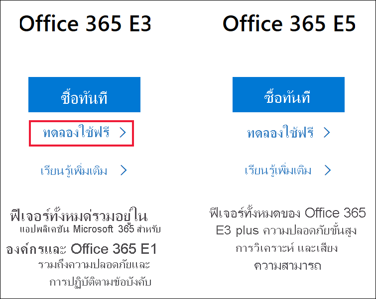
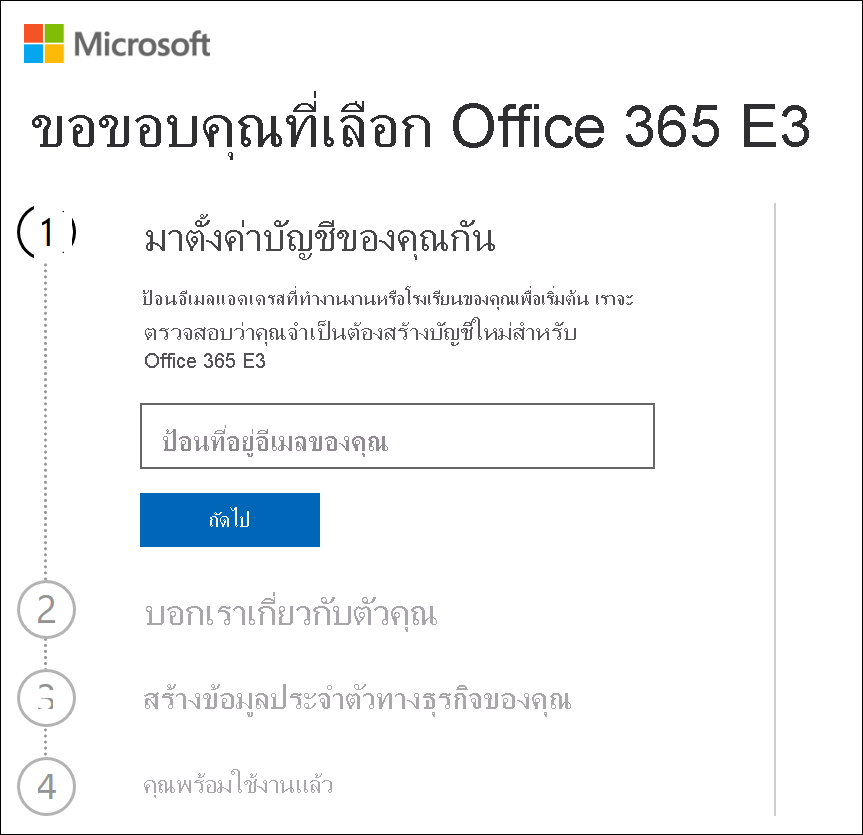
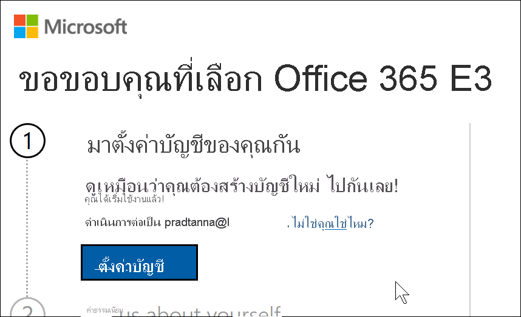
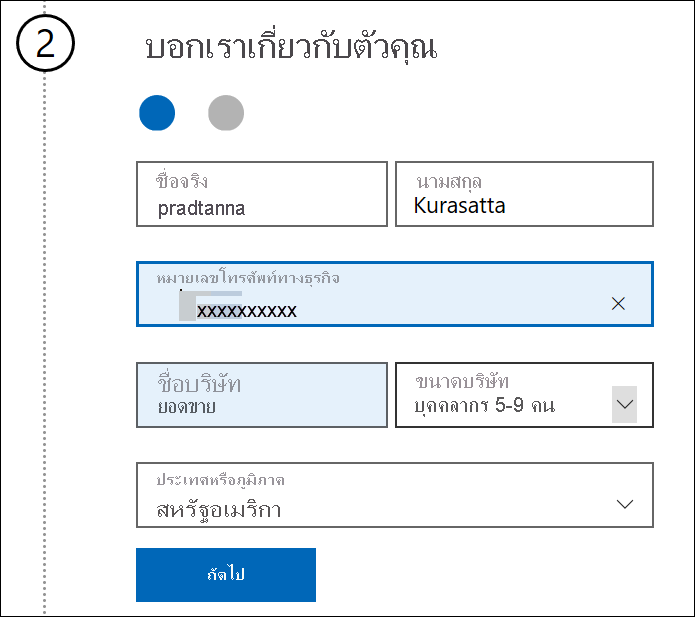
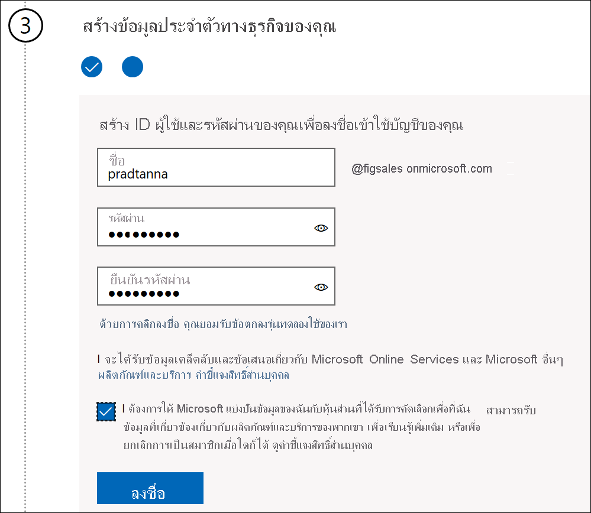
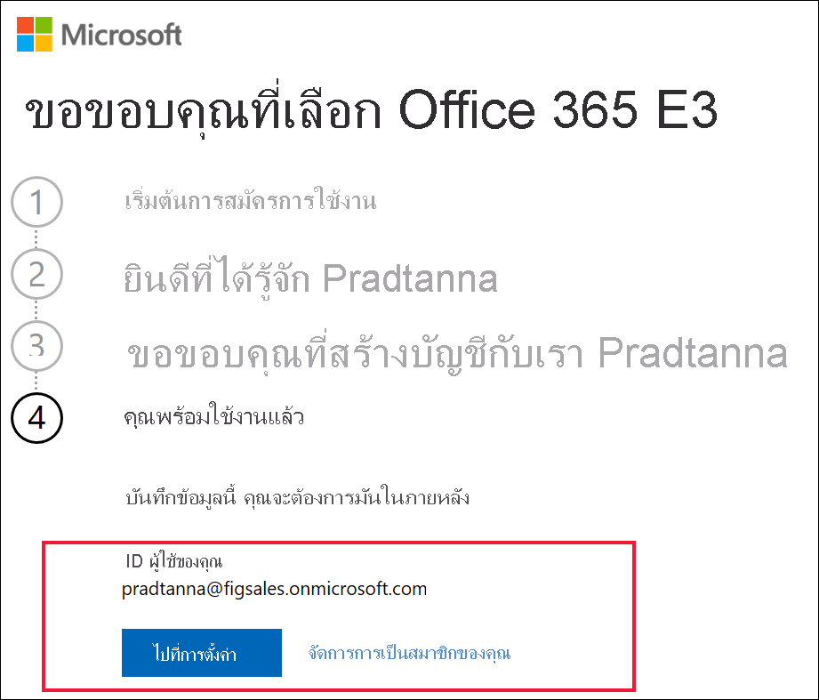

# ลงทะเบียนสำหรับ Power BI ด้วย Microsoft 365 รุ่นทดลองใช้ฟรี ตัวใหม่

บทความนี้อธิบายวิธีทางเลือกในการลงทะเบียนสำหรับบริการ Power BI ถ้าคุณยังไม่มีบัญชีผู้ใช้อีเมลที่ทำงานหรือโรงเรียน

หากคุณกำลังมีปัญหาในการลงทะเบียนใช้งาน Power BI ด้วยที่อยู่อีเมลของคุณ ก่อนอื่นให้ตรวจสอบให้แน่ใจว่าเป็น [ที่อยู่อีเมลที่สามารถใช้ได้กับ Power BI](../fundamentals/service-self-service-signup-for-power-bi.md#supported-email-addresses) ถ้าไม่สำเร็จ ให้ลงทะเบียนสำหรับ Microsoft 365 รุ่นทดลองใช้ฟรีและสร้างบัญชีที่ทำงาน จากนั้น ใช้บัญชีที่ทำงานใหม่เพื่อลงทะเบียนสำหรับบริการของ Power BI คุณจะสามารถใช้ Power BI ได้แม้ว่า Microsoft 365 รุ่นทดลองใช้ฟรีจะหมดอายุ

## ลงทะเบียนสำหรับรุ่นทดลองใช้ Office ของ Microsoft 365

ลงทะเบียนสำหรับ Microsoft 365 รุ่นทดลองใช้ฟรี[บนเว็บไซต์ Microsoft 365](https://www.microsoft.com/microsoft-365/business/compare-more-office-365-for-business-plans) ถ้าคุณยังไม่มีบัญชี Microsoft จะแนะนำให้คุณทำตามขั้นตอนในการสร้างบัญชี เนื่องจากบัญชีอีเมลการค้าเชิงพาณิชย์ (เช่น Hotmail และ Gmail) จะไม่สามารถใช้งานได้กับ Microsoft 365 คุณจะต้องสร้างบัญชีใหม่ที่จะ  บัญชีอีเมลนั้นจะมีลักษณะบางอย่างเช่น *zalan@onmicrosoft.com*

ถ้าคุณเลือก **Office 365 E5** รุ่นทดลองใช้ของคุณจะรวม Power BI Pro รุ่นทดลองใช้ของ Power BI Pro จะหมดอายุในเวลาเดียวกันกับ Office 365 E5 ซึ่งอยู่ในช่วง 30 วันในขณะนี้ ถ้าแต่คุณเลือก **Office 365 E3**คุณจะสามารถลงทะเบียนสำหรับ Power BI เป็นผู้ใช้*ฟรี*และอัปเกรดเป็น **Pro** สำหรับรุ่นทดลองใช้ 60 วัน 

1. ป้อนที่อยู่อีเมลของคุณ Microsoft จะแจ้งให้คุณทราบหากที่อยู่อีเมลนั้นสามารถใช้งานได้กับ Microsoft 365 หรือหากคุณจำเป็นต้องสร้างที่อยู่อีเมลใหม่  

    หากคุณต้องการที่อยู่อีเมลใหม่ Microsoft จะแนะนำคุณตามขั้นตอน ขั้นตอนแรกในการสร้างบัญชีใหม่ เลือก**ตั้งค่าบัญชี**

    

2. ป้อนรายละเอียดเกี่ยวกับบัญชีใหม่

    

3. สร้างที่อยู่อีเมลและรหัสผ่านใหม่ของคุณ สร้างชื่อการลงชื่อเข้าใช้ใหม่ของคุณที่มีลักษณะเหมือน you@yourcompany.onmicrosoft.com นี่คือการลงชื่อเข้าใช้ด้วยบัญชีที่ทำงานหรือโรงเรียนใหม่ของคุณและกับ Power BI

    

4. แค่นั้นเอง!  ขณะนี้คุณมีที่อยู่อีเมลที่คุณสามารถใช้ในการลงทะเบียนสำหรับ Power BI ได้ มุ่งหน้าไป [ลงทะเบียนสำหรับบริการของ Power BI เป็นรายบุคคล](../service-self-service-signup-for-power-bi.md)

     

    คุณอาจต้องรอในขณะที่สร้างผู้เช่าใหม่ของคุณขึ้น

## ข้อควรพิจารณาที่สำคัญ

หากคุณมีปัญหาในการลงชื่อเข้าใช้ด้วยบัญชีใหม่ ให้ลองใช้เซสชันเบราว์เซอร์ส่วนตัว

หากใช้วิธีการลงทะเบียนวิธีนี้ คุณกำลังสร้างผู้เช่าองค์กรใหม่ และคุณจะกลายเป็นผู้ดูแลผู้เช่า สามารถดูข้อมูลเพิ่มเติมได้ที่ [ผู้ดูแล Power BI คืออะไร](service-admin-administering-power-bi-in-your-organization.md) คุณสามารถเพิ่มผู้ใช้ใหม่ลงในผู้เช่าของคุณ แล้วแชร์ให้กับพวกเขา ดังที่อธิบายไว้ใน [เอกสารผู้ดูแลระบบ Microsoft 365](https://support.office.com/article/Add-users-individually-to-Office-365---Admin-Help-1970f7d6-03b5-442f-b385-5880b9c256ec)

## ขั้นตอนถัดไป

[การดูแลระบบ Power BI คืออะไร?](service-admin-administering-power-bi-in-your-organization.md)  
[สิทธิ์การใช้งาน Power BI สำหรับองค์กรของคุณ](service-admin-licensing-organization.md)  
[ลงทะเบียนใช้งาน Power BI เป็นรายบุคคล](../fundamentals/service-self-service-signup-for-power-bi.md)

มีคำถามเพิ่มเติมหรือไม่ [ลองถามชุมชน Power BI](https://community.powerbi.com/)
