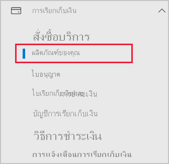
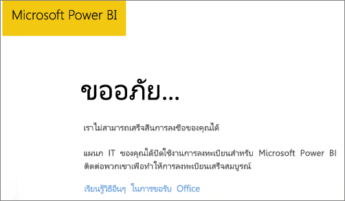

# เพิ่ม Power BI ในการสมัครสมาชิกคู่ค้า Microsoft 365

Microsoft 365 อนุญาตให้บริษัทสามารถขายต่อ Microsoft 365 โดยรวมเข้ากับโซลูชันของพวกเขาเองได้ และให้บริการด้านการจัดซื้อ การเรียกเก็บเงิน และการสนับสนุน ให้แก่ลูกค้าปลายทางในจุดเดียว

หากคุณสนใจที่จะเพิ่ม Power BI ในการสมัครใช้งาน Microsoft 365 เราขอแนะนำให้ติดต่อกับคู่ค้าของคุณ ถ้าคู่ค้าของคุณไม่มี Power BI ในขณะนี้ คุณสามารถติดตามตัวเลือกที่อธิบายไว้ด้านล่าง

## ติดต่อกับคู่ค้าของคุณเพื่อซื้อ Power BI

หากคุณต้องการซื้อการสมัครใช้งาน Power BI Pro หรือ Power BI Premium ให้ติดต่อคู่ค้าของคุณเพื่อพิจารณาทางเลือกที่คุณมี

* คู่ค้าของคุณตกลงที่จะเพิ่ม Power BI ลงในรายการผลิตภัฑณฑ์ของพวกเขาเพื่อให้คุณสามารถซื้อจากพวกเขาได้

* คู่ค้าของคุณสามารถเปลี่ยนรูปแบบของคุณให้สามารถซื้อ Power BI โดยตรงจาก Microsoft หรือคู่ค้าอื่นที่มี Power BI ได้

## สั่งซื้อจาก Microsoft หรือช่องทางอื่น

ขึ้นอยู่กับความสัมพันธ์ระหว่างคู่ค้าของคุณ คุณอาจสามารถซื้อ Power BI โดยตรงจาก Microsoft หรือคู่ค้าอื่นได้ คุณสามารถตรวจสอบว่าคุณสามารถเพิ่มการสมัครใช้งาน Power BI ในศูนย์การจัดการ Microsoft 365 ได้หรือไม่ (จำเป็นต้องเป็นสมาชิกในบทบาทผู้ดูแลระบบส่วนกลางหรือบทบาทผู้ดูแลระบบการเรียกเก็บเงิน)

1. ไปที่ [ศูนย์การจัดการ Microsoft 365](https://admin.microsoft.com/AdminPortal/Home#/homepage)

1. ในเมนูด้านซ้าย ให้เปิด **การเรียกเก็บเงิน** จากนั้นเลือก **ผลิตภัณฑ์ของคุณ**:

   

 1. ค้นหา **การสมัครสมาชิก** ตามที่แสดงในภาพด้านล่าง หากคุณเห็น **การสมัครใช้งาน** คุณสามารถขอรับบริการจาก Microsoft โดยตรง หรือติดต่อคู่ค้าอื่นที่มี Power BI

    

    หากคุณไม่เห็น **การสมัครใช้งาน** คุณจะไม่สามารถซื้อโดยตรงจาก Microsoft หรือจากคู่ค้าอื่นได้

หากคู่ค้าของคุณไม่มี Power BI และคุณไม่สามารถซื้อโดยตรงจาก Microsoft หรือคู่ค้าอื่น ให้พิจารณาลงทะเบียนทดลองใช้งานฟรี

## ลงทะเบียนเพื่อทดลองใช้งานฟรี

คุณสามารถลงทะเบียนเพื่อทดลองใช้งาน Power BI โดยไม่เสียค่าใช้จ่าย หากคุณไม่ซื้อ Power BI Pro ในตอนท้ายของช่วงทดลองใช้งาน คุณจะยังคงมีสิทธิ์ใช้งานฟรีที่มีคุณลักษณะมากมายของ Power BI ดูข้อมูลเพิ่มเติมได้ที่ [การสมัคร Power BI รายบุคคล](../fundamentals/service-self-service-signup-for-power-bi.md)

### เปิดใช้งานการสมัครใช้งานแบบเฉพาะกิจ

ตามค่าเริ่มต้น การลงทะเบียนรายบุคคล (หรือที่เรียกว่าการสมัครแบบเฉพาะกิจ) จะถูกปิดการใช้งาน ในกรณีนี้ คุณจะเห็นข้อความต่อไปนี้เมื่อคุณพยายามลงทะเบียน: *แผนก IT ของคุณได้ปิดใช้งานการลงทะเบียนสำหรับ Microsoft Power BI*

ถ้าต้องการเปิดให้สมัครใช้งานเฉพาะกิจ คุณต้องติดต่อกับคู่ค้าของคุณและขอให้เขาเปิดให้ใช้งาน หากคุณเป็นผู้ดูแลระบบผู้เช่าของคุณ และทราบวิธีการใช้คำสั่ง Azure Active Directory PowerShell คุณสามารถเปิดใช้งานการสมัครใช้เฉพาะกิจได้ด้วยตนเอง สำหรับข้อมูลเพิ่มเติม ให้ทำตามขั้นตอนใน [เปิดหรือปิดใช้งานการซื้อแบบบริการตนเอง](service-admin-disable-self-service.md)

## ขั้นตอนถัดไป

* [สิทธิ์การใช้งาน Power BI สำหรับองค์กรของคุณ](service-admin-licensing-organization.md)
* [ซื้อและะมอบใบอนุญาตการใช้งาน Power BI Pro](service-admin-purchasing-power-bi-pro.md)

มีคำถามเพิ่มเติมหรือไม่ [ลองถามชุมชน Power BI](https://community.powerbi.com/)