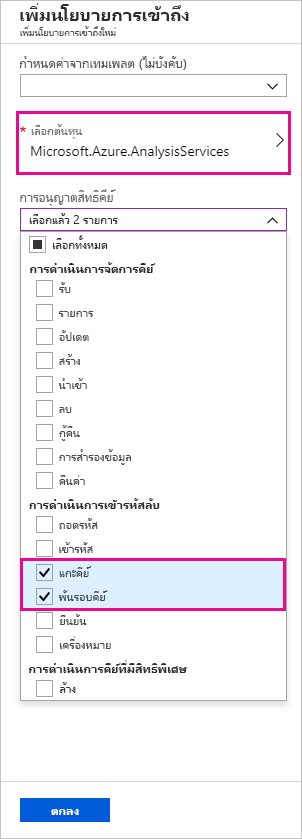
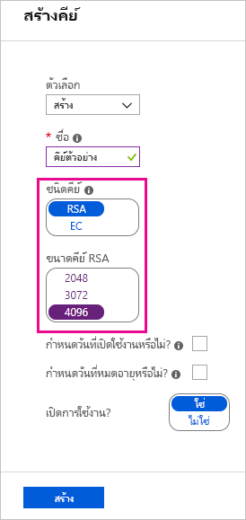
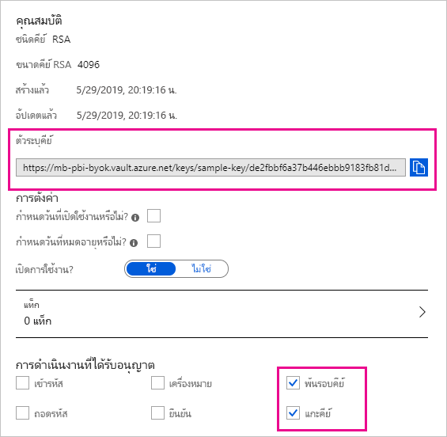

# <a name="bring-your-own-encryption-keys-for-power-bi"></a>นำคีย์การเข้ารหัสลับของคุณเองมาใช้กับ Power BI

Power BI เข้ารหัสลับข้อมูล_ที่พัก_และ_ระหว่างดำเนินการ_ ตามค่าเริ่มต้น Power BI ใช้คีย์ที่จัดการโดย Microsoft เพื่อเข้ารหัสลับข้อมูลของคุณ ใน Power BI Premium คุณยังสามารถใช้คีย์ของคุณเองสำหรับข้อมูลที่พักไว้ที่นำเข้าลงในชุดข้อมูล (ดู[ข้อควรพิจารณาเกี่ยวกับแหล่งข้อมูลและที่เก็บข้อมูล](#data-source-and-storage-considerations)สำหรับข้อมูลเพิ่มเติม) ได้ วิธีนี้จะอธิบายไว้มักจะเป็น_การนำคีย์ของคุณมาใช้เอง_(Bring Your Own Key, BYOK)

## <a name="why-use-byok"></a>เหตุใดจึงใช้ BYOK

BYOK ทำให้ง่ายต่อการปฏิบัติตามข้อกำหนดที่ระบุการจัดการคีย์ด้วย Cloud Service Provider (ในกรณีนี้คือ Microsoft) ด้วย BYOK คุณจะสามารถระบุและควบคุมคีย์การเข้ารหัสลับสำหรับข้อมูล Power BI ที่พักไว้ในระดับแอปพลิเคชัน ดังนั้น คุณสามารถควบคุมและยกเลิกคีย์ขององค์กรของคุณ คุณควรตัดสินใจเพื่อออกจากบริการ เมื่อยกเลิกคีย์ ข้อมูลจะไม่สามารถอ่านได้ในบริการภายใน 30 นาที

## <a name="data-source-and-storage-considerations"></a>ข้อควรพิจารณาเกี่ยวกับแหล่งข้อมูลและที่เก็บข้อมูล

หากต้องการใช้ BYOK คุณต้องอัปโหลดข้อมูลในบริการของ Power BI จากไฟล์ Power BI Desktop (PBIX) คุณไม่สามารถใช้ BYOK ในสถานการณ์ต่อไปนี้:

- การเชื่อมต่อแบบออนไลน์ของ Analysis Services
- เวิร์กบุ๊ก Excel (เว้นแต่ว่าข้อมูลจะถูกนำเข้าลงใน Power BI Desktop ก่อน)
- [ส่งชุดข้อมูล](/rest/api/power-bi/pushdatasets)
- [ชุดข้อมูลการสตรีม](../connect-data/service-real-time-streaming.md#set-up-your-real-time-streaming-dataset-in-power-bi)


BYOK ใช้กับชุดข้อมูลเท่านั้น Push ชุดข้อมูล ไฟล์ Excel และไฟล์ CSV ที่ผู้ใช้สามารถอัปโหลดไปยังบริการไม่ได้รับการเข้ารหัสโดยใช้คีย์ของคุณเอง เมื่อต้องระบุอาร์ทิแฟกต์ที่จัดเก็บไว้ในพื้นที่ทำงานของคุณ ให้ใช้คำสั่ง PowerShell ต่อไปนี้:

```PS C:\> Get-PowerBIWorkspace -Scope Organization -Include All```

> [!NOTE]
> cmdlet นี้ต้องการโมดูลการจัดการ Power BI เวอร์ชัน 1.0.840 คุณสามารถดูเวอร์ชันที่คุณมีอยู่โดยการเรียกใช้ Get-InstalledModule -Name MicrosoftPowerBIMgmt ติดตั้งเวอร์ชันล่าสุดโดยการเรียกใช้ Install-Module -Name MicrosoftPowerBIMgmt คุณสามารถรับข้อมูลเพิ่มเติมเกี่ยวกับ cmdlet ของ Power BI และพารามิเตอร์ของคำสั่งดังกล่าวใน[โมดูล cmdlet ของ Power BI PowerShell](https://docs.microsoft.com/powershell/power-bi/overview)

## <a name="configure-azure-key-vault"></a>กำหนดค่า Azure Key Vault

ในส่วนนี้คุณเรียนรู้วิธีการกำหนดค่า Azure Key Vault เครื่องมือเพื่อจัดเก็บและเข้าถึงความลับอย่างปลอดภัย เช่น คีย์การเข้ารหัสลับ คุณสามารถใช้ Key Vault ที่มีอยู่เพื่อจัดเก็บคีย์การเข้ารหัสลับ หรือคุณสามารถสร้างขึ้นใหม่โดยเฉพาะเพื่อใช้กับ Power BI

คำแนะนำในส่วนนี้ถือว่าเป็นความรู้พื้นฐานของ Azure Key Vault สำหรับข้อมูลเพิ่มเติม โปรดดูที่[Azure Key Vault คืออะไร](/azure/key-vault/key-vault-whatis) กำหนดค่า Key Vault ของคุณในวิธีต่อไปนี้:

1. เพิ่มบริการของ Power BI เป็นโครงร่างสำคัญของบริการสำหรับ Key Vault ด้วยสิทธิ์การครอบและยกเลิกการครอบ

1. สร้างคีย์ RSA ที่มีความยาว 4096 บิต (หรือใช้คีย์ที่มีอยู่ของชนิดนี้) ด้วยสิทธิ์การครอบและยกเลิกการครอบ

    > [!IMPORTANT]
    > Power BI BYOK สนับสนุนเฉพาะคีย์ RSA ที่มีความยาว 4096 บิตเท่านั้น

1. แนะนำ: ตรวจสอบว่า Key Vault มีการเปิดใช้งานตัวเลือก_ลบชั่วคราว_หรือไม่

### <a name="add-the-service-principal"></a>เพิ่มโครงร่างสำคัญของบริการ

1. ที่พอร์ทัล Azure ใน Key Vault ของคุณ ภายใต้**นโยบายการเข้าถึง** ให้เลือก**เพิ่มใหม่**

1. ภายใต้**เลือกรายการหลัก** ค้นหาและเลือก Microsoft.Azure.AnalysisServices

    > [!NOTE]
    > หากคุณไม่พบ "Microsoft.Azure.AnalysisServices" อาจเป็นไปได้ว่าการสมัครใช้งาน Azure ที่เชื่อมโยงกับ Azure Key Vault ของคุณไม่เคยมีทรัพยากร Power BI ที่เกี่ยวข้อง ลองค้นหาสตริงต่อไปนี้แทน: 00000009-0000-0000-c000-000000000000

1. ภายใต้**สิทธิ์คีย์** เลือก**ยกเลิกการครอบคีย์**และ**ครอบคีย์**

    

1. เลือก **ตกลง** จากนั้นจึงเลือก **บันทึก**

> [!NOTE]
> หากคุณต้องการยกเลิกการเข้าถึง Power BI ไปยังข้อมูลของคุณในอนาคต ให้ลบสิทธิ์การเข้าถึงบริการหลักจาก Azure Key Vault ของคุณ

### <a name="create-an-rsa-key"></a>สร้างคีย์ RSA

1. ใน Key Vault ของคุณ ภายใต้**คีย์** เลือก**สร้าง/นำเข้า**

1. เลือก **ประเภทคีย์** ของ RSA และ**ขนาดคีย์ RSA**คือ 4096

    

1. เลือก **สร้าง**

1. ภายใต้**คีย์** เลือกคีย์ที่คุณสร้างขึ้น

1. เลือก GUID สำหรับคีย์**รุ่นปัจจุบัน**

1. ตรวจสอบว่า ได้เลือกทั้ง **ครอบคีย์**และ**ยกเลิกการครอบคีย์** คัดลอก**รหัสคีย์**ที่จะใช้เมื่อคุณเปิดใช้งาน BYOK ใน Power BI

    

### <a name="soft-delete-option"></a>ลบตัวเลือกชั่วคราว

เราขอแนะนำให้คุณเปิดใช้งาน [ลบชั่วคราว](/azure/key-vault/key-vault-ovw-soft-delete)บน Key Vault ของคุณ เพื่อป้องกันข้อมูลสูญหายในกรณีที่มีการลบคีย์หรือ Key Vault โดยไม่ได้ตั้งใจ คุณต้องใช้ [PowerShell เพื่อเปิดใช้งานคุณสมบัติ "ลบชั่วคราว"](/azure/key-vault/key-vault-soft-delete-powershell) บน Key Vault เนื่องจากตัวเลือกนี้ยังไม่พร้อมใช้งานจากพอร์ทัล Microsoft Azure

เมื่อมีการกำหนดค่า Azure Key Vault อย่างถูกต้อง คุณก็พร้อมที่จะเปิดใช้งาน BYOK บนผู้เช่าของคุณ

## <a name="enable-byok-on-your-tenant"></a>เปิดใช้งาน BYOK บนผู้เช่าของคุณ

คุณเปิดใช้งาน BYOK ในระดับผู้เช่าด้วย [PowerShell](https://www.powershellgallery.com/packages/MicrosoftPowerBIMgmt.Admin) โดยการแนะนำคีย์การเข้ารหัสลับที่คุณสร้างและจัดเก็บไว้ใน Azure Key Vault ครั้งแรกให้กับผู้เช่า Power BI ของคุณผู้เช่า จากนั้นกำหนดคีย์การเข้ารหัสลับเหล่านี้ต่อความจุพรีเมียมสำหรับการเข้ารหัสเนื้อหาในความจุ

### <a name="important-considerations"></a>ข้อควรพิจารณาที่สำคัญ

ก่อนที่คุณเปิดใช้งาน BYOK ควรคำนึงถึงข้อควรพิจารณาต่อไปนี้:

- ในขณะนี้ คุณไม่สามารถปิดใช้งาน BYOK หลังจากที่คุณเปิดใช้งานได้ ขึ้นอยู่กับวิธีที่คุณระบุพารามิเตอร์สำหรับ`Add-PowerBIEncryptionKey` คุณสามารถควบคุมวิธีที่คุณใช้ BYOK สำหรับความจุอย่างน้อยหนึ่งรายการ อย่างไรก็ตาม คุณไม่สามารถยกเลิกการแนะนำคีย์ไปยังผู้เช่าของคุณได้ สำหรับข้อมูลเพิ่มเติม ให้ดู [เปิดใช้งาน BYOK](#enable-byok)

- คุณไม่สามารถย้ายพื้นที่ทำงานที่ใช้ BYOK ได้_โดยตรง_จากความจุเฉพาะใน Power BI Premium ไปยังความจุที่แชร์ ก่อนอื่น คุณต้องย้ายพื้นที่ทำงานไปยังความจุเฉพาะที่ไม่ได้เปิดใช้งาน BYOK

- ถ้าคุณย้ายพื้นที่ทำงานที่ใช้ BYOK จากกำลังการผลิตเฉพาะใน Power BI Premium ไปยังรายการที่ใช้ร่วมกัน รายงานและชุดข้อมูลจะไม่สามารถเข้าถึงได ้เนื่องจากมีการจัดรูปแบบด้วยคีย์ เพื่อหลีกเลี่ยงไม่ให้เกิดสถานการณ์เช่นนี้ คุณต้องย้ายพื้นที่ทำงานไปยังกำลังการผลิตเฉพาะที่ไม่ได้เปิดใช้งาน BYOK ก่อน

### <a name="enable-byok"></a>เปิดใช้งาน BYOK

หากต้องการเปิดใช้งาน BYOK คุณต้องเป็นผู้ดูแลระบบของผู้เช่าสหรับบริการของ Power BI ลงชื่อเข้าใช้โดยใช้ cmdlet`Connect-PowerBIServiceAccount` จากนั้น ใช ้[`Add-PowerBIEncryptionKey`](/powershell/module/microsoftpowerbimgmt.admin/Add-PowerBIEncryptionKey) เพื่อเปิดใช้งาน BYOK ดังที่แสดงในตัวอย่างต่อไปนี้:

```powershell
Add-PowerBIEncryptionKey -Name'Contoso Sales' -KeyVaultKeyUri'https://contoso-vault2.vault.azure.net/keys/ContosoKeyVault/b2ab4ba1c7b341eea5ecaaa2wb54c4d2'
```

เมื่อต้องการเพิ่มหลายคีย์ เรียกใช้`Add-PowerBIEncryptionKey`ด้วยค่าต่าง ๆ สำหรับ -`-Name`และ`-KeyVaultKeyUri` 

cmdlet ยอมรับพารามิเตอร์สลับสองรายการที่ส่งผลต่อการเข้ารหัสลับสำหรับความจุปัจจุบันและในอนาคต ตามค่าเริ่มต้น ไม่มีการตั้งค่าการสลับ:

- `-Activate`: ระบุว่าจะใช้คีย์นี้สำหรับความจุที่มีอยู่ทั้งหมดในผู้เช่าที่ไม่ได้เข้ารหัสลับ

- `-Default`: ระบุว่า คีย์นี้เป็นค่าเริ่มต้นสำหรับผู้เช่าทั้งหมดในขณะนี้หรือไม่ เมื่อคุณสร้างความจุใหม่ ความจุจะรับคีย์นี้มา

> [!IMPORTANT]
> ถ้าคุณระบุ `-Default` ความจุทั้งหมดที่สร้างขึ้นในผู้เช่าของคุณจากจุดนี้จะถูกเข้ารหัสลับโดยใช้คีย์ที่คุณระบุ (หรือคีย์เริ่มต้นที่อัปเดต) คุณไม่สามารถยกเลิกการดำเนินการเริ่มต้นได้ ดังนั้นคุณจึงไม่สามารถสร้างความจุพรีเมียมในผู้เช่าของคุณที่ไม่ได้ใช้ BYOK

หลังจากที่คุณเปิดใช้งาน BYOK กับผู้เช่าของคุณ ให้ตั้งค่าคีย์การเข้ารหัสสำหรับความจุ Power BI อย่างน้อยหนึ่งรายการหรือมากกว่า:

1. ใช้ [`Get-PowerBICapacity`](/powershell/module/microsoftpowerbimgmt.capacities/get-powerbicapacity) เพื่อรับ ID ความจุที่จำเป็นสำหรับขั้นตอนถัดไป

    ```powershell
    Get-PowerBICapacity -Scope Individual
    ```

    Cmdlet ส่งกลับผลลัพธ์ที่คล้ายคลึงกับผลลัพธ์ต่อไปนี้:

    ```
    Id              : xxxxxxxx-xxxx-xxxx-xxxx-xxxxxxxxxxxx
    DisplayName     : Test Capacity
    Admins          : adam@sometestdomain.com
    Sku             : P1
    State           : Active
    UserAccessRight : Admin
    Region          : North Central US
    ```

1. ใช้ [`Set-PowerBICapacityEncryptionKey`](/powershell/module/microsoftpowerbimgmt.admin/set-powerbicapacityencryptionkey) เพื่อตั้งค่าคีย์การเข้ารหัสลับ:

    ```powershell
    Set-PowerBICapacityEncryptionKey -CapacityId xxxxxxxx-xxxx-xxxx-xxxx-xxxxxxxxxxxx -KeyName 'Contoso Sales'
    ```

คุณสามารถควบคุมวิธีที่คุณใช้ BYOK ในผู้เช่าของคุณ ตัวอย่างเช่น ในการเข้ารหัสลับความจุเดียว เรียกใช้ `Add-PowerBIEncryptionKey` โดยไม่มี `-Activate` หรือ `-Default` จากนั้น เรียกใช้ `Set-PowerBICapacityEncryptionKey` สำหรับความจุที่คุณต้องการเปิดใช้งาน BYOK

## <a name="manage-byok"></a>จัดการ BYOK

Power BI มี cmdlet เพิ่มเติมเพื่อช่วยจัดการ BYOK ในผู้เช่าของคุณ:

- ใช้ [`Get-PowerBICapacity`](/powershell/module/microsoftpowerbimgmt.capacities/get-powerbicapacity) เพื่อรับคีย์ที่ความจุกำลังใช้งาน:

    ```powershell
    Get-PowerBICapacity -Scope Organization -ShowEncryptionKey
    ```

- ใช้ [`Get-PowerBIEncryptionKey`](/powershell/module/microsoftpowerbimgmt.admin/get-powerbiencryptionkey) เพื่อรับคีย์ที่ผู้เช่าของคุณกำลังใช้งาน:

    ```powershell
    Get-PowerBIEncryptionKey
    ```

- ใช้ [`Get-PowerBIWorkspaceEncryptionStatus`](/powershell/module/microsoftpowerbimgmt.admin/get-powerbiworkspaceencryptionstatus) เพื่อดูว่ามีการเข้ารหัสชุดข้อมูลในพื้นที่ทำงานหรือไม่ และสถานะการเข้ารหัสลับซิงค์กับพื้นที่ทำงานหรือไม่:

    ```powershell
    Get-PowerBIWorkspaceEncryptionStatus -Name'Contoso Sales'
    ```

    โปรดทราบว่ามีการเปิดใช้งานการเข้ารหัสลับที่ระดับความจุ แต่คุณได้รับสถานะการเข้ารหัสลับที่ระดับชุดข้อมูลสำหรับพื้นที่ทำงานที่ระบุ

- ใช้ [`Switch-PowerBIEncryptionKey`](/powershell/module/microsoftpowerbimgmt.admin/switch-powerbiencryptionkey) เพื่อสลับ (หรือ_หมุน_) เวอร์ชันของคีย์ที่ถูกใช้สำหรับการเข้ารหัสลับ cmdlet เพียงแค่อัปเดต `-KeyVaultKeyUri` สำหรับคีย์ `-Name`:

    ```powershell
    Switch-PowerBIEncryptionKey -Name'Contoso Sales' -KeyVaultKeyUri'https://contoso-vault2.vault.azure.net/keys/ContosoKeyVault/b2ab4ba1c7b341eea5ecaaa2wb54c4d2'
    ```


## <a name="next-steps"></a>ขั้นตอนถัดไป

* [โมดูล cmdlet ของ PowerShell Power BI](https://docs.microsoft.com/powershell/power-bi/overview) 

* [วิธีการแชร์งานของคุณใน Power BI](../collaborate-share/service-how-to-collaborate-distribute-dashboards-reports.md)

* [กรองรายงานโดยใช้พารามิเตอร์ของสตริงคิวรีใน URL](../collaborate-share/service-url-filters.md)

* [ฝังด้วยส่วนเว็บรายงานใน SharePoint Online](../collaborate-share/service-embed-report-spo.md)

* [เผยแพร่บนเว็บจาก Power BI](../collaborate-share/service-publish-to-web.md)

