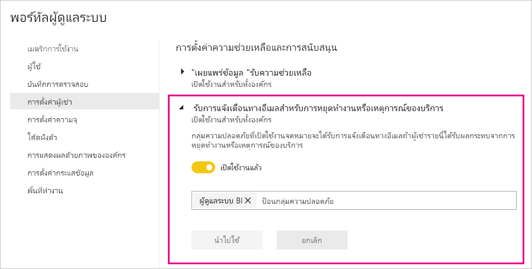

# การแจ้งเตือนการหยุดชะงักของบริการ

สิ่งสำคัญคือต้องมีข้อมูลเชิงลึกเกี่ยวกับความพร้อมใช้งานของแอปพลิเคชันทางธุรกิจที่สำคัญสำหรับภารกิจของคุณ Power BI มีการแจ้งเตือนเหตุการณ์เพื่อให้คุณสามารถเลือกรับอีเมลได้ถ้ามีการหยุดทำงานหรือการลดประสิทธิภาพของบริการ ในขณะที่ข้อตกลงระดับบริการของ Power BI (SLA) อยู่ที่ 99.9% ทำให้เกิดเหตุการณ์เหล่านี้ไม่บ่อย แต่เราต้องการให้แน่ใจว่าคุณได้รับแจ้งให้ทราบ หน้าจอต่อไปนี้แสดงชนิดของอีเมลที่คุณจะได้รับถ้าคุณเปิดใช้งานการแจ้งเตือน:

ในตอนนี้ เราจะส่งอีเมลสำหรับ_สถานการณ์ความน่าเชื่อถือ_ดังต่อไปนี้:

- เปิดความน่าเชื่อถือของรายงาน
- ความน่าเชื่อถือของการรีเฟรชแบบจำลอง
- ความน่าเชื่อถือของการรีเฟรชคิวรี

การแจ้งเตือนจะถูกส่งไปเมื่อมี_ความล่าช้าที่ขยายออกไป_ในการดำเนินงาน เช่น การเปิดรายงาน การรีเฟรชชุดข้อมูล หรือการดำเนินการคิวรี หลังจากที่มีการแก้ไขปัญหาแล้ว คุณจะได้รับอีเมลการติดตามผล

> [!NOTE]
> ปัจจุบัน คุณลักษณะนี้พร้อมใช้งานสำหรับความจุเฉพาะใน Power BI Premium เท่านั้น ซึ่งไม่พร้อมใช้งานสำหรับความจุที่ใช้ร่วมกันหรือฝังไว้

## ความจุและการแจ้งเตือนความมั่นคง

เมื่อความจุของ Power BI Premium ประสบกับปัญหาการใช้ทรัพยากรสูงในระยะยาวที่อาจส่งผลต่อความมั่นคงได้ ระบบจะส่งอีเมลแจ้งเตือนออกไป ตัวอย่างของผลกระทบดังกล่าวหมายรวมถึงความล่าช้าในการทำงานมากยิ่งขึ้น เช่น การเปิดรายงาน การรีเฟรชชุดข้อมูล และการประมวลคำถาม 

อีเมลแจ้งเตือนให้ข้อมูลเรื่องเหตุผลในการใช้ทรัพยากรสูง รวมถึงข้อมูลต่อไปนี้:

* รหัสชุดข้อมูลของชุดข้อมูลที่รับผิดชอบ
* ประเภทการดำเนินการ
* เวลาการใช้งาน CPU ที่เกี่ยวข้องกับการใช้ทรัพยากรสูง

และ Power BI จะส่งการแจ้งเตือนทางอีเมลเมื่อตรวจพบว่ามีการใช้งาน Power BI Premium เกินความจุ อีเมลจะอธิบายเหตุผลที่อาจก่อให้เกิดการโอเวอร์โหลด ซึ่งคือการดำเนินการที่ก่อโหลดในช่วง 10 นาทีก่อนหน้าและปริมาณของโหลดของแต่ละการดำเนินการ 

ถ้าคุณมีความจุของ Premium มากกว่าหนึ่งชุด อีเมลจะให้ข้อมูลเกี่ยวกับความจุเหล่านั้นในช่วงที่เกิดการโอเวอร์โหลด คุณจึงสามารถพิจารณาย้ายพื้นที่ทำงานที่มีรายการที่ใช้ทรัพยากรเข้มข้นไปยังความจุที่มีโหลดน้อยที่สุด

ระบบจะส่งอีเมลแจ้งเตือนการโอเวอร์โหลดเฉพาะเมื่อมีการใช้งานถึงขีดจำกัดการโอเวอร์โหลดเท่านั้น คุณจะไม่ได้รับอีเมลฉบับต่อมาอีกในกรณีที่โหลดบนความจุ Premium คืนกลับสู่ระดับที่ไม่โอเวอร์โหลด

รูปภาพต่อไปนี้แสดงตัวอย่างของอีเมลแจ้งเตือน:

## เปิดใช้งานการแจ้งเตือน

ผู้ดูแลระบบผู้เช่า Power BI จะเปิดใช้งานการแจ้งเตือนในพอร์ทัลผู้ดูแลระบบ:

1. ระบุหรือสร้างกลุ่มความปลอดภัยที่เปิดใช้งานอีเมลซึ่งควรได้รับการแจ้งเตือน

1. ในพอร์ทัลผู้ดูแลระบบ ให้เลือก**การตั้งค่าผู้เช่า** ภายใต้**วิธีใช้และการตั้งค่าการสนับสนุน** ขยาย**รับการแจ้งเตือนทางอีเมลสำหรับบริการขัดข้องหรือเหตุการณ์**

1. เปิดใช้งานการแจ้งเตือน ให้ใส่กลุ่มความปลอดภัยและเลือก **นำไปใช้**

    

> [!NOTE]
> Power BI ส่งการแจ้งเตือนจากบัญชีno-reply-powerbi@microsoft.com ตรวจสอบให้แน่ใจว่าบัญชีนี้ถูกเพิ่มในรายการผู้ส่งที่ปลอดภัยของคุณเพื่อไม่ให้การแจ้งเตือนอีเมลปรากฏอยู่ในโฟลเดอร์อีเมลขยะ

## ขั้นตอนถัดไป

[ตัวเลือกการสนับสนุน Power BI Pro และ Power BI Premium](service-support-options.md)

มีคำถามเพิ่มเติมหรือไม่ [ลองไปที่ชุมชน Power BI](https://community.powerbi.com/)
