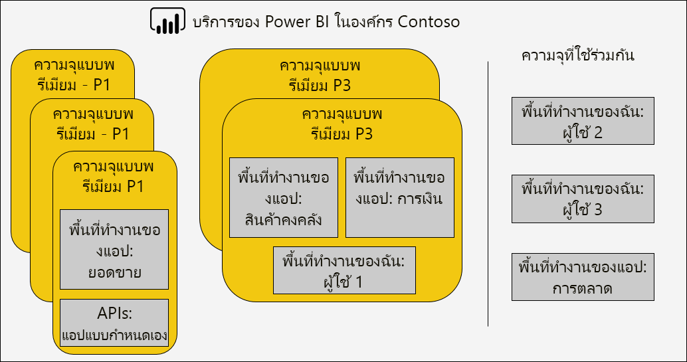
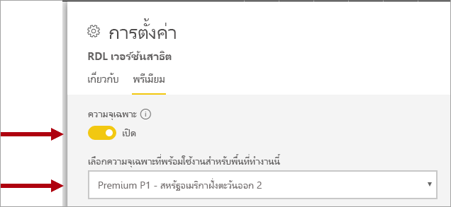
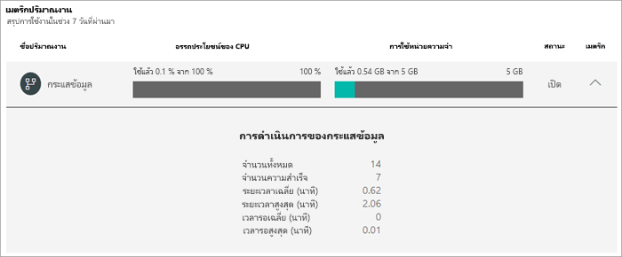
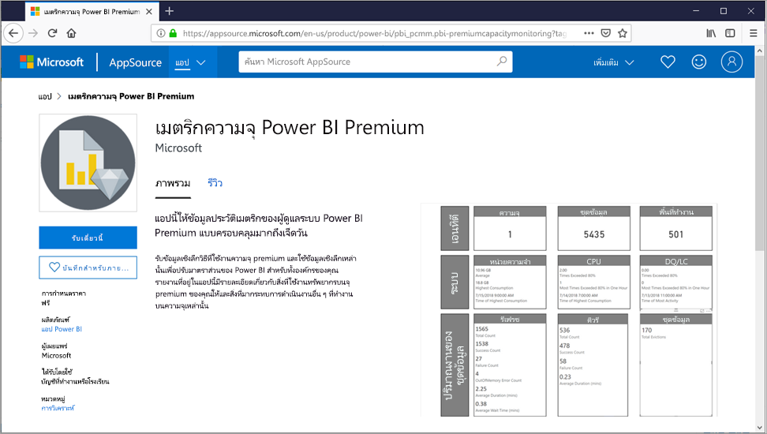

# การจัดการความจุแบบพรีเมียม

การจัดการ Power BI Premium เกี่ยวข้องกับ การสร้าง การจัดการ และการตรวจสอบความจุแบบพรีเมียม บทความนี้ให้ดูภาพรวมของความจุให้ดู[ตัวเลขและการจัดการความจุ](service-admin-premium-manage.md)พรีเมียมทีละขั้นตอน

## การสร้างและการจัดการความจุ

หน้า**การตั้งค่าความจุ**ของพอร์ทัลผู้ดูแลระบบ Power BI จะแสดงจำนวนวี-คอร์ที่ซื้อและความจุแบบพรีเมียมพร้อมใช้งาน หน้านี้ช่วยให้ผู้ดูแลระบบส่วนกลาง หรือผู้ดูแลระบบบริการของ Power BI สามารถสร้างความจุแบบพรีเมียมจากวี-คอร์ที่พร้อมใช้งาน หรือปรับเปลี่ยนความจุแบบพรีเมียมที่มีอยู่

เมื่อสร้างความจุแบบพรีเมียม ผู้ดูแลระบบจะต้องกำหนด:

- ชื่อความจุ (ที่ไม่ซ้ำกันภายในผู้เช่า)
- ผู้ดูแลระบบความจุ
- ขนาดความจุ
- ภูมิภาคสำหรับที่อยู่ข้อมูล

ต้องกำหนดผู้ดูแลระบบความจุอย่างน้อยหนึ่งคน ผู้ใช้ที่เป็นผู้ดูแลระบบความจุสามารถ:

- กำหนดพื้นที่ทำงานสำหรับความจุ
- จัดการสิทธิ์ของผู้ใช้ เพื่อเพิ่มผู้ดูแลระบบความจุเพิ่มเติมหรือผู้ใช้ที่มีสิทธิ์ในการกำหนด (เพื่อให้พวกเขาสามารถกำหนดพื้นที่ทำงานของความจุ)
- จัดการปริมาณงาน เพื่อกำหนดค่าการใช้หน่วยความจำสูงสุดสำหรับรายงานที่มีการแบ่งหน้าและปริมาณงานของกระแสข้อมูล
- รีสตาร์ทความจุ เพื่อรีเซ็ตการทำงานทั้งหมดในกรณีที่ระบบโอเวอร์โหลด

ผู้ดูแลระบบความจุไม่สามารถเข้าถึงเนื้อหาพื้นที่ทำงานเว้นแต่จะได้รับมอบหมายอย่างชัดเจนในสิทธิ์ของพื้นที่ทำงาน ผู้ดูแลความจุไม่สามารถเข้าถึงพื้นที่ทั้งหมดของผู้ดูแลระบบ Power BI (เว้นแต่จะมีการกำหนดไว้อย่างชัดเจน) เช่น เมตริกการใช้งาน บันทึกการตรวจสอบ หรือการตั้งค่าผู้เช่า ที่สำคัญ ผู้ดูแลระบบความจุไม่มีสิทธิ์ในการสร้างความจุใหม่ หรือปรับขนาดความจุที่มีอยู่ ผู้ดูแลระบบยังได้รับมอบหมายตามข้อมูลพื้นฐานของความจุเพื่อให้มั่นใจว่าจะสามารถดูและจัดการความจุตามที่ได้รับมอบหมายเท่านั้น

ขนาดความจุถูกเลือกจากรายการที่มีของตัวเลือก SKU ซึ่งถูกจำกัดด้วยจำนวนของวี-คอร์ที่พร้อมใช้งานในกลุ่ม โดยมีความเป็นไปได้ที่จะสร้างความจุหลายอย่างจากกลุ่ม ซึ่งสามารถจัดหาได้จาก SKU ที่ซื้ออย่างน้อยหนึ่งรายการ ตัวอย่างเช่น P3 SKU (32 วี-คอร์) สามารถใช้เพื่อสร้างความจุสามแบบได้แก่ P2 หนึ่ง (16 วี-คอร์), และ P1 สอง (2 x 8 วี-คอร์) ได้ ประสิทธิภาพที่เพิ่มขึ้นและการปรับมาตราส่วนสามารถทำได้โดยการสร้างความจุที่มีขนาดเล็กกว่า และหัวข้อนี้จะกล่าวถึงในบทความ[การปรับความจุแบบพรีเมียมให้เหมาะสม](service-premium-capacity-optimize.md) ภาพต่อไปนี้แสดงตัวอย่างการตั้งค่าสำหรับองค์กร Contoso ที่สมมติขึ้น ซึ่งประกอบด้วยความจุแบบพรีเมียมห้าแบบ (3 x P1 และ 2 x P3) โดยแต่ละความจุประกอบด้วยพื้นที่ทำงาน และพื้นที่ทำงานหลายแห่งในความจุที่ใช้ร่วมกัน

สามารถกำหนดความจุพรีเมียมให้กับภูมิภาคอื่นนอกเหนือจากภูมิภาคหลักของผู้เช่า Power BI ที่เรียกว่าภูมิศาสตร์หลายแบบ หลายภูมิศาสตร์ให้การควบคุมระดับผู้ดูแลที่ศูนย์การผลิตภายในภูมิภาคทางภูมิศาสตร์ของคุณมีเนื้อหา Power BI ของคุณอยู่ เหตุผลสำหรับการปรับใช้ในหลายภูมิศาสตร์นั้น โดยทั่วไปแล้วสำหรับการปฏิบัติตามกฎระเบียบขององค์กรหรือรัฐบาลมากกว่าประสิทธิภาพและขนาด การโหลดรายงานและแดชบอร์ดยังเกี่ยวข้องกับคำขอในภูมิภาคหลักสำหรับเมตาดาต้า เมื่อต้องการเรียนรู้เพิ่มเติม ดูที่ [การสนับสนุนแบบ Multi-Geo สำหรับ Power BI Premium](service-admin-premium-multi-geo.md)

ผู้ดูแลระบบบริการของ Power BI และผู้ดูแลระบบส่วนกลาง สามารถปรับเปลี่ยนความจุแบบพรีเมียมได้ โดยเฉพาะ ผู้ใช้สามารถที่จะ:

- เปลี่ยนขนาดความจุเพื่อขยายหรือลดแหล่งทรัพยากร
- เพิ่มหรือลบผู้ดูแลระบบความจุ
- เพิ่มหรือลบผู้ใช้ที่มีสิทธิ์ในการกำหนด
- เพิ่มหรือลบปริมาณงานเพิ่มเติม
- เปลี่ยนภูมิภาค

ต้องใช้สิทธิ์ในการกำหนดเพื่อกำหนดพื้นที่ทำงานของความจุแบบพรีเมียมที่เฉพาะเจาะจง สิทธิ์สามารถมอบให้กับทั้งองค์กร ผู้ใช้ หรือกลุ่มที่เฉพาะเจาะจง

ตามค่าเริ่มต้น ความจุแบบพรีเมียมจะสนับสนุนปริมาณงานที่เชื่อมโยงกับการเรียกใช้คิวรี Power BI กำลังการผลิตของ premium ยังรองรับปริมาณงานเพิ่มเติม **AI (บริการด้านการรับรู้)** **รายงานแบบคั่นหน้า**และ**กระแสข้อมูล** ปริมาณงานแต่ละรายการต้องกำหนดค่าหน่วยความจำสูงสุด (เป็นเปอร์เซ็นต์ของผลรวมหน่วยความจำที่พร้อมใช้งาน) ที่สามารถใช้ได้ตามปริมาณงาน คุณจะต้องเข้าใจว่าการเพิ่มการปันส่วนหน่วยความจำสูงสุดอาจมีผลกระทบต่อจำนวนของแบบจำลองที่ใช้งานที่สามารถกำหนดเป็นโฮสต์ และอัตราความเร็วของการรีเฟรช 

ระบบได้จัดสรรหน่วยความจำให้กับกระแสข้อมูลเชิงไดนามิก แต่ในเชิงสแตติกแล้วระบบได้จัดสรรหน่วยความจำนั้นให้กับรายงานที่มีการแบ่งหน้า เหตุผลสำหรับการปันส่วนหน่วยความจำสูงสุดแบบคงที่คือรายงานที่มีการแบ่งแบ่งหน้าจะทำงานภายในพื้นที่ความจุที่มีความปลอดภัย ควรใช้ความระมัดระวังเมื่อตั้งค่าหน่วยความจำของรายงานที่มีการแบ่งหน้าเนื่องจากจะลดหน่วยความจำที่มีอยู่สำหรับโหลดแบบจำลอง เมื่อต้องการเรียนรู้เพิ่มเติมให้ดู[การตั้งค่าหน่วยความจำเริ่มต้น](service-admin-premium-workloads.md#default-memory-settings)

การลบความจุแบบพรีเมียมสามารถทำได้และจะไม่ส่งผลให้มีการลบพื้นที่ทำงานและเนื้อหาของความจุ แต่ย้ายพื้นที่ทำงานที่กำหนดไว้ต่าง ๆ ไปยังความจุที่ใช้ร่วมกัน เมื่อความจุแบบพรีเมียมถูกสร้างขึ้นในภูมิภาคอื่น พื้นที่ทำงานถูกย้ายไปยังความจุที่ใช้ร่วมกันของภูมิภาคหลัก

### การกำหนดพื้นที่ทำงานในความจุ

คุณสามารถกำหนดพื้นที่ทำงานสำหรับความจุแบบพรีเมียมในพอร์ทัลผู้ดูแลระบบ Power BI หรือสำหรับพื้นที่ทำงานในบานหน้าต่างของ**พื้นที่ทำงาน**

ผู้ดูแลระบบความจุ ตลอดจนผู้ดูแลระบบส่วนกลาง หรือผู้ดูแลระบบบริการของ Power BI สามารถกำหนดพื้นที่ทำงานจำนวนมากในพอร์ทัลผู้ดูแลระบบ Power BI ได้ กลุ่มที่กำหนดไว้สามารถนำไปใช้กับ:

- **พื้นที่ทำงานโดยผู้ใช้** - พื้นที่ทำงานทั้งหมดที่ผู้ใช้เหล่านั้นเป็นเจ้าของ รวมถึงพื้นที่ทำงานส่วนบุคคลได้รับการกำหนดไว้สำหรับความจุแบบพรีเมียม ซึ่งจะรวมถึงการกำหนดพื้นที่ทำงานใหม่เมื่อพื้นที่ทำงานเหล่านั้นถูกกำหนดไว้สำหรับความจุแบบพรีเมียมอื่นแล้ว นอกจากนี้ ผู้ใช้ยังจะได้รับสิทธิ์ในการกำหนดพื้นที่ทำงาน

- **พื้นที่ทำงานเฉพาะ**
- **พื้นที่ทำงานทั้งหมดขององค์กร** - พื้นที่ทำงานทั้งหมด รวมถึงพื้นที่ทำงานส่วนบุคคลได้รับการกำหนดไว้สำหรับความจุแบบพรีเมียม ผู้ใช้ปัจจุบันและผู้ใช้ในอนาคตทั้งหมดยังจะได้รับสิทธิ์ในการกำหนดพื้นที่ทำงาน ไม่แนะนำให้ใช้วิธีการนี้ ต้องการวิธีการที่กำหนดเป้าหมายมากขึ้น

สามารถเพิ่มพื้นที่ทำงานในความจุแบบพรีเมียมโดยใช้บานหน้าต่างของ**พื้นที่ทำงาน**โดยผู้ใช้เป็นทั้งผู้ดูแลระบบพื้นที่ทำงานและมีสิทธิ์ในการกำหนด

ผู้ดูแลระบบพื้นที่ทำงานสามารถลบพื้นที่ทำงานจากความจุ (สำหรับความจุที่ใช้ร่วมกัน) โดยไม่จำเป็นต้องมีสิทธิ์ในการกำหนด การลบพื้นที่ทำงานออกจากความจุเฉพาะที่เป็นผลจะย้ายตำแหน่งพื้นที่ทำงานไปยังความจุที่ใช้ร่วมกัน โปรดทราบว่าการลบพื้นที่ทำงานออกจากความจุแบบพรีเมียมอาจมีผลกระทบด้านลบ ตัวอย่างเช่น ในเนื้อหาที่แชร์จะไม่สามารถใช้งานได้กับผู้ใช้ที่ได้รับสิทธิ์ Power BI Free หรือการระงับการรีเฟรชตามกำหนดเวลาเมื่อเกินค่าเผื่อที่รองรับโดยความจุที่ใช้ร่วมกัน

ในบริการของ Power BI พื้นที่ทำงานที่กำหนดไว้สำหรับความจุแบบพรีเมียมสามารถระบุได้ง่ายโดยไอคอนข้าวหลามตัดที่ติดชื่อของพื้นที่ทำงาน

## การตรวจสอบความจุ

การตรวจสอบความจุแบบพรีเมียมช่วยให้ผู้ดูแลระบบเข้าใจถึงวิธีการทำงานของความจุ สามารถตรวจสอบความจุได้โดยใช้พอร์ทัลผู้ดูแลระบบ Power BI หรือแอปเมตริก**Power BI Premium (Power BI)**

### พอร์ทัลผู้ดูแลระบบ Power BI

ในพอร์ทัลผู้ดูแลสำหรับแต่ละความจุแท็บ**สุขภาพ**มีเมตริกสรุปสำหรับความจุและปริมาณงานที่เปิดใช้แต่ละรายการ เมตริกแสดงค่าเฉลี่ยในเจ็ดวันที่ผ่านมา  

ในระดับกำลังการผลิตเมตริกจะสะสมของปริมาณงานที่เปิดใช้ทั้งหมด มีการระบุเมตริกดังต่อไปนี้:

- **การใช้ CPU อย่างเต็มประสิทธิภาพ** - ให้การใช้งาน cpu โดยเฉลี่ยเป็นเปอร์เซ็นต์ของ cpu ที่พร้อมใช้ทั้งหมดสำหรับความจุ  
- **การใช้หน่วยความจำ** - ให้การใช้หน่วยความจำเฉลี่ย (GB) เป็นผลรวมของหน่วยความจำที่พร้อมใช้งานสำหรับความจุ 

สำหรับแต่ละปริมาณงานที่เปิดใช้การใช้งาน CPU และหน่วยความจำที่มีให้เช่นเดียวกับจำนวนของเมตริกที่ระบุปริมาณงาน ตัวอย่างเช่นสำหรับปริมาณงานกระแสข้อมูล **จำนวนรวม**แสดงการรีเฟรชทั้งหมดสำหรับแต่ละกระแสข้อมูล และ**ระยะเวลาเฉลี่ย**แสดงระยะเวลาโดยเฉลี่ยของการฟื้นฟูกระแสข้อมูล

หากต้องการเรียนรู้เพิ่มเติมเกี่ยวกับเมตริกที่พร้อมใช้งานทั้งหมดสำหรับแต่ละปริมาณให้[ดูการตรวจสอบความจุในพอร์ทัลผู้ดูแล](service-admin-premium-monitor-portal.md)

การตรวจสอบขีดความสามารถในพอร์ทัลผู้ดูแลระบบ Power BI  ได้รับการออกแบบมาเพื่อช่วยให้สามารถสรุปเมตริก์ความจุหลักได้อย่างรวดเร็ว สำหรับรายละเอียดเพิ่มเติมเกี่ยวกับการตรวจสอบ แนะนำให้คุณใช้แอป**เมตริกความจุ Power BI Premium**

### แอปเมตริกความจุ Power BI Premium

แอป[เมตริกความจุ Power BI Premium](https://appsource.microsoft.com/en-us/product/power-bi/pbi_pcmm.capacity-metrics-dxt?tab=Overview) คือแอป Power BI ที่สามารถใช้ได้สำหรับผู้ดูแลระบบความจุ และติดตั้งเช่นเดียวกับแอป Power BI อื่น ๆ ซึ่งประกอบด้วยแดชบอร์ดและรายงาน

เมื่อแอปเปิดขึ้น แดชบอร์ดจะถูกโหลดเพื่อแสดงไทล์จำนวนมากที่แสดงมุมมองโดยรวมของความจุทั้งหมดที่ผู้ใช้เป็นผู้ดูแลระบบความจุ เค้าโครงแดชบอร์ดประกอบด้วยส่วนหลักห้าส่วน:

- **ภาพรวม** - เวอร์ชันแอป จำนวนของความจุและพื้นที่ทำงาน
- **การสรุปของระบบ** - หน่วยความจำและเมตริกของ CPU
- **สรุปชุดข้อมูล** - จำนวนของชุดข้อมูล, DQ/LC, เมตริกการรีเฟรชและการคิวรี
- **การสรุปชุดข้อมูล** - จำนวนกระแสข้อมูล และเมตริกชุดข้อมูล
- **สรุปรายงานการแบ่งหน้า** - รายงานจน-รีเฟรชและดูเมตริก

รายงานเบื้องต้น (จากแดชบอร์ดที่ปักหมุดไว้) สามารถเข้าถึงได้โดยคลิกที่ไทล์แดชบอร์ดต่าง ๆ ซึ่งแสดงมุมมองรายละเอียดเพิ่มเติมของแต่ละส่วนแดชบอร์ด และสนับสนุนการกรองแบบโต้ตอบ 

การกรองสามารถทำได้โดยการตั้งค่าตัวแบ่งส่วนข้อมูลตามช่วงวัน ความจุ พื้นที่ทำงาน และปริมาณงาน (รายงาน ชุดข้อมูล กระแสข้อมูล) และโดยการเลือกองค์ประกอบภายในวิชวลการรายงานเพื่อกรองข้ามหน้ารายงาน การกรองข้ามเป็นเทคนิคที่มีประสิทธิภาพเพื่อจำกัดช่วงเวลา ความจุพื้นที่ทำงาน ชุดข้อมูล และอื่น ๆ ที่เฉพาะเจาะจงให้แคบลง และจะมีประโยชน์มากเมื่อทำการวิเคราะห์สาเหตุของปัญหา

สำหรับข้อมูลโดยละเอียดเกี่ยวกับแดชบอร์ดและเมตริกรายงานในแอปให้ดู[ที่การตรวจสอบความจุพรีเมียมด้วยแอป](service-admin-premium-monitor-capacity.md)

### เมตริกการแปล

เมตริกควรได้รับการตรวจสอบเพื่อสร้างความเข้าใจพื้นฐานเกี่ยวกับกิจกรรมการใช้งานแหล่งทรัพยากรและปริมาณงาน หากความจุช้าลง คุณจะต้องเข้าใจว่าเมตริกใดที่จะตรวจสอบและข้อสรุปที่คุณสามารถทำได้

โดยปกติ คิวรีควรจะเสร็จสมบูรณ์ภายในเสี้ยววินาทีเพื่อส่งมอบประสบการณ์การตอบสนองแก่ผู้ใช้รายงาน และช่วยให้อัตราความเร็วของการคิวรีสูงขึ้น โดยปกติแล้ว ข้อจำกัดจะน้อยลงเมื่อการประมวลผลเบื้องหลัง รวมถึงการรีเฟรช ใช้เวลานานขึ้นในการดำเนินการให้เสร็จสมบูรณ์

โดยทั่วไป รายงานช้าอาจเป็นการบ่งชี้ว่าความจุกำลังจะมีอุณหภูมิสูง เมื่อรายงานไม่สามารถโหลดได้ ลักษณะเช่นนี้ก็ถือเป็นการบ่งชี้ว่าความจุมีอุณหภูมิสูงแล้ว ในทั้งสองสถานการณ์ สาเหตุที่แท้จริงอาจเกิดจากปัจจัยหลายประการรวมถึง:

- **คิวรีล้มเหลว**ระบุอย่างชัดเจนว่าหน่วยความจำไม่เพียงพอและไม่สามารถโหลดแบบจำลองลงในหน่วยความจำได้ บริการของ Power BI จะพยายามโหลดแบบจำลองเป็นเวลา 30 วินาทีก่อนล้มเหลว

- **เวลารอคิวรีมากเกินไป**อาจเนื่องจากหลายสาเหตุ:
  - ความจำเป็นสำหรับบริการของ Power BI เพื่อลดสัดส่วนแบบจำลองก่อนจากนั้นโหลดแบบจำลองที่จะคิวรี (โปรดทราบว่าอัตราการลดสัดส่วนชุดข้อมูลสูงขึ้นเพียงอย่างเดียวไม่บ่งชี้ถึงปัญหาความจุ เว้นแต่จะมาพร้อมกับเวลารอคิวที่นานที่ระบุการแธรชชิ่งหน่วยความจำ)
  - เวลาการโหลดแบบจำลอง (โดยเฉพาะอย่างยิ่งการรอโหลดแบบจำลองขนาดใหญ่ลงในหน่วยความจำ)
  - คิวรีการเรียกใช้ที่นาน
  - การเชื่อมต่อ LC\DQ มากเกินไป (เกินขีดจำกัดของความจุ)
  - ความอิ่มตัวของ CPU
  - การออกแบบรายงานที่ซับซ้อนพร้อมด้วยจำนวนวิชวลบนหน้าที่มากเกินไป (โปรดทราบว่าแต่ละวิชวลคือคิวรี)

- **ระยะเวลาการคิวรีที่นาน**สามารถระบุได้ว่าการออกแบบแบบจำลองจะไม่เหมาะสม โดยเฉพาะอย่างยิ่งเมื่อใช้งานชุดข้อมูลหลายชุดในความจุ และเพียงหนึ่งชุดข้อมูลก็ทำให้ระยะเวลาการคิวรีนาน ซึ่งขอแนะนำให้จัดหาความจุให้เพียงพอและชุดข้อมูลที่มีปัญหานั้นไม่เหมาะสมหรือช้า คิวรีการเรียกใช้ที่นานอาจมีปัญหาขณะที่อาจบล็อกการเข้าถึงแหล่งข้อมูลที่จำเป็นต้องใช้ในกระบวนการอื่น ๆ
- **เวลารอรีเฟรช**ระบุหน่วยความจำไม่เพียงพอเนื่องจากแบบจำลองที่ใช้งานอยู่มากมายกำลังใช้หน่วยความจำ หรือการรีเฟรชที่เป็นปัญหากำลังบล็อกการรีเฟรชอื่น ๆ (เกินขีดจำกัดการรีเฟรชแบบขนาน)

คำอธิบายโดยละเอียดเพิ่มเติมเกี่ยวกับวิธีการใช้เมตริกจะอธิบายไว้ในบทความ[การปรับความจุแบบพรีเมียมให้เหมาะสม](service-premium-capacity-optimize.md)

## การรับทราบ

บทความนี้เขียนโดย Peter Myers, MVP แพลตฟอร์มข้อมูล และผู้เชี่ยวชาญ BI อิสระด้วย [โซลูชันแบบ Bitwise](https://www.bitwisesolutions.com.au/)

## ขั้นตอนถัดไป

> [!div class="nextstepaction"]
> [การปรับความจุแบบพรีเมียมให้เหมาะสม](service-premium-capacity-optimize.md)   
> [!div class="nextstepaction"]
> [กำหนดค่าปริมาณงานในกำลังการผลิตแบบ Premium](service-admin-premium-workloads.md)   

มีคำถามเพิ่มเติมหรือไม่ [ลองถามชุมชน Power BI](https://community.powerbi.com/)

