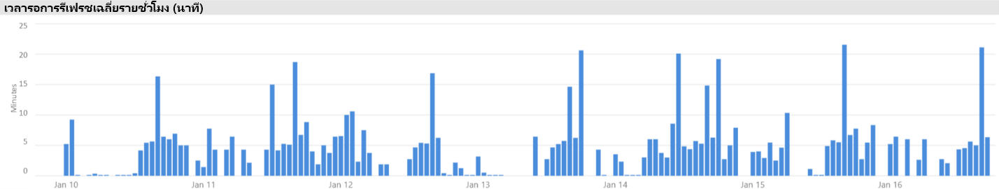

# สถานการณ์ความจุแบบพรีเมียม

บทความนี้อธิบายสถานการณ์ในโลกแห่งความจริงที่ความจุแบบพรีเมียมของ Power BI ได้ถูกนำไปใช้ มีการอธิบายปัญหาและความท้าทายที่พบบ่อยไว้แล้ว รวมถึงวิธีการระบุปัญหาและช่วยแก้ไขปัญหา:

- [การปรับปรุงชุดข้อมูลให้เป็นปัจจุบัน](#keeping-datasets-up-to-date)
- [การระบุชุดข้อมูลที่ตอบสนองช้า](#identifying-slow-responding-datasets)
- [การระบุสาเหตุสำหรับชุดข้อมูลที่ตอบสนองช้าเป็นระยะ ๆ ](#identifying-causes-for-sporadically-slow-responding-datasets)
- [การตรวจสอบว่ามีหน่วยความจำเพียงพอหรือไม่](#determining-whether-there-is-enough-memory)
- [การตรวจสอบว่ามี CPU เพียงพอหรือไม่](#determining-whether-there-is-enough-cpu)

ขั้นตอน พร้อมกับตัวอย่างแผนภูมิและตารางมาจาก **แอป Power BI Premium Capacity Metric** ที่ผู้ดูแลระบบ Power BI จะสามารถเข้าถึงได้

## การปรับปรุงชุดข้อมูลให้เป็นปัจจุบัน

ในสถานการณ์นี้ การตรวจสอบถูกทริกเกอร์เมื่อผู้ใช้ร้องเรียนว่าข้อมูลรายงานในบางครั้งดูเหมือนว่าเก่าหรือ “ไม่เป็นปัจจุบัน”

ในแอป ผู้ดูแลระบบโต้ตอบกับวิชวล**รีเฟรช** จากนั้นเรียงลำดับชุดข้อมูลโดยสถิติ**เวลารอสูงสุด**จากมากไปน้อย วิชวลนี้ช่วยให้พวกเขาแสดงชุดข้อมูลที่มีเวลารอนานที่สุด ซึ่งจัดกลุ่มตามชื่อพื้นที่ทำงาน

ในวิชวล**เวลารอรีเฟรชโดยเฉลี่ยต่อชั่วโมง** พวกเขาจะสังเกตเห็นว่าเวลารอรีเฟรชสูงสุดอยู่ที่เวลาประมาณ 16.00 น. ในแต่ละวันอย่างสม่ำเสมอ

มีคำอธิบายที่เป็นไปได้มากมายสำหรับผลลัพธ์เหล่านี้:

- มีความพยายามในการรีเฟรชมากเกินไปในเวลาเดียวกัน ซึ่งเกินขีดจำกัดที่กำหนดโดยโหนดความจุ ในกรณีนี้ เป็นการรีเฟรชพร้อมกันหกครั้งบน P1 ที่มีการจัดสรรหน่วยความจำเริ่มต้น

- ชุดข้อมูลที่จะรีเฟรชอาจมีขนาดใหญ่เกินไปที่จะพอดีกับหน่วยความจำที่มีอยู่ (ต้องใช้หน่วยความจำอย่างน้อย 2 เท่าสำหรับการรีเฟรชเต็มรูปแบบ)
- ตรรกะ Power Query ที่ไม่มีประสิทธิภาพอาจส่งผลให้อัตราการใช้งานหน่วยความจำเพิ่มขึ้นอย่างรวดเร็วทันทีทันใดในระหว่างการรีเฟรชชุดข้อมูล ในความจุที่ไม่ว่าง บางครั้งอัตราการเพิ่มขึ้นอย่างรวดเร็วทันทีทันใดอาจถึงขีดจำกัดทางกายภาพ ล้มเหลวในการรีเฟรชและอาจส่งผลต่อการดำเนินการบนมุมมองรายงานอื่น ๆ
- ชุดข้อมูลที่มีการคิวรีบ่อยครั้งที่จำเป็นต้องอยู่ในหน่วยความจำอาจส่งผลต่อความสามารถของชุดข้อมูลอื่นในการรีเฟรชเพราะว่าหน่วยความจำที่มีอยู่แบบจำกัด

เพื่อช่วยในการตรวจสอบ ผู้ดูแลระบบ Power BI สามารถค้นหา:

- หน่วยความจำเหลือน้อยในขณะที่รีเฟรชข้อมูลเมื่อหน่วยความจำที่มีอยู่มีขนาดน้อยกว่า 2 เท่าของชุดข้อมูลที่จะรีเฟรช
- ชุดข้อมูลที่ไม่ได้ถูกรีเฟรชและไม่ได้อยู่ในหน่วยความจำก่อนการรีเฟรช แต่ยังเริ่มต้นแสดงปริมาณการใช้งานแบบโต้ตอบในช่วงเวลาที่มีการรีเฟรชมาก หากต้องการดูชุดข้อมูลที่โหลดลงในหน่วยความจำ ณ เวลาใดก็ตาม ผู้ดูแลระบบ Power BI สามารถดูพื้นที่ชุดข้อมูลของแท็บ **ชุดข้อมูล** ในแอปได้ จากนั้นผู้ดูแลระบบสามารถกรองข้ามไปยังเวลาที่กำหนดโดยการคลิกที่หนึ่งในแท่งในวิชวล**จำนวนชุดข้อมูลที่โหลดต่อชั่วโมง** อัตราการเพิ่มขึ้นอย่างรวดเร็วทันทีทันใดภายในที่แสดงในภาพด้านล่าง ระบุหนึ่งชั่วโมงเมื่อโหลดชุดข้อมูลหลายชุดลงในหน่วยความจำ ซึ่งอาจชะลอการเริ่มต้นการรีเฟรชตามกำหนดเวลา
- การลดสัดส่วนชุดข้อมูลเพิ่มมากขึ้นเมื่อมีการกำหนดเวลาเพื่อเริ่มต้นการรีเฟรชข้อมูล การลดสัดส่วนสามารถบ่งบอกว่ามีความกดดันบนหน่วยความจำอย่างสูงซึ่งเกิดจากการให้บริการรายงานเชิงโต้ตอบที่แตกต่างกันมากเกินไปก่อนเวลารีเฟรช วิชวล**การลดสัดส่วนข้อมูลต่อชั่วโมงและปริมาณการใช้หน่วยความจำ** สามารถระบุอัตราการลดสัดส่วนที่เพิ่มขึ้นอย่างรวดเร็วทันทีทันใดได้อย่างชัดเจน

รูปต่อไปนี้แสดงการเพิ่มขึ้นภายในในชุดข้อมูลที่โหลด ซึ่งบ่งบอกว่าการคิวรีแบบโต้ตอบจะเริ่มต้นการรีเฟรชช้า การเลือกระยะเวลาในวิชวล**จำนวนชุดข้อมูลที่โหลดต่อชั่วโมง**จะกรองข้ามวิชวล**ขนาดของชุดข้อมูล**

ผู้ดูแลระบบ Power BI อาจจะพยายามแก้ไขปัญหาโดยทำตามขั้นตอนเพื่อให้แน่ใจว่ามีหน่วยความจำเพียงพอสำหรับการรีเฟรชข้อมูลที่จะเริ่มต้นโดย:

- ติดต่อเจ้าของชุดข้อมูลและขอให้พวกเขาสลับและเว้นระยะเวลาในการรีเฟรชข้อมูล
- ลดการโหลดคิวรีชุดข้อมูลโดยการลบแดชบอร์ดหรือไทล์แดชบอร์ดที่ไม่จำเป็นออก โดยเฉพาะอย่างยิ่งการบังคับใช้การรักษาความปลอดภัยระดับแถว
- เร่งความเร็วการรีเฟรชข้อมูลโดยปรับตรรกะ Power Query ให้เหมาะสม ปรับปรุงการสร้างแบบจำลองคอลัมน์หรือตารางจากการคำนวณ ลดขนาดชุดข้อมูลหรือกำหนดค่าชุดข้อมูลขนาดใหญ่เพื่อดำเนินการรีเฟรชข้อมูลแบบเพิ่มหน่วย

## ระบุชุดข้อมูลที่ตอบสนองช้า

ในสถานการณ์นี้ การตรวจสอบเริ่มต้นขึ้นเมื่อผู้ใช้ร้องเรียนว่ารายงานบางฉบับใช้เวลาในการเปิดนานเกินไป และบางครั้งก็ไม่ตอบสนอง

ในแอป ผู้ดูแลระบบ Power BI สามารถใช้วิชวล**ระยะเวลาคิวรี**เพื่อระบุชุดข้อมูลแย่ที่สุด โดยเรียงลำดับชุดข้อมูลตาม**ระยะเวลาเฉลี่ย**จากมากไปหาน้อย วิชวลนี้ยังแสดงจำนวนคิวรีของชุดข้อมูล ดังนั้นคุณสามารถดูความถี่ของการคิวรีชุดข้อมูลได้

ผู้ดูแลระบบสามารถดูวิชวล**การกระจายระยะเวลาคิวรี** ซึ่งแสดงการกระจายประสิทธิภาพคิวรีแบบจัดกลุ่มโดยภาพรวม (<= 30ms, 0-100ms) สำหรับช่วงเวลาที่กรองแล้ว โดยทั่วไปแล้ว คิวรีที่ใช้เวลาหนึ่งวินาทีหรือน้อยกว่าจะถือเป็นการตอบสนองของผู้ใช้ส่วนใหญ่ แต่คิวรีที่ใช้เวลานานขึ้นทำให้เกิดการรับรู้ประสิทธิภาพที่ไม่ดี

วิชวล**การกระจายระยะเวลาคิวรีต่อชั่วโมง**ช่วยให้ผู้ดูแลระบบ Power BI สามารถระบุช่วงเวลาหนึ่งชั่วโมงเมื่อประสิทธิภาพการทำงานของความจุอาจถูกมองว่าไม่ดี ยิ่งกลุ่มแถบมีขนาดใหญ่ขึ้นซึ่งแสดงถึงระยะเวลาคิวรีมากกว่าหนึ่งวินาที ยิ่งมีความเสียงว่าผู้ใช้จะรับรู้ประสิทธิภาพที่แย่ลง

วิชวลเป็นแบบโต้ตอบ และเมื่อเลือกกลุ่มของแถบ วิชวลตาราง**ระยะเวลาคิวรี**ที่สอดคล้องกันบนหน้ารายงานจะถูกกรองข้ามเพื่อแสดงชุดข้อมูลที่วิชวลแสดง การกรองข้ามช่วยให้ผู้ดูแลระบบ Power BI สามารถระบุชุดข้อมูลที่ตอบสนองช้าได้อย่างง่ายดาย

รูปต่อไปนี้แสดงวิชวลที่กรองตาม**การกระจายระยะเวลาคิวรีต่อชั่วโมง** โดยเน้นชุดข้อมูลที่มีประสิทธิภาพแย่ลงในบักเก็ตหนึ่งชั่วโมง 

เมื่อระบุชุดข้อมูลที่มีประสิทธิภาพไม่ดีในช่วงเวลาหนึ่งชั่วโมงแล้ว ผู้ดูแลระบบ Power BI สามารถตรวจสอบว่าประสิทธิภาพที่ไม่ดีนั้นเกิดจากความจุที่โหลดมากเกินไป หรือเนื่องจากชุดข้อมูลหรือรายงานที่ออกแบบมาไม่ดี พวกเขาสามารถดูวิชวล**เวลารอคิวรี** และเรียงลำดับชุดข้อมูลเรียงลำดับตามเวลารอคิวรีโดยเฉลี่ยจากมากไปหาน้อยได้ ถ้าเปอร์เซ็นต์ของคิวรีที่กำลังรอสูง ความต้องการสำหรับชุดข้อมูลสูงอาจเป็นสาเหตุของการรอคิวรีมากเกินไป ถ้าเวลารอคิวรีโดยเฉลี่ยเป็นจริง (> 100 ms) อาจคุ้มค่าที่จะตรวจทานชุดข้อมูลและรายงานเพื่อดูว่าสามารถปรับให้เหมาะสมได้หรือไม่ ตัวอย่างเช่น มีวิชวลน้อยลงในหน้ารายงานที่กำหนดหรือการปรับนิพจน์ DAX ให้เหมาะสม

มีสาเหตุที่เป็นไปได้หลายประการสำหรับเวลารอคิวรีที่สร้างขึ้นในชุดข้อมูล:

- การออกแบบแบบจำลองที่ไม่เหมาะสม นิพจน์หน่วยวัด หรือแม้แต่การออกแบบรายงาน - สถานการณ์ทั้งหมดที่สามารถนำไปสู่การคิวรีที่ใช้เวลานานซึ่งใช้ CPU ระดับสูง ซึ่งบังคับให้คิวรีใหม่ต้องรอจนกว่าเธรด CPU จะพร้อมใช้งานและสามารถสร้างเอฟเฟ็กต์การป้องกัน (เหมือนกับการจราจรติดขัด) ซึ่งมักพบได้ในช่วงเวลาทำการสูงสุด หน้า**การรอคิวรี**จะเป็นทรัพยากรหลักที่จะตรวจสอบว่าชุดข้อมูลมีเวลารอคิวรีโดยเฉลี่ยสูงหรือไม่
- จำนวนผู้ใช้งานความจุพร้อมกันสูง (หลายร้อยถึงหลายพัน) ซึ่งใช้รายงานหรือชุดข้อมูลเดียวกัน แม้แต่ชุดข้อมูลที่ออกแบบมาอย่างดีก็อาจทำงานได้ไม่ดีหากเกินค่าเกณฑ์กระบวนการการทำงานพร้อมกัน ซึ่งมักจะถูกระบุด้วยชุดข้อมูลเดียว ซึ่งแสดงค่าที่สูงขึ้นอย่างรวดเร็วสำหรับจำนวนคิวรีมากกว่าที่ชุดข้อมูลอื่น ๆ แสดง (ตัวอย่างเช่น คิวรี 300K สำหรับชุดข้อมูลหนึ่งชุดเปรียบเทียบกับ <30K คิวรีสำหรับชุดข้อมูลอื่นทั้งหมด) ในบางจุดที่การรอคิวรีสำหรับชุดข้อมูลนี้จะเริ่มจัดสลับ ซึ่งสามารถมองเห็นได้ในวิชวล**ระยะเวลาคิวรี**
- ชุดข้อมูลที่แตกต่างกันจำนวนมากที่คิวรีพร้อมกันทำให้เกิดการแธรชชิ่งเนื่องจากชุดข้อมูลมักจะวนเข้าและออกจากหน่วยความจำ ซึ่งส่งผลให้ผู้ใช้ประสบปัญหาประสิทธิภาพการทำงานช้าเมื่อโหลดชุดข้อมูลลงในหน่วยความจำ เมื่อต้องยืนยัน ผู้ดูแลระบบ Power BI สามารถอ้างอิงไปยังวิชวล**การลดสัดส่วนชุดข้อมูลต่อชั่วโมงและปริมาณการใช้หน่วยความจำ** ซึ่งอาจบ่งบอกว่าชุดข้อมูลจำนวนมากที่โหลดเข้าสู่หน่วยความจำนั้นถูกสัดส่วนซ้ำ ๆ

## การระบุสาเหตุสำหรับชุดข้อมูลที่ตอบสนองช้าเป็นระยะ

ในสถานการณ์นี้ การตรวจสอบเริ่มต้นขึ้นเมื่อผู้ใช้อธิบายว่าบางครั้งวิชวลรายงานตอบสนองช้าหรืออาจไม่ตอบสนอง แต่ในช่วงเวลอื่น การตอบสนองเป็นที่ยอมรับได้

ภายในแอป ส่วน**ระยะเวลาคิวรี**ถูกนำมาใช้เพื่อค้นหาชุดข้อมูลที่เป็นสาเหตุในวิธีต่อไปนี้:

- ในวิชวล**ระยะเวลาคิวรี** ผู้ดูแลระบบจะกรองชุดข้อมูลโดยชุดข้อมูล (เริ่มต้นจากชุดข้อมูลด้านบนที่คิวรีแล้ว) และตรวจสอบแถบที่กรองข้ามในวิชวล**การกระจายคิวรีต่อชั่วโมง**
- เมื่อแถบเวลาหนึ่งชั่วโมงแถบเดียวที่แสดงการเปลี่ยนแปลงที่สำคัญในอัตราส่วนระหว่างกลุ่มระยะเวลาการคิวรีทั้งหมดกับแถบหนึ่งชั่วโมงแถบอื่นสำหรับชุดข้อมูลนั้น (ตัวอย่างเช่น อัตราส่วนระหว่างสีที่เปลี่ยนไปอย่างมาก) ซึ่งหมายถึงชุดข้อมูลนี้แสดงการเปลี่ยนแปลงด้านประสิทธิภาพเป็นระยะ
- แถบเวลาหนึ่งชั่วโมง ซึ่งแสดงส่วนของคิวรีที่มีประสิทธิภาพต่ำผิดปกติซึ่งระบุช่วงเวลาที่ชุดข้อมูลนั้นได้รับผลกระทบจากเอฟเฟ็กต์ Noisy Neighbor ซึ่งเกิดจากกิจกรรมของชุดข้อมูลอื่น

ภาพด้านล่างแสดงระยะเวลาหนึ่งชั่วโมงในวันที่ 30 มกราคม ซึ่งเกิดความล้มเหลวอย่างมีนัยสำคัญในประสิทธิภาพของชุดข้อมูลที่ระบุโดยขนาดของบักเก็ตระยะเวลาการเรียกใช้งาน "(3,10s)" การคลิกที่แถบหนึ่งชั่วโมงจะแสดงชุดข้อมูลทั้งหมดที่โหลดเข้าสู่หน่วยความจำในช่วงเวลานั้น การตัดชุดข้อมูลอาจเป็นสาเหตุของปัญหาที่ทำให้เกิดเอฟเฟ็กต์ Noisy Neighbor

เมื่อระบุช่วงเวลาที่มีปัญหา (ตัวอย่างเช่น ระหว่างวันที่ 30 มกราคมในภาพด้านบน) ผู้ดูแลระบบ Power BI สามารถลบตัวกรองชุดข้อมูลทั้งหมดแล้วกรองเฉพาะช่วงเวลานั้นเพื่อพิจารณาว่าชุดข้อมูลใดจะถูกคิวรีอย่างแข็งขันในช่วงเวลานี้ ชุดข้อมูลที่เป็นสาเหตุสำหรับเอฟเฟ็กต์ Noisy Neighbor มักจะเป็นชุดข้อมูลที่ถูกคีวรีสูงสุดหรือไม่ก็ชุดข้อมูลที่มีระยะเวลาการคิวรีโดยเฉลี่ยนานที่สุด

วิธีการแก้ไขปัญหานี้อาจเป็นการกระจายชุดข้อมูลที่เป็นสาเหตุผ่านพื้นที่ทำงานที่แตกต่างกันในความจุแบบพรีเมียมที่แตกต่างกัน หรือในความจุที่ใช้ร่วมกันถ้าขนาดของชุดข้อมูล ข้อกำหนดการใช้งาน และรูปแบบการรีเฟรชข้อมูลได้รับการสนับสนุน

การย้อนกลับอาจเป็นจริงเช่นกัน ผู้ดูแลระบบ Power BI สามารถระบุเวลาที่ประสิทธิภาพการคิวรีของชุดข้อมูลดีขึ้นเป็นอย่างมากแล้วมองหาสิ่งที่หายไป ถ้าข้อมูลบางอย่างหายไปที่จุดนั้น อาจเป็นการช่วยบ่งชี้ปัญหาที่เกิดขึ้น

## การตรวจสอบว่ามีหน่วยความจำเพียงพอหรือไม่

เมื่อต้องการตรวจสอบว่าหน่วยความจำมีเพียงพอสำหรับที่จะรองรับความจุของปริมาณงานหรือไม่ ผู้ดูแลระบบ Power BI สามารถดูที่วิชวล**เปอร์เซ็นต์หน่วยความจำที่ใช้แล้ว**ในแท็บ**ชุดข้อมูล**ของแอปได้ หน่วยความ**ทั้งหมด** (รวม) แสดงหน่วยความจำที่ใช้โดยชุดข้อมูลที่โหลดลงในหน่วยความจำ โดยไม่คำนึงถึงว่าชุดข้อมูลเหล่านี้ถูกคิวรีหรือประมวลผลอย่างแข็งขันหรือไม่ หน่วยความจำ**ที่ใช้งานอยู่**แสดงหน่วยความจำที่ใช้โดยชุดข้อมูลที่กำลังถูกประมวลผลอย่างแข็งขัน

ในความจุที่สภาพพร้อมใช้งาน ภาพจะมีลักษณะดังนี้ แสดงช่องว่างระหว่างหน่วยความจำทั้งหมด (รวม) และหน่วยความจำที่ใช้งานอยู่:

ในความจุเกิดความกดดันบนหน่วยความจำ วิชวลเดียวกันจะแสดงการบรรจบกันของหน่วยความจำที่ใช้งานอยู่และหน่วยความจำทั้งหมดอย่างชัดเจน ซึ่งหมายความว่าคุณจะไม่สามารถโหลดชุดข้อมูลเพิ่มเติมลงในหน่วยความจำได้อีก ในกรณีนี้ ผู้ดูแลระบบ Power BI สามารถคลิก**รีสตาร์ทความจุ** (ใน**ตัวเลือกขั้นสูง**ของพื้นที่การตั้งค่าความจุของพอร์ทัลผู้ดูแลระบบ) ได้ การรีสตาร์ทความจุจะส่งผลให้ชุดข้อมูลทั้งหมดถูกล้างออกจากหน่วยความจำและอนุญาตให้โหลดซ้ำลงในหน่วยความจำได้ตามต้องการ (โดยการคิวรีหรือการรีเฟรชข้อมูล)

## การตรวจสอบว่ามี CPU เพียงพอหรือไม่

โดยทั่วไป การใช้งาน CPU โดยเฉลี่ยของความจุควรต่ำกว่า 80% การใช้งานเกินค่านี้หมายความว่าความจุกำลังใกล้ถึงความอิ่มตัวของ CPU

ผลกระทบจากความอิ่มตัวของ CPU จะเห็นได้จากการทำงานที่ใช้เวลานานกว่าที่ควรจะเป็นเนื่องจากความจุที่ใช้บริบทของ CPU จำนวนมากจะสลับขณะที่พยายามประมวลผลการทำงานทั้งหมด ในความจุแบบพรีเมียมที่มีจำนวนคิวรีที่เกิดขึ้นพร้อมกันสูง นั่นหมายถึงเวลารอคิวรีสูง ผลที่ตามมาจากเวลารอคิวรีสูงคือการตอบสนองช้าลงกว่าปกติ ผู้ดูแลระบบ Power BI สามารถระบุได้อย่างง่ายดายเมื่อ CPU มีความอิ่มตัวแล้วโดยดูที่วิชวล**การกระจายเวลารอคิวรีต่อชั่วโมง**้ จำนวนเวลารอคิวรีที่ถึงระดับสูงสุดเป็นระยะ ๆ แสดงถึงความอิ่มตัวของ CPU ที่อาจเกิดขึ้น

ในบางครั้งสามารถตรวจหารูปแบบที่คล้ายกันได้ในการทำงานแบบเบื้องหลังหากการทำงานเหล่านั้นมีส่วนทำให้เกิดความอิ่มต้วของ CPU ผู้ดูแลระบบ Power BI สามารถค้นหาอัตราการเพิ่มขึ้นอย่างรวดเร็วทันทีทันใดเป็นระยะ ๆ ในช่วงเวลาการรีเฟรชสำหรับชุดข้อมูลเฉพาะ ซึ่งสามารถระบุความอิ่มตัวของ CPU ในเวลานั้น (อาจเป็นเพราะว่าชุดข้อมูลอื่นที่กำลังดำเนินการรีเฟรชและ/หรือคิวรีแบบโต้ตอบ) ในอินสแตนซ์นี้ การอ้างอิงไปยังมุมมอง**ระบบ**ในแอปอาจไม่จำเป็นต้องแสดงว่า CPU อยู่ในระดับ 100% มุมมอง**ระบบ**แสดงค่าเฉลี่ยต่อชั่วโมง แต่ CPU อาจจะอิ่มตัวเป็นเวลาหลายนาทีจากการทำงานหนัก ซึ่งแสดงเป็นอัตราเวลารอที่เพิ่มขึ้นอย่างรวดเร็วทันทีทันใด

มีรายละเอียดปลีกย่อยเพิ่มเติมในการดูผลกระทบจากความอิ่มตัวของ CPU ในขณะที่จำนวนคิวรีที่รอเป็นสิ่งสำคัญ แต่เวลารอคิวรีจะเกิดขึ้นในระดับหนึ่งเสมอโดยไม่ทำให้ประสิทธิภาพการทำงานลดลง ชุดข้อมูลบางชุด (ที่มีเวลาคิวรีโดยเฉลี่ยที่ยาวกว่า แสดงถึงความซับซ้อนหรือขนาด) มีแนวโน้มที่จะทำให้เกิดความอิ่มตัวของ CPU มากกว่าชุดอื่น หากต้องการระบุชุดข้อมูลเหล่านี้ได้อย่างง่ายดาย ผู้ดูแลระบบ Power BI สามารถดูการเปลี่ยนแปลงในส่วนประกอบสีของแถบในวิชวล**การกระจายเวลารอต่อชั่วโมง** หลังจากตรวจพบแถบค่าผิดปกติ ผู้ดูแลระบบสามารถค้นหาชุดข้อมูลที่มีการรอคิวรีอยู่ในช่วงเวลานั้น และดูเวลารอคิวรีโดยฉลี่ยโดยเปรียบเทียบกับระยะเวลาคิวรีโดยเฉลี่ย ทเมื่อทั้งสองเมตริกมีขนาดเท่ากันและปริมาณงานของคิวรีสำหรับชุดข้อมูลนั้นมีความสำคัญ อาจเป็นไปได้ว่าชุดข้อมูลนั้นได้รับผลกระทบจาก CPU ไม่เพียงพอ

ผลกระทบนี้สามารถเห็นได้ชัดโดยเฉพาะอย่างยิ่งเมื่อชุดข้อมูลถูกใช้งานในช่วงการส่งชุดข้อมูลสั้น ๆ จากการคิวรีที่มีความถี่สูงโดยผู้ใช้หลายคน (ตัวอย่างเช่น ในช่วงการฝึกอบรม) ซึ่งส่งผลให้เกิดความอิ่มตัวของ CPU ในแต่ละครั้ง ในกรณีนี้ เวลารอคิวรีที่สำคัญในชุดข้อมูลนี้อาจได้รับผลกระทบ รวมถึงมีผลกระทบต่อชุดข้อมูลอื่น ๆ ในความจุ (เอฟเฟ็กต์ Noisy Neighbor)

ในบางกรณี ผู้ดูแลระบบ Power BI สามารถขอให้เจ้าของชุดข้อมูลสร้างปริมาณงานของคิวรีที่มีความผันผวนน้อยลงโดยการสร้างแดชบอร์ด (ซึ่งจะทำการคิวรีเป็นระยะ ๆ กับการรีเฟรชชุดข้อมูลใด ๆ สำหรับไทล์ที่แคช) แทนรายงาน ซึ่งสามารถช่วยป้องกันอัตราการเพิ่มขึ้นอย่างรวดเร็วทันทีทันใดเมื่อโหลดแดชบอร์ด โซลูชันนี้อาจไม่สามารถทำได้สำหรับความต้องการทางธุรกิจที่กำหนดไว้ อย่างไรก็ตามอาจเป็นวิธีที่มีประสิทธิภาพในการหลีกเลี่ยงความอิ่มตัวของ CPU โดยไม่มีการเปลี่ยนแปลงชุดข้อมูล

## กิตติกรรมประกาศ

บทความนี้เขียนโดย Peter Myers, MVP แพลตฟอร์มข้อมูล และผู้เชี่ยวชาญ BI อิสระด้วย [โซลูชันแบบ Bitwise](https://www.bitwisesolutions.com.au/)

## ขั้นตอนถัดไป

> [!div class="nextstepaction"]
> [ตรวจสอบความจุ Premium ด้วยแอป](service-admin-premium-monitor-capacity.md)    
> [!div class="nextstepaction"]
> [ตรวจสอบความจุในพอร์ทัลผู้ดูแลระบบ](service-admin-premium-monitor-portal.md)   

มีคำถามเพิ่มเติมหรือไม่ [ลองถามชุมชน Power BI](https://community.powerbi.com/)

||||||
