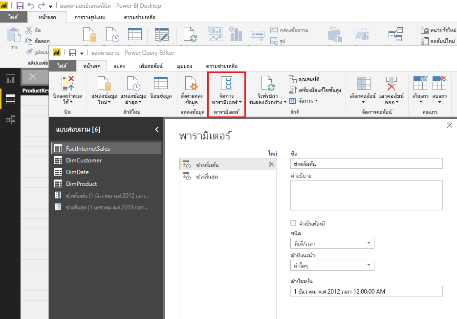
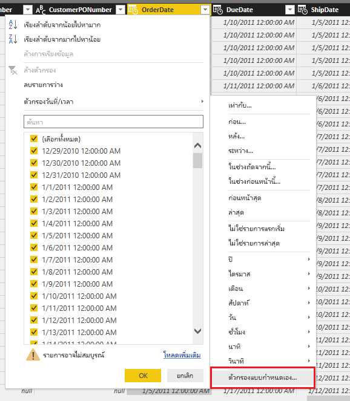
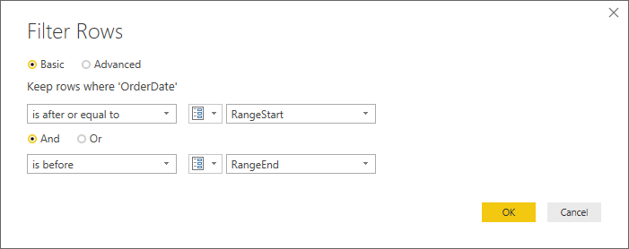
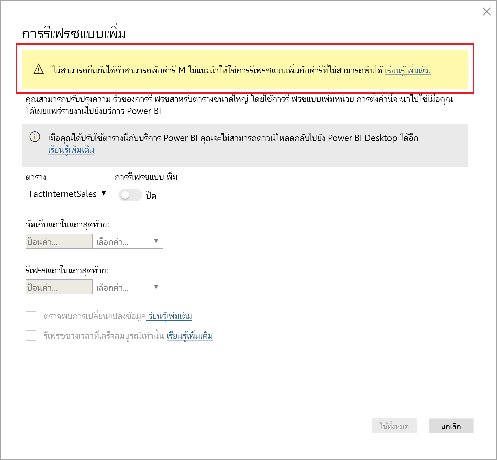
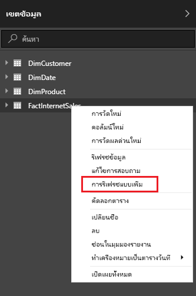
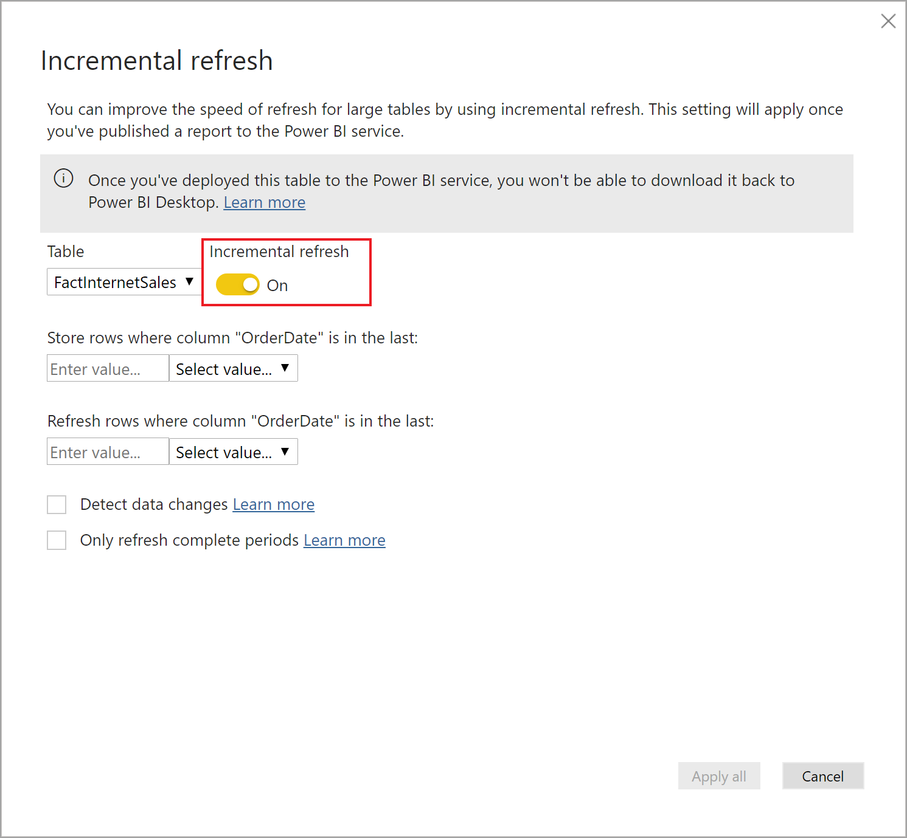
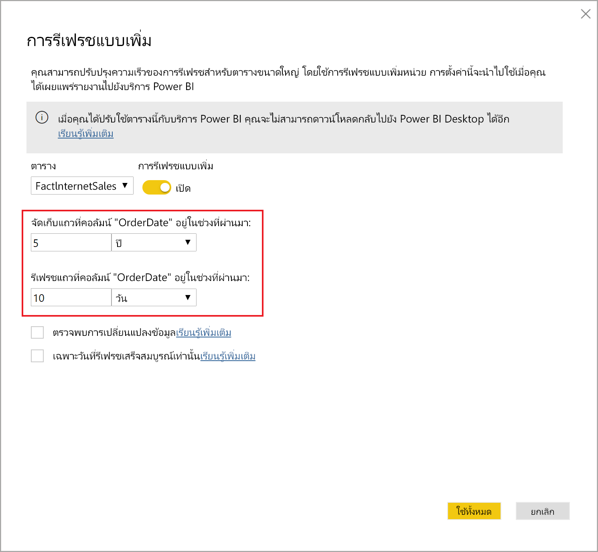
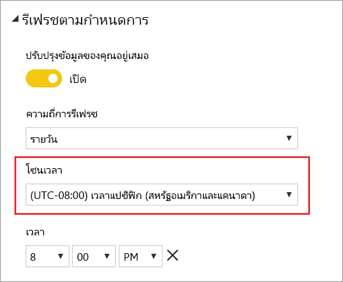
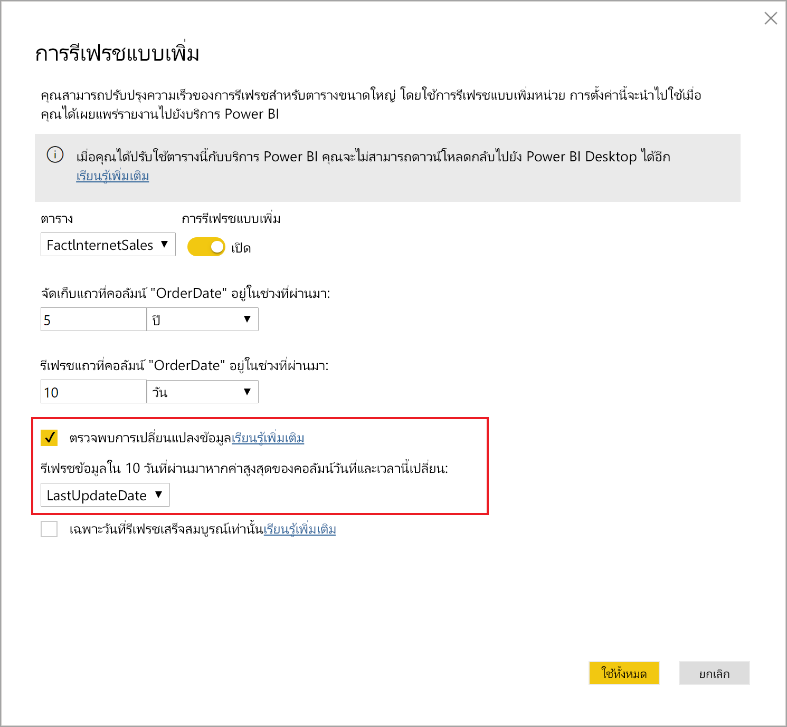
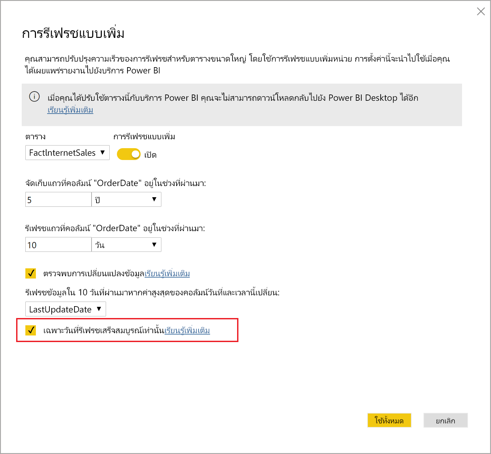

# <a name="incremental-refresh-in-power-bi"></a>การรีเฟรชแบบเพิ่มหน่วยใน Power BI

การรีเฟรชแบบเพิ่มหน่วยจะทำให้ชุดข้อมูลขนาดใหญ่ใน Power BI มีสิทธิประโยชน์ต่อไปนี้:

> [!div class="checklist"]
> * **การรีเฟรชเร็วกว่า**- เฉพาะข้อมูลที่มีความต้องการเปลี่ยนแปลงการรีเฟรช ตัวอย่าง รีเฟรชเฉพาะห้าวันของชุดข้อมูล 10 ปี
> * **การรีเฟรชน่าเชื่อถือมากขึ้น** - ตัวอย่างเช่น ไม่จำเป็นต้องรักษาการเชื่อมต่อระยะยาวกับระบบต้นทางที่ผันผวน
> * **ปริมาณการใช้ทรัพยากรลดลง** - เมื่อต้องรีเฟรชข้อมูลน้อยลง ทำให้ปริมาณการใช้โดยรวมของความจำและทรัพยากรอื่นๆ ลดลงด้วย

> [!NOTE]
> ขณะนี้ การรีเฟรชแบบเพิ่มหน่วยจะพร้อมใช้งานสำหรับ Power BI Pro, Premium และการสมัครสมาชิกและชุดข้อมูลที่ใช้ร่วมกัน 

## <a name="configure-incremental-refresh"></a>คิวรีการรีเฟรชแบบเพิ่มหน่วย

นโยบายการรีเฟรชแบบเพิ่มหน่วยจะถูกกำหนดใน Power BI Desktop และนำไปใช้เมื่อเผยแพร่ไปยังบริการ Power BI


### <a name="filter-large-datasets-in-power-bi-desktop"></a>กรองชุดข้อมูลขนาดใหญ่ใน Power BI Desktop

ชุดข้อมูลขนาดใหญ่ที่อาจมีแถวจำนวนพันล้านแถวอาจไม่เหมาะกับ Power BI Desktop เนื่องจากมีข้อจำกัดตามทรัพยากรที่พร้อมใช้งานบนพีซีเดสก์ท็อปของผู้ใช้ ชุดข้อมูลดังกล่าวจะผ่านการกรองเมื่อนำเข้าไปยัง Power BI Desktop การกรองชนิดนี้ใช้ไม่ว่าใช้การรีเฟรชแบบเพิ่มหน่วย หรือไม่ สำหรับการรีเฟรชแบบเพิ่มหน่วย คุณกรอง โดยใช้พารามิเตอร์วันที่/เวลา Power Query

#### <a name="rangestart-and-rangeend-parameters"></a>พารามิเตอร์ RangeStart และ RangeEnd

เมื่อต้องการใช้ประโยชน์จากการรีเฟรชแบบเพิ่มหน่วยในบริการ Power BI จะต้องกรองโดยใช้พารามิเตอร์วันที่/เวลาของ Power Query ที่มีชื่อที่จองไว้ โดยต้องตรงตามตัวพิมพ์เล็กใหญ่ **RangeStart** และ **RangeEnd** พารามิเตอร์เหล่านี้จะใช้ เพื่อกรองข้อมูลนำเข้าลงใน Power BI Desktop รวม ถึงแบบไดนามิกพาร์ติชันข้อมูลลงในช่วงที่หลังจากเผยแพร่ไปยังบริการ Power BI ค่าพารามิเตอร์จะแทน โดยบริการเพื่อกรองข้อมูลสำหรับแต่ละพาร์ติชัน ไม่จำเป็นต้องตั้งค่าพารามิเตอร์ในการตั้งค่าชุดข้อมูลในบริการ เมื่อเผยแพร่แล้ว ค่าพารามิเตอร์จะถูกเขียนทับโดยบริการ Power BI โดยอัตโนมัติ

เมื่อต้องกำหนดพารามิเตอร์ ด้วยค่าเริ่มต้น ใน Power Query Editor เลือก**จัดการพารามิเตอร์**



เมื่อกำหนดพารามิเตอร์ คุณสามารถนำตัวกรองไปใช้ได้โดยการเลือกตัวเลือกเมนู **ตัวกรองแบบกำหนดเอง** สำหรับคอลัมน์



ตรวจสอบให้แน่ใจว่าแถวได้รับการกรองที่ตำแหน่งที่ค่าคอลัมน์*อยู่หลังหรือเท่ากับ* **RangeStart** และ*อยู่ก่อน* **RangeEnd** การรวมตัวกรองอื่น ๆ อาจส่งผลให้มีการนับจำนวนแถวเป็นสองเท่า



> [!IMPORTANT]
> ตรวจสอบแบบสอบถามที่มีค่าเท่ากับ (=) บน **ช่วงเริ่มต้น** หรือ **ช่วงสิ้นสุด** หากมีค่าเท่ากับ (=) ในพารามิเตอร์ทั้งสอง แถวหนึ่งอาจเป็นไปตามเงื่อนไขสำหรับสองพาร์ติชัน ซึ่งอาจทำให้เกิดข้อมูลที่ซ้ำกันในแบบจำลองได้ ตัวอย่างเช่น  
> \#"แถวที่มีการกรอง" = Table.SelectRows(dbo_Fact, [OrderDate] แต่ละรายการ **>= ช่วงเริ่มต้น** และ [OrderDate] **<= ช่วงสิ้นสุด**) อาจส่งผลให้ข้อมูลซ้ำกันได้

> [!TIP]
> แม้ว่าชนิดข้อมูลของพารามิเตอร์จำเป็นต้องเป็นวันที่/เวลา แต่ก็สามารถแปลงให้ตรงกับความต้องการของแหล่งข้อมูล ตัวอย่างเช่น ฟังก์ชัน Power Query ต่อไปนี้จะแปลงค่าวันที่/เวลาให้กับคีย์ตัวแทนจำนวนของรูปแบบ *yyyymmdd* ซึ่งเป็นรูปแบบทั่วไปของคลังข้อมูล สามารถเรียกฟังก์ชันตามขั้นตอนการกรอง
>
> `(x as datetime) => Date.Year(x)*10000 + Date.Month(x)*100 + Date.Day(x)`

เลือก **ปิดและนำไปใช้** จาก Power Query Editor คุณควรมีชุดย่อยของชุดข้อมูลอยู่ใน Power BI Desktop

#### <a name="filter-date-column-updates"></a>กรองการปรับปรุงคอลัมน์วัน

ตัวกรองจะถูกใช้เพื่อพาร์ติชันข้อมูลเป็นช่วงในบริการ Power BI รีเฟรชแบบเพิ่มหน่วยไม่ได้ออกแบบมาเพื่อสนับสนุนกรณีที่มีการอัปเดคอลัมน์วันที่ถูกกรองในระบบต้นทาง การปรับปรุงจะถูกแปลเป็นการแทรกและลบ ไม่อัปเดจริง ถ้าการลบเกิดขึ้นในช่วงอดีต และไมใช่ช่วงเพิ่มหน่วย การลบนั้นจะไม่ถูกเลือก ซึ่งอาจทำให้เกิดความเสียหายในการรีเฟรชข้อมูลเนื่องจากข้อขัดแย้งคีย์พาร์ติชัน

#### <a name="query-folding"></a>พับแบบสอบถาม

เป็นสิ่งสำคัญที่ตัวกรองจะถูกส่งไปยังระบบแหล่งข้อมูลเมื่อมีการส่งคิวรีให้ดำเนินการรีเฟรช การผลักดันการกรองข้อมูลลงไปหมายความว่า แหล่งข้อมูลควรสนับสนุน "query folding” แหล่งข้อมูลส่วนใหญ่ที่สนับสนุนคำคิวรี่ SQL จะสนับสนุน query folding ด้วย แต่โดยทั่วไปแล้วแหล่งข้อมูล เช่น ไฟล์ข้อมูลธรรมดา, Blobs และฟีดของเว็บจะไม่สนับสนุน ในกรณีที่ตัวกรองไม่สนับสนุนแหล่งข้อมูล backend จะไม่สามารถเก็บข้อมูลเข้ากองซ้อนได้ ในกรณีเช่นนี้ โปรแกรม mashup จะชดเชยและใช้ตัวกรองภายในเครื่องซึ่งอาจต้องเรียกชุดข้อมูลทั้งหมดจากแหล่งข้อมูล ซึ่งสามารถทำให้เกิดการรีเฟรชแบบเพิ่มหน่วยใช้เวลานานมาก และกระบวนการสามารถใช้ทรัพยากรหมดทั้งในบริการ Power BI หรือ ในเกตเวย์ข้อมูลภายในองค์กรถ้าใช้

เนื่องจากมีการสนับสนุน query folding หลายระดับในแหล่งข้อมูล ขอแนะนำให้คุณตรวจสอบว่าตรรกะตัวกรองรวมอยู่ในคิวรีแหล่งข้อมูล เพื่อทำให้ง่ายขึ้น Power BI Desktop พยายามดำเนินการตรวจสอบนี้สำหรับคุณ ถ้าไม่สามารถตรวจสอบ คำเตือนจะแสดงในกล่องโต้ตอบการรีเฟรชแบบเพิ่มหน่วยเมื่อกำหนดนโยบายการรีเฟรชแบบเพิ่มหน่วย SQL ตามแหล่งข้อมูลเช่น SQL, Oracle และ Teradata สามารถพึ่งพาคำเตือนนี้ แหล่งข้อมูลอื่น ๆ อาจไม่สามารถตรวจสอบโดยไม่ต้องการติดตามแบบสอบถาม ถ้า Power BI Desktop ไม่สามารถยืนยัน คำเตือนต่อไปนี้จะปรากฏขึ้น หากคุณมองเห็นคำเตือนนี้ และต้องการตรวจสอบว่าการพับคิวรีที่จำเป็นเกิดขึ้นหรือไม่ คุณสามารถใช้คุณลักษณะการวินิจฉัยคิวรี หรือติดตามคิวรีที่ได้รับจากฐานข้อมูลต้นทาง

 

### <a name="define-the-refresh-policy"></a>กำหนดนโยบายการรีเฟรช

การรีเฟรชแบบเพิ่มหน่วยจะพร้อมใช้งานบนเมนูบริบทสำหรับตาราง ยกเว้นสำหรับแบบจำลองการเชื่อมต่อสด



#### <a name="incremental-refresh-dialog"></a>กล่องโต้ตอบการรีเฟรชแบบเพิ่มหน่วย

กล่องโต้ตอบการรีเฟรชแบบเพิ่มหน่วยจะแสดงขึ้น ใช้ตัวสลับเพื่อเปิดใช้งานงานกล่องโต้ตอบ



> [!NOTE]
> ถ้านิพจน์ของ Power Query สำหรับตารางไม่ได้อ้างอิงไปยังพารามิเตอร์ที่มีชื่อที่จองไว้ ตัวสลับจะถูกปิดใช้งาน

ข้อความส่วนหัวจะอธิบายดังต่อไปนี้:

- นโยบายการรีเฟรชจะถูกกำหนดใน Power BI Desktop ซึ่งจะถูกนำไปใช้โดยการดำเนินการรีเฟรชในบริการ

- ถ้าคุณสามารถดาวน์โหลดไฟล์ PBIX ที่มีนโยบายการรีเฟรชแบบเพิ่มหน่วยจากบริการ Power BI ไฟล์ดังกล่าวจะไม่เปิดใน Power BI Desktop แม้ว่าจะมีการสนับสนุนในอนาคต ให้จำไว้ว่าชุดข้อมูลเหล่านี้สามารถเพิ่มขนาดขึ้นได้อย่างมาก จึงไม่สามารถดาวน์โหลดละเปิดบนพีซีเดสก์ท็อปทั่วไปได้

#### <a name="refresh-ranges"></a>รีเฟรชช่วง

ตัวอย่างต่อไปนี้กำหนดนโยบายการรีเฟรชเพื่อเก็บข้อมูลเป็นเวลาห้าปีปฏิทินเต็มรวมกับข้อมูลสำหรับปีปัจจุบันจนถึงวันที่ปัจจุบัน และจะรีเฟรชข้อมูลแบบเพิ่มหน่วย 10 วัน การดำเนินการรีเฟรชครั้งแรกจะโหลดข้อมูลในอดีตที่ผ่านมา การรีเฟรชครั้งต่อมาจะเป็นการรีเฟรชแบบเพิ่มหน่วย และ (หากกำหนดให้ทำงานทุกวัน) จะมีการดำเนินการต่อไปนี้

- เพิ่มข้อมูลของวันใหม่

- รีเฟรชข้อมูล 10 วันจนถึงวันที่ปัจจุบัน

- ลบปีปฏิทินที่เก่ากว่าห้าปีก่อนวันที่ปัจจุบัน ตัวอย่างเช่น หากวันที่ปัจจุบันคือ 1 มกราคม 2019 ปี 2013 จะถูกลบ

การรีเฟรชครั้งแรกในบริการ Power BI อาจใช้เวลานานในการนำเข้าข้อมูลทั้งหมดในห้าปีปฏิทินเต็ม การรีเฟรชครั้งต่อมาอาจเสร็จสิ้นในเวลาที่เร็วกว่านั้น




#### <a name="current-date"></a>วันที่ปัจจุบัน

*วันที่ปัจจุบัน* จะขึ้นอยู่กับวันที่ในระบบ ณ เวลาที่รีเฟรช หากการรีเฟรชตามกำหนดเวลาเปิดใช้งานสำหรับชุดข้อมูลในบริการของ Power BI โซนเวลาที่กำหนดจะถูกนำมาพิจารณาขณะพิจารณาวันที่ปัจจุบัน การรีเฟรชทั้งสองอย่างด้วยตนเองและการรีเฟรชตามกำหนดการจะสังเกตโซนเวลา ถ้ามี ตัวอย่างเช่น การรีเฟรชที่เกิดขึ้นในเวลา 20.00 น. Pacific Time (สหรัฐฯ และแคนาดา) ในโซนเวลาที่ระบุ จะกำหนดวันที่ปัจจุบันตาม Pacific Time ไม่ใช่ GMT (ซึ่งจะเป็นวันถัดไป)



> [!NOTE]
> ข้อกำหนดของช่วงเหล่านี้อาจเป็นสิ่งที่คุณต้อง ในกรณี คุณสามารถไปยังประกาศขั้นตอนด้านล่างได้ ดรอปดาวน์เพิ่มเติมสำหรับคุณลักษณะขั้นสูงได้

### <a name="advanced-policy-options"></a>ตัวเลือกนโยบายขั้นสูง

#### <a name="detect-data-changes"></a>ตรวจหาการเปลี่ยนแปลงข้อมูล

การรีเฟรชแบบเพิ่มหน่วย 10 วัน มีประสิทธิภาพมากกว่าการรีเฟรชทั้งห้าปีเต็ม อย่างไรก็ตาม จำเป็นต้องทำได้ดีขึ้น ถ้าคุณเลือกกล่องกาเครื่องหมาย **ตรวจพบการเปลี่ยนแปลงข้อมูล** คุณสามารถเลือกคอลัมน์วันที่/เวลาที่ใช้ในการระบุและรีเฟรชเฉพาะวันที่ข้อมูลถูกเปลี่ยนแปลง ซึ่งสมมติว่าคอลัมน์ดังกล่าวอยู่ในระบบแหล่งข้อมูล ซึ่งมีไว้สำหรับวัตถุประสงค์การตรวจสอบ **ซึ่งไม่ควรเป็นคอลัมน์เดียวกับที่ถูกใช้พาร์ติชั่นข้อมูลด้วยพารามิเตอร์ RangeStart/RangeEnd** ค่าสูงสุดของคอลัมน์นี้จะได้รับการประเมินสำหรับแต่ละช่วงเวลาในช่วงที่เพิ่มขึ้น หากไม่มีการเปลี่ยนแปลงตั้งแต่การรีเฟรชครั้งล่าสุด ไม่จำเป็นต้องรีเฟรชช่วงเวลา ตัวอย่างเช่น การทำเช่นนี้จะเป็นการลดจำนวนวันที่ต้องรีเฟรชแบบเพิ่มหน่วยจาก 10 วันเหลือประมาณสองวัน



> [!TIP]
> การออกแบบปัจจุบันจำเป็นต้องให้คอลัมน์ตรวจหาว่าการเปลี่ยนแปลงข้อมูลยังคงเหมือนเดิมและแคชลงในหน่วยความจำ คุณอาจต้องการพิจารณาใช้หนึ่งในเทคนิคต่อไปนี้เพื่อลดการใช้งานข้อมูลในชุดและหน่วยความจำ
>
> คงไว้เฉพาะค่าสูงสุดของคอลัมน์นี้เมื่อรีเฟรช อาจใช้ฟังก์ชันของ Power Query
>
> ลดความแม่นยำเป็นระดับที่ยอมรับได้ของความต้องการความถี่การรีเฟรชของคุณ
>
> กำหนดคิวรีแบบกำหนดเองสำหรับการตรวจหาการเปลี่ยนแปลงข้อมูลโดยใช้ตำแหน่งข้อมูล XMLA และหลีกเลี่ยงการยืนยันค่าคอลัมน์ทั้งหมด ดูแบบคิวรีแบบกำหนดเองสำหรับการตรวจหาการเปลี่ยนแปลงข้อมูลด้านล่างสำหรับข้อมูลเพิ่มเติม

#### <a name="only-refresh-complete-periods"></a>รีเฟรชช่วงเวลาที่เสร็จสมบูรณ์เท่านั้น

สมมติว่าการรีเฟรชของคุณมีกำหนดการที่ 4:00 น. ของทุกๆ เช้า ถ้าข้อมูลปรากฏในระบบแหล่งข้อมูลระหว่าง 4 ชั่วโมงนั้น คุณอาจไม่ต้องการลบ เมทริกซ์ธุรกิจบางอย่าง -- เช่น ถังต่อวันในอุตสาหกรรมน้ำมันและแก๊ส -- จะไม่สามารถเข้าใจได้ในบางส่วนของวัน

อีกตัวอย่างหนึ่งคือการรีเฟรชข้อมูลจากระบบการเงินที่ข้อมูลจากเดือนที่แล้วได้รับการอนุมัติเมื่อวันที่ 12 ของเดือน คุณสามารถตั้งค่าการเว้นช่วงเป็น 1 เดือนและจัดกำหนดการให้เรียกใช้ใยวันที่ 12 ของทุกเดือน เมื่อเลือกตัวเลือกนี้ จะรีเฟรชข้อมูลของเดือนมกราคมในวันที่ 12 กุมภาพันธ์



> [!NOTE]
> การดำเนินการรีเฟรชในบริการจะเรียกใช้ภายใต้เวลา UTC ซึ่งสามารถกำหนดวันที่มีผลและจะส่งผลต่อช่วงเวลาที่เสร็จสมบูรณ์ เราวางแผนที่จะเพิ่มความสามารถในการใช้ถ้อยคำทับวันที่มีผลสำหรับการดำเนินการรีเฟรช

## <a name="publish-to-the-service"></a>เผยแพร่ไปยังบริการ

ในตอนนี้ คุณสามารถรีเฟรชแบบจำลองได้ การรีเฟรชครั้งแรกอาจใช้เวลานานในการนำเข้าข้อมูลประวัติ การรีเฟรชครั้งต่อมาจะเร็วกว่าครั้งแรกมาก เนื่องจากใช้การรีเฟรชแบบเพิ่มหน่วย

## <a name="query-timeouts"></a>หมดเวลาคิวรี

บทความ[การแก้ไขปัญหาการรีเฟรช](../connect-data/refresh-troubleshooting-refresh-scenarios.md)จะอธิบายว่าการดำเนินการรีเฟรชในบริการ Power BI อาจหมดเวลาได้ คิวรียังสามารถถูกจำกัดโดยการหมดเวลาเริ่มต้นสำหรับแหล่งข้อมูล แหล่งข้อมูลที่เกี่ยวข้องส่วนใหญ่จะอนุญาตการใช้ถ้อยคำทับการหมดเวลาในนิพจน์ M ตัวอย่างเช่น นิพจน์ด้านล่างจะใช้[ฟังก์ชันเข้าถึงข้อมูล SQL Server](https://docs.microsoft.com/powerquery-m/sql-database)เพื่อตั้งค่าให้เป็น 2 ชั่วโมง แต่ละช่วงเวลาจะถูกกำหนดโดยนโยบายการส่งคิวรีที่สังเกตการตั้งค่าการหมดเวลาคำสั่ง

```powerquery-m
let
    Source = Sql.Database("myserver.database.windows.net", "AdventureWorks", [CommandTimeout=#duration(0, 2, 0, 0)]),
    dbo_Fact = Source{[Schema="dbo",Item="FactInternetSales"]}[Data],
    #"Filtered Rows" = Table.SelectRows(dbo_Fact, each [OrderDate] >= RangeStart and [OrderDate] < RangeEnd)
in
    #"Filtered Rows"
```

## <a name="xmla-endpoint-benefits-for-incremental-refresh"></a>ประโยชน์ตำแหน่งข้อมูล XMLA สำหรับการรีเฟรชแบบเพิ่มหน่วย

[ตำแหน่งข้อมูล XMLA](service-premium-connect-tools.md)  สำหรับชุดข้อมูลในความจุแบบพรีเมียมสามารถเปิดใช้งานสำหรับการดำเนินการอ่าน-เขียน ซึ่งเป็นประโยชน์อย่างมากสำหรับการรีเฟรชแบบเพิ่มหน่วย  การดำเนินการรีเฟรชผ่านตำแหน่งข้อมูล XMLA ไม่ได้จำกัดเพียง [48 รีเฟรชต่อวัน](../connect-data/refresh-data.md#data-refresh) และ [การรีเฟรชตามกำหนดเวลา](../connect-data/refresh-troubleshooting-refresh-scenarios.md#scheduled-refresh-timeout) ไม่ได้รับการกำหนด ซึ่งจะเป็นประโยชน์ในสถานการณ์การรีเฟรชแบบเพิ่มหน่วย

### <a name="refresh-management-with-sql-server-management-studio-ssms"></a>การจัดการการรีเฟรชด้วย SQL Server Management Studio (SSMS)

ด้วยการเปิดใช้งานการอ่าน-เขียนตำแหน่งข้อมูล XMLA สามารถใช้ SSMS เพื่อดูและจัดการพาร์ติชันที่สร้างขึ้นโดยแอปพลิเคชันของนโยบายการรีเฟรชแบบเพิ่มหน่วย


#### <a name="refresh-historical-partitions"></a>รีเฟรชพาร์ติชันย้อนหลัง

สิ่งนี้อนุญาตให้มีการดำเนินการ เช่น การรีเฟรชพาร์ติชันย้อนหลังที่ไม่ได้อยู่ในช่วงเพิ่มหน่วยเพื่อดำเนินการอัปเดทย้อนหลังโดยไม่ต้องรีเฟรชข้อมูลประวัติทั้งหมด


#### <a name="override-incremental-refresh-behavior"></a>แทนที่การทำงานการรีเฟรชแบบเพิ่มหน่วย

ด้วย SSMS คุณยังสามารถควบคุมวิธีการเรียกการรีเฟรชแบบเพิ่มหน่วยจากการใช้ [Tabular Model Scripting Language (TMSL)](https://docs.microsoft.com/analysis-services/tmsl/tabular-model-scripting-language-tmsl-reference?view=power-bi-premium-current) และ [Tabular Object Model (TOM)](https://docs.microsoft.com/analysis-services/tom/introduction-to-the-tabular-object-model-tom-in-analysis-services-amo?view=power-bi-premium-current) ได้มากขึ้น ตัวอย่างเช่น ใน SSMS ในตัวค้นหาวัตถุ ให้คลิกขวาที่ตารางแล้วเลือกตัวเลือกเมนู **ตารางกระบวนการ** จากนั้นคลิกปุ่ม **สคริปต์** เพื่อสร้างคำสั่งรีเฟรช TMSL


สามารถแทรกพารามิเตอร์ต่อไปนี้ลงในคำสั่งรีเฟรช TMSL เพื่อแทนที่การทำงานการรีเฟรชแบบเพิ่มหน่วยเริ่มต้น

- **applyRefreshPolicy** – ถ้าตารางมีนโยบายการรีเฟรชแบบเพิ่มหน่วยที่กำหนดไว้ applyRefreshPolicy จะกำหนดว่ามีการใช้นโยบายหรือไม่ ถ้าไม่มีการใช้นโยบาย การดำเนินการแบบเต็มของกระบวนการจะปล่อยให้ข้อกำหนดพาร์ติชันไม่มีการเปลี่ยนแปลง และพาร์ติชันทั้งหมดในตารางจะถูกรีเฟรชทั้งหมด ค่าเริ่มต้นถูกต้อง

- **effectiveDate** – หากมีการใช้นโยบายการรีเฟรชแบบเพิ่มหน่วย จำเป็นต้องทราบวันที่ปัจจุบันเพื่อกำหนดช่วงการเลื่อนหน้าต่างสำหรับช่วงอดีตและช่วงที่เพิ่มขึ้น
 พารามิเตอร์ effectiveDate ช่วยให้คุณสามารถแทนที่วันที่ปัจจุบันได้ ซึ่งมีประโยชน์สำหรับการทดสอบ การสาธิต และสถานการณ์ทางธุรกิจที่มีการรีเฟรชข้อมูลแบบเพิ่มหน่วย จนถึงวันที่ในอดีตหรือในอนาคต (ตัวอย่างเช่น งบประมาณในอนาคต) ค่าเริ่มต้นคือ [วันที่ปัจจุบัน](#current-date)

```json
{ 
  "refresh": {
    "type": "full",

    "applyRefreshPolicy": true,
    "effectiveDate": "12/31/2013",

    "objects": [
      {
        "database": "IR_AdventureWorks", 
        "table": "FactInternetSales" 
      }
    ]
  }
}
```

### <a name="custom-queries-for-detect-data-changes"></a>คิวรีแบบกำหนดเองสำหรับการตรวจหาการเปลี่ยนแปลงข้อมูล

คุณสามารถใช้ TMSL และ/หรือ TOM เพื่อแทนที่การเปลี่ยนแปลงข้อมูลที่ตรวจพบได้ ไม่เพียงสามารถใช้เพื่อหลีกเลี่ยงการยืนยันคอลัมน์ที่อัปเดตล่าสุดในแคชในหน่วยความจำเท่านั้น ยังสามารถเปิดใช้งานสถานการณ์ที่มีการจัดเตรียมตารางการกำหนดค่า/คำสั่งด้วยกระบวนการ ETL สำหรับวัตถุประสงค์ในการตั้งสถานะเฉพาะพาร์ติชันที่จำเป็นต้องรีเฟรช ซึ่งสามารถสร้างกระบวนการรีเฟรชแบบเพิ่มหน่วยที่มีประสิทธิภาพมากขึ้นซึ่งมีเฉพาะช่วงเวลาที่กำหนดเท่านั้นที่จะรีเฟรช ไม่ว่าจะมีการอัปเดตข้อมูลเกิดขึ้นเมื่อใดก็ตาม

pollingExpression มีจุดมุ่งหมายที่จะเป็นนิพจน์  M แบบน้ำหนักเบาหรือชื่อของคิวรี  M รายการอื่น โดยจะต้องส่งกลับค่าสเกลาและจะมีการดำเนินการสำหรับแต่ละพาร์ติชัน ถ้าค่าที่ส่งกลับแตกต่างกับค่าสุดท้ายที่เกิดการรีเฟรชแบบเพิ่มหน่วย พาร์ติชันจะถูกตั้งค่าสถานะสำหรับการประมวลผลแบบเต็ม

ตัวอย่างต่อไปนี้ครอบคลุมทั้ง 120 เดือนในช่วงอดีตสำหรับการเปลี่ยนแปลงย้อนหลัง การระบุ 120 เดือนแทน 10 ปีหมายความว่าการบีบอัดข้อมูลอาจไม่ได้ผลดีนัก แต่จะหลีกเลี่ยงการรีเฟรชตลอดทั้งปีที่ผ่านมา ซึ่งอาจมีราคาแพงกว่าเมื่อหนึ่งเดือนจะเพียงพอสำหรับการเปลี่ยนแปลงย้อนหลัง

```json
"refreshPolicy": {
    "policyType": "basic",
    "rollingWindowGranularity": "month",
    "rollingWindowPeriods": 120,
    "incrementalGranularity": "month",
    "incrementalPeriods": 120,
    "pollingExpression": "<M expression or name of custom polling query>",
    "sourceExpression": [
    "let ..."
    ]
}
```

## <a name="metadata-only-deployment"></a>การปรับใช้เมตาดาต้าเท่านั้น

เมื่อเผยแพร่ไฟล์ PBIX รุ่นใหม่จาก Power BI Desktop ไปยังพื้นที่ทำงานในบริการ Power BI ถ้ามีชุดข้อมูลที่มีชื่อเดียวกันอยู่แล้ว คุณจะได้รับการแจ้งเตือนให้แทนที่ชุดข้อมูลที่มีอยู่


ในบางกรณีคุณอาจไม่ต้องการแทนที่ชุดข้อมูล โดยเฉพาะอย่างยิ่งกับการรีเฟรชแบบเพิ่มหน่วย ชุดข้อมูลใน Power BI Desktop อาจมีขนาดเล็กกว่าชุดข้อมูลในบริการ ถ้าชุดข้อมูลในบริการมีการใช้นโยบายการรีเฟรชแบบเพิ่มหน่วย อาจมีข้อมูลในช่วงหลายปีก่อนหน้าสูญหายไป ถ้าชุดข้อมูลนั้นถูกแทนที่ การรีเฟรชข้อมูลในอดีตทั้งหมดอาจใช้เวลาหลายชั่วโมงและส่งผลให้ระบบหยุดทำงานสำหรับผู้ใช้อื่นได้

จะดีกว่าหากดำเนินการปรับใช้งานเมตาดาต้าเท่านั้น โดยช่วยให้มีการปรับใช้วัตถุใหม่โดยไม่สูญเสียข้อมูลในอดีต ตัวอย่างเช่น หากคุณเพิ่มตัววัดยางรายการ คุณสามารถปรับใช้เฉพาะตัววัดใหม่ได้โดยไม่จำเป็นต้องรีเฟรชข้อมูล ซึ่งช่วยประหยัดเวลาได้มาก


เมื่อมีการกำหนดค่าสำหรับการอ่าน-เขียน ตำแหน่งข้อมูล XMLA มีความเข้ากันได้กับเครื่องมือที่ทำให้สิ่งนี้เกิดขึ้น ตัวอย่างเช่น ALM Toolkit เป็นเครื่องมือ diff แบบ schema สำหรับชุดข้อมูล Power BI และสามารถใช้เพื่อดำเนินการปรับใช้เมตาดาต้าเท่านั้น

ดาวน์โหลดและติดตั้ง ALM Toolkit รุ่นล่าสุดจาก [Analysis Services Git repo](https://github.com/microsoft/Analysis-Services/releases) ลิงก์และข้อมูลของเอกสารเกี่ยวกับการสนับสนุนจะพร้อมใช้งานผ่านทางริบบิ้นช่วยเหลือ หากต้องการดำเนินการปรับใช้เมตาดาต้าเท่านั้น ให้ทำการเปรียบเทียบและเลือกอินสแตนซ์ Power BI Desktop ที่กำลังทำงานเป็นแหล่งข้อมูล และชุดข้อมูลที่มีอยู่ในบริการเป็นเป้าหมาย พิจารณาความแตกต่างที่แสดงและข้ามการอัปเดตของตารางด้วยพาร์ติชันรีเฟรชแบบเพิ่มหน่วย หรือใช้กล่องโต้ตอบตัวเลือกเพื่อเก็บพาร์ติชันสำหรับการอัปเดตตาราง ตรวจสอบการเลือกเพื่อให้แน่ใจว่ามีความสมบูรณ์ของโมเดลเป้าหมายจากนั้นจึงอัปเดต


## <a name="see-also"></a>อาจดูได้จาก

[การเชื่อมต่อชุดข้อมูลที่มีตำแหน่งข้อมูล XMLA](service-premium-connect-tools.md)   
[การแก้ไขปัญหาสถานการณ์สมมติในการรีเฟรช](../connect-data/refresh-troubleshooting-refresh-scenarios.md)   
