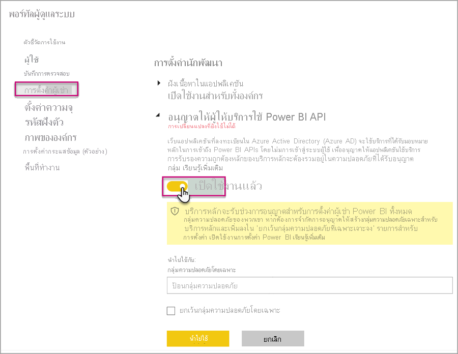
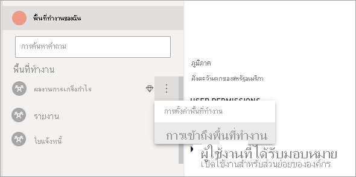

# <a name="automate-premium-workspace-and-dataset-tasks-with-service-principals"></a>ทำให้พื้นที่ทำงาน Premium และงานชุดข้อมูลเป็นแบบอัตโนมัติิด้วยบริการหลัก

บริการหลักคือ *การลงทะเบียนแอป* Azure Active Directory ที่คุณสร้างภายในผู้เช่าของคุณเพื่อใช้ทรัพยากรที่ไม่ได้ใส่ใจและการดำเนินการระดับบริการ ซึ่งเป็นประเภทข้อมูลประจำตัวของผู้ใช้ที่ไม่ซ้ำกันที่มีชื่อแอป ID แอปพลิเคชัน ID ผู้เช่าและ *ข้อมูลลับของไคลเอ็นต์* หรือใบรับรองสำหรับรหัสผ่าน

Power BI Premium ใช้ฟังก์ชันการทำงานของบริการหลักเหมือนกับ Power BI Embedded สำหรับข้อมูลเพิ่มเติม โปรดดู [การฝังเนื้อหา Power BI ด้วยบริการหลัก](../developer/embedded/embed-service-principal.md)

ใน **Power BI Premium** ยังคงสามารถใช้บริการหลักได้กับ [ตำแหน่งข้อมูล XMLA](service-premium-connect-tools.md) เพื่อทำให้งานการจัดการชุดข้อมูลเป็นแบบอัตโนมัติ เช่น พื้นที่ทำงานสำหรับจัดเตรียม การปรับใช้แบบจำลอง และการรีเฟรชชุดข้อมูลด้วย:

- PowerShell
- Azure Automation
- Azure Logic Apps
- แอปพลิเคชันไคลเอ็นต์แบบกำหนดเอง

เฉพาะ [พื้นที่ทำงานใหม่](../collaborate-share/service-new-workspaces.md) เท่านั้นที่สนับสนุนการเชื่อมต่อตำแหน่งข้อมูลของ XMLA โดยใช้บริการหลัก ไม่รองรับพื้นที่ทำงานแบบคลาสสิก บริการหลักมีเฉพาะสิทธิ์ที่จำเป็นในการดำเนินงานสำหรับพื้นที่ทำงานที่ได้รับมอบหมาย สิทธิ์จะได้รับมอบหมายผ่านทางการเข้าถึงพื้นที่ทำงาน ซึ่งคล้ายกันกับบัญชี UPN ทั่วไปมาก

ในการดำเนินการเขียนการปฏิบัติการ **ภาระงานชุดข้อมูล** ของความจุจะต้องมี [ตำแหน่งข้อมูล XMLA ที่เปิดใช้งานสำหรับอ่าน-เขียน](service-premium-connect-tools.md#enable-xmla-read-write) ชุดข้อมูลที่เผยแพร่จาก Power BI Desktop ควรมีการเปิดใช้งานคุณลักษณะการ [รูปแบบเมตาดาต้าขั้นสูง](../connect-data/desktop-enhanced-dataset-metadata.md)

> [!NOTE]
> คุณลักษณะตำแหน่งข้อมูล XMLA ใน Power BI Premium คือ **แสดงตัวอย่าง** ไม่ควรใช้คุณลักษณะการแสดงตัวอย่างในสภาพแวดล้อมการผลิต ฟังก์ชัน การสนับสนุน และเอกสารบางรายการถูกจำกัด  ดู [ข้อกำหนด Microsoft Online Services (OST)](https://www.microsoft.com/licensing/product-licensing/products?rtc=1) สำหรับรายละเอียด

## <a name="create-a-service-principal"></a>สร้างบริการหลัก

บริการหลักจะสร้างขึ้นในขณะที่ลงทะเบียนแอปในพอร์ทัล Azure หรือโดยการใช้ PowerShell เมื่อสร้างบริการหลักของคุณ ตรวจสอบให้แน่ใจว่าได้คัดลอกและบันทึกชื่อแอป ID แอปพลิเคชัน (ไคลเอนต์) ID ไดเรกทอรี (ผู้เช่า) และข้อมูลลับของไคลเอนต์แยกไว้ต่างหาก สำหรับขั้นตอนเกี่ยวกับวิธีการสร้างบริการหลัก โปรดดู:

[สร้างบริการหลัก - พอร์ทัล Azure](https://docs.microsoft.com/azure/active-directory/develop/howto-create-service-principal-portal)   
[สร้างบริการหลัก - PowerShell](https://docs.microsoft.com/azure/active-directory/develop/howto-authenticate-service-principal-powershell)

## <a name="create-an-azure-ad-security-group"></a>สร้างกลุ่มความปลอดภัย Azure AD

ตามค่าเริ่มต้น บริการหลักมีสิทธิ์เข้าถึงการตั้งค่าผู้เช่าใดๆ ที่เปิดใช้งานอยู่ โดยการเข้าถึงสามารถรวมถึงกลุ่มความปลอดภัยเฉพาะหรือทั้งองค์กร ขึ้นอยู่กับการตั้งค่าผู้ดูแลระบบของคุณ

เพื่อจำกัดการเข้าถึงบริการหลักของการตั้งค่าผู้เช่าเฉพาะ คุณสามารถอนุญาตให้เข้าถึงกลุ่มความปลอดภัยเฉพาะ อีกวิธีหนึ่งคือคุณสามารถสร้างกลุ่มความปลอดภัยเฉพาะสำหรับบริการหลัก และแยกออกไปจากการตั้งค่าผู้เช่าที่ต้องการได้ สำหรับขั้นตอนเกี่ยวกับวิธีการสร้างกลุ่มความปลอดภัยและเพิ่มบริการหลัก โปรดดู [สร้างกลุ่มพื้นฐานและเพิ่มสมาชิกโดยใช้ Azure Active Directory](https://docs.microsoft.com/azure/active-directory/fundamentals/active-directory-groups-create-azure-portal)

## <a name="enable-service-principals"></a>เปิดใช้งานบริการหลัก

ก่อนที่จะใช้งานบริการหลักใน Power BI ผู้ดูแลระบบต้องเปิดใช้งานการเข้าถึงบริการหลักในพอร์ทัลผู้ดูแลระบบ Power BI ก่อน

ใน **พอร์ทัลผู้ดูแลระบบ** Power BI > **การตั้งค่าผู้เช่า ให้ขยาย** อนุญาตบริการหลักให้ใช้ **Power BI API** จากนั้นคลิก **เปิดใช้งาน** เมื่อต้องการนำสิทธิ์ไปใช้กับกลุ่มความปลอดภัย ให้เพิ่มชื่อกลุ่มลงใน **กลุ่มความปลอดภัยเฉพาะ**



## <a name="workspace-access"></a>การเข้าถึงพื้นที่ทำงาน

เพื่อให้บริการหลักของคุณมีสิทธิ์ที่จำเป็นในการดำเนินการในพื้นที่ทำงาน Premium และการดำเนินการชุดข้อมูล คุณต้องเพิ่มบริการหลักเป็นสมาชิกพื้นที่ทำงานหรือผู้ดูแลระบบ ใช้การเข้าถึงพื้นที่ทำงานในบริการ Power BI ตามรายละเอียดในที่นี้ แต่นอกจากนี้คุณยังสามารถใช้ [เพิ่มผู้ใช้กลุ่ม REST API](https://docs.microsoft.com/rest/api/power-bi/groups/addgroupuser) ได้เช่นกัน

1. ในบริการ Power BI สำหรับพื้้นที่ทำงาน ให้เลือก **เพิ่มเติม** > **การเข้าถึงพื้นที่ทำงาน**

    

2. ค้นหาตามชื่อแอปพลิเคชัน เพิ่มบริการหลักเป็น **ผู้ดูแลระบบ** หรือ **สมาชิก** ในพื้นที่ทำงาน

    

## <a name="connection-strings-for-the-xmla-endpoint"></a>สตริงการเชื่อมต่อสำหรับตำแหน่งข้อมูล XMLA

เมื่อคุณสร้างบริการหลักแล้ว ให้เปิดใช้งานบริการหลักสำหรับผู้เช่าของคุณ และเพิ่มบริการหลักให้กับการเข้าถึงพื้นที่ทำงาน คุณสามารถใช้เป็นข้อมูลประจำตัวของผู้ใช้ในสตริงการเชื่อมต่อกับตำแหน่งข้อมูล XMLA ความแตกต่างคือพารามิเตอร์ ID ผู้ใช้และรหัสผ่านที่คุณระบุ ID แอปพลิเคชัน ID ผู้เช่า และข้อมูลลับแอปพลิเคชัน

`Data Source=powerbi://api.powerbi.com/v1.0/myorg/<workspace name>; Initial Catalog=<dataset name>;User ID=app:<appId>@<tenantId>;Password=<app_secret>;`

### <a name="powershell"></a>PowerShell

#### <a name="using-sqlserver-module"></a>การใช้โมดูล SQLServer

ในตัวอย่างต่อไปนี้ จะใช้ AppId, TenantId และ AppSecret เพื่อรับรองความถูกต้องของการดำเนินการรีเฟรชชุดข้อมูล:

```powershell
Param (
        [Parameter(Mandatory=$true)] [String] $AppId,
        [Parameter(Mandatory=$true)] [String] $TenantId,
        [Parameter(Mandatory=$true)] [String] $AppSecret
       )
$PWord = ConvertTo-SecureString -String $AppSecret -AsPlainText -Force

$Credential = New-Object -TypeName "System.Management.Automation.PSCredential" -ArgumentList $AppId, $PWord

Invoke-ProcessTable -Server "powerbi://api.powerbi.com/v1.0/myorg/myworkspace" -TableName "mytable" -DatabaseName "mydataset" -RefreshType "Full" -ServicePrincipal -ApplicationId $AppId -TenantId $TenantId -Credential $Credential
```

### <a name="amo-and-adomd"></a>AMO และ ADOMD

เมื่อเชื่อมต่อกับแอปพลิเคชันของไคลเอ็นต์และเว็บแอป [ไลบรารีไคลเอ็นต์ AMO และ ADOMD](https://docs.microsoft.com/azure/analysis-services/analysis-services-data-providers) รุ่น 15.0.2 และแพคเกจการติดตั้งที่สูงกว่าจาก NuGet จะรองรับบริการหลักในสตริงการเชื่อมต่อที่ใช้ไวยากรณ์ต่อไปนี้: `app:AppID` และรหัสผ่านหรือ `cert:thumbprint`

ในตัวอย่างต่อไปนี้ จะใช้ `appID` และ `password` เพื่อดำเนินการรีเฟรชชุดข้อมูลโมเดล

```csharp
string appId = "xxx";
string authKey = "yyy";
string connString = $"Provider=MSOLAP;Data source=powerbi://api.powerbi.com/v1.0/<tenant>/<workspacename>;Initial catalog=<datasetname>;User ID=app:{appId};Password={authKey};";
Server server = new Server();
server.Connect(connString);
Database db = server.Databases.FindByName("adventureworks");
Table tbl = db.Model.Tables.Find("DimDate");
tbl.RequestRefresh(RefreshType.Full);
db.Model.SaveChanges();
```

## <a name="next-steps"></a>ขั้นตอนถัดไป

[การเชื่อมต่อชุดข้อมูลกับตำแหน่งข้อมูล XMLA](service-premium-connect-tools.md)  
[Azure Automation](https://docs.microsoft.com/azure/automation)  
[Azure Logic Apps](https://docs.microsoft.com/azure/logic-apps/)  
[Power BI REST APIs](https://docs.microsoft.com/rest/api/power-bi/)
