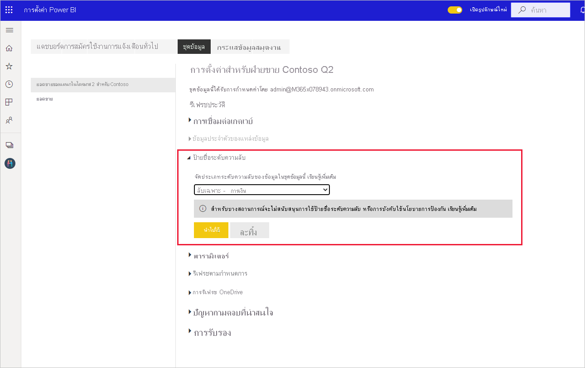

# วิธีการใช้ป้ายชื่อระดับความลับใน Power BI

ป้ายชื่อระดับความลับของ Microsoft Information Protection กับรายงาน แดชบอร์ด ชุดข้อมูล และกระแสข้อมูลสามารถป้องกันเนื้อหาที่สำคัญของคุณจากการเข้าถึงข้อมูลที่ไม่ได้รับอนุญาตและการรั่วไหล การติดป้ายข้อมูลด้วยป้ายชื่อระดับความลับอย่างถูกต้องช่วยให้มั่นใจได้ว่าเฉพาะผู้ที่ได้รับอนุญาตเท่านั้นที่สามารถเข้าถึงข้อมูลของคุณได้ บทความนี้แสดงให้เห็นว่าคุณจะใช้ป้ายชื่อระดับความลับกับเนื้อหาของคุณได้อย่างไร

เพื่อให้สามารถใช้ป้ายชื่อระดับความลับใน Power BI:
* คุณต้องมีสิทธิการใช้งาน Power BI แบบ Pro และสิทธิแก้ไขบนแหล่งข้อมูลที่คุณต้องการติดป้ายชื่อ
* คุณต้องเป็นสมาชิกของกลุ่มความปลอดภัยที่มีสิทธิ์ใช้ป้ายชื่อระดับความลับตามที่อธิบายไว้ในบทความชื่อ [เปิดใช้งานป้ายชื่อระดับความลับใน Power BI](./service-security-enable-data-sensitivity-labels.md#enable-sensitivity-labels)
* ต้องสอดคล้องกับ[ข้อกำหนดเบื้องต้น](./service-security-sensitivity-label-overview.md#requirements-for-using-sensitivity-labels-in-power-bi) และ[ข้อกำหนดสิทธิการใช้งาน](./service-security-data-protection-overview.md#licensing)ทั้งหมด

สำหรับข้อมูลเพิ่มเติมเกี่ยวกับป้ายชื่อระดับความลับใน Power BI โปรดดู [ป้ายชื่อระดับความลับใน Power BI](service-security-sensitivity-label-overview.md)

## การใช้ป้ายชื่อระดับความลับ

เมื่อเปิดใช้งานการป้องกันข้อมูลในผู้เช่าของคุณ ป้ายชื่อระดับความลับจะปรากฏในคอลัมน์ความลับในมุมมองรายการของแดชบอร์ด รายงาน ชุดข้อมูล และกระแสข้อมูล

**เมื่อต้องการนำไปใช้หรือเปลี่ยนป้ายชื่อระดับความลับบนรายงานหรือแดชบอร์ด**
1. คลิก **ตัวเลือกเพิ่มเติม (... )**
1. เลือก **การตั้งค่า**
1. ในบานหน้าต่างด้านการตั้งค่า ให้เลือกป้ายชื่อระดับความลับที่เหมาะสม
1. บันทึกการตั้งค่า

รูปภาพต่อไปนี้อธิบายขั้นตอนเหล่านี้ในรายงาน

**เมื่อต้องการนำไปใช้หรือเปลี่ยนป้ายชื่อระดับความลับบนชุดข้อมูลหรือกระแสข้อมูล**

1. คลิก **ตัวเลือกเพิ่มเติม (... )**
1. เลือก **การตั้งค่า**
1. ในบานหน้าต่างด้านการตั้งค่า ให้เลือกป้ายชื่อระดับความลับที่เหมาะสม
1. ใช้การตั้งค่า

สองรูปต่อไปนี้แสดงขั้นตอนเหล่านี้ในชุดข้อมูล

เลือก **ตัวเลือกเพิ่มเติม (...)** จากนั้น **การตั้งค่า**

บนหน้าการตั้งค่า ให้เปิดส่วนป้ายชื่อระดับความลับ เลือกป้ายชื่อระดับความลับที่ต้องการ แล้วคลิก **นำไปใช้**

## การลบป้ายชื่อระดับความลับ
หากต้องการลบป้ายชื่อระดับความลับออกจากรายงาน แดชบอร์ด ชุดข้อมูลหรือกระแสข้อมูล ให้ทำตาม[ขั้นตอนเดียวกับที่ใช้สำหรับการใช้งานป้ายชื่อ](#applying-sensitivity-labels) แต่เลือก **(ไม่มี)** เมื่อได้รับพร้อมท์ให้จัดประเภทระดับความลับของข้อมูล 

## ข้อควรพิจารณาและข้อจำกัด

ดู [ป้ายชื่อระดับความลับใน Power BI](service-security-sensitivity-label-overview.md#limitations) สำหรับรายการขีดจำกัดของป้ายชื่อระดับความลับใน Power BI

## ขั้นตอนถัดไป

บทความนี้อธิบายวิธีการใช้งานป้ายชื่อระดับความลับใน Power BI บทความต่อไปนี้แสดงรายละเอียดเพิ่มเติมเกี่ยวกับการป้องกันข้อมูลใน Power BI 

* [ภาพรวมของป้ายชื่อระดับความลับใน Power BI](./service-security-sensitivity-label-overview.md)
* [เปิดใช้งานป้ายชื่อระดับความลับใน Power BI](./service-security-enable-data-sensitivity-labels.md)
* [ใช้ตัวควบคุม Microsoft Cloud App Security ใน Power BI](./service-security-using-microsoft-cloud-app-security-controls.md)