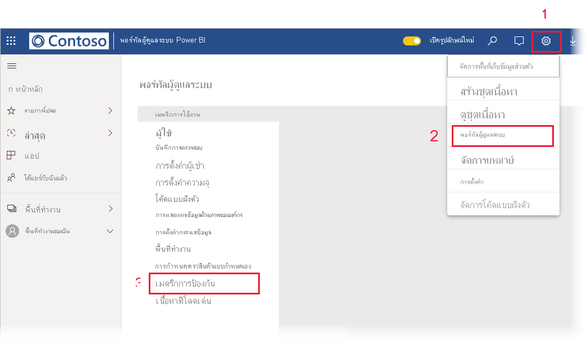

# รายงานเมตริกการป้องกันข้อมูล

## รายงานเมตริกการป้องกันข้อมูลคืออะไร
รายงานเมตริกการป้องกันข้อมูลเป็นรายงานเฉพาะที่ [ผู้ดูแลระบบ Power BI](../service-admin-role.md) สามารถใช้เพื่อตรวจสอบและติดตามการใช้งานป้ายชื่อระดับความลับของข้อมูลและการเริ่มนำไปใช้ในผู้เช่าของตน

 
คุณลักษณะรายงานประกอบด้วย:
* แผนภูมิคอลัมน์แบบเรียงซ้อน 100% ที่แสดงการใช้งานป้ายชื่อระดับความลับรายวันในช่วง 7, 30 หรือ 90 วันที่ผ่านมา แผนภูมินี้ช่วยให้ง่ายต่อการติดตามการใช้งานที่สัมพันธ์กันของชนิดป้ายชื่อที่แตกต่างกันเมื่อเวลาผ่านไป
* แผนภูมิโดนัทที่แสดงสถานะปัจจุบันของการใช้ป้ายชื่อระดับความลับในผู้เช่าสำหรับแดชบอร์ด รายงาน ชุดข้อมูล และกระแสข้อมูล
* ลิงก์ไปยังพอร์ทัล Cloud App Security ที่มีข้อมูลการแจ้งเตือนของ Power BI ผู้ใช้ที่มีความเสี่ยง บันทึกกิจกรรม และข้อมูลอื่น ๆ สำหรับข้อมูลเพิ่มเติม โปรดดู[การใช้ตัวควบคุม Microsoft Cloud App Security ใน Power BI](./service-security-using-microsoft-cloud-app-security-controls.md)

รายงานจะรีเฟรชทุก 24 ชั่วโมง

## การดูรายงานเมตริกการป้องกันข้อมูล

คุณต้องมี [บทบาทผู้ดูแลระบบ Power BI](../service-admin-role.md) เพื่อเปิดและดูรายงาน
หากต้องการดูรายงาน ให้ไปที่ **การตั้งค่า > พอร์ทัลผู้ดูแลระบบ** และเลือก **เมตริกการป้องกัน**

 
 
ในครั้งแรกที่คุณเปิดรายงานเมตริกการป้องกันข้อมูล อาจต้องใช้เวลาสองถึงสามวินาทีในการโหลด รายงานและชุดข้อมูลที่มีชื่อว่า **เมตริกการป้องกันข้อมูล (สร้างขึ้นโดยอัตโนมัติ)** จะถูกสร้างขึ้นในสภาพแวดล้อมส่วนตัวของคุณภายใต้ "พื้นที่ทำงานของฉัน" เราไม่แนะนำให้ดูรายงานที่นี่ รายงานนี้ไม่ใช่รายงานแบบเต็มรูปแบบ อย่างไรก็ตาม ให้ดูรายงานในพอร์ทัลผู้ดูแลระบบตามที่อธิบายไว้ข้างต้น

> [!CAUTION]
> อย่าเปลี่ยนแปลงรายงานหรือชุดข้อมูลในทางใดทางหนึ่งเนื่องจากรายงานเวอร์ชันใหม่จะถูกนำเสนอเป็นครั้งคราว และการเปลี่ยนแปลงใดๆ ที่คุณทำกับรายงานต้นฉบับจะถูกเขียนทับหากคุณอัปเดตเป็นเวอร์ชันใหม่

## การอัปเดตรายงาน

จะมีการเผยแพร่เวอร์ชันที่ปรับปรุงของรายงานเมตริกการป้องกันข้อมูลเป็นระยะ ๆ เมื่อคุณเปิดรายงานถ้ามีเวอร์ชันใหม่พร้อมใช้งาน ระบบจะถามว่าคุณต้องการเปิดเวอร์ชันใหม่หรือไม่ ถ้าคุณพูดว่า "ใช่" เวอร์ชันใหม่ของรายงานจะโหลดและเขียนทับเวอร์ชันเก่า การเปลี่ยนแปลงใด ๆ ที่คุณอาจทำกับรายงานเก่าและ/หรือชุดข้อมูลจะสูญหายไป คุณสามารถเลือกที่จะไม่เปิดเวอร์ชันใหม่ แต่ในกรณีนี้คุณจะไม่ได้รับประโยชน์จากการปรับปรุงเวอร์ชันใหม่ 
## บันทึกย่อและข้อควรพิจารณา
* เมื่อต้องการสร้างรายงานเมตริกการป้องกันข้อมูลให้สำเร็จ [การป้องกันข้อมูล](./service-security-enable-data-sensitivity-labels.md) ต้องเปิดใช้งานบนผู้เช่าของคุณ และ[ควรจะนำป้ายชื่อระดับความลับไปใช้](../collaborate-share/service-security-apply-data-sensitivity-labels.md) 
* เพื่อเข้าถึงข้อมูล Cloud App Security องค์กรของคุณต้องมี [สิทธิ์การใช้งาน Cloud App Security](https://docs.microsoft.com/power-bi/admin/service-security-using-microsoft-cloud-app-security-controls#microsoft-cloud-app-security-licensing) ที่เหมาะสม
* ถ้าคุณตัดสินใจที่จะแชร์ข้อมูลจากรายงานเมตริกการป้องกันข้อมูลด้วยผู้ใช้ที่ไม่ใช่ผู้ดูแลระบบ Power BI โปรดตระหนักว่ารายงานนี้ประกอบด้วยข้อมูลที่สำคัญเกี่ยวกับองค์กรของคุณ
* รายงานเมตริกการป้องกันข้อมูลเป็นรายงานชนิดพิเศษ และไม่แสดงในรายการ "แชร์กับฉัน" "ล่าสุด" และ "รายการโปรด"
* รายงานเมตริกการป้องกันข้อมูลไม่พร้อมใช้งานสำหรับ [ผู้ใช้ภายนอก (Azure Active Directory ผู้ใช้ที่เป็นผู้เยี่ยมชม B2B)](../service-admin-azure-ad-b2b.md)
## ขั้นตอนถัดไป
* [การป้องกันข้อมูลใน Power BI](./service-security-data-protection-overview.md)
* [ใช้ตัวควบคุม Microsoft Cloud App Security ใน Power BI](service-security-using-microsoft-cloud-app-security-controls.md)
* [ทำความเข้าใจเกี่ยวกับบทบาทผู้ดูแลระบบบริการของ Power BI](service-admin-role.md)
* [เปิดใช้งานป้ายชื่อระดับความลับของข้อมูลใน Power BI](service-security-enable-data-sensitivity-labels.md)