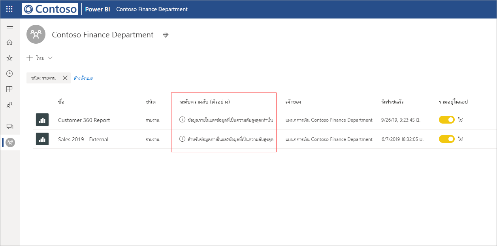
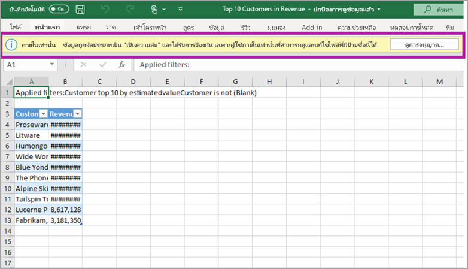

# การป้องกันข้อมูลใน Power BI (ตัวอย่าง)

องค์กรสมัยใหม่มีข้อบังคับและข้อกำหนดทางธุรกิจที่เข้มงวดเกี่ยวกับวิธีจัดการและปกป้องข้อมูลที่มีความละเอียดอ่อนของพวกเขา Power BI สามารถทำงานร่วมกับ Microsoft Information Protection และ Microsoft Cloud App Security เพื่อทำให้การควบคุมและการแสดงข้อมูลที่ละเอียดอ่อนใน Power BI ดียิ่งขึ้น 

ด้วยการปกป้องข้อมูลสำหรับ Power BI คุณสามารถทำสิ่งต่อไปนี้:

* ใช้ป้ายชื่อระดับความลับของ Microsoft เพื่อจัดหมวดหมู่และติดป้ายเนื้อหาในบริการของ Power BI (แดชบอร์ด รายงาน ชุดข้อมูล และกระแสข้อมูล) โดยใช้อนุกรมวิธานเดียวกันกับที่ใช้ในการจัดหมวดหมู่และป้องกันไฟล์ใน Microsoft 365

* บังคับใช้การตั้งค่าการป้องกัน เช่น การเข้ารหัสหรือลายน้ำเมื่อส่งออกข้อมูลจากบริการของ Power BI ไปยังไฟล์โดยใช้ป้ายชื่อระดับความลับและการป้องกันของเนื้อหา (Excel, PowerPoint และ PDF) 

  ตัวอย่างเช่น ผู้ใช้ของคุณสามารถใช้ป้ายชื่อเป็นความลับกับรายงานใน Power BI จากนั้นเมื่อมีการส่งออกข้อมูลไปยังไฟล์ Excel แล้ว Power BI จะนำป้ายชื่อเป็นความลับไปใช้กับไฟล์ด้วย ป้ายชื่อสามารถเข้ารหัสเนื้อหาและใช้ลายน้ำ เป็นความลับ

* ใช้ Microsoft Cloud App Security เพื่อตรวจสอบกิจกรรมใน Power BI ตรวจสอบปัญหาด้านความปลอดภัย และป้องกันเนื้อหาใน Power BI ด้วยการควบคุมการเข้าถึงแอปแบบมีเงื่อนไขของ Microsoft Cloud App Security 

## ป้ายชื่อระดับความลับใน Power BI

ป้ายชื่อระดับความลับจะถูกสร้างขึ้นและจัดการใน [ศูนย์ความปลอดภัยของ Microsoft 365](https://security.microsoft.com/) หรือ [ศูนย์การปฏิบัติตามข้อบังคับ Microsoft 365](https://compliance.microsoft.com/)

เมื่อต้องการเข้าถึงป้ายชื่อระดับความลับในศูนย์ใดศูนย์หนึ่งเหล่านี้ ให้ไปที่ **การจัดประเภท** > **ป้ายชื่อระดับความลับ** ป้ายชื่อระดับความลับเหล่านี้สามารถใช้ได้กับบริการหลายอย่างของ Microsoft เช่น Azure Information Protection แอป Office และบริการ Microsoft 365

> [!IMPORTANT]
> ลูกค้าของ Azure Information Protection จะต้องย้ายป้ายชื่อไปยังหนึ่งในบริการที่ระบุไว้ก่อนหน้านี้เพื่อให้สามารถใช้ป้ายชื่อระดับความลับใน Power BI ได้ นอกจากนี้ ป้ายชื่อระดับความลับยังรองรับเฉพาะในระบบคลาวด์สาธารณะเท่านั้น และไม่รองรับสำหรับผู้เช่าในระบบคลาวด์ เช่น Sovereign Cloud
>
> เรียนรู้เพิ่มเติมเกี่ยวกับ [การย้ายป้ายชื่อระดับความลับไปยัง Microsoft Information Protection](https://docs.microsoft.com/azure/information-protection/configure-policy-migrate-labels)

## ป้ายชื่อระดับความลับทำงานอย่างไร

เมื่อคุณนำป้ายชื่อระดับความลับไปใช้กับแดชบอร์ด รายงาน ชุดข้อมูล และกระแสข้อมูลของ Power BI จะคล้ายกับการใช้*แท็ก* กับแหล่งข้อมูลดังกล่าวที่นำมาพร้อมกับประโยชน์ดังต่อไปนี้:
* **แบบปรับแต่งได้** - คุณสามารถสร้างหมวดหมู่สำหรับเนื้อหาที่ละเอียดอ่อนในระดับที่แตกต่างกันในองค์กรของคุณ เช่น ส่วนบุคคล สาธารณะ ทั่วไป เป็นความลับ และเป็นความลับสูง
* **ข้อความชัดเจน** - เนื่องจากป้ายชื่อเป็นข้อความที่ชัดเจน จึงเป็นเรื่องง่ายสำหรับผู้ใช้ที่จะเข้าใจวิธีการปฏิบัติต่อเนื้อหาตามแนวทางของป้ายชื่อระดับความลับ
* **คงอยู่ยาวนาน** - หลังจากที่มีการใช้ป้ายชื่อระดับความลับกับเนื้อหาแล้ว ป้ายชื่อนั้นจะติดไปกับเนื้อหาเมื่อส่งออกไปยังไฟล์ประเภทที่รองรับต่อไปนี้: Excel, PowerPoint และ PDF 

  ซึ่งหมายความว่าป้ายชื่อระดับความลับจะติดไปกับเนื้อหา รวมถึงการตั้งค่าการป้องกัน และกลายเป็นพื้นฐานสำหรับการใช้และบังคับใช้นโยบายต่าง ๆ 

## ตัวอย่างป้ายชื่อระดับความลับ 

นี่คือตัวอย่างแบบย่อเพื่อแสดงวิธีการทำงานของป้ายชื่อระดับความลับใน Power BI

1. ในบริการของ Power BI มีการใช้ป้ายชื่อระดับความลับ**เป็นความลับสูง - สำหรับใช้ภายในเท่านั้น** กับรายงาน

   

2. เมื่อมีการส่งออกข้อมูลจากรายงานนี้ไปยังไฟล์ Excel ป้ายชื่อระดับความลับและการป้องกันจะถูกนำไปใช้กับไฟล์ Excel ที่ส่งออกด้วย

   

ในแอปพลิเคชัน Microsoft Office ป้ายชื่อระดับความลับจะปรากฏเป็นแท็กในอีเมลหรือเอกสารคล้ายกับรูปภาพด้านบน

นอกจากนี้ คุณยังสามารถกำหนดหมวดหมู่ให้กับเนื้อหา (เช่น สติกเกอร์) ที่ยังคงติดอยู่และติดไปกับเนื้อหาตามที่มีการใช้งานและแบ่งปัน คุณสามารถใช้การจัดหมวดหมู่นี้เพื่อสร้างรายงานการใช้งานและดูข้อมูลกิจกรรมสำหรับเนื้อหาที่ละเอียดอ่อนของคุณ จากข้อมูลนี้คุณสามารถเลือกในภายหลังได้ตลอดเวลาเพื่อใช้การตั้งค่าการป้องกัน

## การใช้ป้ายชื่อระดับความลับใน Power BI

ก่อนที่จะเปิดใช้งานป้ายชื่อระดับความลับของคุณใน Power BI คุณต้องดำเนินการข้อกำหนดเบื้องต้นต่อไปนี้ให้เสร็จสมบูรณ์ก่อน: 

* ตรวจสอบให้แน่ใจว่ามีการกำหนดป้ายชื่อระดับความลับใน [ศูนย์ความปลอดภัยของ Microsoft 365](https://security.microsoft.com/) หรือ [ศูนย์การปฏิบัติตามข้อบังคับ Microsoft 365](https://compliance.microsoft.com/) 
* [เปิดใช้งานป้ายชื่อระดับความลับ](service-security-enable-data-sensitivity-labels.md) (ตัวอย่าง) ใน Power BI
* ตรวจสอบให้แน่ใจว่าผู้ใช้มีสิทธิ์การใช้งานที่เหมาะสม
  * เมื่อต้องการดูหรือใช้ป้ายชื่อใน Power BI ผู้ใช้ต้องมีสิทธิ์การใช้งานของ Azure Information Protection แบบ Premium P1 หรือ Premium P2 คุณสามารถซื้อ Microsoft Azure Information Protection แบบสแตนด์อโลนหรือผ่านหนึ่งในชุดโปรแกรมการอนุญาตให้ใช้สิทธิของ Microsoft ได้ โปรดดู [การกำหนดราคา Azure Information Protection](https://azure.microsoft.com/pricing/details/information-protection/) สำหรับรายละเอียด
  * หากต้องการนำป้ายชื่อระดับความลับไปใช้กับทรัพยากร Power BI ผู้ใช้จะต้องมีสิทธิ์การใช้งาน Power BI Pro นอกเหนือจากหนึ่งในสิทธิ์การใช้งาน Azure Information Protection ที่กล่าวถึงข้างต้น 

## ป้องกันเนื้อหาโดยใช้ Microsoft Cloud App Security

คุณสามารถป้องกันเนื้อหาใน Power BI ไม่ให้มีการรั่วไหลที่ไม่ได้ตั้งใจหรือการละเมิดได้โดยใช้ Microsoft Cloud App Security เมื่อตั้งค่าและกำหนดค่า Microsoft Cloud App Security แล้ว ผู้ดูแลระบบความปลอดภัยสามารถตรวจสอบการเข้าถึงและกิจกรรมของผู้ใช้ ทำการวิเคราะห์ความเสี่ยงแบบเรียลไทม์ และตั้งค่าตัวควบคุมเฉพาะป้ายชื่อได้

ตัวอย่างเช่น องค์กรสามารถใช้ Microsoft Cloud App Security เพื่อกำหนดค่านโยบายที่ป้องกันไม่ให้ผู้ใช้ดาวน์โหลดข้อมูลที่ละเอียดอ่อนจาก Power BI ไปยังอุปกรณ์ที่ไม่มีการจัดการได้ การกำหนดค่าดังกล่าวช่วยให้ผู้ใช้ยังคงทำงานได้อย่างมีประสิทธิภาพและเชื่อมต่อกับ Power BI ได้จากทุกแห่ง ในขณะที่การใช้ Microsoft Cloud App Security ยังช่วยป้องกันไม่ประสิทธิภาพการทำงานของระบบลดลงจากการดำเนินการของผู้ใช้ในแบบเรียลไทม์ด้วย 

### ข้อกำหนด

ก่อนที่ป้ายชื่อระดับความลับของคุณจะสามารถใช้ Microsoft Cloud App Security ได้ คุณต้องปฏิบัติตามข้อกำหนดเบื้องต้นต่อไปนี้: 

* ต้องเปิดใช้งาน Cloud App Security และ Azure Information Protection [สำหรับผู้เช่าของคุณ](https://docs.microsoft.com/cloud-app-security/azip-integration)
* แอป [ต้องเชื่อมต่อกับ Microsoft Cloud App Security](https://docs.microsoft.com/cloud-app-security/enable-instant-visibility-protection-and-governance-actions-for-your-apps)

## ข้อควรพิจารณาและข้อจำกัด

รายการต่อไปนี้แสดงข้อจำกัดบางอย่างของป้ายชื่อระดับความลับใน Power BI:

* การดูหรือใช้ป้ายชื่อระดับความลับ Microsoft Information Protection ใน Power BI ต้องมีสิทธิ์การใช้งานของ Azure Information Protection แบบ Premium P1 หรือ Premium P2 คุณสามารถซื้อ Microsoft Azure Information Protection แบบสแตนด์อโลนหรือผ่านหนึ่งในชุดโปรแกรมการอนุญาตให้ใช้สิทธิของ Microsoft ได้ โปรดดู [การกำหนดราคา Azure Information Protection](https://azure.microsoft.com/pricing/details/information-protection/) สำหรับรายละเอียด
* ป้ายชื่อระดับความลับสามารถใช้ได้เฉพาะบนแดชบอร์ด รายงาน ชุดข้อมูล และกระแสข้อมูลเท่านั้น
* การบังคับใช้ตัวควบคุมการป้องกันและป้ายชื่อบนไฟล์ที่ส่งออกจะรองรับเฉพาะไฟล์ Excel, PowerPoint และ PDF เท่านั้น การป้องกันและป้ายชื่อไม่ได้มีการบังคับใช้เมื่อมีการส่งออกข้อมูลเป็นไฟล์ CSV สมัครใช้งานอีเมล วิชวลแบบฝังตัว และการพิมพ์
* ผู้ใช้ที่ส่งออกไฟล์จาก Power BI มีสิทธิ์ในการเข้าถึงและการแก้ไขไฟล์นั้นตามการตั้งค่าป้ายชื่อระดับความลับ ผู้ใช้ที่ส่งออกข้อมูลไม่ได้รับสิทธิ์การเป็นเจ้าของสำหรับไฟล์ดังกล่าว 
* ในขณะนี้ ป้ายชื่อระดับความลับยังไม่สามารถใช้ได้สำหรับ [รายงานที่มีการแบ่งหน้า]( https://docs.microsoft.com/power-bi/paginated-reports-report-builder-power-bi) และสมุดงาน
* ป้ายชื่อระดับความลับบนแอสเซท Power BI สามารถมองเห็นได้เฉพาะในรายการพื้นที่ทำงานและมุมมองสายข้อมูลเท่านั้น ในขณะนี้ป้ายชื่อจะไม่สามารถมองเห็นได้ในรายการโปรด ที่แชร์กับฉัน ล่าสุด หรือมุมมองแอป อย่างไรก็ตาม โปรดทราบว่าป้ายชื่อที่ใช้กับแอสเซท Power BI แม้ว่าจะไม่สามารถมองเห็นได้ จะยังคงอยู่ในข้อมูลที่ส่งออกไปเป็นไฟล์ Excel, PowerPoint และ PDF เสมอ
* *การตั้งค่าการเข้ารหัสไฟล์* ของป้ายชื่อระดับความลับ ที่กำหนดค่าใน [ศูนย์การรักษาความปลอดภัย Microsoft 365](https://security.microsoft.com/) หรือ [ศูนย์การปฏิบัติตามข้อบังคับ Microsoft 365](https://compliance.microsoft.com/) นำไปใช้เฉพาะกับไฟล์ที่ *ส่งออกจาก* Power BI เท่านั้น ซึ่งไม่ได้บังคับใช้ *ภายใน* Power BI
* [การป้องกัน HYOK](https://docs.microsoft.com/azure/information-protection/configure-adrms-restrictions) ไม่ได้รับการรองรับสำหรับป้ายชื่อที่ใช้ใน Power BI
* การดูและการใช้ป้ายชื่อในแอป Office มี[ข้อกำหนดเรื่องสิทธิ์การใช้งาน](https://docs.microsoft.com/microsoft-365/compliance/get-started-with-sensitivity-labels#subscription-and-licensing-requirements-for-sensitivity-labels)
* ป้ายชื่อระดับความลับได้รับการรองรับสำหรับผู้เช่าในระบบคลาวด์ (สาธารณะ) ส่วนกลางเท่านั้น ป้ายชื่อระดับความลับไม่ได้รับการรองรับสำหรับผู้เช่าในระบบคลาวด์อื่นๆ
* ไม่รองรับป้ายชื่อระดับความลับของข้อมูลสำหรับแอปเทมเพลต ป้ายชื่อระดับความลับที่ตั้งค่าโดยผู้สร้างแอปเทมเพลตจะถูกลบออกเเมื่อมีการแยกและติดตั้งแอป และป้ายชื่อระดับความลับที่เพิ่มไปยังอาร์ทิแฟกต์ในแอปเทมเพลตที่ติดตั้งโดยผู้บริโภคแอปสูญหายไป (ตั้งค่าใหม่เป็นไม่มีอะไร) เมื่อมีการอัปเดตแอป
* Power BI ไม่รองรับป้ายชื่อระดับความลับของประเภทการป้องกัน**Do Not Forward** และ **Ad-Hoc**

## ขั้นตอนถัดไป

บทความนี้แสดงภาพรวมของการป้องกันข้อมูลใน Power BI บทความต่อไปนี้แสดงรายละเอียดเพิ่มเติมเกี่ยวกับการป้องกันข้อมูลใน Power BI 

* [เปิดใช้งานป้ายชื่อระดับความลับของข้อมูลใน Power BI](service-security-enable-data-sensitivity-labels.md)
* [ใช้ป้ายชื่อระดับความลับของข้อมูลใน Power BI](../collaborate-share/service-security-apply-data-sensitivity-labels.md)
* [ใช้ตัวควบคุม Microsoft Cloud App Security ใน Power BI](service-security-using-microsoft-cloud-app-security-controls.md)
* [รายงานเมตริกการป้องกันข้อมูล](service-security-data-protection-metrics-report.md)