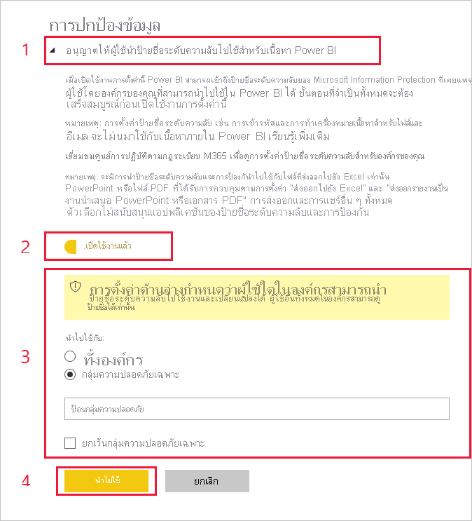

# เปิดใช้งานป้ายชื่อระดับความลับของข้อมูลใน Power BI (แสดงตัวอย่าง)

เมื่อมีการเปิดใช้งาน [ป้ายชื่อระดับความลับของข้อมูลของ Microsoft Information Protection](https://docs.microsoft.com/microsoft-365/compliance/sensitivity-labels) ใน Power BI รายการต่อไปนี้จะมีผลบังคับใช้:

* ผู้ใช้และกลุ่มความปลอดภัยบางกลุ่มในองค์กรสามารถจัดประเภทและ [นำป้ายชื่อระดับความลับ](../designer/service-security-apply-data-sensitivity-labels.md) ไปใช้ในแดชบอร์ด Power BI รายงาน ชุดข้อมูล และกระแสข้อมูล (ต่อจากนี้จะเรียกว่า *แอสเซท*)
* สมาชิกทั้งหมดขององค์กรสามารถดูป้ายชื่อเหล่านั้นได้

ป้ายชื่อระดับความลับของข้อมูลจะส่งเสริมการป้องกันข้อมูลโดยการทำให้ผู้สร้างและผู้ใช้ของ Power BI ตระหนักถึงระดับความลับของข้อมูล ในขณะที่ให้ข้อมูลเกี่ยวกับความหมายของการจำแนกประเภทและวิธีจัดการข้อมูลที่มีการจำแนกประเภทนั้น

ป้ายชื่อระดับความลับของข้อมูลดังกล่าวจะติดไปด้วยเมื่อมีการส่งออกข้อมูล Power BI ที่มีป้ายชื่อระดับความลับของข้อมูลไปเป็นไฟล์ Excel, PowerPoint หรือ PDF ซึ่งหมายความว่าผู้ใช้ที่ไม่มีสิทธิ์ในการเข้าถึงข้อมูลที่มีป้ายชื่อ เนื่องจากนโยบายป้ายชื่อระดับความลับ จะไม่สามารถเปิดไฟล์ *ภายนอก* Power BI (ในแอปพลิเคชัน Excel, PowerPoint หรือ PDF) ได้

การเปิดใช้งานป้ายชื่อระดับความลับของข้อมูลจำเป็นต้องมีสิทธิ์การใช้งาน Azure Information Protection ดูรายละเอียดเพิ่มเติมที่ [การอนุญาตให้ใช้งาน](#licensing)

## เปิดใช้งานป้ายชื่อระดับความลับของข้อมูล

เมื่อต้องการเปิดใช้งานการใช้ป้ายชื่อระดับความลับของข้อมูลของ Microsoft Information Protection ใน Power BI ให้ไปที่พอร์ทัลผู้ดูแลระบบ Power BI เปิดบานหน้าต่างการตั้งค่าผู้เช่า และค้นหาส่วนการป้องกันข้อมูล

ในส่วน **Information Protection** ให้ดำเนินการขั้นตอนต่อไปนี้:
1.  เปิดใช้งานปุ่มสลับ **เปิดใช้งานป้ายชื่อระดับความลับ Microsoft Information Protection** และกด **นำไปใช้** ขั้นตอนนี้ *เพียงแค่* ทำให้ทั้งองค์กรของคุณมองเห็นป้ายชื่อระดับความลับเท่านั้น ไม่ได้ใช้ป้ายชื่อใด ๆ หากต้องการกำหนดบุคคลที่สามารถใช้ป้ายชื่อเหล่านั้นใน Power BI คุณจำเป็นต้องทำตามขั้นตอนที่ 2 ให้เสร็จสมบูรณ์
2.  กำหนดบุคคลที่สามารถใช้และเปลี่ยนแปลงป้ายชื่อระดับความลับในแอสเซท Power BI ได้ ขั้นตอนนี้เกี่ยวข้องกับการดำเนินการสามอย่าง:
    1.  เปิดใช้งานปุ่มสลับ **ตั้งค่าป้ายชื่อระดับความลับสำหรับเนื้อหาและข้อมูล Power BI**
    2.  เลือกกลุ่มความปลอดภัยที่เกี่ยวข้อง ตามค่าเริ่มต้น ทุกคนในองค์กรของคุณจะสามารถใช้ป้ายชื่อระดับความลับได้ อย่างไรก็ตาม คุณสามารถเลือกที่จะเปิดใช้งานการตั้งค่าป้ายชื่อระดับความลับเฉพาะสำหรับผู้ใช้หรือกลุ่มความปลอดภัยที่เฉพาะเจาะจงได้ เมื่อเลือกทั้งองค์กรหรือกลุ่มความปลอดภัยที่เฉพาะเจาะจง คุณสามารถยกเว้นชุดย่อยของผู้ใช้หรือกลุ่มความปลอดภัยที่เฉพาะเจาะจงได้
    * เมื่อมีการเปิดใช้งานป้ายชื่อระดับความลับสำหรับทั้งองค์กร โดยทั่วไปจะมีการยกเว้นกลุ่มความปลอดภัย
    * เมื่อมีการเปิดใช้งานป้ายชื่อระดับความลับเฉพาะสำหรับผู้ใช้หรือกลุ่มความปลอดภัยที่เฉพาะเจาะจง โดยทั่วไปจะมีการยกเว้นผู้ใช้ที่เฉพาะเจาะจง  
    วิธีการนี้จะทำให้สามารถป้องกันไม่ให้ผู้ใช้บางรายนำป้ายชื่อระดับความลับใน Power BI ไปใช้งาน ถึงแม้ว่าพวกเขาจะเป็นสมาชิกของกลุ่มที่มีสิทธิ์ในการทำเช่นนั้นก็ตาม
    
    3. กด **นำไปใช้**

> [!IMPORTANT]
> เฉพาะผู้ใช้ Power BI Pro เท่านั้นที่มีสิทธิ์ *สร้าง* และ *แก้ไข* ในแอสเซท และผู้ที่เป็นส่วนหนึ่งของกลุ่มความปลอดภัยที่เกี่ยวข้องที่ตั้งค่าในส่วนนี้จะสามารถตั้งค่าและแก้ไขป้ายชื่อระดับความลับได้ ผู้ใช้ที่ไม่ได้เป็นส่วนหนึ่งของกลุ่มนี้จะไม่สามารถตั้งค่า หรือแก้ไขป้ายชื่อได้ 

## ข้อควรพิจารณาและข้อจำกัด

Power BI ใช้ป้ายชื่อระดับความลับ Microsoft Information Protection ดังนั้นถ้าคุณพบข้อผิดพลาดเมื่อพยายามเปิดใช้งานป้ายชื่อระดับความลับ อาจเป็นเพราะหนึ่งในสาเหตุต่อไปนี้:

* คุณไม่มี[สิทธิ์การใช้งาน](#licensing) Azure Information Protection
* ไม่มีการโยกย้ายป้ายชื่อระดับความลับไปยังเวอร์ชัน Microsoft Information Protection ที่สนับสนุนโดย Power BI เรียนรู้เพิ่มเติมเกี่ยวกับ [การโยกย้ายป้ายชื่อระดับความลับ](https://docs.microsoft.com/azure/information-protection/configure-policy-migrate-labels)
* ไม่ได้มีการกำหนดป้ายชื่อระดับความลับ Microsoft Information Protection ในองค์กร นอกจากนี้ป้ายชื่อจะต้องเป็นส่วนหนึ่งของนโยบายที่เผยแพร่แล้ว จึงจะสามารถใช้ได้ [เรียนรู้เพิ่มเติมเกี่ยวกับป้ายชื่อระดับความลับ](https://docs.microsoft.com/Office365/SecurityCompliance/sensitivity-labels) หรือเยี่ยมชม [ศูนย์ความปลอดภัยและการปฏิบัติตามข้อกำหนดของ Microsoft](https://sip.protection.office.com/sensitivity?flight=EnableMIPLabels) เพื่ออ่านข้อมูลเกี่ยวกับวิธีการกำหนดป้ายชื่อและเผยแพร่นโยบายสำหรับองค์กรของคุณ

## สิทธิ์การใช้งาน

* เมื่อต้องการดูหรือใช้ป้ายชื่อระดับความลับ Microsoft Information Protection ใน Power BI ผู้ใช้ต้องมีสิทธิ์การใช้งานของ Azure Information Protection แบบ Premium P1 หรือ Premium P2 คุณสามารถซื้อ Microsoft Azure Information Protection แบบสแตนด์อโลนหรือผ่านหนึ่งในชุดโปรแกรมการอนุญาตให้ใช้สิทธิของ Microsoft ได้ โปรดดู [การกำหนดราคา Azure Information Protection](https://azure.microsoft.com/pricing/details/information-protection/) สำหรับรายละเอียด
* ผู้ใช้ที่จำเป็นต้องใช้ป้ายชื่อบนแอสเซท Power BI ต้องมีสิทธิ์การใช้งาน Power BI Pro

## ขั้นตอนถัดไป

บทความนี้อธิบายวิธีการเปิดใช้งานป้ายชื่อระดับความลับของข้อมูลใน Power BI บทความต่อไปนี้แสดงรายละเอียดเพิ่มเติมเกี่ยวกับการป้องกันข้อมูลใน Power BI 

* [ภาพรวมของการป้องกันข้อมูลใน Power BI](service-security-data-protection-overview.md)
* [ใช้ป้ายชื่อระดับความลับของข้อมูลใน Power BI](../designer/service-security-apply-data-sensitivity-labels.md)
* [การใช้ตัวควบคุม Microsoft Cloud App Security ใน Power BI](service-security-using-microsoft-cloud-app-security-controls.md)