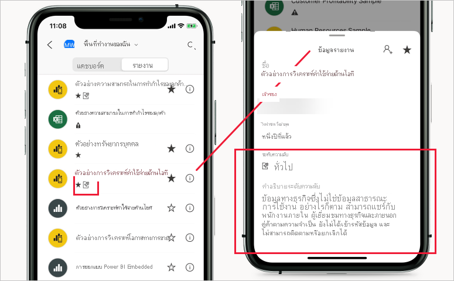

# ป้ายชื่อระดับความลับใน Power BI

บทความนี้อธิบายถึงฟังก์ชันการทำงานของ [ป้ายชื่อระดับความลับ Microsoft Information Protection](https://docs.microsoft.com/microsoft-365/compliance/sensitivity-labels?view=o365-worldwide) ใน Power BI สำหรับข้อมูลเกี่ยวกับวิธีการนำป้ายชื่อระดับความลับไปใช้กับรายงาน Power BI แดชบอร์ด ชุดข้อมูล และกระแสข้อมูล โปรดดู [วิธีการใช้ป้ายชื่อระดับความลับใน Power BI](./service-security-apply-data-sensitivity-labels.md) สำหรับข้อมูลเพิ่มเติมเกี่ยวกับการเปิดใช้งานป้ายชื่อระดับความลับในผู้เช่าของคุณ โปรดดู [การเปิดใช้งานป้ายชื่อระดับความลับของข้อมูลใน Power BI](service-security-enable-data-sensitivity-labels.md)

ป้ายชื่อระดับความลับ Microsoft Information Protection ช่วยให้ผู้ใช้ของคุณสามารถจัดประเภทเนื้อหาที่สำคัญใน Power BI ได้โดยไม่สูญเสียผลผลิตหรือความสามารถในการทำงานร่วมกัน

ป้ายชื่อระดับความลับสามารถใช้ได้บนชุดข้อมูล รายงาน แดชบอร์ด และกระแสข้อมูลเท่านั้น เมื่อมีการส่งออกข้อมูลจาก Power BI ไปยัง Excel, PowerPoint หรือไฟล์ PDF แล้ว Power BI จะนำป้ายชื่อระดับความลับไปใช้กับไฟล์ที่ส่งออกและปกป้องไฟล์ตามการตั้งค่าการเข้ารหัสไฟล์ของป้ายชื่อ ด้วยวิธีนี้ ข้อมูลที่มีความอ่อนไหวของคุณจะยังคงได้รับการปกป้อง ไม่ว่าจะอยู่ที่ไหนก็ตาม

คุณจะสามารถมองเห็นป้ายชื่อระดับความลับที่ใช้ในรายงาน Power BI แดชบอร์ด ชุดข้อมูล และกระแสข้อมูลได้จากหลายตำแหน่งในบริการ Power BI คุณจะสามารถมองเห็นป้ายชื่อระดับความลับบนรายงานและแดชบอร์ดได้ในแอป Power BI iOS และ Android และในวิชวลแบบฝังตัวอีกด้วย

[รายงานเมตริกการป้องกัน](service-security-data-protection-metrics-report.md) พร้อมใช้งานในพอร์ทัลผู้ดูแลระบบ Power BI ซึ่งช่วยให้ผู้ดูแล Power BI สามารถมองเห็นข้อมูลที่มีความอ่อนไหวในผู้เช่า Power BI ได้อย่างเต็มที่ นอกจากนี้ บันทึกการตรวจสอบ Power BI ยังประกอบด้วยข้อมูลป้ายชื่อระดับความลับเกี่ยวกับกิจกรรม เช่น การนำไปใช้ การเอาออก และการเปลี่ยนป้ายชื่อ ตลอดจนเกี่ยวกับกิจกรรม เช่น การดูรายงาน แดชบอร์ด ฯลฯ ช่วยให้ Power BI และผู้ดูแลระบบความปลอดภัยสามารถมองเห็นการใช้ข้อมูลที่มีความอ่อนไหวเพื่อจุดประสงค์ในการติดตาม ตรวจสอบ และแจ้งเตือนความปลอดภัย

## ข้อควรพิจารณาที่สำคัญ

การติดป้ายชื่อระดับความลับ **ไม่** ส่งผลกระทบต่อการเข้าถึงเนื้อหาภายใน Power BI – การเข้าถึงเนื้อหาภายใน Power BI ได้รับการจัดการโดยสิทธิ์การใช้งาน Power BI เท่านั้น ในขณะที่ป้ายชื่อมองเห็นได้ การตั้งค่าการเข้ารหัสลับใดก็ตามที่เกี่ยวข้อง (กำหนดค่าแล้วใน [ศูนย์ความปลอดภัยของ Microsoft 365](https://security.microsoft.com/) หรือ[ศูนย์การปฏิบัติตามกฎระเบียบของ Microsoft 365](https://compliance.microsoft.com/)) จะไม่ถูกนำไปใช้ ป้ายชื่อดังกล่าวจะถูกนำไปใช้กับข้อมูลที่ถูกส่งออกไปยังไฟล์ Excel, PowerPoint และ PDF เท่านั้น

ป้ายชื่อระดับความลับและการเข้ารหัสลับไฟล์**จะไม่ถูก**นำไปใช้ในเส้นทางการส่งออกอื่นนอกเหนือจากการส่งออกไปยัง Excel, PowerPoint และ PDF ผู้ดูแลระบบผู้เช่า Power BI สามารถปิดใช้งานเส้นทางการส่งออกใดก็ตามหรือทั้งหมดที่ไม่สนับสนุนการใช้งานป้ายชื่อระดับความลับและการตั้งค่าการเข้ารหัสลับไฟล์ที่เกี่ยวข้อง

>[!NOTE]
> ผู้ใช้ที่ได้รับสิทธิการเข้าถึงรายงานจะ ได้รับอนุญาตให้เข้าถึงชุดข้อมูลเบื้องต้นทั้งหมด เว้นแต่ว่า [การรักษาความปลอดภัยระดับแถว (RLS)](./service-admin-rls.md) จำกัดการเข้าถึงของพวกเขา ผู้เขียนรายงานสามารถจัดประเภทและรายงานป้ายชื่อโดยใช้ ป้ายชื่อระดับความลับ ถ้าป้ายชื่อระดับความลับมีการตั้งค่าการป้องกัน Power BI ใช้การตั้งค่าการป้องกันเหล่านี้เมื่อส่งออกข้อมูลรายงานไปยัง Excel, PowerPoint หรือไฟล์ PDF เฉพาะผู้ใช้ที่ได้รับอนุญาตเท่านั้นที่สามารถเปิดไฟล์ที่มีการป้องกันได้

## ป้ายชื่อระดับความลับทำงานใน Power BI ได้อย่างไร

เมื่อคุณนำป้ายชื่อระดับความลับไปใช้กับแดชบอร์ด รายงาน ชุดข้อมูล หรือกระแสข้อมูลของ Power BI นั่นจะคล้ายกับการใช้แท็กกับแหล่งข้อมูลดังกล่าวที่จะมีประโยชน์ดังต่อไปนี้:
* **แบบปรับแต่งได้** - คุณสามารถสร้างหมวดหมู่สำหรับเนื้อหาที่ละเอียดอ่อนในระดับที่แตกต่างกันในองค์กรของคุณ เช่น ส่วนบุคคล สาธารณะ ทั่วไป เป็นความลับ และเป็นความลับสูง
* **ข้อความชัดเจน** - เนื่องจากป้ายชื่อเป็นข้อความที่ชัดเจน จึงเป็นเรื่องง่ายสำหรับผู้ใช้ที่จะเข้าใจวิธีการปฏิบัติต่อเนื้อหาตามแนวทางของป้ายชื่อระดับความลับ
* **ถาวร** -  หลังจากใช้งานป้ายชื่อระดับความลับกับเนื้อหา ป้ายชื่อจะรวมเข้ากับเนื้อหาดังกล่าวเมื่อมีการส่งออกไปยังไฟล์ Excel, PowerPoint และ PDF และเป็นข้อมูลพื้นฐานสำหรับการใช้และบังคับใช้นโยบาย

นี่คือตัวอย่างแบบย่อเพื่อแสดงวิธีการทำงานของป้ายชื่อระดับความลับใน Power BI รูปภาพด้านล่างแสดงให้เห็นว่ามีการนำป้ายชื่อระดับความลับไปใช้กับรายงานในบริการ Power BI อย่างไร จากนั้นมีการส่งออกข้อมูลจากรายงานไปยังไฟล์ Excel อย่างไร และท้ายที่สุดป้ายชื่อระดับความลับและการป้องกันยังคงอยู่ในไฟล์ที่ส่งออกอย่างไร

ในแอปพลิเคชัน Microsoft Office ป้ายชื่อระดับความลับจะปรากฏเป็นแท็กในอีเมลหรือเอกสาร คล้ายกับที่แสดงในภาพด้านบน

นอกจากนี้ คุณยังสามารถกำหนดหมวดหมู่ให้กับเนื้อหา (เช่น สติกเกอร์) ที่ยังคงติดอยู่และติดไปกับเนื้อหาตามที่มีการใช้งานและแบ่งปันผ่าน Power BI คุณสามารถใช้การจัดหมวดหมู่นี้เพื่อสร้างรายงานการใช้งานและดูข้อมูลกิจกรรมสำหรับเนื้อหาที่ละเอียดอ่อนของคุณ จากข้อมูลนี้คุณสามารถเลือกในภายหลังได้ตลอดเวลาเพื่อใช้การตั้งค่าการป้องกัน

## การสืบทอดป้ายชื่อระดับความลับเมื่อสร้างเนื้อหาใหม่

เมื่อมีการสร้างรายงานและแดชบอร์ดใหม่ในบริการ Power BI พวกเขาจะสืบทอดป้ายชื่อระดับความลับที่เคยใช้กับชุดข้อมูลหรือรายงานหลักโดยอัตโนมัติ ตัวอย่างเช่น รายงานใหม่ที่สร้างขึ้นจากด้านบนของชุดข้อมูลที่มีป้ายชื่อระดับความลับ "ความลับสูงสุด" จะได้รับป้ายชื่อ "ความลับสูงสุด" โดยอัตโนมัติเช่นกัน

รูปต่อไปนี้แสดงให้เห็นว่าป้ายชื่อระดับความลับของชุดข้อมูลจะถูกนำไปใช้โดยอัตโนมัติในรายงานใหม่ที่สร้างขึ้นด้านบนของชุดข้อมูล

>[!NOTE]
>หากไม่สามารถใช้ป้ายชื่อระดับความลับกับรายงานหรือแดชบอร์ดใหม่ได้ไม่ว่าจะด้วยเหตุผลใดก็ตาม Power BI **จะไม่** บล็อกการสร้างรายการใหม่

## ป้ายชื่อระดับความลับและการป้องกันบนข้อมูลที่ส่งออก

เมื่อมีการส่งออกข้อมูลจาก Power BI ไปยัง Excel, PowerPoint หรือไฟล์ PDF แล้ว Power BI จะนำป้ายชื่อระดับความลับไปใช้กับไฟล์ที่ส่งออกและปกป้องไฟล์ตามการตั้งค่าการเข้ารหัสไฟล์ของป้ายชื่อ ด้วยวิธีนี้ ข้อมูลที่มีความอ่อนไหวของคุณจะยังคงได้รับการปกป้อง ไม่ว่าจะอยู่ที่ไหนก็ตาม

ผู้ใช้ที่ส่งออกไฟล์จาก Power BI มีสิทธิ์ในการเข้าถึงและการแก้ไขไฟล์นั้นตามการตั้งค่าป้ายชื่อระดับความลับ พวกเขาไม่ได้รับสิทธิ์ความเป็นเจ้าของไปยังไฟล์

ป้ายชื่อระดับความลับและการป้องกันไม่ได้ถูกนำไปใช้เมื่อมีการส่งออกข้อมูลไปยังไฟล์ .csv, .pbix หรือเส้นทางการส่งออกอื่นๆ

การใช้ป้ายชื่อระดับความลับและการป้องกันกับไฟล์ที่ส่งออกจะไม่เพิ่มเครื่องหมายเนื้อหาไปยังไฟล์ อย่างไรก็ตาม ถ้ามีการกำหนดค่าป้ายชื่อเพื่อใช้เครื่องหมายเนื้อหา ดังนั้นเครื่องหมายเนื้อหาดังกล่าวจะถูกนำไปใช้โดยอัตโนมัติโดยไคลเอ็นต์การติดป้ายแบบรวมของ Azure Information Protection เมื่อเปิดไฟล์ในแอป Office desktop การทำเครื่องหมายเนื้อหาจะไม่ถูกนำไปใช้โดยอัตโนมัติเมื่อคุณใช้การติดป้ายชื่อที่มีอยู่ภายในสำหรับเดสก์ท็อป อุปกรณ์เคลื่อนที่ หรือเว็บแอป โปรดดู [เมื่อแอป Office ใช้การทำเครื่องหมายเนื้อหาและการเข้ารหัสลับ](https://docs.microsoft.com/microsoft-365/compliance/sensitivity-labels-office-apps?view=o365-worldwide#when-office-apps-apply-content-marking-and-encryption) สำหรับรายละเอียดเพิ่มเติม

การส่งออกล้มเหลวถ้าไม่สามารถนำป้ายชื่อไปใช้ได้เมื่อมีการส่งออกข้อมูลไปยังไฟล์ หากต้องการตรวจสอบว่าการส่งออกล้มเหลวเนื่องจากไม่สามารถใช้ป้ายชื่อได้ ให้คลิกที่ชื่อรายงานหรือแดชบอร์ดที่กึ่งกลางของแถบชื่อเรื่องและดูว่า "ไม่สามารถโหลดป้ายชื่อระดับความลับได้" ในดร็อปดาวน์ข้อมูลที่เปิดขึ้น ซึ่งอาจเกิดขึ้นได้เนื่องมาจากปัญหาระบบชั่วคราว หรือถ้าป้ายชื่อที่ใช้ได้รับการยกเลิกการเผยแพร่หรือถูกลบโดยผู้ดูแลระบบความปลอดภัย

## การรับทอดป้ายชื่อระดับความลับในการวิเคราะห์ใน Excel

เมื่อคุณสร้าง PivotTable ใน Excel ด้วยการเชื่อมต่อแบบสดไปยังชุดข้อมูล Power BI (คุณสามารถทำสิ่งนี้ได้จาก Power BI ผ่าน [การวิเคราะห์ใน Excel](../collaborate-share/service-analyze-in-excel.md) หรือจาก [Excel](https://support.microsoft.com/office/create-a-pivottable-from-power-bi-datasets-31444a04-9c38-4dd7-9a45-22848c666884?ui=en-US&rs=en-US&ad=US)) ป้ายชื่อระดับความลับของชุดข้อมูลจะได้ถูกรับทอดและนำไปใช้กับไฟล์ Excel ของคุณพร้อมกับการป้องกันต่าง ๆ ที่เกี่ยวข้อง ถ้าป้ายชื่อบนชุดข้อมูลมีการเปลี่ยนแปลงในภายหลังในการจำกัดที่มากขึ้น ป้ายชื่อที่ใช้ในไฟล์ Excel ที่เชื่อมโยงจะอัปเดตโดยอัตโนมัติเมื่อรีเฟรชข้อมูล

 
ป้ายชื่อระดับความลับใน Excel ที่ตั้งค่าด้วยตนเองจะไม่ถูกเขียนทับอัตโนมัติโดยป้ายชื่อระดับความลับของชุดข้อมูล แต่แบนเนอร์จะแจ้งให้คุณทราบว่าชุดข้อมูลที่มีป้ายชื่อระดับความลับและแนะนำให้คุณใช้งาน

>[!NOTE]
>ถ้าหากป้ายชื่อระดับความลับของชุดข้อมูลถูกจำกัดน้อยกว่าป้ายชื่อระดับความลับของไฟล์ Excel ซึ่งไม่มีการรับทอดป้ายชื่อหรือการอัปเดตที่เกิดขึ้นแต่อย่างใด ไฟล์ Excel ไม่เคยรับทอดป้ายชื่อระดับความลับที่ถูกจำกัดน้อยลง

## การคงอยู่ของป้ายชื่อระดับความลับในรายงานและแดชบอร์ดแบบฝังตัว

คุณสามารถฝังรายงาน Power BI แดชบอร์ด และวิชวลในแอปพลิเคชันทางธุรกิจ เช่น Microsoft Teams และ SharePoint หรือในเว็บไซต์ขององค์กรได้ เมื่อคุณฝังวิชวล รายงาน หรือแดชบอร์ดที่มีการใช้ป้ายชื่อระดับความลับอยู่ ป้ายชื่อระดับความลับจะปรากฏในมุมมองแบบฝังตัว และป้ายชื่อและการป้องกันจะยังคงอยู่เมื่อมีการส่งออกข้อมูลไปยัง Excel

สนับสนุนสถานการณ์การฝังต่อไปนี้:
* [ฝังตัวสำหรับองค์กรของคุณ](../developer/embedded/embed-sample-for-your-organization.md)
* แอป Microsoft 365 (เช่น [Teams](../collaborate-share/service-embed-report-microsoft-teams.md) และ [SharePoint](../collaborate-share/service-embed-report-spo.md))
* [การฝัง URL ที่ปลอดภัย](../collaborate-share/service-embed-secure.md) (การฝังจากบริการ Power BI) 

## ป้ายชื่อระดับความลับในแอป Power BI สำหรับอุปกรณ์เคลื่อนที่

คุณสามารถดูป้ายชื่อระดับความลับได้บนรายงานและแดชบอร์ดในแอป Power BI สำหรับอุปกรณ์เคลื่อนที่ ไอคอนใกล้กับชื่อรายงานหรือแดชบอร์ดบ่งบอกว่ามีป้ายชื่อระดับความลับและประเภทของป้ายชื่อ และคำอธิบายสามารถพบได้ในกล่องรายงานหรือกล่องข้อมูลของแดชบอร์ด

## รองรับระบบคลาวด์
ป้ายชื่อระดับความลับยังรองรับเฉพาะผู้เช่าในระบบคลาวด์ส่วนกลาง (สาธารณะ) เท่านั้น และไม่รองรับสำหรับผู้เช่าในระบบคลาวด์ เช่น ระบบคลาวด์ของชาติ

## การอนุญาตใช้งานและสิ่งที่ต้องการ

ดู [ การอนุญาตใช้งานและสิ่งที่ต้องการ](service-security-enable-data-sensitivity-labels.md#licensing-and-requirements)

## การสร้างและการจัดการป้ายชื่อระดับความลับ

ป้ายชื่อระดับความลับจะถูกสร้างขึ้นและจัดการใน [ศูนย์ความปลอดภัยของ Microsoft 365](https://security.microsoft.com/) หรือ [ศูนย์การปฏิบัติตามข้อบังคับ Microsoft 365](https://compliance.microsoft.com/)

เมื่อต้องการเข้าถึงป้ายชื่อระดับความลับในศูนย์ใดศูนย์หนึ่งเหล่านี้ให้ไปที่ **การจัดประเภท > ป้ายชื่อระดับความลับ** ป้ายชื่อระดับความลับเหล่านี้สามารถใช้ได้กับบริการหลายอย่างของ Microsoft เช่น Azure Information Protection, แอป Office และบริการ Office 365

>[!Important]
> หากองค์กรของคุณใช้ป้ายชื่อระดับความลับของ Azure Information Protection คุณจะต้อง[ย้าย](https://docs.microsoft.com/azure/information-protection/configure-policy-migrate-labels)ป้ายชื่อไปยังหนึ่งในบริการที่ระบุไว้ก่อนหน้านี้เพื่อให้สามารถใช้ป้ายชื่อใน Power BI ได้

## ข้อจำกัด

รายการต่อไปนี้แสดงข้อจำกัดบางอย่างของป้ายชื่อระดับความลับใน Power BI:

* ป้ายชื่อระดับความลับสามารถใช้ได้เฉพาะบนแดชบอร์ด รายงาน ชุดข้อมูล และกระแสข้อมูลเท่านั้น ในปัจจุบัน ป้ายชื่อระดับความลับยังไม่สามารถใช้ได้สำหรับ [รายงานที่มีการแบ่งหน้า](../paginated-reports/report-builder-power-bi.md) และสมุดงาน
* ป้ายชื่อระดับความลับบนแอสเซท Power BI สามารถมองเห็นได้ในรายการพื้นที่ทำงาน สายข้อมูล รายการโปรด ล่าสุด และมุมมองแอป ในขณะนี้ป้ายชื่อจะไม่สามารถมองเห็นได้ในมุมมอง "แบ่งปันแล้วกับฉัน" อย่างไรก็ตาม โปรดทราบว่าป้ายชื่อที่ใช้กับแอสเซท Power BI แม้ว่าจะไม่สามารถมองเห็นได้ จะยังคงอยู่ในข้อมูลที่ส่งออกไปเป็นไฟล์ Excel, PowerPoint และ PDF เสมอ
* ไม่รองรับป้ายชื่อระดับความลับของข้อมูลสำหรับแอปเทมเพลต ป้ายชื่อระดับความลับที่ตั้งค่าโดยผู้สร้างแอปเทมเพลตจะถูกลบออกเเมื่อมีการแยกและติดตั้งแอป และป้ายชื่อระดับความลับที่เพิ่มไปยังอาร์ทิแฟกต์ในแอปเทมเพลตที่ติดตั้งโดยผู้บริโภคแอปสูญหายไป (ตั้งค่าใหม่เป็นไม่มีอะไร) เมื่อมีการอัปเดตแอป
* Power BI ไม่รองรับป้ายชื่อระดับความลับของประเภทการป้องกัน [Do Not Forward](https://docs.microsoft.com/microsoft-365/compliance/encryption-sensitivity-labels?view=o365-worldwide#let-users-assign-permissions), [ผู้ใช้กำหนดเอง](https://docs.microsoft.com/microsoft-365/compliance/encryption-sensitivity-labels?view=o365-worldwide#let-users-assign-permissions) และ [HYOK](https://docs.microsoft.com/azure/information-protection/configure-adrms-restrictions) ประเภทการป้องกันแบบ Do Not Forward และผู้ใช้กำหนดเองหมายถึงป้ายชื่อที่กำหนดใน[ศูนย์ความปลอดภัยของ Microsoft 365](https://security.microsoft.com/) หรือ[ศูนย์ควบคุมการปฏิบัติตามข้อบังคับของ Microsoft 365](https://compliance.microsoft.com/)
* ไม่แนะนำให้ผู้ใช้สามารถใช้ป้ายชื่อหลักใน Power BI ได้ หากมีการใช้ป้ายชื่อหลักกับเนื้อหา การส่งออกข้อมูลจากเนื้อหานั้นไปยังไฟล์ (Excel, PowerPoint และ PDF) จะล้มเหลว ดู [ป้ายชื่อย่อย (การจัดกลุ่มป้ายชื่อ)](https://docs.microsoft.com/microsoft-365/compliance/sensitivity-labels?view=o365-worldwide#sublabels-grouping-labels)

## ขั้นตอนถัดไป

บทความนี้แสดงภาพรวมของการป้องกันข้อมูลใน Power BI บทความต่อไปนี้แสดงรายละเอียดเพิ่มเติมเกี่ยวกับการป้องกันข้อมูลใน Power BI 

* [เปิดใช้งานป้ายชื่อระดับความลับใน Power BI](service-security-enable-data-sensitivity-labels.md)
* [วิธีการใช้ป้ายชื่อระดับความลับใน Power BI](service-security-apply-data-sensitivity-labels.md)
* [ใช้ตัวควบคุม Microsoft Cloud App Security ใน Power BI](service-security-using-microsoft-cloud-app-security-controls.md)
* [รายงานเมตริกการป้องกัน](service-security-data-protection-metrics-report.md)