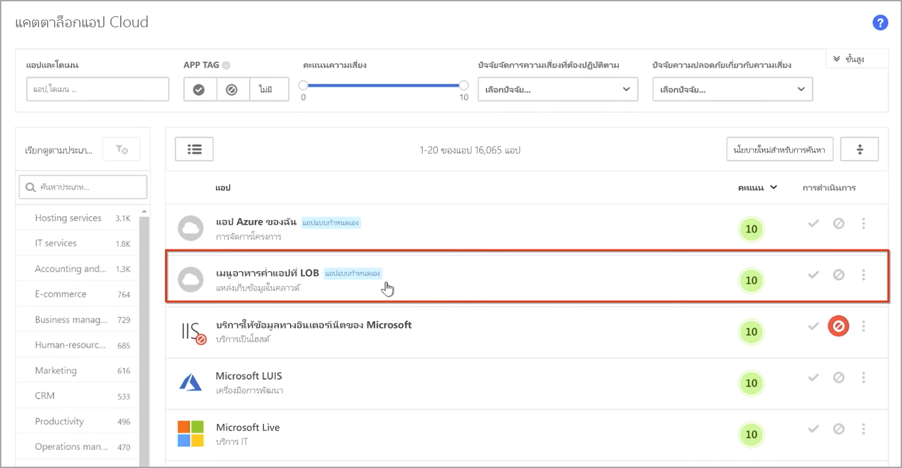
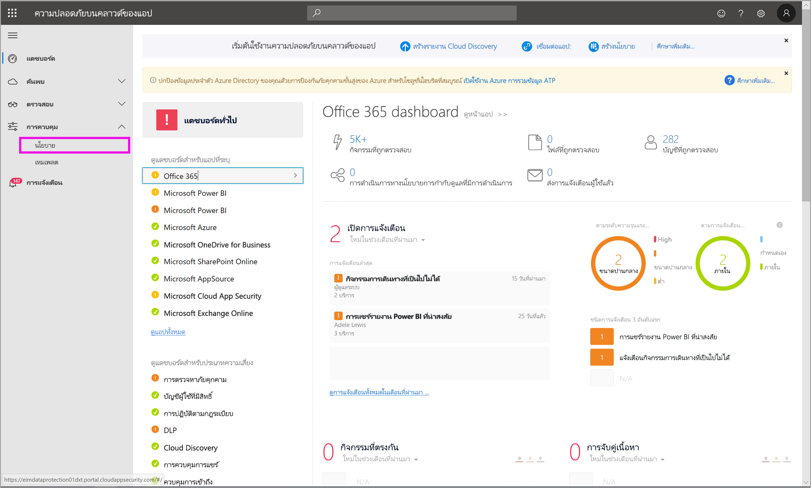
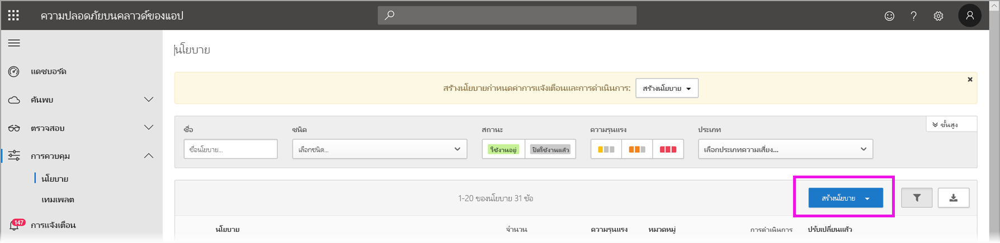
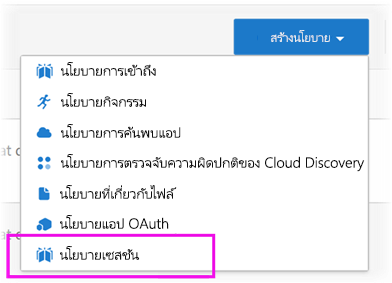
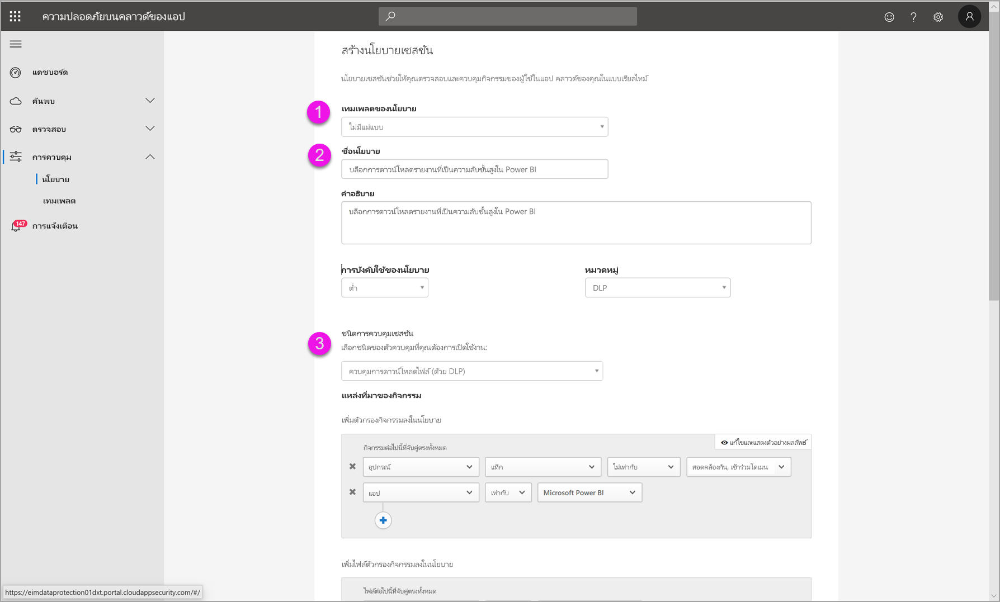
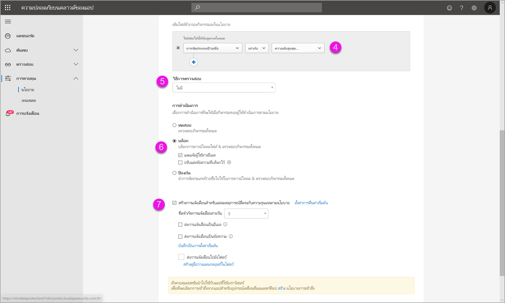
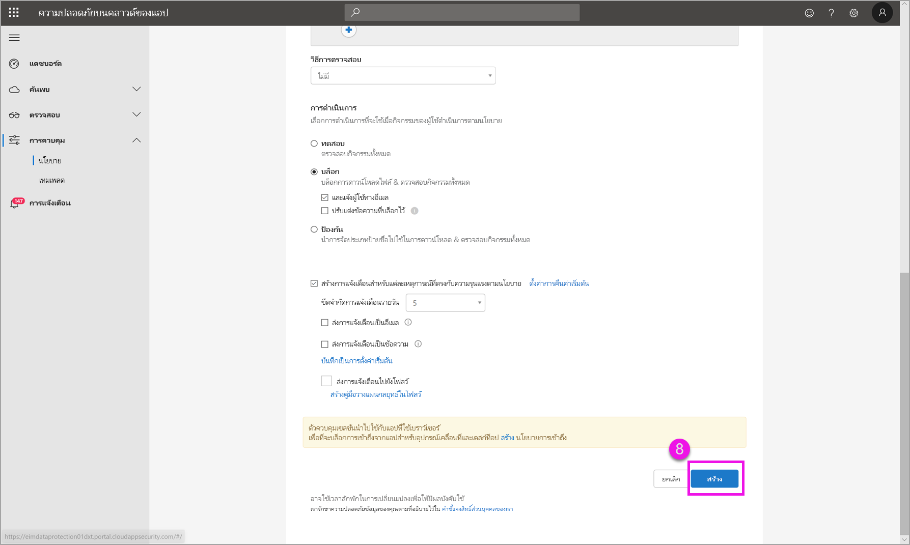

# การใช้ตัวควบคุม Microsoft Cloud App Security ใน Power BI (ตัวอย่าง)

ด้วยการใช้ Microsoft Cloud App Security กับ Power BI คุณสามารถช่วยปกป้องรายงาน ข้อมูล และบริการของ Power BI มิให้รั่วไหลโดยไม่ได้ตั้งใจหรือมิให้ถูกละเมิด ด้วย Cloud App Security คุณสามารถสร้างนโยบายการเข้าถึงตามเงื่อนไขสำหรับข้อมูลขององค์กรโดยใช้ตัวควบคุมเซสชันแบบเรียลไทม์ใน Azure Active Directory (Azure AD) ซึ่งช่วยให้มั่นใจได้ว่าการวิเคราะห์ Power BI ของคุณมีความปลอดภัย หลังจากที่มีการกำหนดนโยบายเหล่านี้ ผู้ดูแลระบบสามารถตรวจสอบการเข้าถึงและกิจกรรมของผู้ใช้ ทำการวิเคราะห์ความเสี่ยงแบบเรียลไทม์ และตั้งค่าตัวควบคุมเฉพาะป้ายชื่อได้ 

คุณสามารถกำหนดค่า Microsoft Cloud App Security สำหรับแอปและบริการทุกประเภท ไม่ใช่เพียงแค่ Power BI เท่านั้น Cloud App Security คือบริการของ Microsoft ที่ปกป้องแอปและอุปกรณ์และสามารถจัดการผ่านแดชบอร์ดของตนเองได้ คุณจะต้องกำหนดค่า Cloud App Security ในการทำงานกับ Power BI เพื่อใช้ประโยชน์จากการคุ้มครอง Cloud App Security สำหรับข้อมูล Power BI และการวิเคราะห์ของคุณ สำหรับข้อมูลเพิ่มเติมเกี่ยวกับ Cloud App Security รวมถึงภาพรวมของวิธีการทำงาน แดชบอร์ด และคะแนนความเสี่ยงของแอป ให้ดูเอกสารประกอบ [Microsoft Cloud App Security](https://docs.microsoft.com/cloud-app-security/)

## การใช้ Microsoft Cloud App Security กับ Power BI

ในการใช้ Microsoft Cloud App Security กับ Power BI คุณต้องใช้และกำหนดค่าบริการการรักษาความปลอดภัยของ Microsoft ที่เกี่ยวข้อง ซึ่งบางรายการถูกตั้งค่าไว้นอก Power BI

### สิทธิ์การใช้งาน Microsoft Cloud App Security 

เพื่อให้มี Microsoft Cloud App Security ในผู้เช่าของคุณ คุณต้องมีสิทธิ์การใช้งานต่อไปนี้:
* MCAS: มีความสามารถของ OCAS สำหรับแอปที่สนับสนุนทั้งหมด ส่วนหนึ่งของชุดโปรแกรม EMS E5 และ M365 E5 
* CAS-D: มีเฉพาะ MCAS Discovery เท่านั้น
* OCAS: มีความสามารถของ MCAS สำหรับ Office 365 เท่านั้น ส่วนหนึ่งของชุดโปรแกรม Office E5
* ทางเลือก: AAD P1 และ AIP P1 เพื่อใช้ประโยชน์จากความสามารถของ Microsoft Cloud App Security หลัก

หัวข้อต่อไปนี้อธิบายขั้นตอนสำหรับการใช้ Microsoft Cloud App Security ใน Power BI

### กำหนดนโยบายสำหรับเซสชันใน Azure Active Directory (จำเป็น)
ขั้นตอนที่จำเป็นในการตั้งค่าตัวควบคุมเซสชันจะเสร็จสมบูรณ์ในพอร์ทัล Azure AD และ Microsoft Cloud App Security ในพอร์ทัล Azure AD คุณสามารถสร้างนโยบายการเข้าถึงแบบมีเงื่อนไขสำหรับ Power BI และเซสชันเส้นทางที่ใช้ใน Power BI ผ่านทางบริการของ Microsoft Cloud App Security 

Microsoft Cloud App Security ทำงานโดยใช้สถาปัตยกรรมพร็อกซีแบบย้อนกลับ และรวมเข้ากับการเข้าถึงแบบมีเงื่อนไขของ Azure AD เพื่อตรวจสอบกิจกรรมผู้ใช้ Power BI แบบเรียลไทม์ ขั้นตอนต่อไปนี้มีไว้เพื่อช่วยให้คุณเข้าใจกระบวนการ และมีคำแนะนำโดยละเอียดทีละขั้นตอนในเนื้อหาที่เชื่อมโยงในแต่ละขั้นตอนต่อไปนี้ นอกจากนี้ คุณยังสามารถอ่านบทความ [Cloud App Security](https://docs.microsoft.com/cloud-app-security/proxy-deployment-aad) ที่อธิบายถึงกระบวนการทั้งหมดได้

1.  [สร้างนโยบายการทดสอบการเข้าถึงแบบมีเงื่อนไขของ Azure AD](https://docs.microsoft.com/cloud-app-security/proxy-deployment-aad#add-azure-ad)
2.  [ลงชื่อเข้าใช้แต่ละแอปโดยผู้ใช้ที่ระบุไว้ในนโยบาย](https://docs.microsoft.com/cloud-app-security/proxy-deployment-aad#sign-in-scoped)
3.  [ตรวจสอบว่าแอปจะได้รับการกำหนดค่าให้ใช้ตัวควบคุมการเข้าถึงและเซสชันหรือไม่](https://docs.microsoft.com/cloud-app-security/proxy-deployment-aad#portal)
4.  [ทดสอบการใช้งาน](https://docs.microsoft.com/cloud-app-security/proxy-deployment-aad#step-4-test-the-deployment)

กระบวนการสำหรับการตั้งค่านโยบายเซสชันมีการอธิบายรายละเอียดไว้ในบทความ[นโยบายเซสชัน](https://docs.microsoft.com/cloud-app-security/session-policy-aad) 

### ตั้งค่านโยบายการตรวจจับความผิดปกติเพื่อตรวจสอบกิจกรรม PBI (แนะนำ)
คุณสามารถกำหนดนโยบายการตรวจจับความผิดปกติของ Power BI ที่สามารถกำหนดขอบเขตได้อย่างอิสระ เพื่อที่จะปรับใช้เฉพาะกับผู้ใช้และกลุ่มที่คุณต้องการรวมและไม่รวมในนโยบายเท่านั้น [เรียนรู้เพิ่มเติม](https://docs.microsoft.com/cloud-app-security/anomaly-detection-policy#scope-anomaly-detection-policies)

Cloud App Security ยังมีฟังก์ชันการตรวจจับภายในแบบเฉพาะสองแบบสำหรับ Power BI [ดูส่วนในภายหลังในเอกสารนี้สำหรับรายละเอียด](#built-in-microsoft-cloud-app-security-detections-for-power-bi).

### ใช้ป้ายชื่อระดับความลับ Microsoft Information Protection (แนะนำ)

ป้ายชื่อระดับความลับช่วยให้คุณสามารถจัดประเภทและช่วยปกป้องเนื้อหาที่สำคัญได้ เพื่อให้บุคลากรในองค์กรของคุณสามารถทำงานร่วมกับคู่ค้าภายนอกองค์กรของคุณได้ แต่ยังคงระมัดระวังและตระหนักถึงเนื้อหาและข้อมูลที่เป็นความลับ 

คุณสามารถอ่านบทความเกี่ยวกับ[ป้ายชื่อระดับความลับใน Power BI](../collaborate-share/service-security-apply-data-sensitivity-labels.md) ซึ่งจะมีรายละเอียดเกี่ยวกับกระบวนการของการใช้ป้ายชื่อระดับความลับสำหรับ Power BI. ดูด้านล่างสำหรับ[ตัวอย่างของนโยบาย Power BI ตามป้ายชื่อระดับความลับ](#example).

## ฟังก์ชันการตรวจจับที่มีอยู่ภายใน Microsoft Cloud App Security สำหรับ Power BI

ฟังก์ชันการตรวจจับของ Microsoft Cloud App Security ช่วยให้ผู้ดูแลระบบสามารถตรวจสอบกิจกรรมที่เฉพาะเจาะจงของแอปที่ตรวจสอบได้ สำหรับ Power BI ขณะนี้มีฟังก์ชันการตรวจจับภายในแบบเฉพาะของ Cloud App Security อยู่สองแบบ: 

* **การแชร์ที่น่าสงสัย** – ตรวจจับเมื่อผู้ใช้แชร์รายงานที่มีความสำคัญกับอีเมลที่ไม่คุ้นเคย (ภายนอกไปยังองค์กร) รายงานที่สำคัญคือรายงานที่มีป้ายชื่อระดับความลับ ซึ่งตั้งค่าเป็น **สำหรับใช้ภายในเท่านั้น** หรือสูงกว่า 

* **การแชร์รายงานจำนวนมาก** – ตรวจจับเมื่อผู้ใช้แชร์รายงานที่แตกต่างกันเป็นจำนวนมากในเซสชันเดียว

การตั้งค่าสำหรับการตรวจจับเหล่านี้จะได้รับการกำหนดค่าในพอร์ทัล Cloud App Security [เรียนรู้เพิ่มเติม](https://docs.microsoft.com/cloud-app-security/anomaly-detection-policy#unusual-activities-by-user) 

## บทบาทผู้ดูแลระบบ Power BI ใน Microsoft Cloud App Security

บทบาทใหม่ถูกสร้างขึ้นสำหรับผู้ดูแลระบบ Power BI เมื่อใช้ Microsoft Cloud App Security กับ Power BI เมื่อคุณเข้าสู่ระบบในฐานะผู้ดูแลระบบ Power BI ไปยัง [พอร์ทัล Cloud App Security](https://portal.cloudappsecurity.com/) คุณมีสิทธิ์การเข้าถึงแบบจำกัดในข้อมูลที่เกี่ยวข้องกับ Power BI การแจ้งเตือน ผู้ใช้ที่มีความเสี่ยง บันทึกกิจกรรม และข้อมูลอื่น ๆ

## ข้อควรพิจารณาและข้อจำกัด 
การใช้ Cloud App Security กับ Power BI ได้รับการออกแบบมาเพื่อช่วยรักษาความปลอดภัยเนื้อหาและข้อมูลขององค์กรของคุณด้วยฟังก์ชันการตรวจจับที่ตรวจสอบเซสชันของผู้ใช้และกิจกรรมของพวกเขา เมื่อใช้ Cloud App Security กับ Power BI มีข้อจำกัดและข้อพิจารณาบางอย่างที่คุณควรจำไว้:

* Microsoft Cloud App Security สามารถใช้งานได้เฉพาะบนไฟล์ Excel, PowerPoint และ PDF เท่านั้น
* ถ้าคุณต้องการใช้ความสามารถของป้ายชื่อระดับความลับในนโยบายเซสชันของคุณสำหรับ Power BI คุณจำเป็นต้องมีสิทธิ์การใช้งานของ Azure Information Protection Premium P1 หรือ Premium P2 สามารถซื้อ Microsoft Azure Information Protection แบบสแตนด์อโลนหรือผ่านหนึ่งในชุดโปรแกรมสิทธิ์การใช้งานของ Microsoft ได้ ดู [การกำหนดราคา Azure Information Protection](https://azure.microsoft.com/pricing/details/information-protection/) สำหรับรายละเอียด นอกจากนี้ ป้ายชื่อระดับความลับจะต้องถูกนำไปใช้กับสินทรัพย์ Power BI ของคุณ
* การควบคุมเซสชันนั้นพร้อมใช้งานสำหรับเบราว์เซอร์ใด ๆ ในแพลตฟอร์มหลักบนระบบปฏิบัติการใด ๆ เราแนะนำให้ใช้ Internet Explorer 11, Microsoft Edge (ล่าสุด), Google Chrome (ล่าสุด), Mozilla Firefox (ล่าสุด) หรือ Apple Safari (ล่าสุด) การเรียกใช้ API สาธารณะของ Power BI และเซสชันที่ไม่ใช่เบราว์เซอร์อื่น ๆ ไม่ได้รับการสนับสนุน เนื่องจากเป็นส่วนหนึ่งของตัวควบคุมเซสชันของ Microsoft Cloud App Security [ดูรายละเอียดเพิ่มเติม](https://docs.microsoft.com/cloud-app-security/proxy-intro-aad#supported-apps-and-clients)

> [!CAUTION]
> * ปัจจุบัน นโยบาย*การตรวจสอบเนื้อหา*ใน Microsoft Cloud App Security ไม่สามารถใช้งานได้ใน Power BI เมื่อใช้นโยบายไฟล์ Excel ดังนั้นอย่าตั้งค่านโยบายนี้สำหรับ Power BI
> * ในนโยบายเซสชันในส่วน "การดำเนินการ" ความสามารถในการ "ป้องกัน" จะใช้ได้เฉพาะในกรณีที่ไม่มีป้ายชื่ออยู่ในรายการเท่านั้น ถ้ามีป้ายชื่ออยู่แล้ว การดำเนินการ "ป้องกัน" จะไม่ถูกนำไปใช้ คุณไม่สามารถแทนที่ป้ายชื่อที่มีอยู่ที่มีการนำไปใช้กับรายการใน Power BI แล้ว

## ตัวอย่าง:

ตัวอย่างต่อไปนี้แสดงวิธีการสร้างนโยบายเซสชันใหม่โดยใช้ Microsoft Cloud App Security กับ Power BI

ก่อนอื่น ให้สร้างนโยบายเซสชันใหม่ เลือก **นโยบาย** จากเมนูด้านซ้ายในพอร์ทัล **Cloud App Security**

ในหน้าต่างที่ปรากฏขึ้น เลือกเมนูดรอปดาวน์ **สร้างนโยบาย**

จากรายการของตัวเลือกในเมนูดรอปดาวน์ ให้เลือก**นโยบายเซสชัน**.

ในหน้าต่างที่ปรากฏขึ้น ให้สร้างนโยบายเซสชัน ขั้นตอนที่เป็นตัวเลขจะอธิบายการตั้งค่าสำหรับภาพต่อไปนี้

  1. ในเมนูดรอปดาวน์**แม่แบบนโยบาย** ให้เลือก*ไม่มีแม่แบบ*.
  2. สำหรับกล่อง**ชื่อนโยบาย** ใส่ชื่อที่เกี่ยวข้องสำหรับนโยบายเซสชันของคุณ
  3. สำหรับ **ชนิดการควบคุมเซสชัน** ให้เลือก*ไฟล์ตัวควบคุมที่ ดาวน์โหลดไว้ (ด้วย DLP)* .

      สำหรับส่วน**แหล่งที่มาของกิจกรรม** ให้เลือกนโยบายการบล็อกที่เกี่ยวข้อง เราขอแนะนำให้บล็อกอุปกรณ์ที่ไม่มีการจัดการและไม่สอดคล้องกัน เลือกบล็อกการดาวน์โหลดเมื่อเซสชันอยู่ใน Power BI

        

        เมื่อคุณเลื่อนลง คุณจะเห็นตัวเลือกเพิ่มเติม รูปภาพต่อไปนี้แสดงตัวเลือกเหล่านั้นพร้อมด้วยตัวอย่างเพิ่มเติม 

  4. เลือก*ป้ายชื่อการรักษาความลับ*เป็น*ความลับสูงสุด* หรือระดับความลับที่เหมาะสมที่สุดสำหรับองค์กรของคุณ
  5. เปลี่ยน**วิธีการตรวจสอบ**เป็น*ไม่มี*.
  6. เลือกตัวเลือก**บล็อก**ที่เหมาะกับความต้องการของคุณ
  7. ตรวจสอบให้แน่ใจว่าคุณได้สร้างการแจ้งเตือนสำหรับการดำเนินการดังกล่าว

        

        

  8. สุดท้าย ตรวจสอบให้แน่ใจว่าคุณเลือกปุ่ม **สร้าง** เพื่อสร้างนโยบายเซสชัน

        

> [!CAUTION]
> ตรวจสอบให้แน่ใจว่าคุณไม่ได้สร้างนโยบาย**การตรวจสอบเนื้อหาของ**ในไฟล์ Excel ของ Power BI ข้อจำกัดนี้เป็นข้อจำกัดที่ทราบกันดีสำหรับการเผยแพร่*ตัวอย่าง*นี้

## ขั้นตอนถัดไป
บทความนี้อธิบายวิธีการที่ Microsoft Cloud App Security สามารถให้ข้อมูลและการป้องกันเนื้อหาสำหรับ Power BI นอกจากนี้ คุณอาจสนใจบทความต่อไปนี้ซึ่งอธิบายการคุ้มครองข้อมูลสำหรับ Power BI และเนื้อหาการสนับสนุนสำหรับบริการ Azure ที่เปิดใช้งาน

* [ภาพรวมของการคุ้มครองข้อมูลใน Power BI](service-security-data-protection-overview.md)
* [เปิดใช้งานป้ายชื่อระดับความลับของข้อมูลใน Power BI](service-security-enable-data-sensitivity-labels.md)
* [ใช้ป้ายชื่อระดับความลับของข้อมูลใน Power BI](../collaborate-share/service-security-apply-data-sensitivity-labels.md)

นอกจากนี้คุณอาจสนใจในบทความเกี่ยวกับ Azure และการรักษาความปลอดภัยต่อไปนี้:

* [ปกป้องแอปด้วยการควบคุมการเข้าถึงแอปแบบมีเงื่อนไข Microsoft Cloud App Security](https://docs.microsoft.com/cloud-app-security/proxy-intro-aad)
* [ปรับใช้การควบคุมการเข้าถึงแอปแบบมีเงื่อนไขสำหรับแอปที่แนะนำ](https://docs.microsoft.com/cloud-app-security/proxy-deployment-aad)
* [นโยบายเซสชัน](https://docs.microsoft.com/cloud-app-security/session-policy-aad)
* [ภาพรวมของป้ายชื่อระดับความลับ](https://docs.microsoft.com/microsoft-365/compliance/sensitivity-labels)
* [รายงานเมตริกการป้องกันข้อมูล](service-security-data-protection-metrics-report.md)