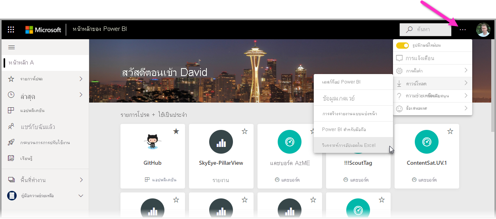
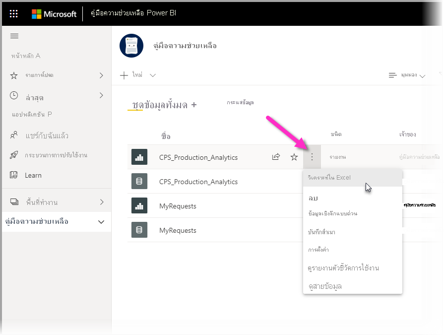
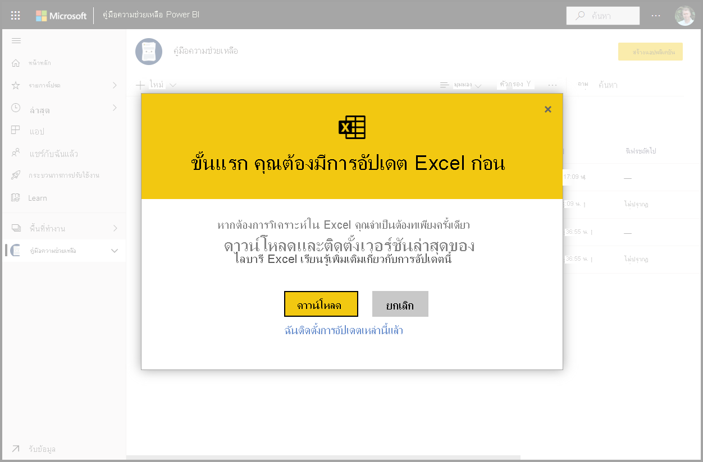
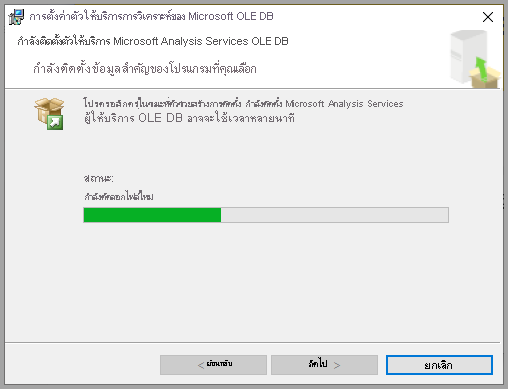
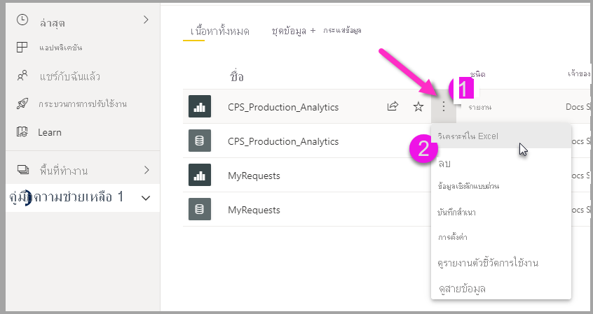
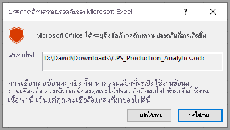
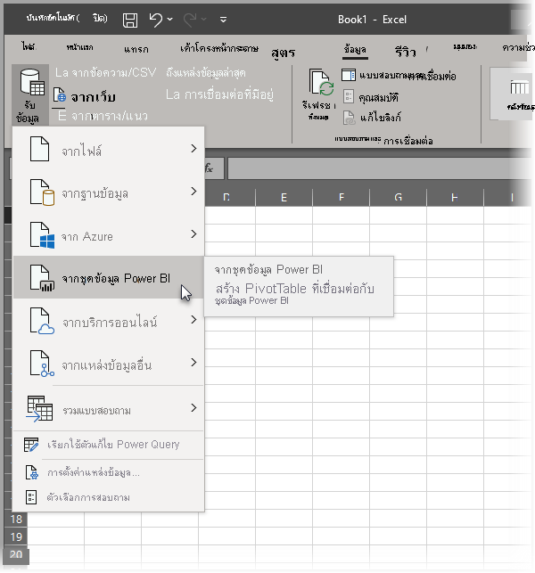

# วิเคราะห์ใน Excel
ด้วย **วิเคราะห์ใน Excel** คุณสามารถนำชุดข้อมูล Power BI เข้าสู่ Excel และจากนั้นดูและโต้ตอบกับชุดข้อมูลเหล่านั้นได้โดยใช้ PivotTables แผนภูมิ แบ่งส่วนข้อมูล และคุณลักษณะอื่นๆ ของ Excel เมื่อต้องการใช้ **วิเคราะห์ใน Excel** ก่อนอื่นคุณต้องดาวน์โหลดคุณลักษณะจาก Power BI ทำการติดตั้ง และจากนั้นจึงเลือกชุดข้อมูลอย่างน้อยหนึ่งชุดเพื่อใช้ใน Excel 

บทความนี้แสดงวิธีการติดตั้งและใช้การวิเคราะห์ใน Excel อธิบายข้อจำกัด จากนั้นจึงทำตามขั้นตอนถัดไป ต่อไปนี้เป็นสิ่งที่คุณจะได้เรียนรู้:

* [ติดตั้งการวิเคราะห์ใน Excel](#install-analyze-in-excel)
* [เชื่อมต่อกับ Power BI](#connect-to-power-bi-data)
* [ใช้ Excel ในการวิเคราะห์ข้อมูล](#use-excel-to-analyze-the-data)
* [การบันทึกและการแชร์เวิร์กบุ๊กของคุณ](#saving-and-sharing-your-new-workbook)
* [ข้อกำหนด](#requirements)

มาสิ เริ่มกระบวนการติดตั้งกันเลย

## ติดตั้งการวิเคราะห์ใน Excel

คุณต้องติดตั้ง **วิเคราะห์ใน Excel** จากลิงก์ที่ให้ไว้ในบริการของ Power BI Power BI ตรวจพบเวอร์ชันของ Excel ที่คุณมีในคอมพิวเตอร์ของคุณ และดาวน์โหลดเวอร์ชันที่เหมาะสม (32-bit หรือ 64-bit) โดยอัตโนมัติ บริการ Power BI ทำงานในเบราว์เซอร์ คุณสามารถลงชื่อเข้าใช้ Power BI โดยใช้ลิงก์ต่อไปนี้:

* [ลงชื่อเข้าใช้ Power BI](https://app.powerbi.com)

หลังจากที่คุณลงชื่อเข้าใช้และบริการของ Power BI ทำงานอยู่ในเบราว์เซอร์ของคุณแล้ว ให้เลือกรายการ **ตัวเลือกเพิ่มเติม**  (...) ที่มุมบนขวาแล้วเลือก **ดาวน์โหลด > อัปเดตการวิเคราะห์ใน Excel** รายการเมนูนี้นำไปใช้กับการติดตั้งการอัปเดตของการวิเคราะห์ใน Excel ใหม่

อีกวิธีหนึ่งคือคุณสามารถนำทางในบริการของ Power BI ไปยังชุดข้อมูลที่คุณต้องการวิเคราะห์ และเลือกรายการ **ตัวเลือกเพิ่มเติม** สำหรับชุดข้อมูล รายงาน หรือรายการ Power BI อื่นๆ จากเมนูที่ปรากฏขึ้น เลือกตัวเลือก **วิเคราะห์ใน Excel** ดังที่แสดงในรูปต่อไปนี้

ไม่ว่าจะด้วยวิธีใด Power BI จะตรวจสอบว่าคุณมีการวิเคราะห์ใน Excel ติดตั้งอยู่หรือไม่ และหากไม่ คุณจะได้รับพร้อมท์เพื่อดาวน์โหลด 

เมื่อคุณเลือกดาวน์โหลด Power BI จะตรวจสอบเวอร์ชันของ Excel ที่คุณได้ติดตั้ง และดาวน์โหลดเวอร์ชันที่เหมาะสมของตัวติดตั้งการวิเคราะห์ใน Excel คุณจะเห็นสถานะการดาวน์โหลดที่ด้านล่างของเบราว์เซอร์ของคุณ หรือที่ใดก็ตามที่เบราว์เซอร์ของคุณแสดงความคืบหน้าการดาวน์โหลด 

เมื่อการดาวน์โหลดเสร็จสมบูรณ์ ให้เรียกใช้ตัวติดตั้ง (.msi) เพื่อติดตั้งการวิเคราะห์ใน Excel ชื่อของกระบวนการติดตั้งแตกต่างจากการวิเคราะห์ใน Excel โดยชื่อจะเป็น **Microsoft Analysis Services OLE DB Provide** ดังที่แสดงในรูปต่อไปนี้ หรืออาจเป็นชื่ออื่นที่คล้ายกัน

เมื่อเสร็จสมบูรณ์แล้ว คุณก็พร้อมที่จะเลือกรายงานในบริการของ Power BI (หรือองค์ประกอบข้อมูล Power BI อื่นๆ เช่นชุดข้อมูล) จากนั้นทำการวิเคราะห์ใน Excel

## เชื่อมต่อกับข้อมูล Power BI

ในบริการของ Power BI ให้นำทางไปยังชุดข้อมูลหรือรายงานที่คุณต้องการวิเคราะห์ใน Excel และเลือกเมนู **ตัวเลือกเพิ่มเติม** (...) เพื่อค้นหาตัวเลือกเมนู **วิเคราะห์ใน Excel** รูปภาพต่อไปนี้แสดงการเลือกรายงาน

มีขั้นตอนเล็กน้อยในการรับชุดข้อมูลจากบริการของ Power BI ลงใน Excel:

1. เลือกเมนู **ตัวเลือกเพิ่มเติม**
2. เลือก **วิเคราะห์ใน Excel** จากรายการเมนูที่ปรากฏขึ้น

    จากนั้นบริการของ Power BI จะสร้างไฟล์ของชุดข้อมูลที่ได้รับการออกแบบ (และจัดโครงสร้าง) เพื่อใช้กับ **วิเคราะห์ใน Excel** ที่มีนามสกุลไฟล์เป็น .ODC ไฟล์ถูกสร้างขึ้น และจากนั้นจะเริ่มกระบวนการดาวน์โหลดในเบราว์เซอร์ของคุณโดยอัตโนมัติ
    
    
    
    ชื่อไฟล์ตรงกับชุดข้อมูล (หรือรายงาน หรือแหล่งข้อมูลอื่นๆ) จากที่ได้รับมา ดังนั้นถ้ารายงานมีชื่อว่า *Latest-Sales* ไฟล์ที่ดาวน์โหลดมาจะมีชื่อว่า **Latest-Sales.ODC**

3. เปิดไฟล์ .ODC

ไฟล์ถูกเชื่อมโยงกับ **วิเคราะห์ใน Excel** แล้ว ดังนั้นเมื่อคุณเลือกหรือเปิดใช้งานไฟล์ .ODC นั้น Excel จะถูกเปิดใช้งานและเริ่มการโหลดไฟล์ .ODC โดยอัตโนมัติ อย่างไรก็ตาม คุณอาจเห็นคำเตือนเกี่ยวกับภัยคุกคามแหล่งข้อมูลภายนอกปรากฏขึ้น:

เลือก **เปิดใช้งาน** เพื่อโหลด ไฟล์ .ODC สำหรับ **วิเคราะห์ใน Excel** และ Excel จะทำการโหลดไฟล์ 

## ใช้ Excel ในการวิเคราะห์ข้อมูล

เมื่อคุณอนุญาตให้โหลดไฟล์ .ODC โดยการเลือก **เปิดใช้งาน** จากการแจ้งเตือนด้านความปลอดภัยแล้ว Excel จะนำเสนอ **PivotTable** และ **เขตข้อมูล** ที่ว่างเปล่าจากชุดข้อมูล Power BI พร้อมที่จะวิเคราะห์

ไฟล์ .ODC มีสตริงการเชื่อมต่อ MSOLAP ที่เชื่อมต่อกับชุดข้อมูลของคุณใน Power BI เมื่อคุณวิเคราะห์หรือทำงานกับข้อมูลดังกล่าว Excel ร้องขอชุดข้อมูลใน Power BI และส่งกลับผลลัพธ์ไปยัง Excel ถ้าชุดข้อมูลนั้นเชื่อมต่อกับแหล่งข้อมูลสดโดยใช้ DirectQuery, Power BI ร้องขอแหล่งข้อมูลและส่งผลลัพธ์ไปยัง Excel

ด้วยการเชื่อมต่อกับข้อมูลใน Power BI นั้น คุณสามารถสร้าง Pivottable แผนภูมิ และวิเคราะห์ชุดข้อมูลในทำนองเดียวกับที่คุณจะดำเนินการกับชุดข้อมูลภายในเครื่องใน Excel

**วิเคราะห์ใน Excel** มีประโยชน์โดยเฉพาะอย่างยิ่งสำหรับชุดข้อมูลและรายงานที่เชื่อมต่อกับแหล่งข้อมูลดังต่อไปนี้:

* ฐานข้อมูล *แบบตารางบริการการวิเคราะห์* หรือ *แบบหลายมิติ*
* ไฟล์หรือสมุดงาน Excel ใน Power BI Desktop  ที่มีแบบจำลองข้อมูลซึ่งมีหน่วยวัดแบบจำลองที่สร้างขึ้นโดยใช้นิพจน์การวิเคราะห์ข้อมูล (DAX)

> [!IMPORTANT]
> การใช้ **วิเคราะห์ใน Excel** จะแสดงข้อมูลในระดับรายละเอียดทั้งหมดให้กับผู้ใช้ทุกคนที่มีสิทธิ์ในการเข้าถึงชุดข้อมูล

มีหลายสิ่งที่ต้องพิจารณาเมื่อคุณเริ่มใช้การวิเคราะห์ใน Excel ซึ่งอาจต้องมีขั้นตอนเพิ่มเติมหนึ่งหรือสองขั้นตอนในการจัดการ ความเป็นไปได้เหล่านี้จะอธิบายไว้ในส่วนต่อไปนี้ 

### ลงชื่อเข้าใช้ไปยัง Power BI
แม้ว่าคุณลงชื่อเข้าใช้ Power BI แล้วในเบราว์เซอร์ของคุณ ครั้งแรกที่คุณเปิดไฟล์ .ODC ใหม่ใน Excel คุณอาจถูกขอให้ลงชื่อเข้าใช้ Power BI ด้วยบัญชี Power BI ของคุณ ซึ่งขั้นตอนนี้รับรองความถูกต้องการเชื่อมต่อจาก Excel ไปยัง Power BI

### ผู้ใช้ที่มีบัญชี Power BI หลายบัญชี
ผู้ใช้บางรายมีบัญชี Power BI หลายบัญชี หากคุณเป็นคนหนึ่ง คุณอาจลงชื่อเข้าใช้ Power BI ด้วยบัญชีเดียว แต่บัญชีอื่นๆ ของคุณมีการเข้าถึงชุดข้อมูลที่ใช้ในการวิเคราะห์ใน Excel ในกรณีนั้น คุณอาจได้รับการแจ้งข้อผิดพลาด **ห้ามใช้งาน** หรือเข้าสู่ระบบไม่สำเร็จขณะพยายามเข้าถึงชุดข้อมูลที่กำลังใช้ในเวิร์กบุ๊กการวิเคราะห์ใน Excel

หากเกิดขึ้นเช่นนั้น คุณจะมีโอกาสในการลงชื่อเข้าใช้ในอีกครั้งหนึ่ง ซึ่งคุณสามารถลงชื่อเข้าใช้ด้วยบัญชี Power BI ที่มีสิทธิ์เข้าถึงชุดข้อมูลที่กำลังเข้าถึงโดยการวิเคราะห์ใน Excel ได้ คุณยังสามารถเลือกชื่อของคุณในแถบเครื่องมือด้านบนสุดใน Excel ซึ่งระบุบัญชีที่คุณกำลังลงชื่อเข้าใช้ด้วยในปัจจุบัน ลงชื่อออกจากระบบและลงชื่อเข้าใช้อีกครั้งด้วยบัญชีอื่น

## การบันทึกและการแชร์เวิร์กบุ๊กใหม่ของคุณ

คุณสามารถ **บันทึก** เวิร์กบุ๊ก Excel ที่คุณสร้างขึ้นด้วยชุดข้อมูล Power BI ได้เช่นเดียวกับเวิร์กบุ๊กอื่น อย่างไรก็ตาม คุณไม่สามารถเผยแพร่ หรือนำเข้าเวิร์กบุ๊กกลับไปยัง Power BI ได้ เนื่องจากคุณสามารถเผยแพร่หรือนำเข้าสมุดงานไปยัง Power BI ที่มีข้อมูลในตาราง หรือที่มีแบบจำลองข้อมูลได้เท่านั้น เนื่องจากสมุดงานใหม่มีการเชื่อมต่อกับชุดข้อมูลใน Power BI การเผยแพร่หรือนำเข้าไปยัง Power BI จะวนกลับไปกลับมา!

เมื่อบันทึกสมุดงานของคุณแล้ว คุณสามารถแชร์กับผู้ใช้ Power BI อื่นในองค์กรของคุณได้ 

เมื่อผู้ใช้ที่คุณแชร์เวิร์กบุ๊กของคุณด้วยเปิดเวิร์กบุ๊กนั้นขึ้น พวกเขาจะเห็น Pivottable และข้อมูลของคุณตามที่ปรากฏเมื่อคุณบันทึกเวิร์กบุ๊กของคุณครั้งสุดท้าย ซึ่งอาจไม่ใช่ข้อมูลเวอร์ชันล่าสุด เพื่อให้ได้ข้อมูลล่าสุด ผู้ใช้ต้องใช้ปุ่ม**รีเฟรช**บน Ribbon**ข้อมูล** และเนื่องจากเวิร์กบุ๊กกำลังเชื่อมต่อไปยังชุดข้อมูลใน Power BI ผู้ใช้ที่พยายามรีเฟรชเวิร์กบุ๊กต้องลงชื่อเข้าใช้ใน Power BI และติดตั้งการอัปเดต Excel ครั้งแรกที่พวกเขาพยายามที่จะอัปเดตโดยใช้วิธีการนี้

เนื่องจากผู้ใช้ต้องรีเฟรชชุดข้อมูลนั้น และการรีเฟรชสำหรับการเชื่อมต่อภายนอกไม่รองรับอยู่ใน Excel Online ขอแนะนำให้ผู้ใช้เปิดเวิร์กบุ๊กใน Excel เวอร์ชันเดสก์ท็อปบนคอมพิวเตอร์ของผู้ใช้งาน

> [!NOTE]
> ผู้ดูแลระบบสำหรับผู้เช่า Power BI สามารถใช้*พอร์ทัลผู้ดูแลระบบของ Power BI*เพื่อปิดใช้งาน**วิเคราะห์ใน Excel**ที่มีชุดข้อมูลภายในองค์กรที่ถูกติดตั้งในฐานข้อมูล Analysis Services (AS) ได้ เมื่อตัวเลือกนั้นถูกปิดใช้งาน **วิเคราะห์ใน Excel**ถูกปิดใช้งานสำหรับฐานข้อมูล AS แต่ยังคงพร้อมใช้งานสำหรับการใช้กับชุดข้อมูลอื่น

## วิธีอื่นในการเข้าถึงชุดข้อมูล Power BI จาก Excel
ผู้ใช้ที่มี Office SKU เฉพาะยังสามารถเชื่อมต่อกับชุดข้อมูล Power BI จากภายใน Excel ได้โดยใช้คุณลักษณะ **รับข้อมูล** ใน Excel ถ้า SKU ของคุณไม่รองรับคุณลักษณะนี้ ตัวเลือกเมนู **รับข้อมูล** จะไม่ปรากฏขึ้น

จากเมนูแถบเครื่องมือ **ข้อมูล** เลือก  **รับข้อมูล > จากชุดข้อมูล Power BI** ดังที่แสดงในรูปต่อไปนี้

บานหน้าต่างจะปรากฏขึ้นซึ่งคุณสามารถเรียกดูชุดข้อมูลที่คุณมีสิทธิ์เข้าถึง และดูว่าชุดข้อมูลได้รับการรับรองหรือได้รับการเลื่อนระดับหรือไม่ อีกทั้งพิจารณาว่ามีการใช้ป้ายชื่อการป้องกันข้อมูลกับชุดข้อมูลเหล่านั้นหรือไม่ 

สำหรับข้อมูลเพิ่มเติมเกี่ยวกับการรับข้อมูลลงใน Excel ด้วยวิธีนี้ ดู [สร้าง PivotTable จากชุดข้อมูล Power BI](https://support.office.com/article/31444a04-9c38-4dd7-9a45-22848c666884) ในเอกสารประกอบของ Excel

คุณยังสามารถเข้าถึง **ตารางที่แนะนำ** ใน Excel ได้ ในแกลเลอรี **ชนิดข้อมูล** หากต้องการเรียนรู้เพิ่มเติมเกี่ยวกับตารางที่แนะนำและวิธีการเข้าถึงตารางเหล่านั้น ดู [เข้าถึงตารางที่แนะนำ Power BI ใน Excel (ตัวอย่าง)](service-excel-featured-tables.md)

## ข้อกำหนด
มีสองสามข้อกำหนดสำหรับการใช้**วิเคราะห์ใน Excel**:

* **วิเคราะห์ใน Excel**สนับสนุนสำหรับ Microsoft Excel 2010 SP1 และเวอร์ชั่นที่ใหม่กว่า

* Pivottable ของ Excel ไม่สนับสนุนการรวมที่ลากแล้วปล่อยสำหรับเขตข้อมูลตัวเลข ชุดข้อมูลของคุณใน Power BI *ต้องมีหน่วยวัดที่กำหนดไว้ล่วงหน้า* อ่านเกี่ยวกับ [การสร้างหน่วยวัด](../transform-model/desktop-measures.md)
* บางองค์กรอาจมี Group Policy (นโยบายของทั้งองค์กร) ที่ป้องกันการติดตั้งอัปเดต**วิเคราะห์ใน Excel**ที่จำเป็นไปยัง Excel ถ้าคุณไม่สามารถติดตั้งการอัปเดตได้ โปรดตรวจสอบกับผู้ดูแลระบบของคุณ
* **วิเคราะห์ใน Excel** ต้องการให้ชุดข้อมูลใน Power BI Premium หรือที่ว่าผู้ใช้มีใบอนุญาต Power BI Pro เมื่อต้องการเรียนรู้เพิ่มเติมเกี่ยวกับความแตกต่างในฟังก์ชันการทำงานระหว่างสิทธิ์ในการใช้ Power BI แบบต่างๆ ดูที่ _การเปรียบเทียบคุณลักษณะ Power BI_[ตามราคา](https://powerbi.microsoft.com/pricing/)
* ผู้ใช้สามารถเชื่อมต่อกับชุดข้อมูลผ่าน Analyze ใน Excel หากพวกเขามีสิทธิสำหรับชุดข้อมูลพื้นฐาน  ผู้ใช้สามารถมีสิทธินี้ได้หลายแนวทาง เช่น การมีบทบาทสมาชิกในพื้นที่ทำงานที่มีชุดข้อมูล มีรายงานหรือแดชบอร์ดที่แชร์กับพวกเขาที่ใช้ชุดข้อมูลดังกล่าว หรือมีสิทธิในการสร้างสำหรับชุดข้อมูลในพื้นที่ทำงานหรือแอปที่มีชุดข้อมูล อ่านเพิ่มเติมเกี่ยวกับ[สิทธิในการสร้าง](../connect-data/service-datasets-build-permissions.md)สำหรับชุดข้อมูล
* ผู้ใช้ที่เป็นผู้เยี่ยมชมไม่สามารถใช้ **วิเคราะห์ใน Excel** สำหรับชุดข้อมูลที่ส่งจาก (มีที่มาจาก) ผู้เช่ารายอื่น 
* **Analyze ใน Excel** เป็นคุณลักษณะบริการของ Power BI และไม่พร้อมใช้งานในเซิร์ฟเวอร์รายงาน Power BI หรือ Power BI Embedded 
* **Analyze ใน Excel** รองรับเฉพาะในคอมพิวเตอร์ที่ติดตั้ง Microsoft Windows

สำหรับผู้ใช้ที่ต้องการถอนการติดตั้งคุณลักษณะ **วิเคราะห์ใน Excel** คุณสามารถทำได้โดยใช้การตั้งค่าระบบ **เพิ่มหรือลบโปรแกรม** ในคอมพิวเตอร์ Windows ของคุณ

## การแก้ไขปัญหา
อาจมีบางครั้งที่เมื่อคุณใช้การวิเคราะห์ใน Excel คุณได้รับผลลัพธ์ที่ไม่คาดคิดหรือลักษณะการทำงานไม่ทำงานตามที่คุณคาดไว้ [หน้านี้เสนอโซลูชันสำหรับปัญหาทั่วไปเมื่อใช้การวิเคราะห์ใน Excel](desktop-troubleshooting-analyze-in-excel.md)

## ขั้นตอนถัดไป

คุณอาจสนใจบทความต่อไปนี้:

* [ใช้ตัวเจาะเข้าถึงรายละเอียดข้ามรายงานใน Power BI Desktop](../create-reports/desktop-cross-report-drill-through.md)
* [การใช้ตัวแบ่งส่วนข้อมูล Power BI Desktop](../visuals/power-bi-visualization-slicers.md)
* [การแก้ไขปัญหาการวิเคราะห์ใน Excel](desktop-troubleshooting-analyze-in-excel.md)
* [เข้าถึงตารางที่แนะนำของ Power BI ใน Excel (ตัวอย่าง)](service-excel-featured-tables.md)

