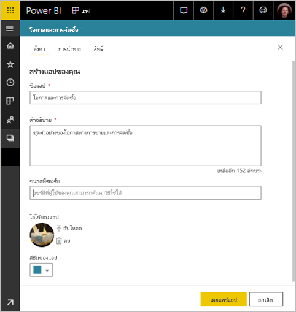

# เผยแพร่แอปใน Power BI

ใน Power BI คุณสามารถสร้างเนื้อหาที่รวมเป็นแพคเกจอย่างเป็นทางการ จากนั้นแจกจ่ายให้กับผู้รับที่กว้างขวางเป็น*แอป*ได้ คุณสร้างแอปใน*พื้นที่ทำงาน* ที่ซึ่งคุณสามารถทำงานร่วมกันบนเนื้อหาของ Power BI กับเพื่อนร่วมงานของคุณ จากนั้น คุณสามารถเผยแพร่แอปที่เสร็จแล้วไปยังกลุ่มบุคคลขนาดใหญ่ต่างๆ ในองค์กรของคุณ 

ผู้ใช้ทางธุรกิจของคุณจำเป็นต้องมีหลายแดชบอร์ดและรายงาน Power BI เพื่อการบริหารธุรกิจของตน ด้วยแอป Power BI คุณสามารถสร้างคอลเลกชันของแดชบอร์ดและรายงาน และเผยแพร่คอลเล็กชันเหล่านี้เป็นแอปเหล่านี้ไปยังองค์กรของคุณ หรือไปยังบุคคลหรือกลุ่มที่เฉพาะเจาะจงได้ หากคุณเป็นผู้สร้างรายงานหรือผู้ดูแลระบบ แอปจะช่วยให้คุณจัดการสิทธิ์บนคอลเลกชันเหล่านี้ได้ง่ายขึ้น

ผู้ใช้ทางธุรกิจจะได้รับแอปของคุณในสองสามวิธีที่แตกต่างกัน

- พวกเขาสามารถค้นหาและติดตั้งแอปจาก Microsoft AppSource ได้
- คุณสามารถส่งลิงก์โดยตรงให้กับพวกเขาได้
- คุณสามารถติดตั้งแอปโดยอัตโนมัติในบัญชี Power BI ของเพื่อนร่วมงานของคุณถ้าผู้ดูแลระบบ Power BI ของคุณให้สิทธิ์คุณ
- Power BI จะไม่ส่งอีเมลไปยังผู้ใช้ภายในเมื่อคุณเผยแพร่หรืออัปเดตแอป ถ้าคุณเผยแพร่ไปยังผู้ใช้ภายนอก ผู้ใช้เหล่านั้นจะได้รับอีเมลที่มีลิงก์โดยตรง 

คุณสามารถสร้างแอปที่มีการนำทางภายในตัว เพื่อให้ผู้ใช้ของคุณสามารถค้นหาวิธีการใช้เนื้อหาของคุณได้อย่างง่ายดาย พวกเขาไม่สามารถปรับเปลี่ยนเนื้อหาของแอปได้ พวกเขาสามารถโต้ตอบกับเนื้อหาของแอปในบริการ Power BI หรือในแอปสำหรับอุปกรณ์เคลื่อนที่- – ด้วยการกรอง เน้น และเรียงลำดับข้อมูลด้วยตนเอง พวกเขาจะได้รับอัปเดตโดยอัตโนมัติ และคุณสามารถควบคุมความถี่ในการรีเฟรชข้อมูลได้ คุณยังสามารถให้สิทธิ์การสร้างเพื่อเชื่อมต่อกับชุดข้อมูลพื้นฐานและสร้างสำเนาของรายงานในแอปได้ อ่านเพิ่มเติมเกี่ยวกับ[สิทธิในการสร้าง](../connect-data/service-datasets-build-permissions.md)

## สิทธิ์การใช้งานสำหรับแอปฯ
คุณต้องมีสิทธิการใช้งาน Power BI Pro เพื่อสร้างหรืออัปเดตแอป สำหรับ*ผู้ใช้แอป* มีสองตัวเลือก

* **ตัวเลือก 1** พื้นที่ใช้งานสำหรับแอปนี้*ไม่*อยู่ใน Power BI ความจุระดับพรีเมียม: ผู้ใช้ทางธุรกิจทุกคนต้องมีใบอนุญาต Power BI Pro เพื่อดูแอปของคุณ 
* **ตัวเลือก 2** พื้นที่ใช้งานสำหรับแอปนี้*อยู่*ใน Power BI ความจุระดับพรีเมียม: ผู้ใช้ทางธุรกิจที่ไม่มีใบอนุญาต Power BI Pro ในองค์กรของคุณสามารถดูเนื้อหาแอปได้ อย่างไรก็ตาม พวกเขาไม่สามารถทำสำเนารายงาน หรือสร้างรายงานที่ยึดตามชุดข้อมูลพื้นฐานได้ อ่าน[Power BI Premium คืออะไร](../admin/service-premium-what-is.md)สำหรับรายละเอียด

## เผยแพร่แอปฯของคุณ
เมื่อแดชบอร์ดและรายงานในพื้นที่ทำงานของคุณพร้อม คุณสามารถเลือกแดชบอร์ดและรายงานที่คุณต้องการเผยแพร่ แล้วเผยแพร่สิ่งดังกล่าวในฐานะเป็นแอปหนึ่ง 

1. ในมุมมองรายการพื้นที่ทำงาน ตัดสินใจเลือกแดชบอร์ดและรายงานที่คุณต้องการให้**รวมอยู่ในแอป**

    

    ถ้าคุณเลือกที่จะไม่รวมรายงานที่มีแดชบอร์ดที่เกี่ยวข้อง คุณจะเห็นคำเตือนถัดจากรายงาน คุณยังสามารถเผยแพร่แอปนั้นได้ แต่แดชบอร์ดที่เกี่ยวข้องจะไม่มีไทล์จากรายงานนั้น

    

2. เลือกปุ่ม**เผยแพร่แอป**ที่มุมบนขวาเพื่อเริ่มกระบวนการของการสร้างและเผยแพร่แอปจากพื้นที่ทำงานนั้น
   
    

3. บน**การตั้งค่า** กรอกข้อมูลชื่อและคำอธิบายเพื่อช่วยให้ผู้คนค้นพบแอป คุณสามารถตั้งค่าสีธีมเพื่อปรับแต่ง คุณยังสามารถเพิ่มลิงก์ไปยังไซต์ฝ่ายสนับสนุน
   
    

4. บน**การนำทาง** คุณเลือกเนื้อหาเผยแพร่เป็นส่วนหนึ่งของแอป จากนั้นคุณสามารถเพิ่มการนำทางของแอปเพื่อจัดระเบียบเนื้อหาในส่วนต่าง ๆ ดู[ออกแบบประสบการณ์การนำทางสำหรับแอปของคุณ](#design-the-navigation-experience)ในบทความนี้สำหรับรายละเอียด
   
    

5. บน**สิทธิ** ตัดสินใจว่าใครสามารถเข้าถึงแอป และสิ่งที่พวกเขาสามารถทำได้ในแอป 

    - ใน[พื้นที่ทำงานแบบคลาสสิก](service-create-workspaces.md): ทุกคนในองค์กรของคุณ บุคคลที่เฉพาะเจาะจง หรือกลุ่มความปลอดภัยของ Azure Active Directory (Azure AD)
    - ใน[พื้นที่ทำงานประสบการณ์ใหม่](service-create-the-new-workspaces.md): บุคคลที่เฉพาะเจาะจง กลุ่มความปลอดภัย Azure AD และรายการการแจกจ่าย และกลุ่ม Office 365 ผู้ใช้พื้นที่ทำงานทั้งหมดจะมีสิทธิ์การเข้าถึงแอปสำหรับพื้นที่ทำงานโดยอัตโนมัติ
    - คุณสามารถอนุญาตให้ผู้ใช้แอปเชื่อมต่อกับชุดข้อมูลเบื้องต้นของแอปโดยให้สิทธิ์การสร้างแก่พวกเขา พวกเขาจะเห็นชุดข้อมูลเหล่านี้เมื่อพวกเขากำลังค้นหาชุดข้อมูลที่แชร์อยู่ อ่านเพิ่มเติมเกี่ยวกับ [การอนุญาตให้ผู้ใช้เชื่อมต่อกับชุดข้อมูลของแอป](#allow-users-to-connect-to-datasets) ในบทความนี้
    - ผู้ใช้ที่มีสิทธิ์การสร้างสามารถมีสิทธิ์ในการทำสำเนารายงานจากแอปนี้ไปยังพื้นที่ทำงานอื่นด้วย อ่านเพิ่มเติมเกี่ยวกับ [การอนุญาตให้ผู้ใช้ทำสำเนารายงานในแอป](#allow-users-to-copy-reports) ในบทความนี้
    
    >[!IMPORTANT]
    >ถ้าแอปของคุณใช้ชุดข้อมูลจากพื้นที่ทำงานอื่น ถือเป็นความรับผิดชอบของคุณในการตรวจสอบให้แน่ใจว่า ผู้ใช้แอปทั้งหมดมีสิทธิ์เข้าถึงชุดข้อมูลเบื้องต้นได้
    >

6. คุณสามารถติดตั้งแอปโดยอัตโนมัติสำหรับผู้รับ ถ้าผู้ดูแลระบบ Power BI ของคุณเปิดใช้งานการตั้งค่านี้สำหรับคุณในพอร์ทัลผู้ดูแลระบบ Power BI อ่านเพิ่มเติมเกี่ยวกับ[การติดตั้งแอปโดยอัตโนมัติ](#automatically-install-apps-for-end-users)ในบทความนี้

    

7. เมื่อคุณเลือก**เผยแพร่แอป** คุณจะเห็นข้อความยืนยันว่าแอปพร้อมสำหรับการเผยแพร่แล้ว ในกล่องโต้ตอบ**แชร์แอปนี้** คุณสามารถคัดลอก URL ที่เป็นลิงก์โดยตรงกับแอปนี้ได้
   
    

คุณสามารถส่งลิงก์โดยตรงไปยังผู้ที่คุณต้องการแชร์ด้วย หรือพวกเขาสามารถค้นหาแอปของคุณจากแท็บ Apps โดยไปที่**ดาวน์โหลด และสำรวจแอปเพิ่มเติมจาก AppSource** อ่านเพิ่มเติมเกี่ยวกับการ[ประสบการณ์การใช้งานแอปฯสำหรับผู้ใช้ทางธุรกิจ](../consumer/end-user-apps.md)

## เปลี่ยนแอปฯที่คุณเผยแพร่
หลังจากที่คุณเผยแพร่แอปฯ คุณอาจต้องการเปลี่ยนแปลงหรือปรับปรุงแอปฯนั้น การอัปเดตเป็นเรื่องง่ายถ้าคุณเป็นผู้ดูแลระบบหรือเป็นสมาชิกในพื้นที่ทำงานใหม่ 

1. เปิดพื้นที่ทำงานที่สอดคล้องกับแอปฯดังกล่าว 
   
    

2. ทำการเปลี่ยนแปลงที่คุณต้องการในแดชบอร์ดหรือรายงาน
 
    พื้นที่ทำงานป็นพื้นที่ที่คุณจัดเตรียมข้อมูล ดังนั้นการเปลี่ยนแปลงของคุณจะไม่อยู่ในแอปจนกว่าคุณเผยแพร่อีกครั้ง ซึ่งนี่ช่วยให้คุณทำการเปลี่ยนแปลงได้โดยไม่กระทบต่อแอปฯที่เผยแพร่แล้ว  
 
    > [!IMPORTANT]
    > หากคุณลบรายงานและอัปเดตแอปแม้ว่าคุณจะเพิ่มรายงานกลับไปที่แอป ผู้ใช้แอปของคุณจะไม่สามารถแก้ไข/ปรับปรุงตามคำสั่งทั้งหมดได้เช่น บุ๊กมาร์ก ความคิดเห็น ฯลฯ  
 
3. ย้อนกลับไปยังรายการพื้นที่ทำงานของเนื้อหาและเลือก**อัปเดตแอป**ในมุมบนขวา
   
1. อัปเดต**ตั้งค่า** **การนำทาง**และ**สิทธิ**ถ้าคุณจำเป็นต้องทำ จากนั้นเลือก**อัปเดตแอป**
   
บุคคลที่คุณได้เผยแพร่แอปฯด้วยนั้นจะเห็นแอปฯเวอร์ชั่นที่อัปเดตโดยอัตโนมัติ 

## ออกแบบประสบการณ์การนำทาง
ตัวเลือก**ตัวสร้างการนำทางใหม่** ช่วยให้คุณสามารถสร้างการนำทางแบบกำหนดเองสำหรับแอปของคุณ การนำทางแบบกำหนดเองทำให้ง่ายขึ้นสำหรับผู้ใช้ในการค้นหาและใช้เนื้อหาในแอป แอปที่มีอยู่มีการปิดใช้งานตัวเลือกนี้และแอปใหม่จะถูกเปิดใช้งานโดยค่าเริ่มต้น

เมื่อปิดตัวเลือกอยู่ คุณสามารถเลือก**หน้าเริ่มต้นของแอป**เพื่อเป็น**เนื้อหาที่เฉพาะเจาะจง**เช่น แดชบอร์ดหรือรายงาน หรือเลือก**ไม่มี**เพื่อแสดงรายการพื้นฐานของเนื้อหาสำหรับผู้ใช้

เมื่อคุณเปิดใช้งาน**ตัวสร้างการนำทางใหม่** คุณสามารถออกแบบการนำทางแบบกำหนดเองได้ ตามค่าเริ่มต้น รายงาน แดชบอร์ด และสมุดงาน Excel ทั้งหมดที่คุณใส่ไว้ในแอปจะแสดงรายการเป็นรายการแบบแฟลต 

คุณสามารถแก้ไข/ปรับปรุงการนำทางแอปเพิ่มเติมได้โดย:

* การจัดเรียงรายการใหม่โดยใช้ลูกศรขึ้น/ลง 
* การเปลี่ยนชื่อรายการใน**รายละเอียดรายงาน** **รายละเอียดแดชบอร์ด** และ**รายละเอียดสมุดงาน**
* การซ่อนรายการบางอย่างจากการนำทาง
* การใช้ตัวเลือก**ใหม่**เพื่อเพิ่ม**หัวข้อ**ในกลุ่มเนื้อหาที่เกี่ยวข้อง
* การใช้ตัวเลือก**ใหม่**เพื่อเพิ่ม**ลิงก์**ไปยังทรัพยากรภายนอกสำหรับบานหน้าต่างนำทาง 

เมื่อคุณเพิ่ม**ลิงก์** ใน**รายละเอียดลิงก์**คุณสามารถเลือกที่จะเปิดลิงก์ ตามค่าเริ่มต้น ลิงก์จะเปิดใน**แท็บปัจจุบัน**แต่คุณสามารถเลือก**แท็บใหม่**หรือ**พื้นที่เนื้อหา** 

### ข้อควรพิจารณาสำหรับการใช้ตัวเลือกตัวสร้างการนำทางใหม่
ต่อไปนี้เป็นข้อมูลทั่วไปที่ควรทราบเมื่อใช้ตัวสร้างการนำทางใหม่:

* หน้ารายงานจะแสดงในพื้นที่การนำทางแอปเป็นส่วนที่ขยายได้ เมื่อรายงานมีหน้าที่มองเห็นได้จำนวนหนึ่งหน้า ระบบจะแสดงเฉพาะชื่อรายงานเท่านั้น การคลิกที่ชื่อรายงานในการนำทาง จะเปิดหน้าแรกของรายงาน 

    > [!NOTE]
    > รายงานของคุณอาจมีหน้าที่มองเห็นได้เพียงหน้าเดียว เนื่องจากคุณได้ตั้งค่าการนำทางไปยังหน้าที่เหลือ โดยใช้ปุ่มหรือการดำเนินการเข้าถึงรายละเอียด

* หากคุณปิดตัวสร้างการนำทางใหม่ แล้วเผยแพร่หรืออัปเดตแอปของคุณ การแก้ไข/ปรับปรุงตามคำสั่งที่คุณกำหนดไว้จะหายไป ตัวอย่างเช่น หัวข้อ การจัดลำดับ ลิงก์ และชื่อที่กำหนดเองสำหรับรายการการนำทางจะหายไปทั้งหมด
* ตัวเลือกที่ไม่ใช้ตัวสร้างแอปจะพร้อมใช้งาน

เมื่อต้องการเพิ่มลิงก์ในการนำทางแอปและการเลือกตัวเลือกพื้นที่เนื้อหา:
* ให้แน่ใจว่าสามารถฝังลิงก์ได้ บริการบางอย่างจะบล็อกการฝังเนื้อหาของตนในไซต์ของบริษัทอื่นเช่น Power BI
* การฝังเนื้อหาบริการของ Power BI เช่น รายงานหรือแดชบอร์ดในพื้นที่ทำงานอื่น ๆ ไม่ได้รับการสนับสนุน 
* ฝังเนื้อหาเซิร์ฟเวอร์รายงาน Power BI ผ่านเนื้อหา URL แบบฝังอันเดิมจากการปรับใช้งานภายในองค์กร ใช้ขั้นตอนใน[การสร้าง URL ของเซิร์ฟเวอร์รายงาน Power BI](https://docs.microsoft.com/power-bi/report-server/quickstart-embed#create-the-power-bi-report-url) เพื่อรับ URL โปรดทราบว่ามีการใช้กฎการตรวจสอบความถูกต้องตามปกติ ดังนั้นการดูเนื้อหาต้องใช้การเชื่อมต่อ VPN กับเซิร์ฟเวอร์ภายในองค์กร 
* คำเตือนด้านความปลอดภัยจะปรากฏที่ด้านบนของเนื้อหาแบบฝังตัวเพื่อระบุว่าเนื้อหาไม่ได้อยู่ใน Power BI

## ติดตั้งแอปฯโดยอัตโนมัติสำหรับผู้ใช้ปลายทาง
ถ้าผู้ดูแลระบบมอบสิทธิให้คุณ คุณสามารถติดตั้งแอปโดยอัตโนมัติ *ซึ่งเป็นการส่ง*แอปไปยังผู้ใช้ปลายทาง ฟังก์ชันพุชนี้ทำให้ง่ายต่อการแจกจ่ายแอปเหมาะสมไปยังบุคคลหรือกลุ่มที่เหมาะสม แอปของคุณจะปรากฏขึ้นโดยอัตโนมัติในรายการเนื้อหาแอปของผู้ใช้ปลายทาง พวกเขาไม่จำเป็นต้องค้นหาแอปจาก Microsoft AppSource หรือทำตามลิงก์การติดตั้ง ดูวิธีที่ผู้ดูแลระบบเปิดใช้งาน[การส่งแอปไปยังผู้ใช้ปลายทาง](../admin/service-admin-portal.md#push-apps-to-end-users)ในบทความพอร์ทัลผู้ดูแลระบบของ Power BI

### วิธีการส่งแอปไปยังผู้ใช้ปลายทางโดยอัตโนมัติ
เมื่อผู้ดูแลระบบได้กำหนดให้สิทธิ์ใช้งานแก่คุณ คุณมีทางเลือกใหม่ที่จะ**ติดตั้งแอปโดยอัตโนมัติ** เมื่อคุณทำเครื่องหมายที่กล่อง และเลือก**เผยแพร่แอป** (หรือ**อัปเดตแอป**), แอปจะถูกส่งไปยังผู้ใช้ทั้งหมด หรือกลุ่มที่กำหนดไว้ในหัวข้อ**สิทธิใช้งาน**ของแอปบนแท็บ **เข้าถึง**

### วิธีที่ผู้ใช้รับแอปซึ่งคุณส่งไปให้พวกเขา
หลังจากที่คุณส่งแอปไปแล้ว แอปดังกล่าวจะแสดงอยู่ในรายการแอปโดยอัตโนมัติ ด้วยวิธีนี้ คุณสามารถดูแลจัดการแอปที่ผู้ใช้หรือบทบาทของงานในองค์กรของคุณจำเป็นต้องมี

### ข้อควรพิจารณาสำหรับการติดตั้งแอปฯโดยอัตโนมัติ
นี่คือสิ่งที่ควรทราบเมื่อส่งแอปให้กับผู้ใช้ปลายทาง:

* การติดตั้งแอปฯโดยอัตโนมัติสำหรับผู้ใช้อาจต้องใช้เวลา แอปส่วนใหญ่จะติดตั้งทันทีสำหรับผู้ใช้ แต่การส่งแอปอาจใช้เวลา  ซึ่งขึ้นอยู่กับจำนวนของรายการในแอปฯและจำนวนของบุคคลที่สามารถเข้าถึงได้ เราขอแนะนำให้ส่งแอปฯในช่วงนอกเวลาใช้งานและส่งแอปฯให้มีระยะเวลาห่างก่อนใช้งานมากพอสมควร ตรวจสอบกับผู้ใช้หลายรายก่อนที่จะสื่อสารเกี่ยวกับความพร้อมใช้งานแอปฯไปยังผู้ใช้จำนวนมาก

* รีเฟรชเบราว์เซอร์ ก่อนที่จะเห็นแอปฯที่ส่งไปในรายการ Apps ผู้ใช้อาจจำเป็นต้องรีเฟรช หรือปิดและเปิดเบราว์เซอร์ของตนอีกครั้ง

* หากผู้ใช้ไม่เห็นแอปในรายการแอปโดยทันที ผู้ใช้ควรรีเฟรช หรือปิดและเปิดเบราว์เซอร์ของตนอีกครั้ง

* พยายามอย่าส่งแอปฯมากเกินไป ระมัดระวังไม่ให้มีการส่งแอปมากเกินไป เพื่อให้ผู้ใช้ของคุณรู้สึกว่าแอปที่ติดตั้งไว้ล่วงหน้าจะมีประโยชน์กับพวกเขา เป็นเรื่องดีที่คุณควรควบคุมว่าใครสามารถส่งแอปฯ ให้กับผู้ใช้ปลายทางได้ เพื่อให้เหมาะสมกับกำหนดเวลา กำหนดผู้ติดต่อสำหรับการรับแอปในองค์กรของคุณที่ส่งไปยังผู้ใช้ปลายทางได้

* ผู้ใช้ที่เป็นผู้เยี่ยมชมที่ไม่ยอมรับคำเชิญจะไม่ได้รับแอปที่ติดตั้งโดยอัตโนมัติสำหรับพวกเขา  

## อนุญาตให้ผู้ใช้สามารถเชื่อมต่อกับชุดข้อมูล

เมื่อคุณเลือกตัวเลือก **อนุญาตให้ผู้ใช้เชื่อมต่อกับชุดข้อมูลพื้นฐานของแอป** คุณจะให้*สิทธิ์การสร้าง*ชุดข้อมูลเหล่านั้นกับผู้ใช้แอป ด้วยสิทธิ์นี้ พวกเขาสามารถดำเนินการสำคัญหลายอย่างได้:

- [ใช้ชุดข้อมูลของแอป](../connect-data/service-datasets-across-workspaces.md)เพื่อเป็นข้อมูลพื้นฐานสำหรับรายงานของพวกเขา
- ค้นหาชุดข้อมูลเหล่านี้ใน Power BI Desktop และในประสบการณ์รับข้อมูลในบริการของ Power BI
- สร้างรายงานและแดชบอร์ดที่ยึดตามชุดข้อมูลเหล่านี้

เมื่อคุณล้างตัวเลือกนี้ ผู้ใช้ใหม่ที่คุณเพิ่มในแอปจะไม่ได้รับสิทธิ์การสร้าง อย่างไรก็ตาม สำหรับผู้ใช้แอปที่มีอยู่ สิทธิ์ในชุดข้อมูลพื้นฐานจะไม่เปลี่ยนแปลง คุณสามารถลบสิทธิ์ในการสร้างออกจากผู้ใช้แอปที่ไม่ควรได้รับด้วยตัวคุณเองได้ อ่านเพิ่มเติมเกี่ยวกับ[สิทธิในการสร้าง](../connect-data/service-datasets-build-permissions.md)

## อนุญาตให้ผู้ใช้ทำสำเนารายงาน

เมื่อคุณเลือกตัวเลือก**อนุญาตให้ผู้ใช้ทำสำเนารายงานในแอปนี้** หมายความว่าผู้ใช้ของคุณสามารถบันทึกรายงานใดก็ตามในแอปไปยังพื้นที่ทำงานของฉัน หรือพื้นที่ทำงานอื่น เมื่อต้องการทำสำเนา ผู้ใช้ต้องมีสิทธิ์การใช้งานระดับ Pro แม้ว่ารายงานต้นฉบับจะอยู่ในพื้นที่ทำงานในความจุพรีเมียมก็ตาม พวกเขาสามารถกำหนดรายงานตามความต้องการเฉพาะของตนได้ คุณจะต้องเลือกตัวเลือก**อนุญาตให้ผู้ใช้ทุกคนเชื่อมต่อกับชุดข้อมูลพื้นฐานของแอปโดยใช้สิทธิ์การสร้าง**ก่อน ด้วยการเลือกตัวเลือกเหล่านี้ คุณกำลังเปิดใช้งานความสามารถ [ทำสำเนารายงานใหม่จากพื้นที่ทำงานอื่น](../connect-data/service-datasets-copy-reports.md)

## ยกเลิกการเผยแพร่แอปฯ
สมาชิกของพื้นที่ทำงานสามารถยกเลิกการเผยแพร่แอปได้

>[!IMPORTANT]
>เมื่อคุณยกเลิกการประกาศแอป ผู้ใช้แอปจะสูญเสียการเลือกกำหนดเองของพวกเขา ที่คั่นหน้าส่วนบุคคล ข้อคิดเห็น หรือการสมัครใช้งานใดๆ ที่เกี่ยวข้องกับเนื้อหาในแอปจะสูญหาย โปรดยกเลิกการประกาศแอปหากต้องการลบออกเท่านั้น
> 

* ในพื้นที่ทำงาน เลือกจุดไข่ปลา ( **...** ) ที่มุมขวาบน > **ยกเลิกการเผยแพร่แอปฯ**
  
    

การดำเนินการนี้จะถอนการติดตั้งแอปฯสำหรับทุกคนที่คุณได้เผยแพร่ไป และบุคคลเหล่านี้จะไม่สามารถเข้าถึงแอปฯได้อีกต่อไป ขั้นตอนนี้จะไม่ลบพื้นที่ทำงานหรือเนื้อหา

## ดูแอปที่เผยแพร่

เมื่อผู้ใช้แอปเปิดแอปของคุณ พวกเขาเห็นการนำทางที่คุณสร้างขึ้น แทนบานหน้าต่างนำทางของ Power BI มาตรฐาน การนำทางของแอปจะแสดงรายการรายงานและแดชบอร์ดในส่วนที่คุณกำหนดไว้ นอกจากนี้ยังแสดงรายการแต่ละหน้าในแต่ละรายงานแทนที่ชื่อรายงาน คุณสามารถขยายและยุบการนำทางด้านซ้ายได้โดยใช้ลูกศรในแถบเมนู

ในโหมดเต็มหน้าจอ คุณสามารถแสดงหรือซ่อนการนำทางได้โดยการเลือกตัวเลือกที่มุม

## ข้อควรพิจารณาและข้อจำกัด
สิ่งที่ควรจดจำเกี่ยวกับการเผยแพร่แอป:

* หน้าสิทธิ์ไม่เปลี่ยนแปลงสิทธิ์ในชุดข้อมูลในพื้นที่ทำงานอื่นๆ คุณจะเห็นคำเตือนที่แจ้งให้คุณทราบ เพื่อให้สิทธิ์การเข้าถึงชุดข้อมูลเหล่านั้นได้อย่างอิสระ แนวทางปฏิบัติที่ดีที่สุดคือ การติดต่อเจ้าของชุดข้อมูลก่อนที่จะเริ่มสร้างแอปของคุณ เพื่อให้แน่ใจว่ามีการตั้งค่าให้ผู้ใช้แอปของคุณทุกคนสามารถเข้าถึงชุดข้อมูลเหล่านั้นได้ 
* คุณมีผู้ใช้หรือกลุ่มได้สูงสุด 100 รายการในรายชื่อสำหรับเข้าใช้งานแอปนี้ ทั้งนี้คุณสามารถให้สิทธิ์ใช้งานแอปนี้แก่ผู้ใช้มากกว่า 100 ราย ทำได้โดยใช้กลุ่มผู้ใช้หนึ่งกลุ่มขึ้นไปที่มีผู้ใช้ทั้งหมดที่ต้องการ
* สำหรับประสบการณ์ใหม่สำหรับพื้นที่ทำงาน หากผู้ใช้ที่ถูกเพิ่มไปยังรายการสิทธิ์ใช้งานแอปมีสิทธิ์ใช้งานแอปอยู่แล้วผ่านพื้นที่ทำงานดังกล่าว ผู้ใช้จะไม่ปรากฏขึ้นในรายการใช้งานแอปนี้ในส่วนนี้  
* เมื่อใช้รูปลักษณ์ใหม่สำหรับบริการของ Power BI URL ไซต์การสนับสนุนจะแสดงอยู่ในการ์ดข้อมูลรายการ อ่านข้อมูลเพิ่มเติมเกี่ยวกับ [‘รูปลักษณ์ใหม่’ ใน Power BI](../consumer/service-new-look.md)
* แอปมีตัวเลือกในการอนุญาตให้ผู้ใช้แชร์แอปและชุดข้อมูลเบื้องต้นของแอปได้โดยใช้สิทธิ์การแชร์ สำหรับแอปใหม่ ตัวเลือกนี้จะปิดใช้งานในค่าเริ่มต้น เราขอแนะนำให้ปิดตัวเลือกนี้สำหรับแอปที่คุณใช้งานอยู่ และให้อัปเดตสิทธิ์เกี่ยวกับชุดข้อมูลเบื้องต้น ตัวเลือกดังกล่าวจะถูกเปิดใช้งานสำหรับแอปที่มีอยู่ เนื่องจากแอปต่าง ๆ จะถูกออกแบบในตอนเริ่มต้นให้ใช้แทนที่ชุดเนื้อหา ซึ่งมีลักษณะการทำงานแบบนี้

## ขั้นตอนถัดไป
* [สร้างพื้นที่ทำงาน](service-create-workspaces.md)
* [ติดตั้งและใช้แอปฯใน Power BI](../consumer/end-user-apps.md)
* [แอปฯ Power BI สำหรับบริการภายนอก](../connect-data/service-connect-to-services.md)
* [พอร์ทัลผู้ดูแล Power BI](https://docs.microsoft.com/power-bi/service-admin-portal)
* มีคำถามหรือไม่ [ลองถามชุมชน Power BI](https://community.powerbi.com/)
