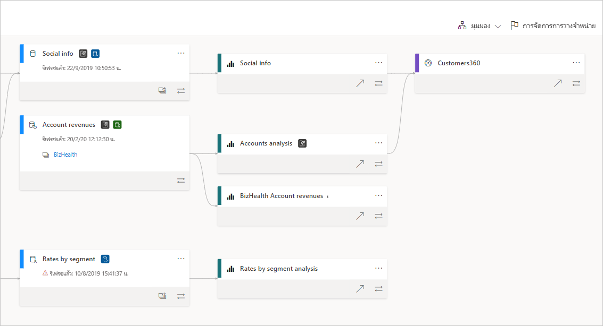
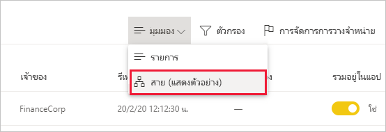
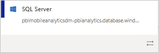
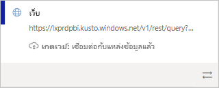
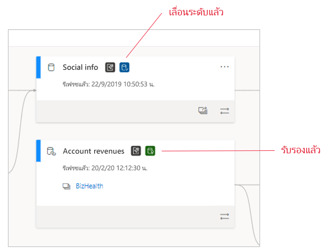
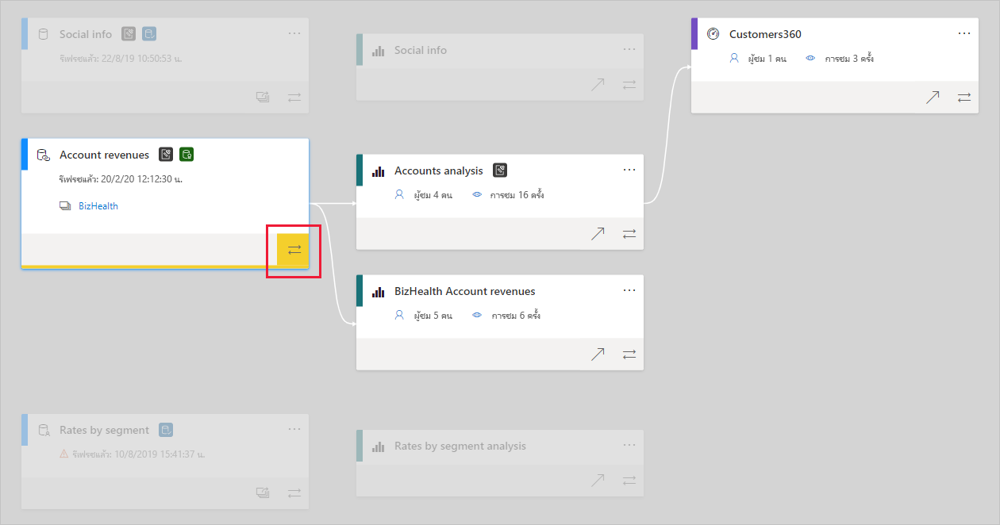

# สายข้อมูล (ตัวอย่าง)
ในโครงการระบบธุรกิจอัจฉริยะที่ทันสมัย (BI) การทำความเข้าใจการไหลของข้อมูลจากแหล่งข้อมูลไปยังจุดหมายปลายทางเป็นความท้าทาย ความท้าทายจะยิ่งเพิ่มมากขึ้นหากคุณสร้างโครงการวิเคราะห์ขั้นสูงซึ่งครอบคุลมแหล่งข้อมูล สิ่งประดิษฐ์ และการอ้างอิงจำนวนมาก คำถามเช่น "จะเกิดอะไรขึ้นหากฉันเปลี่ยนแปลงข้อมูลนี้" หรือ "เพราะเหตุใดรายงานนี้จึงไม่มีข้อมูลล่าสุด" เป็นคำถามที่ตอบยาก จึงอาจจำเป็นต้องมีทีมผู้เชี่ยวชาญหรือการตรวจสอบอย่างลึกซึ้งเพื่อทำความเข้าใจ เราออกแบบมุมมองสายข้อมูลเพื่อช่วยเหลือคุณในการตอบคำถามเหล่านี้

 
Power BI มีสิ่งประดิษฐ์หลายชนิด เช่น แดชบอร์ด รายงาน ชุดข้อมูล และกระแสข้อมูล ชุดข้อมูลและกระแสข้อมูลจำนวนมากเชื่อมต่อกับแหล่งข้อมูลภายนอก เช่น SQL Server และยังเชื่อมต่อกับชุดข้อมูลภายนอกในพื้นที่ทำงานอื่น ๆ เมื่อชุดข้อมูลอยู่ภายนอกพื้นที่ทำงานที่คุณเป็นเจ้าของ ชุดข้อมูลนั้นอาจอยู่ในพื้นที่ทำงานที่บุคคลในฝ่ายไอทีหรือนักวิเคราะห์รายอื่นเป็นเจ้าของ ในท้ายที่สุด แหล่งข้อมูลภายนอกและชุดข้อมูลนั้นทำให้การค้นหาว่าข้อมูลมาจากที่ใดเป็นเรื่องยากขึ้น สำหรับโครงการที่มีความซับซ้อนและโครงการที่เรียบง่ายกว่า เราขอแนะนำมุมมองสายข้อมูล

ในมุมมองสายข้อมูล คุณจะเห็นความสัมพันธ์ของสายการเชื่อมโยงระหว่างสิ่งประดิษฐ์ทั้งหมดในพื้นที่ทำงาน และการอ้างอิงภายนอกทั้งหมด ซึ่งแสดงการเชื่อมต่อระหว่างสิ่งประดิษฐ์ในพื้นที่ทำงานทั้งหมด รวมถึงการเชื่อมต่อไปยังกระแสข้อมูล ทั้งต้นทางและปลายทาง

## ดูมุมมองสายข้อมูล

พื้นที่ทำงานทั้งหมด ไม่ว่าจะเป็นแบบใหม่หรือแบบดั้งเดิม ก็จะมีมุมมองสายข้อมูลโดยอัตโนมัติ อย่างน้อยคุณต้องมีบทบาทผู้สนับสนุนในพื้นที่ทำงานเพื่อดูมุมมองดังกล่าว ดูรายละเอียดที่หัวข้อ [สิทธิ์](#permissions) ในบทความนี้

* หากต้องการเข้าถึงมุมมองสายข้อมูล ให้ไปที่มุมมองรายการพื้นที่ทำงาน แตะลูกศรที่อยู่ถัดจาก **มุมมองรายการ** และเลือก **มุมมองสายข้อมูล**

   

ในมุมมองนี้ คุณจะเห็นสิ่งประดิษฐ์ในพื้นที่ทำงานทั้งหมดและวิธีการที่ข้อมูลส่งจากจุดหนึ่งไปยังอีกจุดหนึ่ง

**แหล่งข้อมูล**

คุณจะเห็นแหล่งข้อมูลจากชุดข้อมูลและกระแสข้อมูลที่ได้รับข้อมูล บนการ์ดแหล่งข้อมูล คุณจะเห็นข้อมูลเพิ่มเติมที่สามารถช่วยระบุแหล่งที่มาได้ ตัวอย่างเช่น สำหรับเซิร์ฟเวอร์ Azure SQL คุณจะเห็นชื่อฐานข้อมูล

 
**เกตเวย์**

หากมีการเชื่อมต่อแหล่งข้อมูลผ่านเกตเวย์ภายในองค์กร ระบบจะเพิ่มข้อมูลเกตเวย์ไปยังการ์ดแหล่งข้อมูล หากคุณมีสิทธิ์ในฐานะผู้ดูแลระบบเกตเวย์หรือเป็นผู้ใช้แหล่งข้อมูล คุณจะเห็นข้อมูลเพิ่มเติม เช่น ชื่อเกตเวย์

**ชุดข้อมูลและกระแสข้อมูล**
 
บนชุดข้อมูลและกระแสข้อมูล คุณจะเห็นเวลารีเฟรชครั้งล่าสุด เช่นเดียวกับถ้าชุดข้อมูลหรือกระแสข้อมูล ได้รับการรับรองหรือเลื่อนขั้น

 
หากรายงานในพื้นที่ทำงานถูกสร้างขึ้นบนชุดข้อมูลหรือกระแสข้อมูลในพื้นที่ทำงานอื่น คุณจะเห็นชื่อพื้นที่ทำงานต้นทางบนการ์ดของชุดข้อมูลและกระแสข้อมูลนั้นๆ เลือกชื่อพื้นที่ทำงานต้นทางเพื่อไปยังพื้นที่ทำงานนั้นๆ

* สำหรับสิ่งประดิษฐ์ใดๆ ก็ตาม ให้เลือก**ตัวเลือกเพิ่มเติม** (... ) เพื่อดูเมนูตัวเลือก ซึ่งมีการดำเนินการเหมือนกันทั้งหมดที่สามารถใช้งานได้ในมุมมองรายการ

หากต้องการดูเมตาดาต้าเพิ่มเติมเกี่ยวกับสิ่งสิ่งประดิษฐ์ใดๆ ให้เลือกการ์ดสิ่งประดิษฐ์ ข้อมูลเพิ่มเติมเกี่ยวกับชุดข้อมูลจะแสดงในบานหน้าต่างด้านข้าง ในภาพด้านล่าง บานหน้าต่างด้านข้างจะแสดงเมตาดาต้าของชุดข้อมูลที่เลือก

 
## แสดงสายข้อมูลสำหรับสิ่งประดิษฐ์ใด ๆ 

สมมติว่าคุณต้องการดูสายข้อมูลสำหรับสิ่งประดิษฐ์เฉพาะ

* ให้เลือกลูกศรคู่ซึ่งอยู่ที่ด้านล่างของสิ่งประดิษฐ์

   

   Power BI ไฮไลท์สิ่งประดิษฐ์ทั้งหมดที่เกี่ยวข้องกับสิ่งประดิษฐ์นั้น และลดความสว่างของส่วนที่เหลือ 

## การนำทางและการแสดงผลเต็มหน้าจอ 

มุมมองสายข้อมูลเป็นพื้นที่ทำงานแบบโต้ตอบ คุณสามารถใช้เมาส์และทัชแพดเพื่อนำทางในพื้นที่ทำงาน และย่อหรือขยาย

* เมื่อต้องการย่อและขยาย ให้ใช้เมนูที่มุมขวาล่าง หรือใช้เมาส์หรือทัชแพดของคุณ
* หากต้องการเพิ่มพื้นที่ให้มากขึ้นสำหรับกราฟ ให้ใช้ตัวเลือกการแสดงผลเต็มหน้าจอที่มุมขวาล่าง 

    

## การอนุญาต

* คุณต้องมีสิทธิ์การใช้งาน Power BI Pro เพื่อดูมุมมองสายข้อมูล
* มุมมองสายข้อมูลพร้อมใช้งานสำหรับผู้ใช้ที่มีสิทธิ์ในการเข้าถึงพื้นที่ทำงานเท่านั้น
* ผู้ใช้ต้องมีบทบาทผู้ดูแลระบบ สมาชิก หรือบทบาทผู้สนับสนุนในพื้นที่ทำงาน ผู้ใช้ที่มีบทบาทผู้ชมไม่สามารถสลับไปยังมุมมองสายข้อมูลได้

## ข้อควรพิจารณาและข้อจำกัด

- มุมมองสายข้อมูลไม่สามารถใช้งานได้บน Internet Explorer ดูรายละเอียดที่ [เบราว์เซอร์ที่สนับสนุนสำหรับ Power BI](../power-bi-browsers.md)

## ขั้นตอนถัดไป

* [บทนำชุดข้อมูลทั้งพื้นที่ทำงาน (ตัวอย่าง)](../service-datasets-across-workspaces.md)
