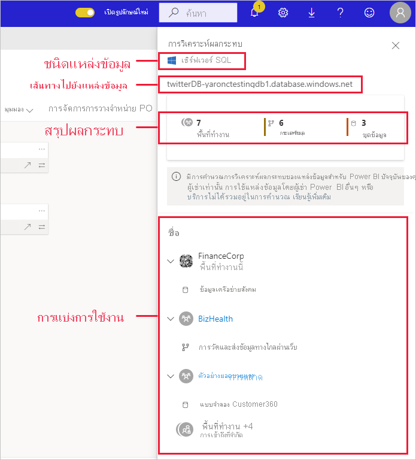
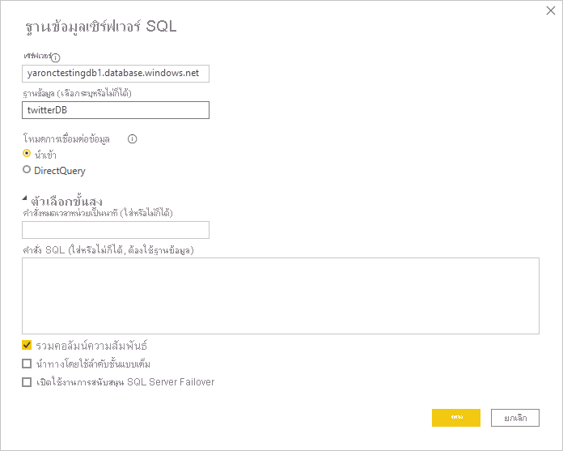

# การวิเคราะห์ผลกระทบของแหล่งข้อมูล

การวิเคราะห์ผลกระทบของแหล่งข้อมูลช่วยให้คุณเห็นตำแหน่งที่มีการใช้แหล่งข้อมูลของคุณจากทั่วทั้งองค์กร ซึ่งจะเป็นประโยชน์เมื่อมีการใช้แหล่งข้อมูลแบบออฟไลน์ชั่วคราวหรือถาวร และคุณต้องการทราบเกี่ยวกับบุคคลที่ได้รับผลกระทบ การดำเนินการนี้จะแสดงให้เห็นถึงจำนวนพื้นที่ทำงาน กระแสข้อมูล และชุดข้อมูลที่ใช้แหล่งข้อมูล และมอบการนำทางที่ง่ายดายไปยังพื้นที่ทำงานที่มีกระแสข้อมูลและชุดข้อมูลที่ได้รับผลกระทบเพื่อให้คุณสามารถตรวจสอบเพิ่มเติมได้

การวิเคราะห์ผลกระทบของแหล่งข้อมูลยังช่วยให้คุณสามารถระบุการสร้างข้อมูลซ้ำในผู้เช่าได้ เช่น เมื่อผู้ใช้หลายรายสร้างแบบจำลองที่คล้ายคลึงกันที่ด้านบนของแหล่งข้อมูลเดียวกัน การวิเคราะห์ผลกระทบของแหล่งข้อมูลสนับสนุนเป้าหมายในการมี “แหล่งความจริงหนึ่งเดียว” ด้วยการช่วยให้คุณค้นพบชุดข้อมูลและกระแสข้อมูลที่ซ้ำซ้อนดังกล่าว

## ดำเนินการวิเคราะห์ผลกระทบของแหล่งข้อมูล

วิธีดำเนินการวิเคราะห์ผลกระทบของแหล่งข้อมูล:

1. ไปยังพื้นที่ทำงานที่มีแหล่งข้อมูลที่คุณสนใจ และเปิด[มุมมองสายข้อมูล](service-data-lineage.md)
1. ค้นหาการ์ดของแหล่งข้อมูล และคลิกที่ไอคอนการวิเคราะห์ผลกระทบ

    
 
บานหน้าต่างข้างการวิเคราะห์ผลกระทบจะเปิดออก

 
* **ชนิดแหล่งข้อมูล**: ระบุชนิดแหล่งข้อมูล
* **เส้นทางไปยังแหล่งข้อมูล**: เส้นทางไปยังแหล่งข้อมูลตามที่กำหนดไว้ใน Power BI Desktop ตัวอย่างเช่น ในรูปภาพด้านบน เส้นทางไปยังแหล่งข้อมูลของฐานข้อมูล SQL server คือสตริงการเชื่อมต่อ "twitterDB-yaronctestingdb1.database.windows.net" ตามที่กำหนดไว้ใน Power BI Desktop (แสดงที่ด้านล่าง) ซึ่งประกอบด้วยชื่อฐานข้อมูล "twitterDB" และชื่อเซิร์ฟเวอร์ "yaronctestingdb1.database.windows.net"

    
 
* **สรุปผลกระทบ**: แสดงจำนวนของพื้นที่ทำงาน กระแสข้อมูล และชุดข้อมูลที่อาจได้รับผลกระทบ การนับจำนวนนี้รวมถึงพื้นที่ทำงานที่คุณไม่มีสิทธิ์เข้าถึงด้วย
* **การแบ่งการใช้งาน**: แสดงให้คุณเห็นชื่อของกระแสข้อมูลและชุดข้อมูลที่ได้รับผลกระทบสำหรับแต่ละพื้นที่ทำงาน หากต้องการสำรวจผลกระทบเพิ่มเติมในพื้นที่ทำงานเฉพาะ ให้คลิกที่ชื่อพื้นที่ทำงานเพื่อเปิดพื้นที่ทำงาน เมื่ออยู่ในพื้นที่ทำงานที่ได้รับผลกระทบ ให้ใช้[การวิเคราะห์ผลกระทบของชุดข้อมูล](service-dataset-impact-analysis.md) เพื่อดูรายละเอียดการใช้งานเกี่ยวกับรายงานและแดชบอร์ดที่เชื่อมต่อ

## ความเป็นส่วนตัว

ในบานหน้าต่างด้านข้างการวิเคราะห์ผลกระทบ คุณจะเห็นเฉพาะชื่อจริงสำหรับพื้นที่ทำงาน ชุดข้อมูล และกระแสข้อมูลที่คุณสามารถเข้าถึงได้ หน่วยข้อมูลที่คุณไม่มีสิทธิ์ในการเข้าถึงจะแสดงเป็นการเข้าถึงแบบจำกัด เนื่องจากชื่อหน่วยข้อมูลบางรายการอาจมีข้อมูลส่วนบุคคลอยู่ด้วย
จำนวนสรุปผลกระทบ รวมถึงกระแสข้อมูลและชุดข้อมูลที่ได้รับผลกระทบทั้งหมด แม้ว่าจะอยู่ในพื้นที่ทำงานที่คุณไม่มีสิทธิ์เข้าถึงก็ตาม

## ข้อจำกัด

รายงานแบบแบ่งหน้ายังไม่รองรับการวิเคราะห์ผลกระทบของแหล่งข้อมูล ดังนั้นคุณจะไม่เห็นว่าแหล่งข้อมูลมีผลกระทบโดยตรงใด ๆ กับรายงานชนิดนี้ในผู้เช่าหรือไม่

## ขั้นตอนถัดไป

* [การวิเคราะห์ผลกระทบของชุดข้อมูล](service-dataset-impact-analysis.md)
* [สายข้อมูล](service-data-lineage.md)