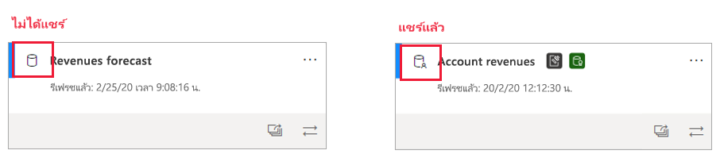
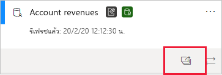
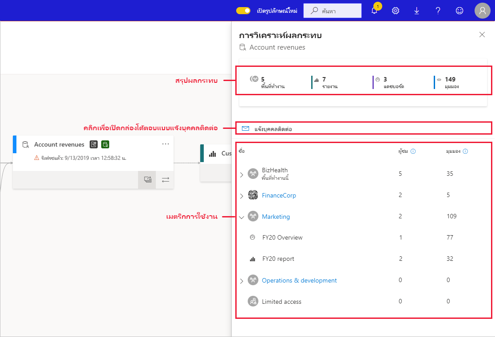
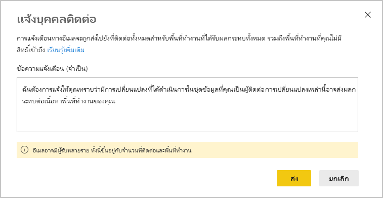
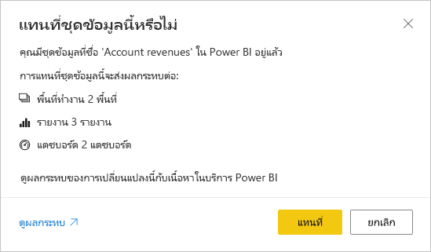

# การวิเคราะห์ผลกระทบของชุดข้อมูล

เมื่อคุณทำการเปลี่ยนแปลงชุดข้อมูลหรือกำลังพิจารณาทำการเปลี่ยนแปลง สิ่งสำคัญคือต้องสามารถประเมินผลกระทบที่การเปลี่ยนแปลงเหล่านั้นจะมีในรายงานและแดชบอร์ดที่อยู่ในเวลาที่ขึ้นอยู่กับชุดข้อมูลนั้น **การวิเคราะห์ผลกระทบของชุดข้อมูล** ให้ข้อมูลที่ช่วยให้คุณสามารถทำการประเมินนี้ได้
* การดำเนินการนี้จะแสดงให้เห็นถึงจำนวนพื้นที่ทำงาน รายงาน และแดชบอร์ดของคุณที่อาจได้รับผลกระทบ และมอบการนำทางอย่างง่ายไปยังพื้นที่ทำงานที่มีรายงานและแดชบอร์ดที่ได้รับผลกระทบเพื่อให้คุณสามารถตรวจสอบเพิ่มเติมได้
* การดำเนินการนี้จะแสดงให้คุณเห็นถึงจำนวนผู้เยี่ยมชม และจำนวนการเข้าชมที่มีในรายการที่อาจได้รับผลกระทบ การดำเนินการนี้จะช่วยให้คุณพิจารณาผลกระทบโดยรวมของการเปลี่ยนแปลงสำหรับรายการปลายทาง ตัวอย่างเช่น อาจเป็นเรื่องสำคัญที่ต้องตรวจสอบผลกระทบจากการเปลี่ยนแปลงในรายงานที่มีผู้ชม 20,000 ราย มากกว่าการตรวจสอบผลกระทบจากการเปลี่ยนแปลงในรายงานที่มีผู้ชมสามราย
* โดยถือเป็นวิธีการที่ง่ายดายในการแจ้งให้ผู้คนที่เกี่ยวข้องทราบเกี่ยวกับการเปลี่ยนแปลงที่คุณได้ทำ หรือกำลังคิดว่าจะทำ

การวิเคราะห์ผลกระทบของชุดข้อมูลจะถูกเปิดใช้งานได้อย่างง่ายดายจากภายใน [มุมมองการติดตามการใช้งานข้อมูล](service-data-lineage.md)

## การระบุชุดข้อมูลที่แชร์

คุณสามารถดำเนินการวิเคราะห์ผลกระทบของชุดข้อมูลได้ทั้งบนชุดข้อมูลที่แชร์และไม่ได้แชร์ อย่างไรก็ตาม จะเป็นประโยชน์อย่างยิ่งสำหรับชุดข้อมูลที่แชร์ในพื้นที่ทำงาน ซึ่งมีความซับซ้อนมากขึ้นเมื่อต้องการรับรูปภาพที่ชัดเจนของการขึ้นต่อกันที่ปลายทาง มากกว่าชุดข้อมูลที่ไม่ได้แชร์ ทั้งนี้ การขึ้นต่อกันทั้งหมดนี้จะตั้งอยู่ในพื้นที่ทำงานเดียวกันกับชุดข้อมูลของตนเอง

ในมุมมองการติดตามการใช้งาน คุณจะสามารถบอกได้ถึงความแตกต่างระหว่างชุดข้อมูลที่แชร์และไม่ได้แชร์ จากไอคอนที่ปรากฏในมุมบนซ้ายมือของการ์ดของชุดข้อมูล

## ดำเนินการวิเคราะห์ผลกระทบของชุดข้อมูล

คุณสามารถดำเนินการวิเคราะห์ผลกระทบเกี่ยวกับชุดข้อมูลใด ๆ ในพื้นที่ทำงาน ไม่ว่าจะมีการแชร์หรือไม่ก็ตาม คุณไม่สามารถดำเนินการวิเคราะห์ผลกระทบบนชุดข้อมูลภายนอกที่แสดงในมุมมองการติดตามการใช้งาน แต่ในความเป็นจริง ตั้งอยู่ในพื้นที่ทำงานอื่น เมื่อต้องการทำการวิเคราะห์ผลกระทบบนชุดข้อมูลภายนอก คุณต้องนำทางไปยังพื้นที่ทำงานต้นทาง

เมื่อต้องการทำการวิเคราะห์ผลกระทบของชุดข้อมูล ให้คลิกที่ปุ่มการวิเคราะห์ผลกระทบบนการ์ดชุดข้อมูล

บานหน้าต่างข้างการวิเคราะห์ผลกระทบจะเปิดออก

* **สรุปผลกระทบ** แสดงจำนวนพื้นที่ทำงาน รายงาน และแดชบอร์ดที่อาจได้รับผลกระทบ รวมถึงจำนวนมุมมองทั้งหมดสำหรับรายงานปลายทางและแดชบอร์ดทั้งหมดที่เชื่อมต่อกับชุดข้อมูล
* ลิงก์ **แจ้งบุคคลผู้ติดต่อ** จะเปิดกล่องโต้ตอบที่คุณสามารถสร้างและส่งข้อความเกี่ยวกับการเปลี่ยนแปลงชุดข้อมูลใด ๆ ที่คุณทำต่อรายชื่อติดต่อของพื้นที่ทำงานที่ได้รับผลกระทบ 
* **การแจกแจงการใช้งาน** ที่แสดงให้คุณเห็นถึงพื้นที่ทำงานแต่ละรายการ จำนวนมุมมองทั้งหมดสำหรับรายงานและแดชบอร์ดที่อาจได้รับผลกระทบ และสำหรับรายงานและแดชบอร์ดแต่ละรายการ จำนวนผู้ชุมทั้งหมดและมุมมองที่
   * ผู้ชม: จำนวนผู้ใช้ที่ไม่ซ้ำกันที่ดูรายงานหรือมุมมองหนึ่งๆ
   * มุมมอง: จำนวนมุมมองสำหรับรายงานหรือแดชบอร์ด

เมตริกการใช้งานจะสัมพันธ์กับ 30 วันล่าสุด โดยไม่นับรวมวันปัจจุบัน จำนวนจะหมายรวมถึงการใช้งานผ่านแอปต่าง ๆ ที่เกี่ยวข้อง เมตริกจะช่วยให้คุณเข้าใจการใช้งานชุดข้อมูลในทุกผู้เช่า รวมถึงประเมินผลกระทบที่อาจเกิดจากการเปลี่ยนแปลงของชุดข้อมูลของคุณ

## แจ้งบุคคลติดต่อ

หากคุณทำการเปลี่ยนแปลงกับชุดข้อมูล หรือกำลังคิดที่จะทำการเปลี่ยนแปลง คุณอาจต้องการติดต่อผู้ใช้ที่เกี่ยวข้อง เพื่อแจ้งให้พวกเขาทราบ เมื่อคุณแจ้งบุคคลติดต่อ ระบบจะส่งอีเมลไปยัง [รายชื่อบุคคลติดต่อ](../service-create-the-new-workspaces.md#workspace-contact-list) ของพื้นที่ทำงานทั้งหมดที่ได้รับผลกระทบ ชื่อของคุณจะปรากฏบนอีเมล ดังนั้น บุคคลติดต่อจะสามารถค้นหาคุณได้และตอบกลับในเธรดอีเมลใหม่ 

1. คลิก **แจ้งบุคคลติดต่อ** ในบานหน้าต่างด้านข่างการวิเคราะห์ผลกระทบ กล่องโต้ตอบแจ้งบุคคลติดต่อจะปรากฏขึ้น

   

1. ในกล่องข้อความ ให้ระบุรายละเอียดบางอย่างเกี่ยวกับการเปลี่ยนแปลง
1. เมื่อข้อความพร้อม ให้คลิก **ส่ง**

> [!NOTE]
> แจ้งบุคคลติดต่อจะไม่สามารถใช้งานได้ หากชุดข้อมูลที่คุณกำลังทำการวิเคราะห์ผลกระทบอยู่ในพื้นที่ทำงานแบบคลาสสิก

## ความเป็นส่วนตัว

เพื่อดำเนินการวิเคราะห์ผลกระทบในชุดข้อมูล คุณจำเป็นต้องเขียนสิทธิ์ให้ชุดข้อมูลดังกล่าว ในบานหน้าต่างด้านข้างการวิเคราะห์ผลกระทบ คุณจะเห็นเฉพาะชื่อจริงสำหรับพื้นที่ทำงาน รายงาน และแดชบอร์ดที่คุณสามารถเข้าถึงได้ หน่วยข้อมูลที่คุณไม่สามารถเข้าถึงได้ จะแสดงแบบ **การเข้าถึงแบบจำกัด** เนื่องจากชื่อหน่วยข้อมูลบางรายการอาจมีข้อมูลส่วนบุคคลอยู่ด้วย

แม้ว่าคุณจะไม่สามารถเข้าถึงพื้นที่ทำงานบางอย่างได้ แต่คุณจะยังคงมองเห็นเมตริกการใช้งานสรุปสำหรับพื้นที่ทำงานดังกล่าว และข้อความแจ้งบุคคลติดต่อของคุณจะเข้าถึงรายชื่อบุคคลติดต่อของพื้นที่ทำงานดังกล่าว

## การวิเคราะห์ผลกระทบจาก Power BI Desktop

เมื่อคุณทำการเปลี่ยนแปลงกับชุดข้อมูลใน Power BI Desktop แล้วเผยแพร่อีกครั้งไปยังบริการ Power BI ข้อความจะแสดงจำนวนพื้นที่ทำงาน รายงาน และแดชบอร์ดที่อาจได้รับผลกระทบจากการเปลี่ยนแปลงนั้น และขอให้คุณยืนยันว่า คุณต้องการแทนที่ชุดข้อมูลที่เผยแพร่ในปัจจุบันด้วยรายการที่คุณปรับเปลี่ยน นอกจากนี้ ข้อความยังประกอบด้วยลิงก์ไปยังการวิเคราะห์ผลกระทบของชุดข้อมูลแบบเต็มรูปแบบในบริการ Power BI ที่คุณจะสามารถมองเห็นข้อมูลเพิ่มเติม และดำเนินการเพื่อบรรเทาความเสี่ยงจากการเปลี่ยนแปลงของคุณ

> [!NOTE]
> ข้อมูลที่แสดงในข้อความจะระบุถึงผลกระทบที่อาจเกิดขึ้น โดยไม่จำเป็นต้องระบุว่ามีสิ่งใดเสียหายบ้าง ในบางครั้ง การเปลี่ยนแปลงของชุดข้อมูลจะไม่ส่งผลเสียต่อแดชบอร์ดและรายงานปลายทาง แต่คุณจะได้รับข้อความนี้ทีมอบความชัดเจนให้แก่คุณเกี่ยวกับผลกระทบที่อาจเกิดขึ้น
>
>ในข้อความดังกล่าว จำนวนพื้นที่ทำงานจะปรากฏก็ต่อเมื่อมีพื้นที่ทำงานมากกว่าหนึ่งรายการที่มีแดชบอร์ดและรายงานที่ได้รับผลกระทบ

## ข้อจำกัด

* ขณะนี้ เมตริกการใช้งานจะไม่ได้รับการสนับสนุนสำหรับพื้นที่ทำงานส่วนบุคคลและแบบคลาสสิก

## ขั้นตอนถัดไป

* [บทนำชุดข้อมูลทั้งพื้นที่ทำงาน (ตัวอย่าง)](../service-datasets-across-workspaces.md)
* [สายข้อมูล](service-data-lineage.md)
