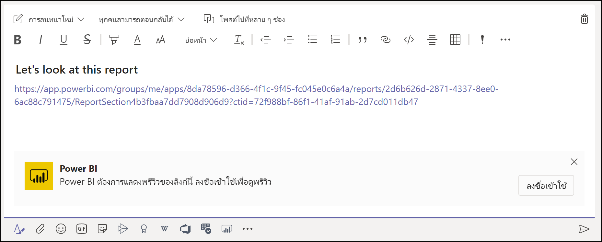
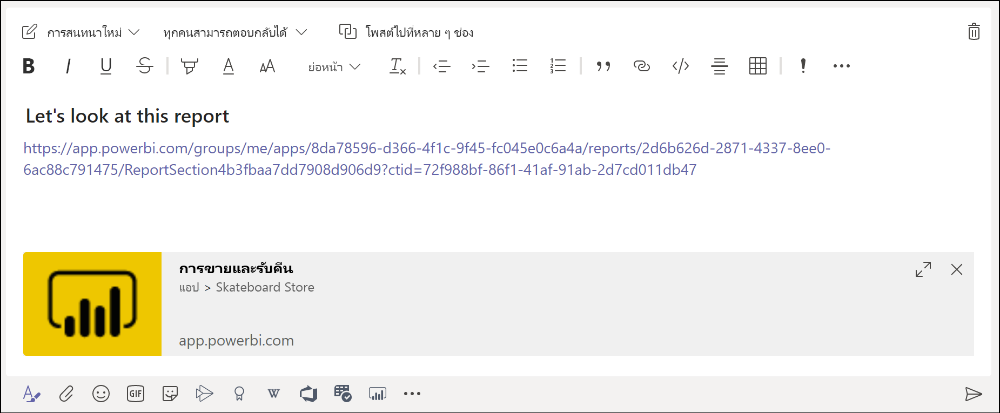
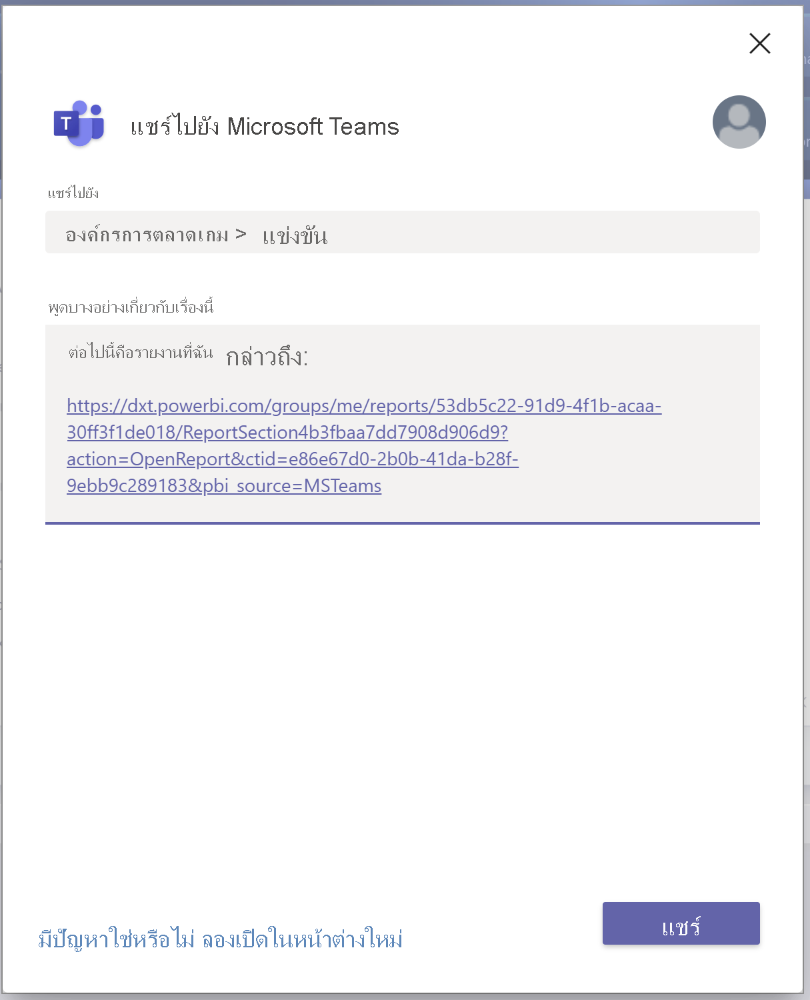
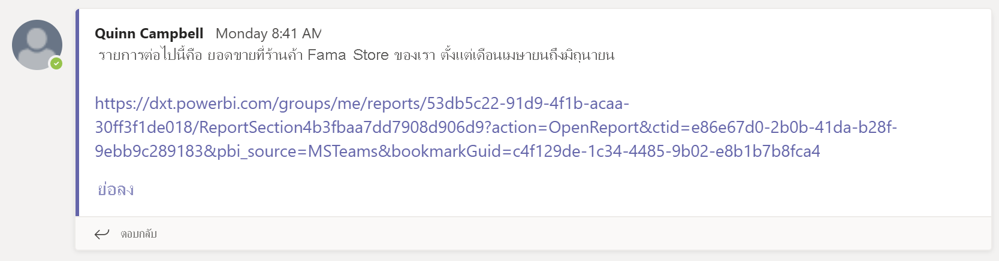
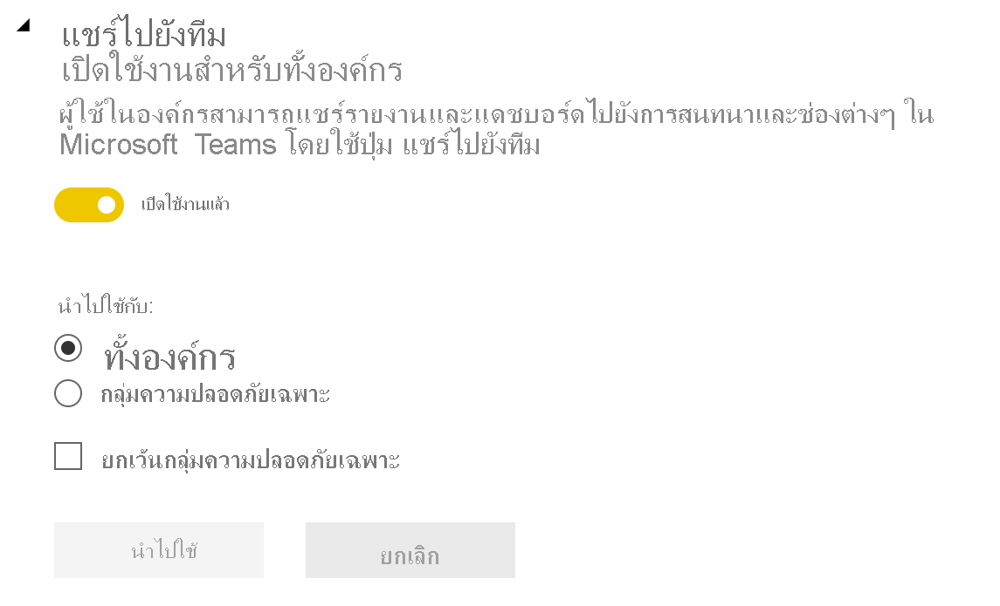

# ทำงานร่วมกันใน Microsoft Teams ด้วย Power BI

ด้วยแท็บ **Power BI** ที่อัปเดตใหม่สำหรับ Microsoft Teams คุณสามารถฝังรายงานแบบโต้ตอบในแชนเนลและแชทของ Microsoft Teams ได้อย่างง่ายดาย ใช้แท็บ **Power BI** สำหรับ Microsoft Teams เพื่อช่วยเพื่อนร่วมงานของคุณค้นหาข้อมูลที่ทีมของคุณใช้และเพื่อพูดคุยเกี่ยวกับข้อมูลภายในช่องของทีม เมื่อคุณวางลิงก์ไปยังรายงาน แดชบอร์ด และแอปของคุณลงในกล่องข้อความ Microsoft Teams การแสดงตัวอย่างลิงก์จะแสดงข้อมูลเกี่ยวกับลิงก์ดังกล่าว ใช้ปุ่ม**แชร์กับทีม**เพื่อเริ่มการสนทนาเมื่อคุณดูรายงานและแดชบอร์ดใน Power BI ได้อย่างรวดเร็ว

## ข้อกำหนด

เพื่อทำให้**แท็บ Power BI สำหรับ Microsoft Teams** ทำงาน ตรวจสอบให้แน่ใจว่า:

- ผู้ใช้ของคุณสิทธิ์การใช้งาน Power BI Pro หรือรายงานที่มีอยู่ในความจุ [Power BI Premium (EM หรือ P SKU)](../admin/service-premium-what-is.md) พร้อมสิทธิ์การใช้งาน Power BI
- Microsoft Teams มีแท็บ **Power BI**
- ผู้ใช้ได้ลงชื่อเข้าใช้ในบริการของ Power BI เพื่อเปิดใช้สิทธิ์การใช้งาน Power BI ของตนสำหรับการใช้รายงาน
- หากต้องการเพิ่มรายงานใน  Microsoft Teams ด้วยแท็บ **Power BI** คุณต้องมีอย่างน้อยหนึ่งบทบาทของผู้ชมในพื้นที่ทำงานที่โฮสต์รายงาน ดู[บทบาทในพื้นที่ทำงานใหม่](service-new-workspaces.md#roles-in-the-new-workspaces)สำหรับข้อมูลเกี่ยวกับบทบาทที่แตกต่างกัน
- หากต้องการดูรายงานในแท็บ **Power BI** ใน Microsoft Teams ผู้ใช้ต้องมีสิทธิ์ในการดูรายงาน
- ผู้ใช้จะต้องเป็นผู้ใช้  Microsoft Teams ที่มีสิทธิ์เข้าถึงช่องและการสนทนา

เพื่อทำให้การแสดงตัวอย่างลิงก์ทำงานอย่างถูกต้อง โปรดทำให้แน่ใจว่า:

- ผู้ใช้จะต้องเป็นไปตามข้อกำหนดในการใช้แท็บ **Power BI**I สำหรับ Microsoft Teams
- ผู้ใช้ได้ลงชื่อเข้าใช้ Power BI

เพื่อให้ปุ่ม**แชร์กับทีม**ทำงานอย่างถูกต้อง โปรดทำให้แน่ใจว่า:

- ผู้ใช้จะต้องเป็นไปตามข้อกำหนดในการใช้แท็บ **Power BI**I สำหรับ Microsoft Teams
- ผู้ใช้ได้ลงชื่อเข้าใช้ Power BI
- ผู้ดูแลระบบ Power BI ยังไม่ได้ปิดใช้งานการตั้งค่าผู้เช่า**แชร์กับทีม**

## ฝังรายงานของคุณ

ทำตามขั้นตอนเหล่านี้เพื่อฝังรายงานของคุณลงในแชนเนลหรือแชทของ Microsoft Teams

1. เปิดแชนเนลหรือแชทใน Microsoft Teams และเลือกไอคอน **+**

    

1. เลือกแท็บ **Power BI**

    

1. ใช้ตัวเลือกที่ให้มาเพื่อเลือกรายงานจากพื้นที่ทำงานหรือแอป Power BI

    

1. ชื่อแท็บจะอัปเดตโดยอัตโนมัติเพื่อให้ตรงกับชื่อของชื่อรายงาน แต่คุณสามารถเปลี่ยนได้

1. เลือก**บันทึก**

## รายงานที่รองรับสำหรับการฝังแท็บ Power BI

คุณสามารถฝังรายงานประเภทต่อไปนี้ได้บนแท็บ **Power BI**:

- รายงานแบบโต้ตอบและรายงานที่มีการแบ่งหน้า
- รายงานใน**พื้นที่ทำงานของฉัน** ประสบการณ์พื้นที่ทำงานใหม่ และพื้นที่ทำงานแบบคลาสสิก
- รายงานในแอป Power BI

## รับตัวอย่างลิงก์

ทำตามขั้นตอนเหล่านี้เพื่อรับการแสดงตัวอย่างลิงก์สำหรับเนื้อหาในบริการของ Power BI

1. คัดลอกลิงก์ไปยังรายงาน แดชบอร์ด หรือแอปในบริการของ Power BI ตัวอย่างเช่น คัดลอกลิงก์จากแถบที่อยู่เบราว์เซอร์

1. วางลิงก์ในกล่องข้อความของ Microsoft Teams ลงชื่อเข้าใช้บริการการแสดงตัวอย่างลิงก์ถ้าได้รับพร้อมท์ คุณอาจต้องรอสองสามวินาในการโหลดการแสดงตัวอย่างลิงก์

    

1. การแสดงตัวอย่างลิงก์พื้นฐานจะปรากฏขึ้นหลังจากลงชื่อเข้าใช้เรียบร้อยแล้ว

    

1. เลือกไอคอน**ขยาย**เพื่อแสดงการ์ดแสดงตัวอย่างแบบผสม

    

1. การ์ดแสดงตัวอย่างลิงก์แบบผสมจะแสดงลิงก์และปุ่มการดำเนินการที่เกี่ยวข้อง

    

1. ส่งข้อความ

## ปุ่มแชร์กับทีมในบริการของ Power BI

ทำตามขั้นตอนเหล่านี้เพื่อแชร์ลิงก์ไปยังช่องของ Microsoft Teams และการสนทนาเมื่อคุณดูรายงานหรือแดชบอร์ดในบริการของ Power BI

1. ใช้ปุ่ม**แชร์ไปยัง Teams** ในแถบการดำเนินการหรือในเมนูบริบทบนภาพที่ระบุ

   * ปุ่ม**แชร์ไปยัง Teams** ในแถบการดำเนินการ:

       
    
   * ปุ่ม**แชร์ไปยัง Teams** ในเมนูบริบทภาพ:
    
      

1. ในกล่องโต้ตอบ**แชร์กับ Microsoft Teams** ให้เลือกช่องหรือบุคคลที่คุณต้องการส่งลิงก์ไปให้ เพิ่มข้อความถ้าคุณต้องการ คุณอาจถูกขอให้ลงชื่อเข้าใช้ Microsoft Teams ก่อน

    

1. เลือก**แชร์** เพื่อส่งลิงก์
    
1. ลิงก์จะถูกเพิ่มไปยังการสนทนาที่มีอยู่หรือเริ่มการสนทนาใหม่

    

1. เลือกลิงก์เพื่อเปิดรายการในบริการ Power BI

1. ถ้าคุณใช้เมนูบริบทสำหรับภาพที่ระบุ ภาพจะถูกไฮไลท์เมื่อรายงานเปิดขึ้น

    
    

## อนุญาตการเข้าถึงรายงาน

การฝังรายงานใน Microsoft Teams หรือการส่งลิงก์ไปยังรายการไม่ได้ให้สิทธิ์แก่ผู้ใช้ในการดูรายงานโดยอัตโนมัติ คุณจำเป็นต้อง[อนุญาตให้ผู้ใช้สามารถดูรายงานใน Power BI](service-share-dashboards.md) ได้ คุณสามารถใช้ Microsoft 365 Group สำหรับทีมของคุณเพื่อทำให้ง่ายขึ้น

> [!IMPORTANT]
> ให้ตรวจสอบให้แน่ใจว่าว่าใครสามารถดูรายงานภายใน Power BI service และอนุญาตให้เข้าถึงสิ่งที่ไม่ได้อยู่ในรายการ

วิธีหนึ่งในการตรวจสอบให้แน่ใจว่าทุกคนในทีมมีสิทธิ์เข้าถึงรายงานคือการวางรายงานในพื้นที่ทำงานเดียวและให้การเข้าถึง Microsoft 365 Group กับทีมของคุณ

## การแสดงตัวอย่างลิงก์

การแสดงตัวอย่างลิงก์มีไว้สำหรับรายการต่อไปนี้ใน Power BI:
- รายงาน
- แดชบอร์ด
- แอป

บริการการแสดงตัวอย่างลิงก์ต้องการให้ผู้ใช้ของคุณลงชื่อเข้าใช้ หากต้องการออกจากระบบ ให้เลือกไอคอน **Power BI** ที่ด้านล่างของกล่องข้อความ จากนั้นเลือก**ออกจากระบบ**

## เริ่มการสนทนา

เมื่อคุณเพิ่มแท็บรายงาน Power BI ไปยัง Microsoft Teams  Teams จะสร้างแท็บการสนทนาสำหรับรายงานโดยอัตโนมัติ

- เลือกไอคอน**แสดงแท็บการสนทนา**ในมุมบนขวา

    

    ข้อคิดเห็นแรกคือการเชื่อมโยงไปยังรายงาน ทุกคนในช่องของ Microsoft Teams สามารถดูและพูดคุยเกี่ยวกับรายงานในการสนทนาได้

    
    
## แชร์ไปยังการตั้งค่าผู้เช่า Teams

การตั้งค่าผู้เช่า**แชร์ไปยัง Teams**ในพอร์ทัลผู้ดูแลระบบ Power BI ช่วยให้องค์กรสามารถซ่อนปุ่ม**แชร์ไปยัง Teams** ได้ เมื่อตั้งค่าเป็นปิดใช้งาน ผู้ใช้จะไม่เห็นปุ่ม**แชร์ไปยัง Teams** ในเมนูการดำเนินการหรือบริบทเมื่อพวกเขาดูรายงานและแดชบอร์ดในบริการของ Power BI

## ปัญหาและขีดจำกัดที่ทราบแล้ว

- Power BI ไม่รองรับภาษาที่แปลเป็นภาษาท้องถิ่นเช่นเดียวกับที่ Microsoft Teams รองรับ ผลที่ได้คือคุณอาจไม่เห็นการแปลที่เหมาะสมภายในรายงานแบบฝังตัว
- คุณไม่สามารถฝังแดชบอร์ด Power BI ในแท็บ **Power BI** สำหรับ Microsoft Teams ได้
- ผู้ใช้ที่ไม่มีสิทธิ์การใช้งาน Power BI หรือสิทธิ์ในการเข้าถึงรายงานจะเห็นข้อความ "เนื้อหาไม่พร้อมใช้งาน"
- คุณอาจพบปัญหาถ้าคุณใช้ Internet Explorer 10 <!--You can look at the [browsers support for Power BI](../consumer/end-user-browsers.md) and for [Microsoft 365](https://products.office.com/office-system-requirements#Browsers-section). -->
- ไม่รองรับ[ตัวกรอง URL](service-url-filters.md) ที่มีแท็บ **Power BI** สำหรับ Microsoft Teams
- ในระบบคลาวด์ภายในประเทศ แท็บ **Power BI** ใหม่ไม่พร้อมใช้งาน รุ่นที่เก่ากว่าอาจพร้อมใช้งานที่ไม่รองรับพื้นที่ทำงานใหม่ พื้นที่ทำงานที่เคยทำ หรือรายงานในแอป Power BI
- หลังจากที่คุณบันทึกแท็บแล้ว คุณจะไม่สามารถเปลี่ยนชื่อแท็บผ่านการตั้งค่าแท็บได้ ใช้ตัวเลือก**เปลี่ยนชื่อ**เพื่อดำเนินการเปลี่ยนชื่อ
- การลงชื่อเข้าระบบครั้งเดียวไม่ได้รับการรองรับสำหรับบริการการแสดงตัวอย่างลิงก์
- การแสดงตัวอย่างลิงก์ไม่ทำงานในแชทการประชุมหรือแชนเนลส่วนตัว
- ปุ่ม**แชร์ไปยัง Teams** อาจไม่ทำงานถ้าเบราว์เซอร์ของคุณใช้การตั้งค่าความเป็นส่วนตัวที่เข้มงวด ใช้ **ยังพบปัญหาอยู่ใช่หรือไม่? ลองเปิดในตัวเลือกหน้าต่างใหม่** ถ้ากล่องโต้ตอบไม่เปิดอย่างถูกต้อง
- **แชร์ไปยัง Teams** ไม่มีการแสดงตัวอย่างลิงก์
- การแสดงตัวอย่างลิงก์และการ**แชร์ไปยัง Teams** ไม่อนุญาตให้ผู้ใช้สามารถดูรายการได้ สิทธิ์ต้องได้รับการจัดการแยกต่างหาก
- ปุ่ม**แชร์ไปยัง Teams** ไม่พร้อมใช้งานในเมนูบริบทภาพเมื่อผู้สร้างรายงานตั้งค่าตัวเลือก**เพิ่มเติม**เป็น*ปิด* สำหรับภาพ

## ขั้นตอนถัดไป

- [แชร์แดชบอร์ดกับเพื่อนร่วมงานและคนอื่นๆ](service-share-dashboards.md)
- [สร้างและกระจายแอปฯใน Power BI](service-create-distribute-apps.md)
- [Power BI Premium คืออะไร?](../admin/service-premium-what-is.md)

มีคำถามเพิ่มเติมหรือไม่ [ลองถามชุมชน Power BI](https://community.powerbi.com/)
