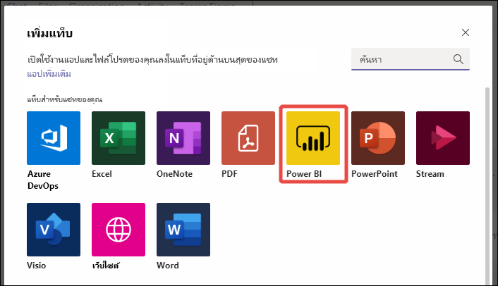
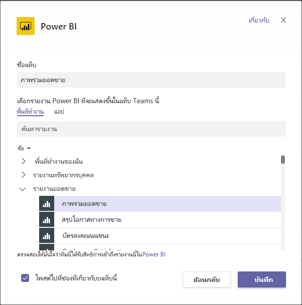
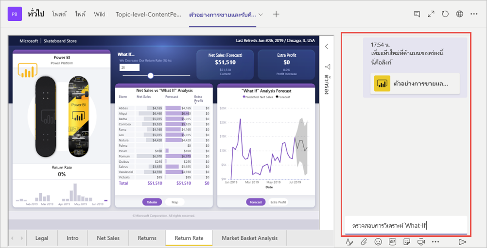

# ฝังเนื้อหา Power BI ใน Microsoft Teams

คุณสามารถฝังรายงาน Power BI แบบโต้ตอบในช่องทางการสื่อสารและการสนทนาของ Microsoft Teams ได้อย่างง่ายดาย 

## ข้อกำหนด

หากต้องการใช้แท็บ **Power BI** ใน Microsoft Teams ให้ตรวจสอบองค์ประกอบต่าง ๆ เหล่านี้:

- Microsoft Teams มีแท็บ **Power BI**
- หากต้องการเพิ่มรายงานใน Microsoft Teams ด้วยแท็บ **Power BI** อย่างน้อยคุณต้องมีบทบาทผู้ชมในพื้นที่ทำงานที่โฮสต์รายงาน ดู[บทบาทในพื้นที่ทำงานใหม่](service-new-workspaces.md#roles-in-the-new-workspaces)สำหรับข้อมูลเกี่ยวกับบทบาทที่แตกต่างกัน
- หากต้องการดูรายงานในแท็บ **Power BI** ใน Microsoft Teams ผู้ใช้ต้องมีสิทธิ์ในการดูรายงาน
- ผู้ใช้จะต้องเป็นผู้ใช้  Microsoft Teams ที่มีสิทธิ์เข้าถึงช่องและการสนทนา

ดู[การทำงานร่วมกันใน Microsoft Teams ด้วย Power BI](service-embed-report-microsoft-teams.md) สำหรับเบื้องหลังเกี่ยวกับวิธีที่ระบบ Power Bi และ Teams ทำงานร่วมกัน รวมถึงข้อกำหนดต่าง ๆ ด้วย

## ฝังรายงานใน Teams

ทำตามขั้นตอนเหล่านี้เพื่อฝังรายงานของคุณลงในแชนเนลหรือแชทของ Microsoft Teams

1. เปิดแชนเนลหรือแชทใน Microsoft Teams และเลือกไอคอน **+**

    

1. เลือกแท็บ **Power BI**

    

1. ใช้ตัวเลือกที่ให้มาเพื่อเลือกรายงานจากพื้นที่ทำงานหรือแอป Power BI

    

1. ชื่อแท็บจะอัปเดตโดยอัตโนมัติเพื่อให้ตรงกับชื่อของชื่อรายงาน แต่คุณสามารถเปลี่ยนได้

1. เลือก**บันทึก**

### รายงานที่คุณสามารถฝังบนแท็บ Power BI ได้

คุณสามารถฝังรายงานประเภทต่อไปนี้ได้บนแท็บ **Power BI**:

- รายงานแบบโต้ตอบและรายงานที่มีการแบ่งหน้า
- รายงานใน**พื้นที่ทำงานของฉัน** ประสบการณ์พื้นที่ทำงานใหม่ และพื้นที่ทำงานแบบคลาสสิก
- รายงานในแอป Power BI

## เริ่มการสนทนา

เมื่อคุณเพิ่มแท็บรายงาน Power BI ไปยัง Microsoft Teams  Teams จะสร้างแท็บการสนทนาสำหรับรายงานโดยอัตโนมัติ

- เลือกไอคอน**แสดงแท็บการสนทนา**ในมุมบนขวา

    

    ข้อคิดเห็นแรกคือการเชื่อมโยงไปยังรายงาน ทุกคนในช่องของ Microsoft Teams สามารถดูและพูดคุยเกี่ยวกับรายงานในการสนทนาได้

    

## ปัญหาและขีดจำกัดที่ทราบแล้ว

- คุณไม่สามารถฝังแดชบอร์ด Power BI ลงในแท็บ **Power BI** สำหรับ Microsoft Teams ได้
- ไม่รองรับ[ตัวกรอง URL](service-url-filters.md) ที่มีแท็บ **Power BI** สำหรับ Microsoft Teams
- ในระบบคลาวด์ภายในประเทศ แท็บ **Power BI** ใหม่ไม่พร้อมใช้งาน รุ่นที่เก่ากว่าอาจพร้อมใช้งานที่ไม่รองรับพื้นที่ทำงานใหม่ พื้นที่ทำงานที่เคยทำ หรือรายงานในแอป Power BI
- หลังจากที่คุณบันทึกแท็บแล้ว คุณไม่สามารถเปลี่ยนชื่อแท็บผ่านการตั้งค่าแท็บได้ ใช้ตัวเลือก**เปลี่ยนชื่อ**เพื่อดำเนินการเปลี่ยนชื่อ
- ดูปัญหาอื่น ๆ ที่หัวข้อ[ปัญหาที่ทราบแล้วและข้อจำกัดต่าง ๆ](service-collaborate-microsoft-teams.md#known-issues-and-limitations) ในบทความ “ทำงานร่วมกันใน Microsoft Teams"

## ขั้นตอนถัดไป

- [ทำงานร่วมกันใน Microsoft Teams ด้วย Power BI](service-collaborate-microsoft-teams.md)

มีคำถามเพิ่มเติมหรือไม่ [ลองถามชุมชน Power BI](https://community.powerbi.com/)
