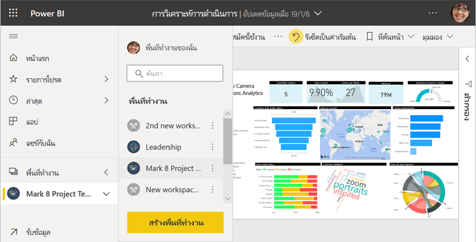
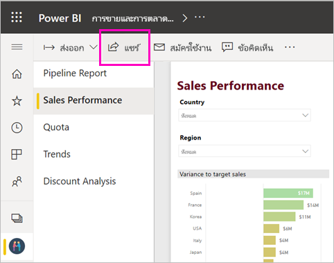
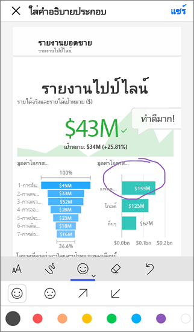
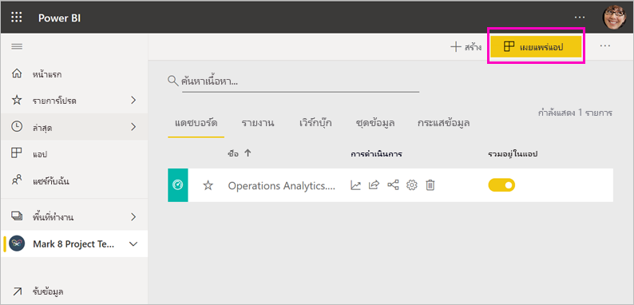
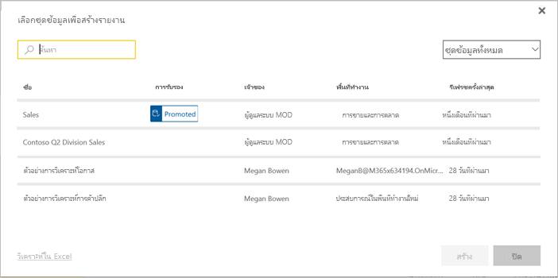

# วิธีในการทำงานร่วมกันและแชร์ใน Power BI

คุณได้สร้างแดชบอร์ดและรายงานแล้ว บางทีคุณอาจต้องการทำงานกับเพื่อนร่วมงานของคุณด้วย หรือบางทีคุณพร้อมที่จะเผยแพร่ข้อมูลเหล่านั้นให้กว้างขวางยิ่งขึ้น วิธีที่ดีที่สุดในการร่วมงานและแชร์คืออะไร ในบทความนี้ เราจะเปรียบเทียบตัวเลือกของคุณ

*แอปในบริการของ Power BI*

**ทำงานร่วมกัน**

- ทำงานร่วมกับเพื่อนร่วมงานใน *พื้นที่ทำงาน* เพื่อสร้างรายงานและแดชบอร์ดที่มีความหมาย
- ทำงานร่วมกันใน *Microsoft Teams*

**เผยแพร่หรือแชร์แดชบอร์ดและรายงาน**

- *แชร์แดชบอร์ดหรือรายงาน* จากพื้นที่ทำงานของฉันหรือพื้นทำงานอื่นของคุณได้
- อธิบายและแชร์จาก *แอปมือถือ* ของ Power BI ได้
- รวมแดชบอร์ดและรายงานเหล่านั้นลงใน *แอป* และเผยแพร่กับกลุ่มที่ใหญ่ขึ้นหรือให้กับทั้งองค์กรของคุณ
- ฝังรายงานใน *พอร์ทัลที่ปลอดภัย* หรือ *เว็บไซต์สาธารณะ*
- พิมพ์รายงาน
- สร้าง*แอปเทมเพลต*ที่คุณสามารถแจกจ่ายให้กับผู้ใช้ Power BI ภายนอกผ่านทาง Microsoft AppSource
 
**แชร์ข้อมูล**

- สร้าง *ชุดข้อมูลที่แชร์* ที่เพื่อนร่วมงานของคุณสามารถใช้เป็นเกณฑ์สำหรับรายงานของตัวเองในพื้นที่ทำงานของพวกเขาเอง
- สร้าง *กระแสข้อมูล* เป็นวิธีในการแชร์แหล่งข้อมูลทั่วไปร่วมกัน

ไม่ว่าคุณจะเลือกตัวเลือกไหนเพื่อแชร์เนื้อหาของคุณ คุณต้องมี[สิทธิ์การใช้งาน Power BI Pro](../fundamentals/service-features-license-type.md) หรือเนื้อหาจำเป็นต้องอยู่ใน[ความจุพรีเมียม](../admin/service-premium-what-is.md) ข้อกำหนดสิทธิ์การใช้งานสำหรับผู้ร่วมงานที่จะดูเนื้อหาของคุณ จะแตกต่างกันไป ขึ้นอยู่กับตัวเลือกที่คุณเลือก ส่วนต่อไปนี้คือรายละเอียด 

## ทำงานร่วมกันในพื้นที่ทำงาน

เมื่อทีมทำงานร่วมกัน พวกเขาจำเป็นต้องเข้าถึงเอกสารเดียวกันเพื่อให้พวกเขาสามารถทำงานร่วมกันได้อย่างง่ายดาย ในพื้นที่ทำงานของ Power BI ทีมจะแบ่งปันความเป็นเจ้าของและการจัดการแดชบอร์ด รายงาน ชุดข้อมูลและสมุดงาน ในบางครั้งผู้ใช้ Power BI จะจัดระเบียบพื้นที่ทำงานของพวกเขาตามโครงสร้างองค์กร หรือพวกเขาสร้างพื้นที่ทำงานสำหรับโครงการเฉพาะ องค์กรอื่นๆ ยังคงใช้หลายพื้นที่ทำงานเพื่อจัดเก็บรายงานหรือแดชบอร์ดเวอร์ชั่นอื่นที่พวกเขาใช้ 

พื้นที่ทำงานให้บทบาทที่กำหนดว่าเพื่อนร่วมงานของคุณมีสิทธิ์ใด ใช้บทบาทเหล่านั้นเพื่อกำหนดว่าใครสามารถจัดการพื้นที่ทำงาน แก้ไขหรือแจกจ่ายเนื้อหา หรือเพียงแค่ดูเนื้อหาเท่านั้น อ่านเพิ่มเติมเกี่ยวกับ[บทบาทในพื้นที่ทำงานใหม่](service-new-workspaces.md#roles-in-the-new-workspaces)

พื้นที่ทำงานดีกว่าสำหรับการทำงานร่วมกันมากกว่าพื้นที่ทำงานของฉัน เนื่องจากอนุญาตให้มีการเป็นเจ้าของเนื้อหาร่วมกัน คุณและทีมของคุณทั้งหมดสามารถอับเดตหรือ หรือให้ผู้อื่นเข้าถึงได้ง่าย พื้นที่ทำงานของฉันถูกใช้ โดยบุคคลต่างๆ เพียงครั้งเดียวหรือเพื่อเนื้อหาส่วนบุคคล

ตอนนี้จินตนาการว่าคุณมีแดชบอร์ดที่เสร็จแล้วที่คุณต้องการแบ่งปันกับเพื่อนร่วมงานของคุณ วิธีที่ดีที่สุดในการให้พวกเขาสามารถเข้าถึงแดชบอร์ดคืออะไร? คำตอบขึ้นอยู่กับหลายปัจจัย 

- หากเพื่อนร่วมงานต้องการทำให้แดชบอร์ดเป็นปัจจุบัน หรือต้องการเข้าถึงเนื้อหาทั้งหมดในพื้นที่ทำงานให้เพิ่มพวกเขาไปยังพื้นที่ทำงานในฐานะสมาชิกหรือผู้ร่วมให้ข้อมูล 
- หากเพื่อนร่วมงานต้องการเพียงดูเนื้อหาในพื้นที่ทำงานให้เพิ่มพวกเขาเป็นผู้ชม
- หากเพื่อนร่วมงานต้องการเห็นแดชบอร์ดนั้นและไม่ได้ดูเนื้อหาทั้งหมดในพื้นที่ทำงาน คุณสามารถแชร์แดชบอร์ดกับพวกเขาได้โดยตรง
- หากแดชบอร์ดเป็นส่วนหนึ่งของชุดแดชบอร์ดและรายงานที่คุณต้องเผยแพร่ให้เพื่อนร่วมงานหลายคน การเผยแพร่ *แอป* น่าจะเป็นตัวเลือกที่ดีที่สุด

อ่านเกี่ยวกับวิธีการ [สร้างพื้นที่ทำงานใหม่](service-create-the-new-workspaces.md) 

## ทำงานร่วมกันใน  Microsoft Teams

เพิ่มการทำงานร่วมกันซึ่งขับเคลื่อนด้วยข้อมูลในองค์กรของคุณโดยการฝังรายงาน Power BI และรายงาน Power BI ที่ระบุหมายเลขหน้าใน Microsoft Teams บริการของ Power BI มีปุ่ม **แชร์กันในทีม** สำหรับรายงาน คุณสามารถเพิ่มแท็บ Power BI แยกต่างหากสำหรับรายงานแต่ละรายการ และกำหนดชื่อรายงานหรือชื่ออื่น ๆ ให้แต่ละแท็บ 

เมื่อคุณเพิ่มแท็บรายงาน Power BI ไปยัง Microsoft Teams ทีมงานจะสร้างแท็บการสนทนาสำหรับรายงานโดยอัตโนมัติ ทุกคนในช่องของ Microsoft Teams นั้นสามารถดูและพูดคุยเกี่ยวกับรายงานในการสนทนาได้ 

:::image type="content" source="media/service-how-to-collaborate-distribute-dashboards-reports/power-bi-teams-conversation-tab.png" alt-text="แท็บการสนทนาของ Microsoft Teams":::

อ่านเพิ่มเติมเกี่ยวกับ [การทำงานร่วมกันใน Microsoft Teams ด้วย Power BI](service-collaborate-microsoft-teams.md)

## แชร์แดชบอร์ดและรายงาน

สมมติว่าคุณสรุปรายงานใน Power BI Desktop แล้ว และคุณต้องการให้ผู้อื่นสามารถเข้าถึงได้ วิธีหนึ่งคือการ *แชร์* ให้พวกเขาในบริการของ Power BI คุณเผยแพร่ไปยังพื้นที่ทำงานของฉันหรือพื้นที่ทำงานอื่น บางทีคุณอาจสร้างแดชบอร์ดเพื่อไปพร้อมกันและคุณก็พร้อมแล้ว

คุณต้องสิทธิ์การใช้งาน Power BI Pro เพื่อแชร์เนื้อหาของคุณ คนที่คุณแชร์ด้วยทำได้เช่นกัน หรือเนื้อหาต้องอยู่ในพื้นที่ทำงานใน [ความจุแบบพรีเมียม](../admin/service-premium-what-is.md) เมื่อคุณแชร์แดชบอร์ดหรือรายงาน ผู้รับสามารถดู และโต้ตอบกับข้อมูลได้ ถ้าคุณให้สิทธิ์แก่พวกเขา พวกเขาสามารถแก้ไขได้ ทำสำเนาและแชร์กับเพื่อนร่วมงานของพวกเขาได้ด้วย พวกเขาจะเห็นข้อมูลเดียวกันกับที่คุณเห็นในแดชบอร์ดหรือรายงาน พวกเขามีสิทธิ์เข้าถึงข้อมูลทั้งหมดในชุดข้อมูลเบื้องต้น เว้นแต่จะมีการใช้ [การรักษาความปลอดภัยระดับแถว (RLS)](../admin/service-admin-rls.md)

คุณสามารถแชร์ให้กับบุคคลภายนอกองค์กรได้ด้วย พวกเขาสามารถดู และโต้ตอบกับแดชบอร์ด หรือรายงานได้ แต่ไม่สามารถแชร์ได้ 

อ่านเกี่ยวกับวิธี [การแชร์แดชบอร์ดและรายงาน](service-share-dashboards.md) จากบริการของ Power BI หรืออ่านเกี่ยวกับการเพิ่มตัวกรองในลิงก์และ [แชร์มุมมองที่กรองแล้วของรายงานของคุณ](service-share-reports.md)

## ใส่คำอธิบายประกอบ และแชร์จากแอป Power BI สำหรับอุปกรณ์เคลื่อนที่

ในแอป Power BI สำหรับอุปกรณ์เคลื่อนที่ สำหรับ iOS และ Android คุณสามารถใส่คำอธิบายประกอบไทล์ รายงาน หรือ วิชวล แล้วแชร์ให้กับใครก็ได้ผ่านทางอีเมล

คุณกำลังแชร์สแนปช็อตของไทล์ รายงานหรือวิชวล ผู้รับของคุณเห็นเหมือนกับเวลาที่คุณส่งเมล เมลยังมีลิงก์ไปยังแดชบอร์ดหรือรายงาน หากพวกเขามีสิทธิ์การใช้งาน Power BI Pro หรือเนื้อหาที่อยู่ใน [ความจุแบบพรีเมียม](../admin/service-premium-what-is.md) และคุณได้แชร์เนื้อหากับพวกเขาแล้ว พวกเขาก็สามารถเปิดดูได้ คุณสามารถส่งสแนปช็อตของไทล์ให้กับใครก็ได้ ไม่เพียงแต่ผู้ร่วมงานในโดเมนอีเมลเดียวกันเท่านั้น

อ่านเพิ่มเติมเกี่ยวกับ[การใส่คำอธิบายประกอบ และการแชร์ไทล์ รายงาน และวิชวล](../consumer/mobile/mobile-annotate-and-share-a-tile-from-the-mobile-apps.md)จากแอปมือถือ iOS และ Android

คุณยังสามารถ[แชร์สแนปช็อตของไทล์](../consumer/mobile/mobile-windows-10-phone-app-get-started.md) จากแอป Power BI สำหรับอุปกรณ์ของ Windows 10 ได้ แต่ไม่สามารถใส่คำอธิบายประกอบได้

## แจกจ่ายข้อมูลเชิงลึกในแอป

สมมุติว่า คุณต้องการแจกจ่ายแดชบอร์ดของคุณให้กับผู้ชมในองค์กรของคุณ คุณและเพื่อนร่วมงานของคุณได้สร้าง*พื้นที่ทำงาน* จากนั้นจึงได้สร้างและกำหนดแดชบอร์ด รายงาน และชุดข้อมูลในพื้นที่ทำงาน ตอนนี้คุณเลือกแดชบอร์ดและรายงานและเผยแพร่เป็น *แอป* ไม่ว่าจะเป็นกลุ่มหรือกับทั้งองค์กรของคุณ

สามารถค้นหาและติดตั้งแอปได้ง่าย ๆ ในบริการของ Power BI ([https://app.powerbi.com](https://app.powerbi.com)) คุณสามารถส่งลิงก์โดยตรงไปยังแอป ให้กับผู้ใช้ทางธุรกิจ หรือพวกเขาสามารถค้นหาได้ใน AppSource ถ้าผู้ดูแลระบบ Power BI ของคุณ ให้สิทธิ์แก่คุณ คุณสามารถติดตั้งแอปลงในบัญชีผู้ใช้ Power BI ของเพื่อนร่วมงานคุณโดยอัตโนมัติ อ่านเกี่ยวกับวิธีการ [เผยแพร่แอป](service-create-distribute-apps.md)

หลังจากติดตั้งแอปแล้วพวกเขาสามารถดูได้ในเบราว์เซอร์หรืออุปกรณ์มือถือของพวกเขา

สำหรับผู้ใช้ของคุณในการดูแอปของพวกเขา พวกเขาต้องการสิทธิ์ใช้งาน Power BI Pro ด้วยหรือจำเป็นต้องจัดเก็บแอปในความจุแบบพรีเมียมของ Power BI อ่าน[Power BI Premium คืออะไร](../admin/service-premium-what-is.md)สำหรับรายละเอียด

คุณสามารถเผยแพร่แอปไปยังบุคคลภายนอกองค์กรของคุณได้เช่นกัน พวกเขาสามารถดูและโต้ตอบกับเนื้อหาแอป แต่ไม่สามารถแชร์แอปกับผู้อื่นได้ ตอนนี้ คุณสามารถสร้าง *แอปเทมเพลม* และปรับใช้กับลูกค้า Power BI ใดๆ ก็ได้

## ฝังรายงานในพอร์ทัลที่ปลอดภัยหรือเว็บไซต์สาธารณะ

### ฝังในพอร์ทัลที่ปลอดภัย

คุณสามารถฝังรายงาน Power BI ในพอร์ทัลหรือเว็บไซต์ที่ผู้ใช้ของคุณควรจะเห็นได้  
ด้วยการ **ฝังใน SharePoint Online** และตัวเลือก **แบบฝัง** ในบริการ Power BI ช่วยให้คุณสามารถฝังรายงานสำหรับผู้ใช้ภายในของคุณได้อย่างปลอดภัย ตัวเลือกใดที่คุณเลือก Power BI จะบังคับใช้สิทธิ์และความปลอดภัยของข้อมูลทั้งหมดก่อนที่ผู้ใช้จะสามารถดูเนื้อหาได้ ผู้ที่ดูรายงานนั้นจำเป็นต้องมีใบอนุญาตที่เหมาะสม  

- **ฝังใน SharePoint Online**ทำงานกับ Power BI web part สำหรับ SharePoint Online ซึ่งจะมอบประสบการณ์การลงชื่อเข้าระบบครั้งเดียวโดยมีการควบคุมวิธีการฝังรายงาน อ่านเพิ่มเติมเกี่ยวกับ [การฝังใน SharePoint Online](service-embed-report-spo.md)
- **การฝัง**ทำงานร่วมกับพอร์ทัลหรือเว็บไซต์ใดก็ได้ที่รองรับเนื้อหาการฝังโดยใช้ URL หรือ iFrame อ่านเพิ่มเติมเกี่ยวกับตัวเลือก [การฝัง](service-embed-secure.md)

### เผยแพร่ไปยังเว็บไซต์สาธารณะ

ด้วยการ **เผยแพร่ไปยังเว็บ** คุณสามารถเผยแพร่รายงาน Power BI ไปยังอินเทอร์เน็ตทั้งหมด โดยการฝังตัวการแสดงภาพลงในบล็อกโพสต์ เว็บไซต์ โซเชียลมีเดีย และการสื่อสารทางออนไลน์อื่นๆ ทุกคนบนอินเทอร์เน็ตสามารถดูรายงานของคุณ และคุณไม่สามารถควบคุมว่าใครสามารถดูสิ่งที่คุณได้เผยแพร่แล้ว พวกเขาไม่จำเป็นต้องมีใบอนุญาต Power BI การเผยแพร่ไปยังเว็บ มีเฉพาะรายงานที่คุณสามารถแก้ไขได้เท่านั้น คุณไม่สามารถเผยแพร่รายงานไปยังเว็บ ถ้ารายงานถูกแชร์มาให้คุณ หรือ ถ้ารายงานอยู่ในแอป อ่านเกี่ยวกับวิธีการ [เผยแพร่ไปยังเว็บ](service-publish-to-web.md)

>[!Warning]
>ใช้[เผยแพร่ไปยังเว็บ](service-publish-to-web.md)เท่านั้นเมื่อต้องแชร์เนื้อหาต่อสาธารณะ ไม่ใช่เพื่อการแชร์ภายใน

## พิมพ์ หรือบันทึกเป็น PDF หรือไฟล์แบบคงที่อื่น ๆ

จากบริการ Power BI คุณสามารถพิมพ์บันทึกเป็น PDF หรือบันทึกเป็นรูปแบบไฟล์คงที่อื่นๆ หรือรายการใดๆ เหล่านี้:

- แดชบอร์ดทั้งหมด
- ไทล์ของแดชบอร์ด
- หน้ารายงาน
- รายงานที่มีการแบ่งหน้า
- การแสดงภาพจากบริการของ Power BI 

คุณสามารถพิมพ์รายงาน Power BI ได้ครั้งละหนึ่งหน้าเท่านั้น คุณไม่สามารถพิมพ์รายงานทั้งหมดในครั้งเดียว อ่านเกี่ยวกับวิธีการ [พิมพ์หรือบันทึกรายงานหรือแดชบอร์ดเป็นไฟล์แบบคงที่](../consumer/end-user-print.md)

รายงานที่มีการแบ่งหน้าในทางกลับกันคือรายงานที่ออกแบบมาเพื่อการพิมพ์ อ่าน [การเปรียบเทียบของรายงาน Power BI และรายงานที่มีการแบ่งหน้า](../paginated-reports/paginated-reports-report-builder-power-bi.md#compare-power-bi-reports-and-paginated-reports) สำหรับรายละเอียด 

## สร้างและปรับใช้แอปเทมเพลต

*แอปเทมเพลต*ได้รับการออกแบบมาเพื่อเผยแพร่สู่สาธารณะ ส่วนใหญ่ใน Microsoft AppSource คุณสร้างแอป และมีการเข้ารหัสเพียงเล็กน้อยหรือไม่มีเลย คุณสามารถปรับใช้กับลูกค้า Power BI ได้ ลูกค้าของคุณเชื่อมต่อกับข้อมูลของตนเอง และสร้างอินสแตนซ์ของบัญชีของตนเอง อ่านเพิ่มเติมเกี่ยวกับ[แอปเทมเพลตของ Power BI](../connect-data/service-template-apps-overview.md)

## แชร์ชุดข้อมูล

ต้องยอมรับว่า บางคนมีทักษะมากกว่าในการสร้างรูปแบบข้อมูลคุณภาพสูง ออกแบบมาอย่างดีในรายงานของตน คุณอาจจะเป็นบุคคลนั้นก็ได้ ทั้งองค์กรของคุณสามารถใช้ประโยชน์จากการใช้รูปแบบข้อมูลที่ออกแบบมาอย่างดีเดียวกัน *ชุดข้อมูลที่แชร์*จะเติมบทบาทนั้น เมื่อคุณสร้างรายงานด้วยรูปแบบข้อมูลที่ทุกคนควรใช้ คุณสามารถบันทึกรายงานดังกล่าวไปยังบริการของ Power BI และให้สิทธิ์การใช้กับบุคคลเหมาะสม จากนั้น พวกเขาสามารถสร้างรายงานของตนบนชุดข้อมูลของคุณได้ ด้วยวิธีดังกล่าว ทุกคนจะยึดรายงานของตนด้วยข้อมูลเดียวกัน และมองเห็น "ความจริง" ในทิศทางเดียวกัน

อ่านเพิ่มเติมเกี่ยวกับ[การสร้างและการใช้ชุดข้อมูลที่แชร์](../connect-data/service-datasets-across-workspaces.md)

## สร้างกระแสข้อมูล

*กระแสข้อมูล* เป็นวิธีการบริการตนเองเพื่อรวมข้อมูลจากแหล่งข้อมูลที่แตกต่างกันและเตรียมสำหรับการสร้างแบบจำลอง นักวิเคราะห์สร้างกระแสข้อมูลเพื่อนำเข้า แปลง รวมและทำให้ข้อมูลใหญ่ขึ้น พวกเขาสร้างและจัดการกระแสข้อมูลในพื้นที่ทำงานในบริการของ Power BI อ่านเกี่ยวกับ [บริการเตรียมข้อมูลด้วยตัวเองโดยใช้กระแสข้อมูล](../transform-model/service-dataflows-overview.md)

## ข้อควรพิจารณาและข้อจำกัด

- คุณไม่สามารถแชร์รายงานจากเซิร์ฟเวอร์รายงานของ Power BI ได้ แต่คุณสามารถสร้าง [การสมัครใช้งาน สำหรับตัวคุณเองหรือผู้อื่น](/sql/reporting-services/working-with-subscriptions-web-portal) ได้

## ขั้นตอนถัดไป

- [แชร์แดชบอร์ดกับเพื่อนร่วมงานและผู้อื่น](service-share-dashboards.md)
- [สร้างและเผยแพร่แอปใน Power BI](service-create-distribute-apps.md)
- [ฝังรายงานในพอร์ทัลความปลอดภัยหรือเว็บไซต์](service-embed-secure.md)

มีคำติชมหรือไม่? ไปที่[ไซต์ชุมชน Power BI](https://community.powerbi.com/) พร้อมกับคำแนะนำของคุณ

มีคำถามเพิ่มเติมหรือไม่ [ลองไปที่ชุมชน Power BI](https://community.powerbi.com/)
