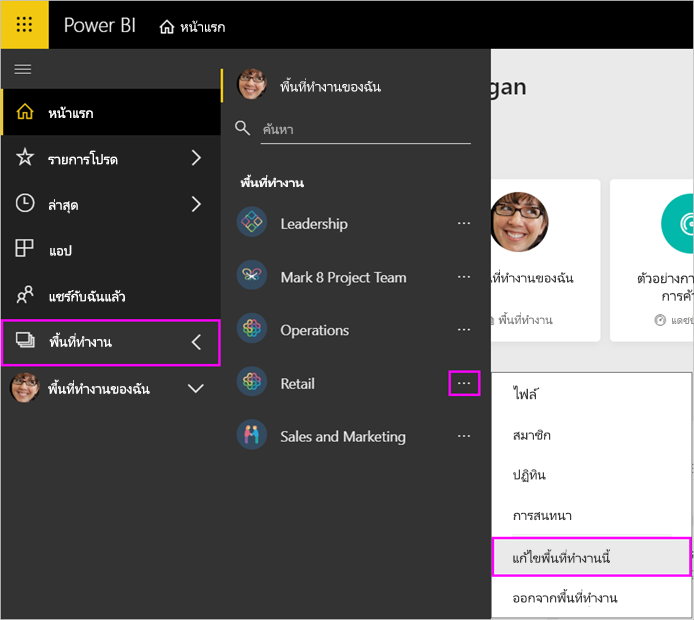
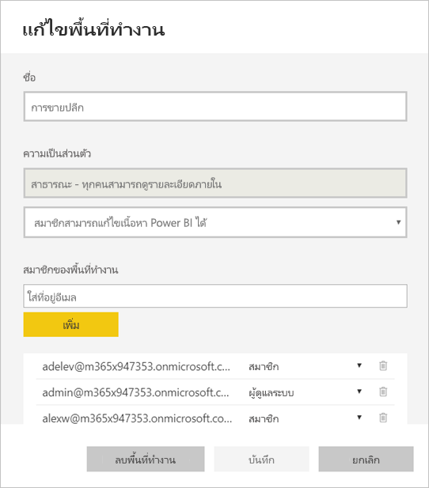
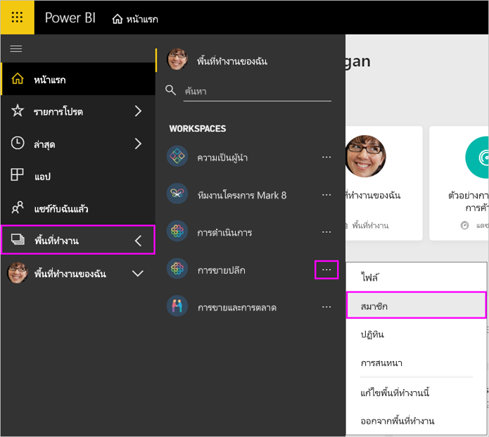
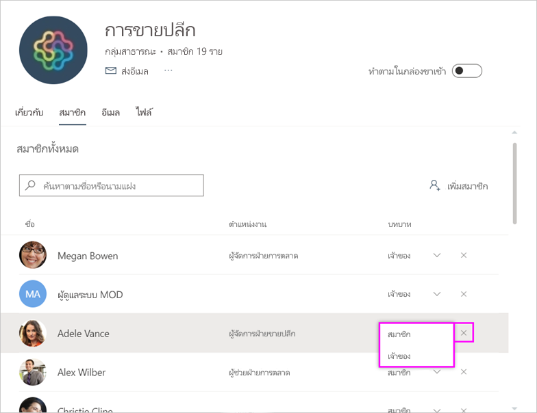
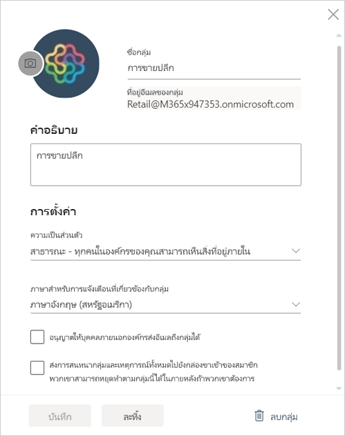

# จัดการพื้นที่ทำงานของคุณใน Power BI และ Microsoft 365

ในฐานะผู้สร้างหรือผู้ดูแลระบบของ[พื้นที่ทำงานใน Power BI](service-create-distribute-apps.md)หรือใน Microsoft 365 คุณสามารถจัดการลักษณะบางส่วนของพื้นที่ทำงานใน Power BI ลักษณะอื่น ๆ ที่คุณจัดการใน Microsoft 365

> [!NOTE]
> ประสบการณ์พื้นที่ทำงานใหม่จะเปลี่ยนความสัมพันธ์ระหว่างพื้นที่ทำงาน Power BI และ Microsoft 365 Group คุณจะไม่สามารถสร้าง Microsoft 365 Group โดยอัตโนมัติทุกครั้งที่คุณสร้างพื้นที่ทำงานใหม่ อ่านเกี่ยวกับ [สร้างพื้นที่ทำงานใหม่](service-create-the-new-workspaces.md)

ใน **Power BI** คุณสามารถ:

* เพิ่มหรือลบสมาชิกพื้นที่ทำงาน รวมถึงการทำให้สมาชิกพื้นที่ทำงานเป็นผู้ดูแลระบบ
* แก้ไขชื่อพื้นที่ทำงาน
* ลบพื้นที่ทำงาน ซึ่งจะลบ Microsoft 365 Group ออกด้วย

ใน **Microsoft 365** คุณสามารถ:

* เพิ่มหรือลบสมาชิกกลุ่มพื้นที่ทำงาน รวมถึงการทำให้สมาชิกเป็นเจ้าของ
* แก้ไขชื่อกลุ่ม รูปภาพ คำอธิบาย และการตั้งค่าอื่นๆ
* ดูที่อยู่อีเมลของกลุ่ม
* ลบกลุ่ม

คุณจำเป็นต้องมี[สิทธิ์การใช้งาน Power BI Pro](../fundamentals/service-features-license-type.md) ในการเป็นผู้ดูแลระบบหรือสมาชิกของพื้นที่ทำงาน ผู้ใช้แอปของคุณต้องมีสิทธิ์ใช้งาน Power BI Pro เช่นกัน ยกเว้นว่าพื้นที่ทำงานของคุณจะอยู่ในความจุ Power BI Premium อ่าน[Power BI Premium คืออะไร](../admin/service-premium-what-is.md)สำหรับรายละเอียด

## แก้ไขพื้นที่ทำงานใน Power BI

1. ในบริการของ Power BI เลือกลูกศรที่อยู่ถัดจาก**พื้นที่ทำงาน** > เลือก **ตัวเลือกเพิ่มเติม** (...) ถัดจากชื่อพื้นที่ทำงานของคุณ > **แก้ไขพื้นที่ทำงานนี้**

   

   > [!NOTE]
   > คุณเห็นเฉพาะ **แก้ไขพื้นที่ทำงานนี้** ถ้าคุณเป็นผู้ดูแลระบบพื้นที่ทำงาน

1. ที่นี่คุณสามารถเปลี่ยนชื่อพื้นที่ทำงาน เพิ่ม หรือลบสมาชิกออก หรือลบพื้นที่ทำงานได้

   

1. เลือก**บันทึก**หรือ**ยกเลิก**

## แก้ไขคุณสมบัติพื้นที่ทำงาน Power BI ใน Microsoft 365

คุณยังสามารถแก้ไขลักษณะของพื้นที่ทำงานได้โดยตรงใน Outlook for Microsoft 365

### แก้ไขสมาชิกของกลุ่มพื้นที่ทำงาน

1. ในบริการของ Power BI เลือกลูกศรอยู่ถัดจาก**พื้นที่ทำงาน** > เลือก **ตัวเลือกเพิ่มเติม** (... ) ถัดจากชื่อพื้นที่ทำงานของคุณ > **สมาชิก**

   

   การดำเนินการนี้จะเปิดมุมมอง Outlook for Microsoft 365 Group ของพื้นที่ทำงาน คุณอาจจำเป็นต้องลงชื่อเข้าใช้บัญชีขององค์กรของคุณ

1. เลือกบทบาทถัดจากชื่อเพื่อนร่วมทีมเพื่อให้บุคคลนั้นเป็น **สมาชิก** หรือ **เจ้าของ** เลือก **X** เพื่อลบบุคคลออกจากกลุ่ม

   

### เพิ่มรูปภาพ และตั้งค่าคุณสมบัติพื้นที่ทำงานอื่นๆ

เมื่อคุณเผยแพร่แอปของคุณจากพื้นที่ทำงาน รูปภาพที่คุณเพิ่มที่นี่จะเป็นรูปภาพสำหรับแอปของคุณ ดูหัวข้อ [เพิ่มรูปภาพในพื้นที่ทำงาน Microsoft 365](service-create-workspaces.md#add-an-image-to-your-microsoft-365-workspace-optional) ในบทความ **สร้างพื้นที่ทำงานใหม่**

1. ในมุมมอง Outlook for Microsoft 365 ของพื้นที่ทำงาน ให้ไปที่แท็บ **เกี่ยวกับ** แล้วเลือก **แก้ไข**

    
1. คุณสามารถแก้ไขชื่อ คำอธิบาย และภาษาสำหรับการแจ้งเตือนที่เกี่ยวข้องกับกลุ่มได้ คุณยังสามารถเพิ่มรูปภาพ และตั้งค่าคุณสมบัติอื่นได้ ที่นี่

   

1. เลือก**บันทึก**หรือ**ละทิ้ง**

## ขั้นตอนถัดไป

* [เผยแพร่แอปใน Power BI](service-create-distribute-apps.md)

* มีคำถามเพิ่มเติมหรือไม่ [ลองไปที่ชุมชน Power BI](https://community.powerbi.com/)
