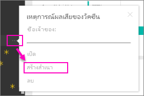

# ชุดเนื้อหาระดับองค์กร: คัดลอก รีเฟรช และเข้าถึง

เมื่อมีชุดเนื้อหาระดับองค์กรการเผยแพร่ ผู้รับทั้งหมดดูแดชบอร์ รายงาน เวิร์กบุ๊ก Excel ชุดข้อมูล และข้อมูล (ยกเว้นแหล่งข้อมูลของ SQL Server Analysis Services (SSAS))เดียวกัน  [ผู้สร้างชุดเนื้อหาเท่านั้นที่สามารถแก้ไข และประกาศ](service-organizational-content-pack-manage-update-delete.md)ชุดเนื้อหาได้  อย่างไรก็ตาม ผู้รับทั้งหมดสามารถบันทึกสำเนาของชุดเนื้อหาที่สามารถ live ควบคู่ไปกับต้นฉบับ

กำลังสร้างชุดเนื้อหาที่จะแตกต่างจากการแชร์แดชบอร์ดหรือการทำงานร่วมกันบนชุดเนื้อหาเหล่านั้นในกลุ่ม อ่าน[ฉันควรทำงานร่วมกันและแชร์แดชบอร์ดและรายงานอย่างไร](service-how-to-collaborate-distribute-dashboards-reports.md) เพื่อตัดสินใจเลือกตัวเลือกที่ดีที่สุดสำหรับสถานการณ์ของคุณ

> [!NOTE]
> คุณไม่สามารถสร้างหรือติดตั้งชุดเนื้อหาขององค์กรในประสบการณ์ในพื้นที่ทำงานใหม่ได้ ตอนนี้ คือเวลาดีที่จะอัปเกรดชุดเนื้อหาของคุณไปยังแอป ถ้าคุณยังไม่ได้เริ่มต้น เรียนรู้[เพิ่มเติมเกี่ยวกับการใช้งานพื้นที่ทำงานใหม่](service-create-the-new-workspaces.md)
>

## สร้างสำเนาของข้อแพ็คเนื้อหาขององค์กร
สร้างสำเนาของคุณเองของชุดเนื้อหา ที่ผู้อื่นไม่สามารถมองเห็น

1. เลือก**ตัวเลือกเพิ่มเติม** (...) ที่อยู่ถัดจากแดชบอร์ดชุดเนื้อหา > ทำสำเนา

    
2. เลือก**บันทึก**  

ในตอนนี้คุณมีสำเนาที่คุณสามารถเปลี่ยนได้ บุคคลอื่นจะเห็นการเปลี่ยนแปลงที่คุณทำ

> [!NOTE]
> ก่อนหน้านี้ แต่ละครั้งที่คุณติดตั้งชุดเนื้อหาหรือสร้างสำเนา หนึ่งชุดข้อมูลใหม่จะปรากฏในรายการเนื้อหาพื้นที่ทำงาน การอัปเดตล่าสุดประยุกต์ประสบการณ์การใช้งานเพื่อแสดงเพียงหนึ่งรายการโดยใช้ไอคอนอ้างอิงชุดข้อมูลใหม่:
>
> 
>

## ความช่วยเหลือ  ฉันไม่สามารถเข้าถึงชุดเนื้อหาได้
ซึ่งสามารถเกิดขึ้นได้จากสาเหตุหลายประการ

* **เปลี่ยนแปลงการเป็นสมาชิก**:  ชุดเนื้อหาถูกเผยแพร่ไปยังกลุ่มการกระจายอีเมล กลุ่มความปลอดภัย และ [กลุ่ม Power BI ที่อ้างอิงจาก Microsoft 365](https://support.office.com/article/Create-a-group-in-Office-365-7124dc4c-1de9-40d4-b096-e8add19209e9)  ถ้าคุณจะถูกลบออกจากกลุ่ม คุณจะไม่สามารถเข้าถึงชุดเนื้อหาได้
* **เปลี่ยนแปลงการเผยแพร่** ผู้สร้างแพคเนื้อหาเปลี่ยนแปลงการเผยแพร่ ตัวอย่างเช่น ถ้าชุดเนื้อหานี้ถูกเผยแพร่ครั้งแรกทั่วทั้งองค์กร แต่ผู้สร้างเผยแพร่อีกครั้งให้กับผู้ชมที่มีขนาดเล็กกว่า คุณอาจไม่ถูกรวมอยู่ด้วย
* **เปลี่ยนแปลงการตั้งค่าความปลอดภัย**: ถ้าแดชบอร์ดและรายงานที่เชื่อมต่อกับแหล่งข้อมูล SSAS ภายในองค์กร และการเปลี่ยนแปลงการตั้งค่าความปลอดภัย อาจสามารถเพิกถอนสิทธิ์ของคุณในเซิร์ฟเวอร์ได้

## รีเฟรชชุดเนื้อหาระดับองค์กรทำอย่างไร
เมื่อมีการสร้างชุดเนื้อหา การตั้งค่าการรีเฟรชจะถูกสืบทอดกับชุดข้อมูล  เมื่อคุณสร้างสำเนาชุดเนื้อหา เวอร์ชันใหม่ยังมีลิงก์ไปยังชุดข้อมูลต้นฉบับและกำหนดการการรีเฟรช

ดู[จัดการ ปรับปรุง และลบชุดเนื้อหาระดับองค์กร](service-organizational-content-pack-manage-update-delete.md)

## ขั้นตอนถัดไป
* [แนะนำชุดเนื้อหาองค์กร](service-organizational-content-pack-introduction.md)
* [สร้างกลุ่มใน Power BI](service-create-distribute-apps.md)
* มีคำถามเพิ่มเติมหรือไม่ [ลองไปที่ชุมชน Power BI](https://community.powerbi.com/)
