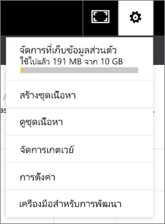

# จัดการ อัปเดต และลบชุดเนื้อหาองค์กร
> [!NOTE]
> คุณไม่สามารถสร้างชุดเนื้อหาขององค์กร หรือติดตั้งชุดเนื้อหาดังกล่าวในประสบการณ์ในพื้นที่ทำงานใหม่ ตอนนี้ คือเวลาดีที่จะอัปเกรดชุดเนื้อหาของคุณไปยังแอป ถ้าคุณยังไม่ได้เริ่มต้น เรียนรู้[เพิ่มเติมเกี่ยวกับการใช้งานพื้นที่ทำงานใหม่](service-create-the-new-workspaces.md)
> 

อ่านเกี่ยวกับการรวมชุดแดชบอร์ด รายงาน เวิร์กบุ๊ก Excel และชุดข้อมูลของคุณลงใน[ชุดเนื้อหาองค์กร](service-organizational-content-pack-introduction.md) เพื่อนร่วมงานของคุณสามารถใช้งานได้แบบเป็น หรือพวกเขาสามารถสร้างสำเนาของตนเองได้

กำลังสร้างชุดเนื้อหาที่จะแตกต่างจากการแชร์แดชบอร์ดหรือการทำงานร่วมกันบนชุดเนื้อหาเหล่านั้นในกลุ่ม อ่าน[ฉันควรทำงานร่วมกันและแชร์แดชบอร์ดและรายงานอย่างไร](service-how-to-collaborate-distribute-dashboards-reports.md) เพื่อตัดสินใจเลือกตัวเลือกที่ดีที่สุดสำหรับสถานการณ์ของคุณ

คุณสามารถทำงานแพ็คเนื้อหาขององค์กรบางอย่างเท่านั้น ถ้าคุณเป็นผู้สร้างชุดเนื้อหา:

* เผยแพร่อีกครั้ง
* จำกัดหรือขยายการเข้าถึงชุดเนื้อหา
* ตั้งค่าและเปลี่ยนแปลงการรีเฟรชตามกำหนดการ
* ลบชุดเนื้อหา

## ปรับเปลี่ยน และเผยแพร่เป็นแพ็คเนื้อหาขององค์กรอีกครั้ง
ถ้าคุณทำการเปลี่ยนไปยังแดชบอร์ดของชุดเนื้อหาต้นฉบับ รายงาน หรือสมุดงาน Excel, Power BI จะถามให้คุณทำการเผยแพร่อีกครั้ง นอกจากนี้ ในฐานะผู้สร้างชุดเนื้อหา คุณสามารถปรับปรุงตัวเลือกที่คุณเลือกในหน้าต่างการสร้างชุดเนื้อหาเมื่อคุณกำลังสร้างชุดเนื้อหาต้นฉบับ 

## เผยแพร่ด้วยเนื้อหาใหม่
เมื่อคุณทำบันทึกการเปลี่ยนแปลงไปยังแดชบอร์ดที่คุณรวมอยู่ในชุดเนื้อหา Power BI จะแจ้งเตือนคุณให้อัปเดตเพื่อให้ผู้อื่นสามารถเห็นการเปลี่ยนแปลง ตัวอย่างเช่น ถ้าคุณปักหมุดไทล์ใหม่ หรือเพียงแค่เปลี่ยนชื่อของแดชบอร์ด

1. เลือก**ชุดเนื้อหามอง**ในข้อความ
   
   
2. หรือเลือกไอคอนฟันเฟืองที่มุมบนขวา  และเลือก **ดูชุดเนื้อหา**
   
   
   
   โปรดสังเกตไอคอนคำเตือน .  ซึ่งช่วยให้คุณทราบว่าคุณได้ปรับเปลี่ยนชุดเนื้อหาด้วยวิธีบางอย่างและไม่ตรงกับสิ่งที่คุณได้เผยแพร่ไป
3. เลือก **แก้ไข**  
4. ทำการเปลี่ยนแปลงที่จำเป็นในการ**อัปเดตชุดเนื้อหา**และเลือก**อัปเดต** ข้อความ**ประสบความสำเร็จ**ปรากฏขึ้น
   
   * สำหรับสมาชิกกลุ่มที่ยังไม่ได้ปรับชุดเนื้อหา การอัพเดตจะเป็นโดยอัตโนมัติ
   * สมาชิกของกลุ่มทีได้ปรับ่มีชุดเนื้อหา จะได้รับการแจ้งเตือนว่ามีเวอร์ชันใหม่  พวกเขาสามารถไปที่ AppSource และอัปเดตชุดเนื้อหาโดยไม่สูญเสียเวอร์ชันส่วนบุคคลของเธอเอง  พวกเขามี 2 เวอร์ชันด้วยกัน นั่นคือ ชุดเนื้อหาเวอร์ชันส่วนบุคคลของเธอเอง และเวอร์ชั่นที่อัปเดตแล้ว  ในเวอร์ชันส่วนบุคคล ไทล์ทั้งหมดจากชุดเนื้อหานี้เดิมจะหายไป  แต่ไทล์ที่ปักจากรายงานอื่นๆ จะยังคงทำงาน อย่างไรก็ตาม หากเจ้าของชุดเนื้อหาลบชุดข้อมูลที่ชุดเนื้อหาอิงข้อมูลมา รายงานทั้งหมดจะหายไป  

## อัพเดตผู้ชม ขยายหรือจำกัดการเข้าถึง
การปรับเปลี่ยนอื่นที่่ผู้สร้างชุดเนื้อหาสามารถทำได้คือ ขยายและการจำกัดการเข้าถึงชุดเนื้อหา  บางทีคุณเผยแพร่ชุดเนื้อหาให้กับผู้ชมที่กว้างขวาง และคุณตัดสินใจจำกัดการเข้าถึงให้เป็นกลุ่มขนาดเล็กลง  

1. เลือกไอคอนฟันเฟือง  และเลือก **ดูชุดเนื้อหา**
2. เลือก **แก้ไข** 
3. ทำการเปลี่ยนแปลงที่จำเป็นในการ**อัปเดตชุดเนื้อหา**และเลือก**อัปเดต** ตัวอย่างเช่น ลบกลุ่มการแจกจ่ายเดิมในเขตข้อมูล**กลุ่มที่เฉพาะเจาะจง** และแทนที่ ด้วยกลุ่มการแจกจ่ายอื่น (ที่มีสมาชิกที่น้อยกว่า)
   
   ข้อความว่าประสบความสำเร็จปรากฏขึ้น
   
   สำหรับเพื่อนร่วมงานใดๆ ที่ไม่ใช่ส่วนหนึ่งของนามแฝงใหม่
   
   * สำหรับสมาชิกกลุ่มที่ยังไม่ได้ทำเวอร์ชั่นส่วนตัวของชุดเนื้อหา แดชบอร์ดและรายงานที่เกี่ยวข้องกับชุดเนื้อหาจะใช้ไม่ได้อีกต่อไป และชุดเนื้อหาจะไม่ปรากฏในบานหน้าต่างนำทาง
   * สำหรับสมาชิกของกลุ่มที่มีชุดเนื้อหาทีทำเป็นเวอร์ชั่นส่วนตัว ในครั้งถัดไปที่พวกเขาเปิดแดชบอร์ดที่กำหนดเอง ไทล์ทั้งหมดจากชุดเนื้อหานี้เดิมจะไม่ปรากฏ  แต่ไทล์ที่ปักจากรายงานอื่นๆ จะยังคงทำงาน รายงานชุดเนื้อหาต้นฉบับและชุดข้อมูลใช้งานไม่ได้อีกแล้ว และชุดเนื้อหาจะไม่ปรากฏในบานหน้าต่างนำทาง   

## รีเฟรชข้อชุดเนื้อหาขององค์กร
ในฐานะผู้สร้างชุดเนื้อหา คุณสามารถ[กำหนดเวลาการรีเฟรชของชุดข้อมูล](../connect-data/refresh-data.md)ได้  เมื่อคุณสร้างและอัปโหลดชุดเนื้อหา การกำหนดเวลาการรีเฟรชนั้นก็ถูกอัปโหลดพร้อมกับชุดข้อมูล ถ้าคุณเปลี่ยนการกำหนดเวลาการรีเฟรช คุณจำเป็นต้องเผยแพร่ชุดเนื้อหา (ดูด้านบน) อีกครั้ง

## ลบชุดเนื้อหาขององค์กรจาก AppSource
คุณสามารถลบชุดเนื้อหาจาก AppSource ได้ ถ้าคุณเป็นผู้สร้างชุดเนื้อหานั้น ถ้าคุณได้สร้างชุดเนื้อหาขององค์กรในพื้นที่ทำงาน แล้วตัดสินใจที่จะลบพื้นที่ทำงานนั้น ตรวจสอบให้แน่ใจว่าคุณลบชุดเนื้อหาก่อนแล้ว ถ้าคุณลบพื้นที่ทำงานโดยไม่ได้ลบชุดเนื้อหาก่อน คุณสูญเสียการเข้าถึงชุดเนื้อหาเหล่านั้นทั้งหมด และจะต้องติดต่อฝ่ายสนับสนุนของ Microsoft สำหรับความช่วยเหลือ 

> [!TIP]
> คุณสามารถ[ลบการเชื่อมต่อไปยังชุดเนื้อหา](service-organizational-content-pack-disconnect.md)ที่คุณไม่ได้สร้างขึ้นได้ สิ่งนั้นไม่ได้ลบชุดเนื้อหาจาก AppSource
> 
> 

1. เมื่อต้องการลบชุดเนื้อหาจาก AppSource ให้ไปยังพื้นที่ทำงานที่คุณสร้างชุดเนื้อหา เลือกไอคอนฟันเฟือง  และเลือก **ดูชุดเนื้อหา**
2. เลือก**ลบ\>ลบ** 
   
   * สำหรับสมาชิกกลุ่มที่ยังไม่ไดทำเวอณืชั่นแบบกำหนดเองของชุดเนื้อหา แดชบอร์ดและรายงานที่เกี่ยวข้องกับชุดเนื้อหาที่จะถูกลบออกโดยอัตโนมัติ ใช้งานไม่ได้อีกแล้ว และชุดเนื้อหาจะไม่ปรากฏในบานหน้าต่างนำทาง
   * สำหรับสมาชิกของกลุ่มที่มีชุดเนื้อหาทีทำเป็นเวอร์ชั่นส่วนตัว ในครั้งถัดไปที่พวกเขาเปิดแดชบอร์ดที่กำหนดเอง ไทล์ทั้งหมดจากชุดเนื้อหานี้เดิมจะไม่ปรากฏ  แต่ไทล์ที่ปักจากรายงานอื่นๆ จะยังคงทำงาน รายงานชุดเนื้อหาต้นฉบับและชุดข้อมูลใช้งานไม่ได้อีกแล้ว และชุดเนื้อหาจะไม่ปรากฏในบานหน้าต่างนำทาง   

## ขั้นตอนถัดไป
* [แนะนำชุดเนื้อหาองค์กร](service-organizational-content-pack-introduction.md)
* [สร้างและกระจายแอปฯใน Power BI](service-create-distribute-apps.md) 
* มีคำถามเพิ่มเติมหรือไม่ [ลองไปที่ชุมชน Power BI](https://community.powerbi.com/)

