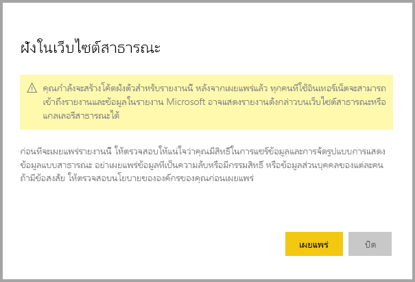
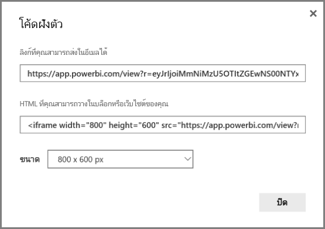
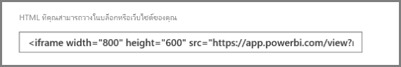
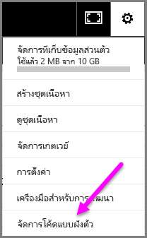
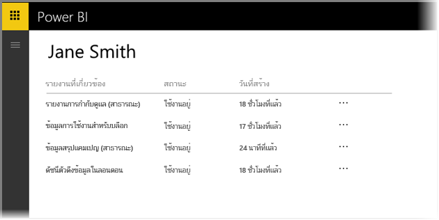
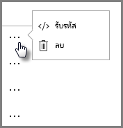
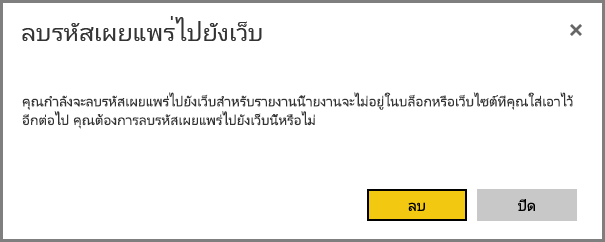
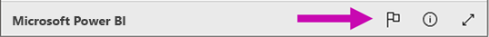

# เผยแพร่บนเว็บจาก Power BI

ด้วยตัวเลือก **เผยแพร่บนเว็บ** จาก Power BI คุณสามารถฝังเนื้อหา Power BI แบบโต้ตอบ เช่น โพสต์ในบล็อก เว็บไซต์ อีเมล หรือสื่อทางสังคมได้อย่างง่ายดาย คุณสามารถแก้ไข อัปเดต รีเฟรช หรือหยุดการแชร์การแสดงภาพที่คุณเผยแพร่ได้อย่างง่ายดาย

> [!WARNING]
> เมื่อคุณใช้**การเผยแพร่บนเว็บ** ทุกคนบนอินเทอร์เน็ตสามารถดูรายงานหรือรูปภาพที่คุณเผยแพร่ การดูต้องไม่มีการตรวจสอบสิทธิ์ ซึ่งรวมถึงการดูข้อมูลระดับรายละเอียดที่รายงานของคุณรวม ก่อนที่จะเผยแพร่รายงาน ให้ตรวจสอบให้แน่ใจว่าคุณยินดีที่จะแชร์ข้อมูลและการจัดรูปแบบการแสดงข้อมูลแบบสาธารณะ อย่าเผยแพร่ข้อมูลที่เป็นความลับหรือมีกรรมสิทธิ์ ถ้ามีข้อสงสัย ให้ตรวจสอบนโยบายขององค์กรของคุณก่อนเผยแพร่

>[!Note]
>คุณสามารถฝังเนื้อหาของคุณได้อย่างปลอดภัยในพอร์ทัลหรือเว็บไซต์ภายใน ใช้ตัวเลือก [ฝังตัว](service-embed-secure.md) หรือ [ฝังใน SharePoint Online](service-embed-report-spo.md) ตัวเลือกเหล่านี้จะตรวจสอบให้แน่ใจว่ามีการบังคับใช้สิทธิ์และการรักษาความปลอดภัยของข้อมูลทั้งหมดเมื่อผู้ใช้ของคุณดูข้อมูลภายในของคุณ

## สร้างโค้ดฝังตัวที่มีการเผยแพร่บนเว็บ

**การเผยแพร่บนเว็บ**สามารถใช้งานได้สำหรับรายงานที่คุณแก้ไขในพื้นที่ทำงานส่วนตัวและกลุ่ม  ไม่สามารถใช้งานได้สำหรับรายงานที่แชร์กับคุณ หรือรายงานที่ใช้การรักษาความปลอดภัยระดับแถวเพื่อรักษาความปลอดภัยข้อมูล ดูหัวข้อ[**ข้อจำกัด**](#limitations)ด้านล่างสำหรับรายละเอียดกรณีทั้งห**มดที่ตัวเลือกการเผ**ยแพร่บนเว็บนั้นไม่รองรับ ตรวจสอบ**คำเตือน**ก่อนหน้าในบทความนี้ก่อนใช้**การเผยแพร่บนเว็บ**

วิดีโอสั้น ๆ ต่อไปนี้แสดงวิธีการทำงานของคุณสมบัตินี้ แล้วลองทำด้วยตนเองในขั้นตอนด้านล่าง

<iframe width="560" height="315" src="https://www.youtube.com/embed/UF9QtqE7s4Y" frameborder="0" allowfullscreen></iframe>

ขั้นตอนต่อไปนี้อธิบายวิธีการใช้**เผยแพร่ไปยังเว็บ**

1. เปิดรายงานในพื้นที่ทำงานที่คุณสามารถแก้ไขได้และเลือก **ตัวเลือกเพิ่มเติม (...)**   > **ฝัง** > **เผยแพร่บนเว็บ (สาธารณะ)**

   
   
2. ถ้าผู้ดูแลระบบ Power BI ของคุณไม่อนุญาตให้คุณสร้างโค้ดฝังตัว คุณอาจจำเป็นต้องติดต่อพวกเขา

   
   
   สำหรับความช่วยเหลือในการค้นหาบุคคลที่สามารถเปิดใช้งานเผยแพร่บนเว็บในองค์กรของคุณ โปรดดู [วิธีการค้นหาผู้ดูแลระบบ Power BI ของคุณ](#find-your-power-bi-administrator) ภายหลังในบทความนี้

3. ตรวจสอบเนื้อหากล่องโต้ตอบและเลือก **สร้างโค้ดฝังตัว**

   

4. ตรวจสอบคำเตือนที่แสดงในที่นี่ และยืนยันว่าข้อมูลสามารถฝังในเว็บไซต์สาธารณะได้ ถ้าเป็นเช่นนั้น เลือก **เผยแพร่**

   

5. กล่องโต้ตอบจะปรากฏขึ้นพร้อมลิงก์ เลือกลิงก์เพื่อส่งลิงก์ในอีเมลหรือคัดลอก HTML คุณสามารถฝังลิงก์ในโค้ดเช่น iFrame หรือวางไว้ในเว็บเพจหรือบล็อกโดยตรง

   

6. ถ้าคุณเคยสร้างโค้ดฝังตัวสำหรับรายงาน และคุณเลือก**เผยแพร่บนเว็บ**มาก่อนแล้ว คุณจะไม่เห็นกล่องโต้ตอบในขั้นตอนที่ 2-4 แต่กล่องโต้ตอบของ**โค้ดฝังตัว**จะปรากฏขึ้น:

   

   คุณสามารถสร้างโค้ดฝังตัวหนึ่งโค้ดสำหรับแต่ละรายงาน

### เคล็ดลับสำหรับโหมดมุมมอง

เมื่อคุณฝังเนื้อหาภายในโพสต์ในบล็อก โดยทั่วไปแล้วจำเป็นต้องพอดีภายในขนาดหน้าจอที่เฉพาะเจาะจง  คุณสามารถปรับความสูงและความกว้างเป็นแท็ก iFrame ตามความจำเป็น อย่างไรก็ตาม คุณจำเป็นต้องให้แน่ใจว่ารายงานของคุณพอดีกับพื้นที่ของ iFrame ที่กำหนดไว้ ดังนั้นคุณยังต้องตั้งค่าเป็นโหมดมุมมองที่เหมาะสมเมื่อแก้ไขรายงาน

ตารางต่อไปนี้มีคำแนะนำเกี่ยวกับโหมดมุมมอง และวิธีจะปรากฏเมื่อถูกฝังตัว

| โหมดมุมมอง | มันจะเห็นอย่างไรเมื่อถูกฝังตัว |
| --- | --- |
|  |**พอดีกับหน้า**ตามความสูงและความกว้างของหน้าในรายงานของคุณ ถ้าคุณตั้งค่าหน้าของคุณเป็นอัตราส่วน *แบบไดนามิก* เช่น 16:9 หรือ 4:3 เนื้อหาของคุณจะปรับขนาดให้พอดีภายใน iFrame เมื่อฝังใน iFrame โดยใช้**ให้พอดีกับหน้า**อาจก่อให้เกิด*letterboxing*ที่พื้นหลังสีเทาถูกแสดงในพื้นที่ของ iFrame หลังจากเนื้อหาถูกปรับขนาดให้พอดีกับภายใน iFrame เมื่อต้องการย่อ letterboxing ให้เล็กที่สุด ให้ตั้งค่าความสูงและกว้างของ iFrame ของคุณให้เหมาะสม |
|  |**ขนาดจริง**จะให้แน่ใจว่ารายงานรักษาขนาดตามที่ตั้งค่าหน้ารายงาน ซึ่งอาจทำให้แถบเลื่อนปรากฎใน iFrame ของคุณ ตั้งค่าความสูงและความกว้างของ iFrame เพื่อหลีกเลี่ยงแถบเลื่อน |
|  |**จัดพอดีกับความกว้าง** ตรวจสอบให้แน่ใจว่าเนื้อหาพอดีกับพื้นที่แนวนอนของ iFrame เส้นขอบจะยังคงแสดงอยู่ แต่เนื้อหาจะปรับมาตราส่วนเพื่อใช้ช่องว่างแนวนอนที่มีทั้งหมด |

### เคล็ดลับสำหรับความกว้างและความสูงของ iFrame

โค้ดฝังตัว **เผยแพร่บนเว็บ**มีลักษณะดังต่อไปนี้:

 
คุณสามารถแก้ไขความกว้างและความสูงด้วยตนเอง เพื่อให้แน่ใจอย่างแม่นยำว่าคุณต้องการให้พอดีกับหน้าที่คุณกำลังฝัง

เพื่อให้ได้ขนาดที่พอดียิ่งขึ้น คุณสามารถลองเพิ่ม 56 พิกเซลไปที่ความสูงของ iFrame เพื่อให้สอดคล้องกับขนาดปัจจุบันของแถบด้านล่าง ถ้าหน้าของรายงานใช้ขนาดแบบไดนามิก ตารางด้านล่างแสดงขนาดบางอย่างคุณสามารถทำให้พอดีโดยไม่ต้องจัดแบบ letterbox

| อัตราส่วน | ขนาด | มิติ (ความกว้าง x ความสูง) |
| --- | --- | --- |
| 16:9 |ขนาดเล็ก |640 x 416 px |
| 16:9 |ขนาดปานกลาง |800 x 506 px |
| 16:9 |ขนาดใหญ่ |960 x 596 px |
| 4:3 |ขนาดเล็ก |640 x 536 px |
| 4:3 |ขนาดปานกลาง |800 x 656 px |
| 4:3 |ขนาดใหญ่ |960 x 776 px |

## จัดการโค้ดแบบฝังตัว

เมื่อคุณสร้างโค้ดฝังตัวของ**เผยแพร่บนเว็บ** คุณสามารถจัดการโค้ดจากเมนู**การตั้งค่า**ใน Power BI การจัดการโค้ดฝังตัวมีความสามารถในการลบภาพปลายทางหรือรายงานสำหรับโค้ด (แสดงโค้ดฝังตัวที่ไม่สามารถใช้งาน) หรือได้รับโค้ดฝังตัว

1. เพื่อจัดการฝังรหัส**เผยแพร่ไปยังเว็บ**ของคุณ เปิดเฟือง**การตั้งค่า** แล้วเลือก**จัดการโค้ดฝังตัว**

   

2. โค้ดฝังตัวของคุณจะปรากฏขึ้น

   

3. คุณสามารถเรียกใช้ หรือลบโค้ดฝังตัว การลบจะปิดใช้งานลิงก์ไปยังรายงานหรือรูปภาพ

   

4. ถ้าคุณเลือก**ลบ** ระบบจะสอบถามการยืนยันจากคุณ

   

## อัปเดตรายงานและรีเฟรชข้อมูล

หลังจากที่คุณสร้างโค้ดฝังตัวของ**การเผยแพร่บนเว็บ**ของคุณและแชร์ไฟล์ มีการอัปเดรายงานที่มีการเปลี่ยนแปลง และลิงก์โค้ดฝังตัวจะเปิดใช้งานทันที ทุกคนที่เปิดลิงก์สามารถดูได้ หลังจากการดำเนินการนี้เริ่มต้น อย่างไรก็ตาม การอัปเดตรายงานหรือการแสดงผลด้วยภาพอาจใช้เวลาประมาณสองถึงสามชั่วโมงก่อนที่ผู้ใช้ของคุณจะมองเห็นได้ เมื่อต้องการเรียนรู้เพิ่มเติม ให้ดูหัวข้อ[**วิธีการทำงาน**](#howitworks)ในภายหลังในบทความนี้ 

### การรีเฟรชข้อมูล

รีเฟรชข้อมูลเป็นภาพสะท้อนในรายงานแบบฝังตัวหรือแบบรูปภาพอัตโนมัติของคุณ อาจใช้เวลาประมาณหนึ่งชั่วโมงสำหรับรีเฟรชข้อมูลเพื่อให้สามารถมองเห็นได้จากโค้ดฝังตัว หากต้องการปิดการใช้งานรีเฟรชโดยอัตโนมัติ เลือก**อย่ารีเฟรช**ตามกำหนดการสำหรับชุดข้อมูลที่รายงานใช้  

## วิชวล Power BI

วิชวล Power BI รองรับ**การเผยแพร่ไปยังเว็บ** เมื่อคุณใช้ **การเผยแพร่ไปยังเว็บ** ผู้ใช้ที่คุณแชร์ภาพที่เผยแพร่ของคุณไม่จำเป็นต้องเปิดใช้งานวิชวล Power BI เพื่อดูรายงาน

## ทำความเข้าใจเกี่ยวกับคอลัมน์สถานะโค้ดฝังตัว

>[!Note]
>ตรวจสอบโค้ดฝังตัวที่คุณเผยแพร่บ่อยครั้ง ลบรายการใดๆ ที่ไม่จำเป็นต้องมีให้ใช้งานแบบสาธารณะอีกต่อไป

หน้า**จัดการโค้ดฝังตัว**ประกอบด้วยคอลัมน์สถานะ ตามค่าเริ่มต้น โค้ดฝังตัวจะ**เปิดใช้งานอยู่**แต่อาจอยู่ในสถานะใดสถานะหนึ่งดังที่แสดงอยู่ด้านล่าง

| สถานะ | คำอธิบาย |
| --- | --- |
| **ใช้งานอยู่** |รายงานจะพร้อมใช้งานสำหรับผู้ใช้อินเทอร์เน็ตเพื่อดูและโต้ตอบ |
| **ถูกบล็อก** |เนื้อหาของรายงานการละเมิด[ เงื่อนไขการใช้บริการ Power BI](https://powerbi.microsoft.com/terms-of-service) Microsoft ได้บล็อกไว้ ติดต่อฝ่ายสนับสนุนหากคุณเชื่อว่าเนื้อหาที่ถูกบล็อกมาจากความผิดพลาด |
| **ไม่รองรับ** |ชุดข้อมูลของรายงานใช้ความปลอดภัยระดับแถว หรือไม่รองรับการกำหนดค่าอื่น ดูหัวข้อ[**ข้อจำกัด**](#limitations)สำหรับรายการทั้งหมด |
| **ถูกละเมิด** |โค้ดฝังตัวอยู่นอกนโยบายที่กำหนดไว้โดยผู้เช่า สถานะนี้มักเกิดขึ้นเมื่อสร้างโค้ดฝังตัว และการตั้งค่าผู้เช่าของ**การเผยแพร่ไปยังเว็บ** มีการเปลี่ยนแปลงเพื่อไม่รวมผู้ใช้ที่เป็นเจ้าของโค้ดฝังตัว ถ้าการตั้งค่าผู้เช่าถูกปิด หรือผู้ใช้ไม่ได้รับอนุญาตให้สร้างโค้ดฝังตัว โค้ดฝังตัวที่มีอยู่จะแสดงสถานะ**ถูกละเมิด** ดูส่วน [ค้นหาผู้ดูแลระบบ Power BI ของคุณ](#find-your-power-bi-administrator) ในบทความนี้สำหรับรายละเอียด |

## รายงานข้อจำกัดเกี่ยวกับเนื้อหาการเผยแพร่ไปยังเว็บ

เพื่อรายงานข้อจำกัดเกี่ยวกับเนื้อหา**เผยแพร่ไปยังเว็บ**แบบฝังหรือบล็อก เลือกไอคอน**ค่าสถานะ**ในแถบด้านล่างของรายงาน **เผยแพร่ไปยังเว็บ**

คุณจะต้องส่งอีเมลไปยัง Microsoft เพื่ออธิบายสิ่งที่คุณเป็นกังวล Microsoft จะประเมินเนื้อหาที่ยึดตาม [เงื่อนไขการใช้บริการ Power BI ](https://powerbi.microsoft.com/terms-of-service) และดำเนินการที่เหมาะสม

## สิทธิ์การใช้งาน

คุณจำเป็นต้องเป็นผู้ใช้ Microsoft Power BI เพื่อใช้**เผยแพร่ไปยังเว็บ** ผู้ชมของรายงานของคุณไม่จำเป็นต้องเป็นผู้ใช้ Power BI

## ทำงานอย่างไร (รายละเอียดทางเทคนิค)

เมื่อคุณสร้างโค้ดฝังตัวโดยใช้**การเผยแพร่บนเว็บ** ผู้ใช้บนอินเทอร์เน็ตจะมองเห็นรายงานได้ ซึ่งสามารถใช้งานแบบสาธารณะได้ ดังนั้นคุณจึงสามารถคาดหวังให้ผู้ชมแชร์รายงานผ่านสื่อสังคมในอนาคตได้อย่างง่ายดาย ขณะที่ผู้ใช้ดูรายงาน โดยเปิดผ่าน URL สาธารณะโดยตรงหรือดูแบบฝังในเว็บเพจหรือบล็อก Power BI เก็บการให้คำนิยามรายงานและผลลัพธ์ของคิวรี่ที่จำเป็นต้องดูรายงาน การแคชข้อมูลนี้ทำให้แน่ใจว่าผู้ใช้พร้อมกันหลายพันคนสามารถดูรายงานโดยไม่ส่งผลกระทบต่อประสิทธิภาพการทำงาน

การแคชข้อมูลเป็นแบบ long-lived ถ้าคุณปรับปรุงข้อกำหนดของรายงาน (ตัวอย่างเช่น ถ้าคุณเปลี่ยนโหมดมุมมอง) หรือรีเฟรชข้อมูลรายงาน อาจใช้เวลาประมาณหนึ่งชั่วโมงก่อนที่จะเห็นการเปลี่ยนแปลงในเวอร์ชันของรายงานที่ผู้ใช้ดู เนื่องจากแต่ละองค์ประกอบและค่าข้อมูลถูกแคชไว้อย่างอิสระเมื่อการอัปเดตข้อมูลเกิดขึ้นการผสมของค่าปัจจุบันและก่อนหน้านี้สามารถแสดงให้กับผู้ใช้ได้ ดังนั้นจึงแนะนำให้คุณจัดลำดับการทำงานของคุณล่วงหน้า และสร้างโค้ดฝังตัวสำหรับการ**เผยแพร่ไปยังเว็บ** เฉพาะเมื่อคุณพอใจกับการตั้งค่าแล้วเท่านั้น ถ้าข้อมูลของคุณจะรีเฟรช ให้ลดจำนวนรีเฟรชและดำเนินการรีเฟรชในเวลาที่ออก

## ค้นหาผู้ดูแลระบบ Power BI ของคุณ

พอร์ทัลผู้ดูแลระบบ Power BI มีการตั้งค่าที่ควบคุมว่าใครใดสามารถเผยแพร่ไปยังเว็บได้ ทำงานกับ [ผู้ดูแลระบบ Power BI](../admin/service-admin-role.md) ขององค์กรเพื่อเปลี่ยน [การตั้งค่าผู้เช่าสำหรับเผยแพร่ไปยังเว็บ](../admin/service-admin-portal.md#publish-to-web) ในพอร์ทัลผู้ดูแลระบบ

สำหรับองค์กรที่มีขนาดเล็กกว่าหรือบุคคลที่ลงทะเบียนสำหรับ Power BI คุณอาจยังไม่มีผู้ดูแลระบบ Power BI ทำตาม [กระบวนการสำหรับการเข้าครองผู้ดูแลระบบของผู้เช่า](https://docs.microsoft.com/azure/active-directory/users-groups-roles/domains-admin-takeover) ของเรา เมื่อคุณมีผู้ดูแลระบบ Power BI แล้ว พวกเขาสามารถเปิดใช้งานการสร้างโค้ดฝังตัวให้คุณได้

องค์กรที่สร้างขึ้นมักจะมีผู้ดูแลระบบ Power BI อยู่แล้ว บุคคลในบทบาทต่อไปนี้สามารถทำหน้าที่เป็นผู้ดูแลระบบ Power BI ได้:

- ผู้ดูแลระบบส่วนกลาง
- ผู้ใช้ที่มีบทบาทผู้ดูแลระบบบริการของ Power BI ใน Azure Active Directory

คุณจำเป็นต้อง [ค้นหาหนึ่งในบุคคลเหล่านี้](https://docs.microsoft.com/office365/admin/admin-overview/admin-overview#who-has-admin-permissions-in-my-business) ในองค์กรของคุณและขอให้พวกเขาอัปเดต [การตั้งค่าผู้เช่าสำหรับเผยแพร่ไปยังเว็บ](../admin/service-admin-portal.md#publish-to-web) ในพอร์ทัลผู้ดูแลระบบ

## ข้อจำกัด

**การเผยแพร่ไปยังเว็บ** ได้รับการรองรับสำหรับแหล่งข้อมูลส่วนใหญ่และรายงานในบริการของ Power BI อย่างไรก็ตาม รายงานประเภทต่อไปนี้ยังไม่ได้รับการรองรับ หรือไม่พร้อมใช้งานสำหรับ**เผยแพร่ไปยังเว็บ**ในขณะนี้:

- รายงานที่ใช้การรักษาความปลอดภัยระดับแถว
- รายงานที่ใช้แหล่งข้อมูลแบบไลฟ์ใดๆ รวมถึง Analysis Services Tabular ที่โฮสต์ภายในองค์กร Analysis Services Multidimensional และ Azure Analysis Services
- รายงานที่ใช้[ชุดข้อมูลที่ใช้ร่วมกัน](../connect-data/service-datasets-across-workspaces.md) ซึ่งจัดเก็บไว้ในพื้นที่ทำงานที่แตกต่างกันจากรายงาน
- [ชุดข้อมูลที่ใช้ร่วมกันและได้รับการรับรอง](../connect-data/service-datasets-share.md)
- รายงานทีแชร์กับคุณโดยตรง หรือผ่าแพ็คเนื้อหาขององค์กร
- รายงานในพื้นที่ทำงานที่คุณไม่ใช่สมาชิกที่มีสิทธิ์แก้ไข
- วิชวล "R" จะไม่ได้รับการรองรับในรายงานที่ **เผยแพร่ไปยังเว็บ**
- การส่งออกข้อมูลจากวิชวลในรายงานที่เผยแพร่ไปยังเว็บ
- ArcGIS Maps สำหรับภาพ Power BI
- รายงานที่ประกอบด้วยหน่วยวัดของ DAX ระดับรายงาน
- การลงชื่อเข้าระบบแบบจำลองคิวรีข้อมูลเพียงครั้งเดียว
- รักษาข้อมูลความลับหรือกรรมสิทธิ์
- ความสามารถในการรับรองความถูกต้องโดยอัตโนมัติที่มาพร้อมกับการ**ฝัง**ตัวเลือกที่ไม่ทำงานกับ Power BI JavaScript API สำหรับ Power BI JavaScript API ให้ใช้[ผู้ใช้เป็นเจ้าของข้อมูล](../developer/embedded/embed-sample-for-your-organization.md)ในการฝัง

## ขั้นตอนถัดไป

- [Web part สำหรับรายงาน SharePoint Online](service-embed-report-spo.md) 

- [ฝังรายงานในพอร์ทัลความปลอดภัยหรือเว็บไซต์](service-embed-secure.md)

มีคำถามเพิ่มเติมหรือไม่ [ลองไปที่ชุมชน Power BI](https://community.powerbi.com/)

