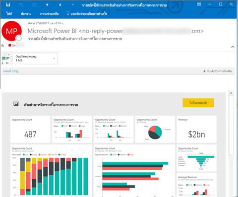
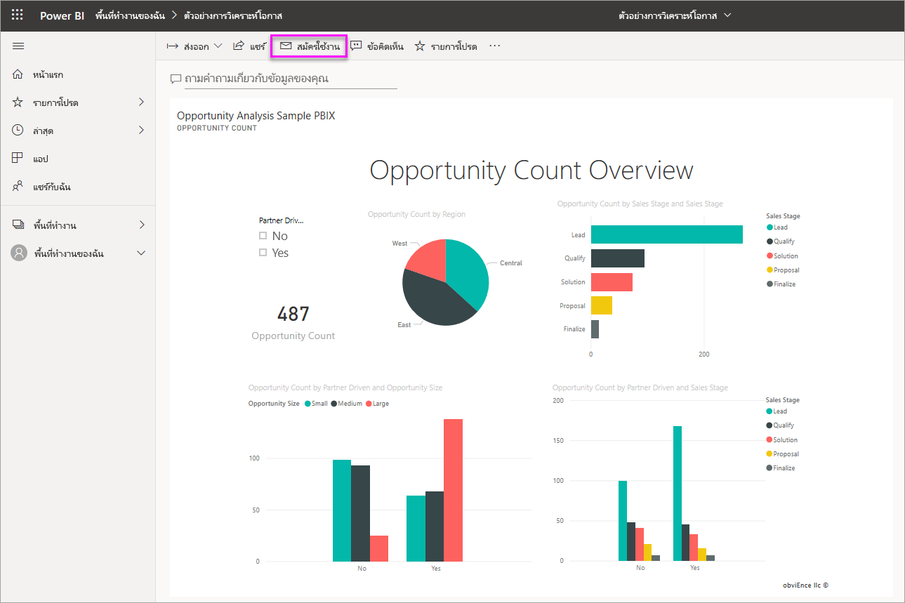
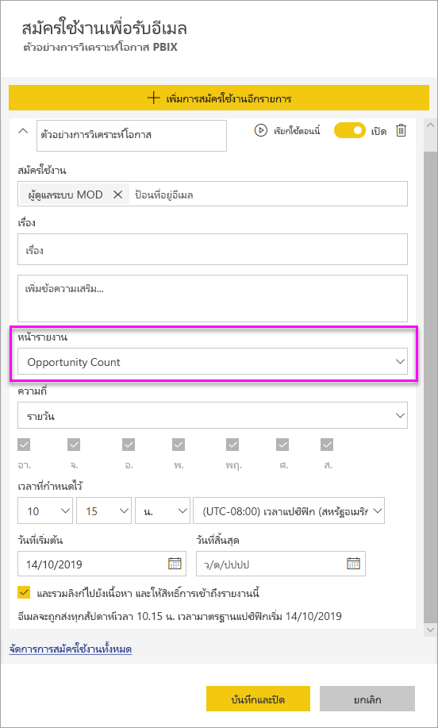
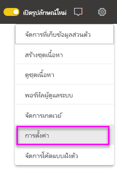

# สมัครใช้งานรายงานและแดชบอร์ดในบริการ Power BI สำหรับตัวคุณเองและผู้อื่น

คุณสามารถสมัครใช้งานสำหรับคุณเองและเพื่อนร่วมงานในหน้ารายงาน แดชบอร์ด และรายงานที่มีการแบ่งหน้าที่สำคัญที่สุดสำหรับคุณ การสมัครใช้งานอีเมลของ Power BI ช่วยให้คุณสามารถ:

- กำหนดความถี่ในการรับอีเมล: รายวัน รายสัปดาห์ รายชั่วโมง รายเดือน หรือวันละครั้งหลังจากรีเฟรชข้อมูลเริ่มต้น
- เลือกเวลาที่คุณต้องการรับอีเมล หากคุณเลือกรายวัน รายสัปดาห์ รายชั่วโมง หรือรายเดือน
- ตั้งค่าการสมัครใช้งาน 24 ครั้งอื่นๆ ต่อแดชบอร์ดหรือรายงาน Power BI  ไม่มีขีดจำกัดสำหรับจำนวนการสมัครใช้งาน คุณจะสามารถตั้งค่าสำหรับรายงานที่มีการแบ่งหน้าได้
- มีอีเมลที่ส่งไปโดยมีรูปภาพของรายงาน และลิงก์ไปยังรายงานในบริการดังกล่าว  บนอุปกรณ์เคลื่อนท่ีที่่ติดตั้งแอป Power BI ให้เลือกลิงก์นี้เพื่อเปิดใช้ Power BI แทนการเปิดรายงานหรือแดชบอร์ดบนเว็บไซต์ Power BI)
- รวมเอกสารแนบของรายงานฉบับเต็ม หากคุณสมัครใชิงานรายงานที่มีการแบ่งหน้า
- ส่งอีเมลถึงผู้ใช้ภายนอกผู้เช่า หากเนื้อหาของ Power BI ของคุณโฮสต์อยู่ในความจุแบบพรีเมียม  ผู้ดูแลระบบสามารถควบคุมการเข้าถึงไปยังบุคคลที่สามารถส่งการสมัครใช้งานอีเมลถึงผู้ใช้ภายนอก โดยการใช้การตั้งค่าการควบคุมการแชร์ภายนอกที่มีอยู่ในศูนย์การจัดการของ Power BI

 

## ข้อกำหนด

**สร้าง**การสมัครใช้งานสามารถทำได้โดย:

- ผู้ใช้ต้องมีสิทธิ์การใช้งาน Pro 
- ผู้ใช้ที่ดูเนื้อหาในพื้นที่ทำงาน Premium หรือแอปอาจยังเป็นสมาชิกที่ใช้งานอยู่แม้ว่าจะไม่มีสิทธิ์การใช้งาน Power BI Pro 

คุณไม่จำเป็นต้องแก้ไขการอนุญาตในเนื้อหา (แดชบอร์ดหรือรายงาน) เพื่อสร้างการสมัครใช้งานสำหรับตัวคุณเอง แต่คุณต้องมีสิทธิ์แก้ไขเพื่อสร้างการสมัครใช้งานสำหรับผู้อื่น

## สมัครใช้งานในแดชบอร์ด หน้ารายงาน หรือรายงานที่มีการแบ่งหน้า

ไม่ว่าคุณจะสมัครใช้งานในแดชบอร์ด รายงาน หรือรายงานที่มีการแบ่งหน้า กระบวนการจะคล้ายกัน ปุ่มเดียวกันนี้ช่วยให้คุณสามารถบอกรับแดชบอร์ดหรือรายงานของบริการ Power BI

การสมัครใช้งานในรายงานที่มีการแบ่งหน้าจะแตกต่างกันเล็กน้อย ดูที่ [สมัครใช้งานในรายงานที่มีการแบ่งหน้าสำหรับตัวคุณเองและผู้อื่นในบริการของ Power BI](../consumer/paginated-reports-subscriptions.md) สำหรับรายละเอียด
 
.

1. เปิดแดชบอร์ดหรือรายงาน
2. จากแถบเมนูด้านบน ให้เลือก**สมัครใช้งาน**หรือเลือกไอคอนซองจดหมาย
   
    

1. ใช้แถบเลื่อนสีเหลืองเพื่อเปิดการสมัครใช้งานและปิด ตั้งค่าแถบเลื่อนเป็น**ปิด**จะไม่ลบการสมัครใช้งาน เมื่อต้องลบการสมัครใช้งาน เลือกไอคอนถังขยะ

2. อีเมลของคุณพร้อมแล้วในกล่อง **สมัครใช้งาน** คุณสามารถเพิ่มที่อยู่อีเมลอื่นๆ ในโดเมนเดียวกันไปยังการสมัครใช้งานเช่นเดียวกัน หากรายงานหรือแดชบอร์ดถูกโฮสต์อยู่ใน [ความจุพรีเมียม](https://docs.microsoft.com/power-bi/service-premium-what-is) คุณจะสามารถสมัครใช้งานที่อยู่อีเมลของบุคคลอื่น และนามแฝงของกลุ่ม ไม่ว่าจะอยู่ในโดเมนของคุณหรือไม่ก็ตาม หากรายงานหรือแดชบอร์ดไม่ได้รับการโฮสต์ในความจุพรีเมียม คุณจะสามารถสมัครใช้งานสำหรับบุคคลอื่นได้ แต่พวกเขาก็ต้องมีสิทธิ์การใช้งาน Power BI Pro ด้วย โปรดดู [ข้อควรพิจารณาและการแก้ไขปัญหา](#considerations-and-troubleshooting) ด้านล่างสำหรับรายละเอียดเพิ่มเติม

3. กรอกรายละเอียดอีเมล **หัวเรื่อง** และ **ข้อความ**

4. เลือก **ความถี่** สำหรับการสมัครใช้งาน:  **รายวัน**, **รายชั่วโมง**, **รายสัปดาห์**, **รายเดือน** หรือ **หลังจากรีเฟรชข้อมูล (รายวัน)** หากต้องการรับอีเมลการสมัครใช้งานเฉพาะในบางวัน ให้เลือก **รายวัน** หรือ **รายสัปดาห์** แล้วเลือกวันที่คุณต้องการรับ ตัวอย่างเช่น หากคุณต้องการรับอีเมลการสมัครใช้งานในวันทำงานเท่านั้น ให้เลือก **รายสัปดาห์** และยกเลิกการเลือกช่องสำหรับ**เสาร์**และ**อาทิตย์** หากคุณเลือก **รายเดือน** ให้ป้อนวันของเดือนที่คุณต้องการรับอีเมลที่สมัครใช้งาน

5. หากคุณเลือก  **รายวัน**  **รายชั่วโมง**  **รายเดือน** หรือ  **รายสัปดาห์** คุณยังจะสามารถเลือก  **เวลาตามกำหนดการ**  สำหรับการสมัครใช้งานได้ คุณใช้เวลาเป็นชั่วโมงหรือเมื่อ 15, 30 หรือ 45 นาทีที่ผ่านมา เลือกเช้า (AM) หรือบ่าย/เย็น (PM) คุณยังสามารถระบุโซนเวลาได้อีกด้วย หากคุณเลือก  **รายชั่วโมง** ให้เลือก  **เวลาตามกำหนดการ**  ที่คุณต้องการให้การสมัครใช้งานเริ่มต้น จากนั้นระบบจะเรียกใช้ทุกชั่วโมงหลังจากนั้น

6. ตามค่าเริ่มต้น วันเริ่มต้นสำหรับการสมัครใช้งานคือ วันที่คุณสร้าง คุณมีตัวเลือกเพื่อเลือกวันที่สิ้นสุด หากคุณไม่ได้กำหนดวันที่สิ้นสุด วันที่สิ้นสุดจะเป็นไปโดยอัตโนมัติหนึ่งปีหลังจากวันที่เริ่มต้น คุณสามารถเปลี่ยนเป็นวันใดก็ได้ในอนาคต (สูงสุด 9999 ปี) ได้ตลอดเวลาก่อนที่การสมัครใช้งานจะสิ้นสุดลง เมื่อการสมัครใช้งานถึงวันที่สิ้นสุด การทำงานจะหยุดจนกว่าคุณจะเปิดใช้งานอีกครั้ง คุณจะได้รับการแจ้งเตือนก่อนวันที่สิ้นสุดตามกำหนดเพื่อถามว่าคุณต้องการที่จะขยายเวลาออกไปไหม

    ในภาพถ่ายหน้าจอด้านล่างนี้ โปรดสังเกตว่า เมื่อคุณสมัครใช้งานรายงานหนึ่ง จริง ๆ แล้วคุณกำลังสมัครใช้งานไปยัง_หน้า_รายงาน เมื่อต้องการสมัครใช้งานมากกว่าหนึ่งหน้าในรายงาน ให้เลือก**เพิ่มการสมัครใช้งานอื่น**และเลือกหน้าอื่น
     
      

1. (ไม่บังคับ) เลือกว่าจะรวมลิงก์การเชื่อมโยงกลับไปยังเนื้อหาใน Power BI และกำหนดให้ผู้ใช้สามารถเข้าถึงเนื้อหาที่คุณกำลังใช้งานอยู่หรือไม่  หากคุณเลือกที่จะรวมลิงก์ เพื่อประสบการณ์ที่ดีที่สุด โปรดตรวจสอบให้แน่ใจว่า ผู้ใช้ทั้งหมดสามารถเข้าถึงรายงานได้
2. เลือก  **บันทึกและปิด** ผู้สมัครใช้งานจะได้รับอีเมลและภาพรวมของหน้าแดชบอร์ดหรือหน้ารายงานสำหรับความถี่และเวลาที่คุณเลือก โดยรวมคุณสามารถสร้างการสมัครใช้งานได้ถึง 24 รายการต่อรายงานหรือแดชบอร์ดและสามารถให้ผู้รับ เวลา และความถี่ที่ไม่ซ้ำสำหรับแต่ละการสมัครใช้งานได้ การสมัครใช้งานทั้งหมดตั้งค่าเป็น **หลังจากรีเฟรชข้อมูล** สำหรับแดชบอร์ดหรือรายงานของคุณจะยังคงส่งอีเมลหลังจากรีเฟรชตามกำหนดเวลาครั้งแรกเท่านั้น

    > [!NOTE]
    > หากคุณแก้ไขการสมัครใช้งานหลังจากบันทึกและปิด การเลือกเพื่อให้ผู้ใช้สามารถเข้าถึงเนื้อหาที่คุณกำลังติดตามอยู่เปิดใช้งานอยู่หรือไม่ โดยไม่คำนึงถึงการเลือกก่อนหน้าของคุณ
    >

    > [!TIP]
    > ต้องการส่งอีเมลจากการสมัครใช้งานทันทีหรือตามความต้องการได้ทุกเวลาหรือไม่ เลือก**เรียกใช้ทันที**สำหรับการสมัครใช้งานสำหรับแดชบอร์ดหรือรายงานที่คุณต้องการส่ง คุณจะเห็นการแจ้งเตือนว่าอีเมลที่กำลังจะมาถึงทุกคนสำหรับการสมัครใช้งานเฉพาะ การดำเนินการนี้จะไม่นับรวมขีดจำกัดของการเรียกใช้การสมัครใช้งานตามกำหนดการ 24 ต่อวันต่อรายงานหรือแดชบอร์ด จะไม่ทริกเกอร์การรีเฟรชข้อมูลของชุดข้อมูลเบื้องต้น
    >

## จัดการการสมัครใช้งานของคุณ

เฉพาะบุคคลที่สร้างการสมัครใช้งานเท่านั้นที่สามารถจัดการได้ มีสองเส้นทางที่จะไปยังหน้าจอสำหรับการจัดการการสมัครใช้งาน สิ่งแรกคือเลือก**จัดการการสมัครใช้งานทั้งหมด** จากกล่องโต้ตอบ **สมัครใช้งานอีเมล** (ดูขั้นตอนที่ 4 ด้านบน) ขั้นตอนที่สองคือ เลือกไอคอนฟันเฟือง Power BI  จากแถบเมนูด้านบน และเลือก **การตั้งค่า**

การสมัครใช้งานที่แสดง จะขึ้นอยู่กับพื้นที่ทำงานที่กำลังใช้งานอยู่ในปัจจุบัน เมื่อต้องการดูการสมัครใช้งานทั้งหมดของคุณในครั้งเดียวสำหรับพื้นที่ทำงานทั้งหมด โปรดตรวจสอบให้แน่ใจว่า  **พื้นที่ทำงานของฉัน**  เปิดใช้งานอยู่ เพื่อทำความเข้าใจพื้นที่ทำงาน ให้ดู[พื้นที่ทำงานใน Power BI](service-create-workspaces.md)

การสมัครใช้งานจะสิ้นสุดลงเนื่องจากกรณีใดกรณีหนึ่งต่อไปนี้:

- สิทธิ์การใช้งาน Pro หมดอายุ
- เจ้าของลบแดชบอร์ดหรือรายงานดังกล่าวแล้ว
- บัญชีผู้ใช้ที่ใช้สำหรับสร้างการสมัครใช้งานนั้น ถูกลบแล้ว

ผู้ดูแลระบบ Power BI สามารถใช้บันทึกการตรวจสอบ Power BI เพื่อดูรายละเอียดและการสมัครใช้งาน รายละเอียดเหล่านี้ หมายรวมถึง:

- สร้างโดย
- วันที่สร้าง
- เนื้อหาที่สมัครใช้งาน
- ผู้รับ
- ความถี่
- ปรับเปลี่ยนโดย
- วันที่ปรับเปลี่ยน

## ข้อควรพิจารณาและการแก้ไขปัญหา

### ทั่วไป

- เช่นเดียวกับผลิตภัณฑ์ BI อื่นๆ เวลาที่คุณตั้งไว้สำหรับการสมัครใช้งานของคุณ คือ เวลาเมื่อการสมัครใช้งานนั้นเริ่มต้นการประมวลผล  เมื่อการประมวลผลรายงานเสร็จสมบูรณ์แล้ว การสมัครใช้งานจะอยู่ในคิวและส่งไปยังผู้รับอีเมล  เรามุ่งมั่นที่จะดำเนินการและส่งการสมัครใช้งานทั้งหมดให้เร็วที่สุดเท่าที่เป็นไปได้ อย่างไรก็ตามในบางครั้งที่มีความต้องการสูงสุด คุณอาจเห็นการหน่วงเวลาต่อไปเนื่องจากจำนวนการสมัครใช้งานที่ Power BI สามารถส่งได้ในแต่ละครั้ง ลูกค้าส่วนใหญ่ไม่ควรเห็นการหน่วงเวลามากกว่า 15 นาที สำหรับการดำเนินการและส่งรายงาน อาจใช้เวลาสูงสุด 30 นาที สำหรับบางครั้งและผู้เช่าที่มีการใช้งานอย่างมีนัยสำคัญ  ความล่าช้าในการส่งไม่ควรยาวนานเกินกว่า 60 นาที จากเวลาที่การสมัครใช้งานถูกกำหนดเวลาไว้  ถ้าคุณพบความล่าช้าตามระยะเวลาดังกล่าว ควรตรวจสอบให้แน่ใจว่าที่อยู่ `no-reply-powerbi@microsoft.com` อยู่ในรายชื่อผู้ส่งที่ปลอดภัยของคุณและไม่ถูกบล็อกโดยผู้ให้บริการอีเมลของคุณ  ถ้าไม่มีการบล็อกอีเมล ควรติดต่อฝ่ายสนับสนุน Power BI เพื่อขอความช่วยเหลือ
- ในปัจจุบัน การสมัครใช้งานผ่านอีเมลสำหรับรายงานและแดชบอร์ดโดยใช้ชุดข้อมูลที่เชื่อมต่อสดจะไม่ได้รับการสนับสนุนเมื่อสมัครใช้งานผู้ใช้อื่นนอกเหนือจากตัวคุณเอง ยกเว้นรายงานที่มีการแบ่งหน้า คุณสามารถสมัครใช้งานให้ผู้อื่นไปยังรายงานที่มีการแบ่งหน้า โดยใช้บริบทความปลอดภัยของคุณ เรียนรู้เพิ่มเติมเกี่ยวกับ [การสมัครใช้งานไปยังรายงานที่มีการแบ่งหน้า](../consumer/paginated-reports-subscriptions.md)
- Power BI หยุดรีเฟรชชั่วคราวบนชุดข้อมูลที่เกี่ยวข้องกับแดชบอร์ดและรายงานที่มีการเยี่ยมชมในมากกว่าสองเดือน โดยอัตโนมัติ อย่างไรก็ตาม ถ้าคุณเพิ่มการสมัครใช้งานแดชบอร์ดหรือรายงาน จะไม่สามารถหยุดชั่วคราวถึงแม้ว่าจะไม่ได้เข้าเยี่ยมชม
- ถ้าคุณไม่ได้รับอีเมลสมัครใช้งาน ให้ตรวจสอบว่า User Principal Name (UPN) สามารถรับอีเมลได้
- ถ้าแดชบอร์ดหรือรายงานของคุณอยู่ในความจุพรีเมียม คุณสามารถใช้นามแฝงอีเมลของกลุ่มสำหรับการสมัครใช้งานแทนการสมัครใช้งานเพื่อนร่วมงานต่าง ๆ ด้วยหนึ่งที่อยู่อีเมลในแต่ละครั้งได้ นามแฝงเป็นไปตามการไดเรกทอรีที่ใช้งานปัจจุบัน
- ถ้าเนื้อหาของคุณไม่ได้อยู่ในความจุ Premium เฉพาะผู้ใช้ Power BI Pro เท่านั้นที่สามารถรับการสมัครใช้งานทางอีเมลได้ 
- การสมัครใช้งานไม่สนับสนุนบุ๊กมาร์กในขณะนี้
- ตัวเลือกเพื่อให้การเข้าถึงรายงาน/แดชบอร์ดจะแสดงเป็นเปิดใช้งานเสมอเมื่อคุณแก้ไขการสมัครใช้งานที่มีอยู่  ถ้าคุณล้างตัวเลือกนี้และบันทึกการสมัครใช้งาน ระบบจะบันทึกสถานะดังกล่าว อย่างไรก็ตาม เมื่อคุณไปแก้ไขรายงานอีกครั้ง มันจะถูกเลือกตามค่าเริ่มต้น

### แดชบอร์ด

- แดชบอร์ดที่มีไทล์ปักหมุดมากกว่า 25 หมุดหรือมี 4 หมุดปักที่หน้ารายงานสด อาจไม่แสดงข้อมูลอย่างสมบูรณ์ในอีเมลที่สมัครใช้งานที่ส่งถึงผู้ใช้ การสมัครใช้งานในแดชบอร์ดที่เกินจำนวนไทล์เหล่านี้จะไม่ถูกบล็อก อย่างไรก็ตาม อาจไม่ได้รับการสนับสนุนถ้าคุณประสบกับปัญหา พิจารณาปรับเปลี่ยนให้เหมาะสมเพื่อให้อยู่ภายในการสนับสนุน
- ในบางโอกาส การสมัครใช้งานทางอีเมลอาจใช้เวลานานกว่าสิบห้านาทีในการส่งมอบให้กับผู้รับ ในกรณีนี้ เราขอแนะนำให้ใช้งานการรีเฟรชข้อมูล และสมัครใช้งานทางอีเมลในเวลาอื่นเพื่อให้แน่ใจว่าจะสามารถส่งได้ทันเวลา ถ้าปัญหายังคงอยู่ ติดต่อฝ่ายสนับสนุน Power BI
- สำหรับการสมัครใช้งานทางอีเมลของแดชบอร์ด ไทล์ใดก็ตามที่ใช้ความปลอดภัยระดับแถว (RLS) จะไม่แสดงขึ้นมา
- สำหรับการสมัครใช้งานแดชบอร์ด ไทล์บางประเภทยังไม่ได้รับการสนับสนุน ซึ่งรวมถึง: สตรีมไทล์ วิดีโอไทล์ และไทล์เนื้อหาเว็บแบบกำหนดเอง
- ถ้าคุณแชร์แดชบอร์ดกับเพื่อนร่วมงานภายนอกผู้เช่าของคุณ คุณจะไม่สามารถสร้างการสมัครใช้งานสำหรับเพื่อนร่วมงานรายนั้นได้ *ยกเว้นในกรณีที่*แดชบอร์ดอยู่ในพื้นที่ทำงานและแอป Premium ดังนั้น ถ้าคุณคือ `aaron@contoso.com` คุณสามารถแชร์กับ`anyone@fabrikam.com` ได้ แต่คุณยังไม่สามารถสมัครใช้งานสำหรับ`anyone@fabrikam.com`ได้ และพวกเขาไม่สามารถสมัครใช้งานไปยังเนื้อหาที่ใช้ร่วมกันได้

### รายงาน

- สำหรับการสมัครใช้งานทางอีเมลของรายงาน ถ้าชุดข้อมูลใช้ RLS คุณจะสามารถสร้างการสมัครใช้งานสำหรับตัวคุณเอง คุณไม่สามารถสมัครใช้งานสำหรับผู้อื่นในรายงานที่มีความปลอดภัยระดับแถว (RLS) ยกเว้นรายงานที่มีการแบ่งหน้า คุณสามารถสมัครใช้งานให้ผู้อื่นไปยังรายงานที่มีการแบ่งหน้า โดยใช้บริบทความปลอดภัยของคุณ เรียนรู้เพิ่มเติมเกี่ยวกับ [การสมัครใช้งานไปยังรายงานที่มีการแบ่งหน้า](../consumer/paginated-reports-subscriptions.md)
- การสมัครใช้งานหน้ารายงานจะถูกผูกกับชื่อของหน้ารายงาน ถ้าคุณสมัครใช้งานหน้ารายงาน และเปลี่ยนชื่อ หลังจากนั้นคุณจะต้องสร้างการสมัครใช้งานใหม่
- องค์กรของคุณอาจกำหนดการตั้งค่าบางอย่างใน Azure Active Directory ซึ่งอาจจำกัดความสามารถในการใช้การบอกรับอีเมลใน Power BI ขีดจำกัดความสามารถเหล่านี้รวมถึงแต่ไม่จำกัดเพียง การรับรองความถูกต้องแบบหลายปัจจัยหรือข้อจำกัดช่วง IP เมื่อเข้าถึงแหล่งข้อมูล
- การสมัครใช้งานด้วยอีเมลไม่รองรับ[รูปแบบกำหนดเอง](../developer/power-bi-custom-visuals.md)ส่วนใหญ่ ข้อยกเว้นหนึ่งคือ รูปแบบกำหนดเองเหล่านั้น[ได้รับการรับรอง](../developer/power-bi-custom-visuals-certified.md)
- การสมัครใช้งานด้วยอีเมลไม่รองรับรูปแบบ R วิชวลแบบกำหนดเองส่วนใหญ่
- สมัครใช้งานด้วยอีเมล จะได้รับตัวกรองรายงานสถานะเริ่มต้นและตัวแบ่งส่วนข้อมูล การเปลี่ยนแปลงใด ๆ กับค่าเริ่มต้นที่คุณทำหลังการสมัครใช้งานจะไม่แสดงในอีเมล รายงานที่มีการแบ่งหน้าจะสนับสนุนความสามารถนี้และอนุญาตให้คุณตั้งค่าพารามิเตอร์เฉพาะต่อการสมัครใช้งานได้
- สมมติว่าคุณมีรายงานที่มีการเชื่อมต่อแบบสดไปยัง Analysis Services และคุณมีการตั้งค่าสมัครใช้งานที่จะทำงานหลังจากรีเฟรชข้อมูล รายงานจะทำงานเป็นครั้งแรกที่บริการ Power BI ตรวจพบการเปลี่ยนแปลงในแบบจำลองในสถานที่ของคุณเมื่อโพลอินสแตนซ์ Analysis Services  Power BI จะตรวจสอบทุกชั่วโมงสำหรับการเปลี่ยนแปลงในแบบจำลองข้อมูล Analysis Services เพื่อกำหนดเวลาที่จะส่งการสมัครใช้งาน

## ขั้นตอนถัดไป

- [สมัครใช้งานในรายงานที่มีการแบ่งหน้าสำหรับตัวคุณเองและผู้อื่นในบริการของ Power BI](../consumer/paginated-reports-subscriptions.md)
- มีคำถามเพิ่มเติมหรือไม่ [ลองถามชุมชน Power BI](https://community.powerbi.com/)    
- [อ่านโพสต์ในบล็อก](https://powerbi.microsoft.com/blog/introducing-dashboard-email-subscriptions-a-360-degree-view-of-your-business-in-your-inbox-every-day/)
