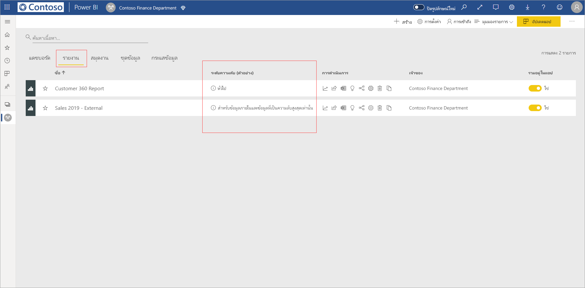
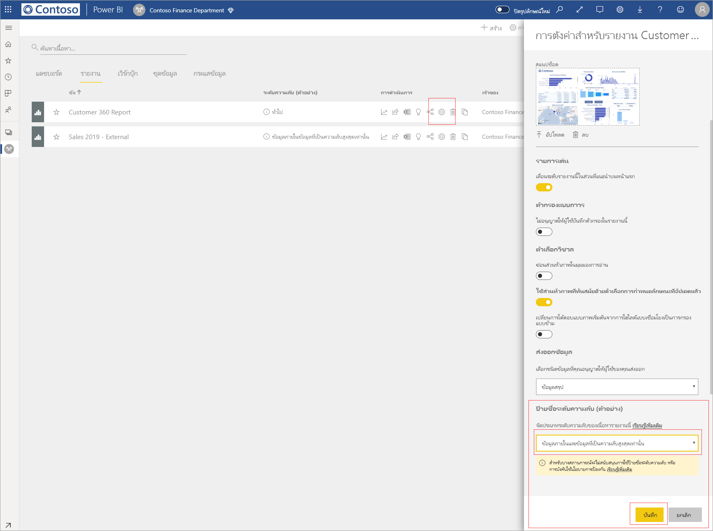
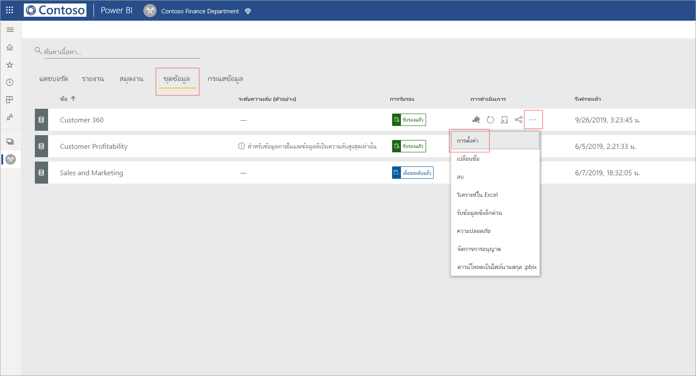
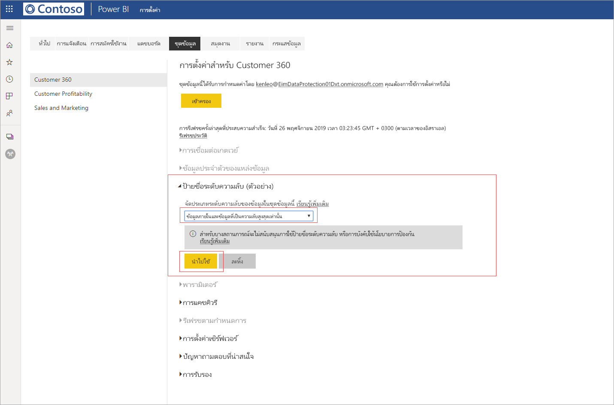
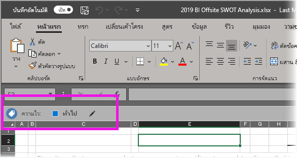

# ใช้ป้ายชื่อระดับความลับของข้อมูลใน Power BI

ป้ายชื่อระดับความลับของ Microsoft Information Protection กับรายงาน แดชบอร์ด ชุดข้อมูล และกระแสข้อมูลสามารถป้องกันเนื้อหาที่สำคัญของคุณจากการเข้าถึงข้อมูลที่ไม่ได้รับอนุญาตและการรั่วไหล การติดป้ายข้อมูลด้วยป้ายชื่อระดับความลับของข้อมูลอย่างถูกต้องช่วยให้มั่นใจได้ว่าเฉพาะผู้ที่ได้รับอนุญาตเท่านั้นที่สามารถเข้าถึงข้อมูลของคุณได้ บทความนี้แสดงให้เห็นว่าคุณจะใช้ป้ายชื่อระดับความลับกับเนื้อหาของคุณได้อย่างไร

เพื่อให้สามารถใช้ป้ายชื่อระดับความลับใน Power BI:
* คุณต้องมีสิทธิการใช้งาน Power BI แบบ Pro และสิทธิแก้ไขบนแหล่งข้อมูลที่คุณต้องการติดป้ายชื่อ
* คุณต้องเป็นสมาชิกของกลุ่มความปลอดภัยที่มีสิทธิ์ใช้ป้ายชื่อระดับความลับของข้อมูลตามที่อธิบายไว้ในบทความชื่อ [เปิดใช้งานป้ายชื่อระดับความลับของข้อมูลใน Power BI](../admin/service-security-enable-data-sensitivity-labels.md#enable-data-sensitivity-labels)
* ต้องสอดคล้องกับ[ข้อกำหนดเบื้องต้น](../admin/service-security-data-protection-overview.md#requirements-for-using-sensitivity-labels-in-power-bi) และ[ข้อกำหนดสิทธิการใช้งาน](../admin/service-security-data-protection-overview.md#licensing)ทั้งหมด

สำหรับข้อมูลเพิ่มเติมเกี่ยวกับป้ายชื่อระดับความลับของข้อมูลใน Power BI โปรดดู [ภาพรวมของการป้องกันข้อมูลใน Power BI](../admin/service-security-data-protection-overview.md)

## การใช้ป้ายชื่อระดับความลับ

เมื่อเปิดใช้งานการป้องกันข้อมูลในผู้เช่าของคุณ ป้ายชื่อระดับความลับจะปรากฏในคอลัมน์ความลับในมุมมองรายการของแดชบอร์ด รายงาน ชุดข้อมูล และกระแสข้อมูล

**เมื่อต้องการนำไปใช้หรือเปลี่ยนป้ายชื่อระดับความลับบนรายงานหรือแดชบอร์ด**
1. คลิก **ตัวเลือกเพิ่มเติม (... )**
1. เลือก **การตั้งค่า**
1. ในบานหน้าต่างด้านการตั้งค่า ให้เลือกป้ายชื่อระดับความลับที่เหมาะสม
1. บันทึกการตั้งค่า

รูปภาพต่อไปนี้อธิบายขั้นตอนเหล่านี้ในรายงาน

**เมื่อต้องการนำไปใช้หรือเปลี่ยนป้ายชื่อระดับความลับบนชุดข้อมูลหรือกระแสข้อมูล**

1. คลิก **ตัวเลือกเพิ่มเติม (... )**
1. เลือก **การตั้งค่า**
1. ในบานหน้าต่างด้านการตั้งค่า ให้เลือกป้ายชื่อระดับความลับที่เหมาะสม
1. ใช้การตั้งค่า

สองรูปต่อไปนี้แสดงขั้นตอนเหล่านี้ในชุดข้อมูล

เลือก **ตัวเลือกเพิ่มเติม (...)** จากนั้น **การตั้งค่า**

บนหน้าการตั้งค่า ให้เปิดส่วนป้ายชื่อระดับความลับ เลือกป้ายชื่อระดับความลับที่ต้องการ แล้วคลิก **นำไปใช้**

## การลบป้ายชื่อระดับความลับ
หากต้องการลบป้ายชื่อระดับความลับออกจากรายงาน แดชบอร์ด ชุดข้อมูลหรือกระแสข้อมูล ให้ทำตาม[ขั้นตอนเดียวกับที่ใช้สำหรับการใช้งานป้ายชื่อ](#applying-sensitivity-labels) แต่เลือก **(ไม่มี)** เมื่อได้รับพร้อมท์ให้จัดประเภทระดับความลับของข้อมูล 

## การป้องกันข้อมูลในไฟล์ที่ส่งออก

การป้องกันข้อมูลที่เกี่ยวข้องกับป้ายชื่อระดับความลับจะถูกนำไปใช้กับข้อมูลเท่านั้นเมื่อมีการส่งออกไฟล์ Excel, PowerPoint และ PDF สิ่งนี้ไม่รองรับ Analyze ใน Excel, การส่งออกเป็น .csv, การดาวน์โหลดชุดข้อมูล (.pbix), คุณลักษณะ Power BI Service Live Connect หรือรูปแบบการส่งออกอื่น ๆ ตัวเลือกการส่งออกข้อมูลถูกควบคุมโดยผู้ดูแลระบบผู้เช่า Power BI [การตั้งค่าการส่งออก](../service-admin-portal.md#export-and-sharing-settings)

เมื่อคุณ [ส่งออกข้อมูลจากรายงาน](https://docs.microsoft.com/power-bi/consumer/end-user-export) ที่มีป้ายชื่อระดับความลับไปยังไฟล์ Excel, PowerPoint และ PDF ป้ายชื่อระดับความลับดังกล่าวจะสืบทอดไปยังไฟล์ที่สร้างขึ้น ป้ายชื่อระดับความลับจะปรากฏในไฟล์ และการเข้าถึงไฟล์จะถูกจำกัดเฉพาะสำหรับผู้ที่มีสิทธิ์เพียงพอเท่านั้น

## ข้อควรพิจารณาและข้อจำกัด

รายการต่อไปนี้แสดงข้อจำกัดบางอย่างของป้ายชื่อระดับความลับใน Power BI:

**ทั่วไป**
* ป้ายชื่อระดับความลับสามารถใช้ได้เฉพาะบนแดชบอร์ด รายงาน ชุดข้อมูล และกระแสข้อมูลเท่านั้น ในปัจจุบัน ป้ายชื่อระดับความลับยังไม่สามารถใช้ได้สำหรับ [รายงานที่มีการแบ่งหน้า](../paginated-reports/report-builder-power-bi.md) และสมุดงาน
* ป้ายชื่อระดับความลับบนแอสเซท Power BI สามารถมองเห็นได้ในรายการพื้นที่ทำงาน สายข้อมูล รายการโปรด ล่าสุด และมุมมองแอป ในขณะนี้ป้ายชื่อจะไม่สามารถมองเห็นได้ในมุมมอง "แบ่งปันแล้วกับฉัน" อย่างไรก็ตาม โปรดทราบว่าป้ายชื่อที่ใช้กับแอสเซท Power BI แม้ว่าจะไม่สามารถมองเห็นได้ จะยังคงอยู่ในข้อมูลที่ส่งออกไปเป็นไฟล์ Excel, PowerPoint และ PDF เสมอ
* ป้ายชื่อระดับความลับได้รับการรองรับสำหรับผู้เช่าในระบบคลาวด์ (สาธารณะ) ส่วนกลางเท่านั้น ป้ายชื่อระดับความลับไม่ได้รับการรองรับสำหรับผู้เช่าในระบบคลาวด์อื่นๆ
* ไม่รองรับป้ายชื่อระดับความลับของข้อมูลสำหรับแอปเทมเพลต ป้ายชื่อระดับความลับที่ตั้งค่าโดยผู้สร้างแอปเทมเพลตจะถูกลบออกเเมื่อมีการแยกและติดตั้งแอป และป้ายชื่อระดับความลับที่เพิ่มไปยังอาร์ทิแฟกต์ในแอปเทมเพลตที่ติดตั้งโดยผู้บริโภคแอปสูญหายไป (ตั้งค่าใหม่เป็นไม่มีอะไร) เมื่อมีการอัปเดตแอป
* Power BI ไม่รองรับป้ายชื่อระดับความลับของประเภทการป้องกัน [Do Not Forward](https://docs.microsoft.com/microsoft-365/compliance/encryption-sensitivity-labels?view=o365-worldwide#let-users-assign-permissions), [ผู้ใช้กำหนดเอง](https://docs.microsoft.com/microsoft-365/compliance/encryption-sensitivity-labels?view=o365-worldwide#let-users-assign-permissions) และ [HYOK](https://docs.microsoft.com/azure/information-protection/configure-adrms-restrictions) ประเภทการป้องกันแบบ Do Not Forward และผู้ใช้กำหนดเองหมายถึงป้ายชื่อที่กำหนดใน[ศูนย์ความปลอดภัยของ Microsoft 365](https://security.microsoft.com/) หรือ[ศูนย์ควบคุมการปฏิบัติตามข้อบังคับของ Microsoft 365](https://compliance.microsoft.com/)

**ส่งออก**
* ตัวควบคุมป้ายชื่อและการป้องกันจะถูกบังคับใช้เฉพาะเมื่อมีการส่งออกข้อมูลไปยังไฟล์ Excel, PowerPoint และ PDF ป้ายชื่อและการป้องกันไม่ได้ถูกบังคับใช้เมื่อมีการส่งออกข้อมูลไปยังไฟล์ .csv หรือ .pbix, Analyze ใน Excel หรือเส้นทางการส่งออกอื่นๆ
* การใช้ป้ายชื่อระดับความลับและการป้องกันกับไฟล์ที่ส่งออกจะไม่เพิ่มเครื่องหมายเนื้อหาไปยังไฟล์ อย่างไรก็ตาม ถ้ามีการกำหนดค่าป้ายชื่อเพื่อใช้เครื่องหมายเนื้อหา ดังนั้นเครื่องหมายเนื้อหาดังกล่าวจะถูกนำไปใช้โดยอัตโนมัติโดยไคลเอ็นต์การติดป้ายแบบรวมของ Azure Information Protection เมื่อเปิดไฟล์ในแอป Office desktop การทำเครื่องหมายเนื้อหาจะไม่ถูกนำไปใช้โดยอัตโนมัติเมื่อคุณใช้การติดป้ายชื่อที่มีอยู่ภายในสำหรับเดสก์ท็อป อุปกรณ์เคลื่อนที่ หรือเว็บแอป โปรดดู [เมื่อแอป Office ใช้การทำเครื่องหมายเนื้อหาและการเข้ารหัสลับ](https://docs.microsoft.com/microsoft-365/compliance/sensitivity-labels-office-apps?view=o365-worldwide#when-office-apps-apply-content-marking-and-encryption) สำหรับรายละเอียดเพิ่มเติม
* ผู้ใช้ที่ส่งออกไฟล์จาก Power BI มีสิทธิ์ในการเข้าถึงและการแก้ไขไฟล์นั้นตามการตั้งค่าป้ายชื่อระดับความลับ ผู้ใช้ที่ส่งออกข้อมูลไม่ได้รับสิทธิ์การเป็นเจ้าของสำหรับไฟล์ดังกล่าว
* การส่งออกจะล้มเหลวถ้าไม่สามารถนำป้ายชื่อไปใช้ได้เมื่อมีการส่งออกข้อมูลไปยังไฟล์ หากต้องการตรวจสอบว่าการส่งออกล้มเหลวเนื่องจากไม่สามารถใช้ป้ายชื่อได้ ให้คลิกที่ชื่อรายงานหรือแดชบอร์ดที่กึ่งกลางของแถบชื่อเรื่องและดูว่า "ไม่สามารถโหลดป้ายชื่อระดับความลับได้" ในดร็อปดาวน์ข้อมูลที่เปิดขึ้น ซึ่งอาจเกิดขึ้นได้ถ้าป้ายชื่อที่ใช้ได้รับการยกเลิกการเผยแพร่หรือถูกลบโดยผู้ดูแลระบบความปลอดภัย หรือเป็นผลมาจากปัญหาระบบชั่วคราว

## ขั้นตอนถัดไป

บทความนี้อธิบายวิธีการใช้งานป้ายชื่อระดับความลับของข้อมูลใน Power BI บทความต่อไปนี้แสดงรายละเอียดเพิ่มเติมเกี่ยวกับการป้องกันข้อมูลใน Power BI 

* [ภาพรวมของการป้องกันข้อมูลใน Power BI](../admin/service-security-data-protection-overview.md)
* [เปิดใช้งานป้ายชื่อระดับความลับของข้อมูลใน Power BI](../admin/service-security-enable-data-sensitivity-labels.md)
* [ใช้ตัวควบคุม Microsoft Cloud App Security ใน Power BI](../admin/service-security-using-microsoft-cloud-app-security-controls.md)