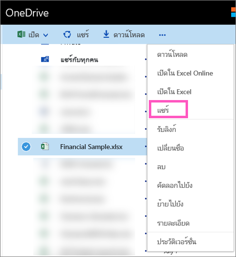

# แชร์แดชบอร์ด Power BI ที่เชื่อมโยงไปยังไฟล์ Excel ใน OneDrive
ใน Power BI คุณสามารถ[เชื่อมต่อกับเวิร์กบุ๊ก Excel บน OneDrive for Business](../connect-data/service-excel-workbook-files.md)และปักหมุดไทล์ไปยังแดชบอร์ดจากเวิร์กบุ๊กนั้นได้ เมื่อคุณแชร์แดชบอร์ดนั้น หรือสร้างชุดเนื้อหาที่ประกอบด้วยแดชบอร์ดนั้น:

* เพื่อนร่วมงานของคุณสามารถดูไทล์โดยไม่จำเป็นต้องมีสิทธิ์การใช้งานสำหรับเวิร์กบุ๊กนั้นได้ ดังนั้นคุณสามารถสร้างชุดเนื้อหาได้ และโปรดทราบว่าเพื่อนร่วมงานของคุณสามารถดูมีไทล์ที่สร้างขึ้นจากเวิร์กบุ๊ก Excel บน OneDrive ได้
* การคลิกที่ไทล์จะเปิดเวิร์กบุ๊กภายใน Power BI เวิร์กบุ๊กจะเปิดขึ้นเฉพาะเมื่อผู้ร่วมงานของคุณมี[สิทธิ์การอ่าน](https://support.office.com/article/Share-documents-or-folders-in-Office-365-1fe37332-0f9a-4719-970e-d2578da4941c)สำหรับเวิร์กบุ๊กบน OneDrive for Business เป็นอย่างน้อย

## แชร์แดชบอร์ดที่ประกอบด้วยไทล์เวิร์กบุ๊ก
เมื่อต้องการแชร์แดชบอร์ดที่เชื่อมโยงกลับไปยังเวิร์กบุ๊ก Excel บน OneDrive for Business ดู[แชร์แดชบอร์ด](service-share-dashboards.md) ความแตกต่างก็คือ คุณมีตัวเลือกในการปรับเปลี่ยนสิทธิ์การใช้งานสำหรับเวิร์กบุ๊ก Excel ที่เชื่อมโยงก่อนการแชร์

  

1. ใส่อีเมลของผู้ร่วมงานของคุณ
2. เพื่อให้เพื่อนร่วมงานของคุณสามารถดูเวิร์กบุ๊ก Excel จาก Power BI ได้ เลือก**ไปยัง OneDrive for Business เพื่อตั้งค่าสิทธิ์การใช้งานเวิร์กบุ๊ก**
3. บน OneDrive [แก้ไขสิทธิ์การใช้งาน](https://support.office.com/article/Share-files-and-folders-and-change-permissions-9fcc2f7d-de0c-4cec-93b0-a82024800c07)ตามความจำเป็น
4. เลือก**แชร์**

>[!NOTE]
>เพื่อนร่วมงานของคุณจะไม่สามารถปักหมุดไทล์เพิ่มเติมจากเวิร์กบุ๊กนั้น หรือทำการเปลี่ยนแปลงไปยังเวิร์กบุ๊ก Excel จาก Power BI ได้
> 
> 

## สร้างชุดเนื้อหาองค์กรด้วยแดชบอร์ดที่ประกอบด้วยไทล์เวิร์กบุ๊ก
เมื่อคุณ[เผยแพร่ชุดเนื้อหา](service-organizational-content-pack-create-and-publish.md) คุณให้การเข้าถึงกับเพื่อนร่วมงานแต่ละคนหรือแต่ละกลุ่ม เมื่อคุณเผยแพร่ชุดเนื้อหาที่ประกอบด้วยลิงก์เวิร์กบุ๊ก คุณจะมีตัวเลือกในการปรับเปลี่ยนสิทธิ์การใช้งานสำหรับเวิร์กบุ๊ก Excel ที่เชืี่อมโยงก่อนการเผยแพร่

1. ที่หน้าจอ**สร้างชุดเนื้อหา** ใส่ที่อยู่อีเมล ใส่ชื่อเรื่องชุดเนื้อหาและคำอธิบาย จากนั้นอัปโหลดรูป
2. เลือกแดชบอร์ดและ/หรือรายงานที่เชื่อมโยงไปยังเวิร์กบุ๊ก Excel บน OneDrive for Business
   
    
3. เลือก**ไปยัง OneDrive for Business เพื่อตั้งค่าสิทธิ์เวิร์กบุ๊ก**
4. บน OneDrive [แก้ไขสิทธิ์การใช้งาน](https://support.office.com/article/Share-files-and-folders-and-change-permissions-9fcc2f7d-de0c-4cec-93b0-a82024800c07)ตามความจำเป็น
5. เลือก **เผยแพร่**

## แชร์แดชบอร์ดจากพื้นที่ทำงาน Power BI
การแชร์แดชบอร์ดจากพื้นที่ทำงาน Power BI จะคล้ายกับการแชร์แดชบอร์ดจากพื้นที่ทำงานของคุณเอง เว้นแต่ว่าไฟล์ต่างๆ จะอยู่ในไซต์พื้นที่ทำงาน Microsoft 365 แทนการอยู่ใน OneDrive for Business ส่วนตัวของคุณ ปรับเปลี่ยนสิทธิ์การใช้งานสำหรับเวิร์กบุ๊ก Excel ก่อนที่จะแชร์แดชบอร์ดกับบุคคลภายนอกพื้นที่ทำงาน

## ขั้นตอนถัดไป
* [ปักหมุดไทล์ไปที่แดชบอร์ด Power BI จาก Excel](../create-reports/service-dashboard-pin-tile-from-excel.md)
* [แนวคิดพื้นฐานสำหรับนักออกแบบในบริการ Power BI](../fundamentals/service-basic-concepts.md)
* มีคำถามเพิ่มเติมหรือไม่ [ลองไปที่ชุมชน Power BI](https://community.powerbi.com/)
