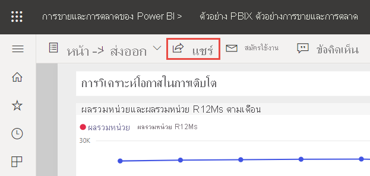
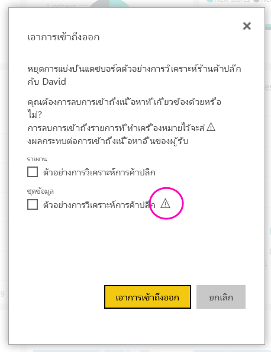

# แชร์แดชบอร์ด Power BI และรายงานกับเพื่อนร่วมงานและคนอื่นๆ
*การแชร์*เป็นวิธีที่ง่ายที่สุดในการให้ผู้ใช้สามารถเข้าถึงแดชบอร์ดและรายงานของคุณในบริการของ Power BI ได้ คุณสามารถแชร์กับบุคคลภายในหรือภายนอกองค์กรของคุณได้

เมื่อคุณแชร์แดชบอร์ดหรือรายงาน คนที่คุณแชรให้จะสามารถดูและโต้ตอบกับรายการดังกล่าวได้ แต่ไม่สามารถแก้ไขได้ พวกเขาจะเห็นข้อมูลเดียวกันกับที่คุณเห็นในแดชบอร์ดและรายงานและรับการเข้าถึงชุดข้อมูลเบื้องต้นทั้งหมด นอกจากว่าจะมีความปลอดภัยระดับแถว (RLS) ใช้กับชุดข้อมูลพื้นฐาน  เหล่าเพื่อนร่วมงานที่คุณแชร์กับสามารถใช้ร่วมกับเพื่อนร่วมงานของพวกเขา ถ้าคุณอนุญาต บุคคลภายนอกองค์กรสามารถดู และโต้ตอบกับแดชบอร์ดหรือรายงาน แต่ไม่สามารถแชร์ได้ 

คุณสามารถแชร์แดชบอร์ดและรายงานได้จากหลายตำแหน่งในบริการของ Power BI ดังนี้: รายการโปรด ล่าสุด พื้นที่ทำงานของฉัน คุณสามารถแชร์จากพื้นที่ทำงานอื่นได้เช่นกัน ถ้าคุณมี [บทบาทผู้ดูแลระบบ สมาชิกหรือผู้สนับสนุน](service-new-workspaces.md#roles-in-the-new-workspaces) ในพื้นที่ทำงาน และคุณสามารถแชร์แดชบอร์ดและรายงานในแชร์ร่วมกับฉันได้ถ้าเจ้าของอนุญาต 

บริการของ Power BI มีวิธีอื่นๆ ในการทำงานร่วมกันและเผยแพร่แดชบอร์ดและรายงานได้เช่นกัน อ่าน[วิธีการเพื่อทำงานร่วมกันและแชร์ใน Power BI](service-how-to-collaborate-distribute-dashboards-reports.md) เพื่อดูวิธีที่ดีที่สุดสำหรับสถานการณ์ของคุณ 

ด้วยการใช้งานร่วมกัน ไม่ว่าคุณแชร์เนื้อหาภายใน หรือภายนอกองค์กร คุณจำเป็นต้องมี[สิทธิ์การใช้งาน Power BI Pro](../fundamentals/service-features-license-type.md) ผู้รับของคุณยังต้องมีสิทธิ์ใช้งาน Power BI Pro หรือเนื้อหาต้องอยู่ใน [ความจุแบบพรีเมียม](../admin/service-premium-what-is.md) 

คุณไม่สามารถ*แชร์* ได้โดยตรงจาก Power BI Desktop คุณ[เผยแพร่รายงานจาก Power BI Desktop](../create-reports/desktop-upload-desktop-files.md) ไปยังบริการ Power BI อย่างไรก็ตาม คุณยังสามารถ[แชร์แดชบอร์ดจากแอป Power BI สำหรับอุปกรณ์เคลื่อนที่](../consumer/mobile/mobile-share-dashboard-from-the-mobile-apps.md)ได้ด้วย  

## แชร์แดชบอร์ดหรือรายงาน

1. ในรายการของแดชบอร์ดหรือรายงาน หรือในแดชบอร์ดหรือรายงานที่เปิด ให้เลือก**แชร์**:::image type="icon" source="../media/power-bi-share-icon.png" border="false":::

2. ในกล่องทางด้านบน ใส่อยู่อีเมลแบบเต็มสำหรับแต่ละบุคคล กลุ่มการแจกจ่ายหรือกลุ่มความปลอดภัย คุณไม่สามารถใช้ร่วมกับรายการการแจกแจงแบบไดนามิก 
   
   คุณสามารถใช้ร่วมกันกับบุคคลที่มีอยู่ภายนอกองค์กรของคุณ แต่คุณจะเห็นคำเตือน อ่านเพิ่มเติมเกี่ยวกับ[การแชร์ออกนอกองค์กรของคุณ](#share-a-dashboard-or-report-outside-your-organization) ในบทความนี้
   
    
 
   >[!NOTE]
   >กล่องข้อมูลป้อนเข้ารองรับผู้ใช้หรือกลุ่มแยกกันได้สูงสุด 100 คน/กลุ่ม โปรดดูหัวข้อ [แชร์กับผู้ใช้มากกว่า 100 ราย](#share-with-more-than-100-separate-users) ในบทความนี้สำหรับวิธีการแชร์กับคนอื่นมากขึ้น

3. เพิ่มข้อความถ้าคุณต้องการ เลือกหรือไม่เลือกก็ได้
4. เมื่อต้องการให้เพื่อนร่วมงานของคุณใช้เนื้อหาของคุณร่วมกันกับผู้อื่น ให้ตรวจสอบ **อนุญาตให้ผู้รับแชร์แดชบอร์ด (หรือรายงาน)**
   
   อนุญาตให้ผู้อื่นแชร์นั้นถูกเรียกว่า*resharing* ถ้าคุณให้อนุญาตพวกเขา พวกเขาสามารถแชร์ต่อจาก Power BI service และแอปสำหรับอุปกรณ์เคลื่อน หรือส่งต่ออีเมลเชิญให้กับผู้อื่นในองค์กรของคุณ คำเชิญจะหมดอายุในอีกหนึ่งเดือน บุคคลภายนอกองค์กรของคุณไม่สามารถแชร์ต่อได้ ในฐานะเจ้าของเนื้อหา คุณสามารถปิดการแชร์ซ้ำ หรือเพิกถอนการแชร์ซ้ำบนแต่ละเซลล์ โปรดดูหัวข้อ [หยุดหรือเปลี่ยนแปลงการแชร์](#stop-or-change-sharing) ในบทความนี้

5. ถ้าคุณเลือก**อนุญาตให้ผู้ใช้สร้างเนื้อหาใหม่โดยใช้ชุดข้อมูลพื้นฐาน** พวกเขาสามารถสร้างรายงานของตนเองในพื้นที่ทำงานอื่น ๆ โดยยึดตามชุดข้อมูลสำหรับแดชบอร์ดนี้ได้ อ่านเพิ่มเติมเกี่ยวกับ [การสร้างรายงานที่ยึดตามชุดข้อมูลจากพื้นที่ทำงานที่ต่างกัน](../connect-data/service-datasets-discover-across-workspaces.md)

1. เลือก**แชร์**
   
     
   
   Power BI ส่งคำเชิญทางอีเมลของบุคคล แต่ไม่สามารถจัดกลุ่ม ที่มีลิงก์ไปยังเนื้อหาที่แชร์ คุณดูแจ้งเตือนที่**ประสบความสำเร็จ** 
   
   เมื่อผู้รับในองค์กรของคุณคลิกลิงก์ Power BI เพิ่มแดชบอร์ดหรือรายงานหน้ารายการ**แชร์กับฉัน**ของพวกเขา พวกเขาสามารถเลือกชื่อของคุณเมื่อต้องการดูเนื้อหาทั้งหมดที่คุณได้่แชร์กับพวกเขา 
   
   
   
   เมื่อผู้รับภายนอกองค์กรของคุณคลิกลิงก์ พวกเขาจะเห็นแดชบอร์ดหรือรายงาน แต่ไม่ใช่ในพอร์ทัล Power BI ปกติ อ่านเพิ่มเติมเกี่ยวกับ [การแชร์กับบุคคลภายนอกองค์กรของคุณ](#share-a-dashboard-or-report-outside-your-organization) ในบทความนี้

## ดูว่าใครสามารถเข้าถึงแดชบอร์ดหรือรายงานที่คุณแชร์ได้บ้าง
ในบางครั้งคุณจำเป็นต้องดูบุคคลที่คุณได้แชร์ และดูว่าพวกเขาได้แชร์กับใครบ้าง

1. ในรายการของแดชบอร์ดและรายงาน หรือในแดชบอร์ดหรือรายงานเอง ให้เลือก**แชร์** :::image type="icon" source="../media/power-bi-share-icon.png" border="false"::: 
2. ในกล่องโต้ตอบ **แชร์แดชบอร์ด** หรือ **รายงาน** ให้เลือก **เข้าถึง**
   
    

    บุคคลภายนอกองค์กรของคุณได้แสดงอยู่ในขณะ**ผู้เยี่ยมชม**

    ในมุมมองนี้ คุณสามารถ [หยุดหรือเปลี่ยนแปลงสิทธิ์การแชร์](#stop-or-change-sharing) ในบทความนี้ 

## แชร์แดชบอร์ดหรือรายงานภายนอกองค์กรของคุณ
เมื่อคุณแชร์กับบุคคลภายนอกองค์กรของคุณ พวกเขาได้รับอีเมลพร้อมลิงก์ไปยังแดชบอร์ดหรือรายงานที่แชร์ พวกเขาต้องลงชื่อเข้าใช้ Power BI เพื่อดูสิ่งที่คุณแชร์ ถ้าพวกเขาไม่มีสิทธิ์การใช้งาน Power BI Pro พวกเขาสามารถลงทะเบียนขอสิทธิ์การใช้งานหลังจากพวกเขาคลิกลิงก์

หลังจากที่พวกเขาลงชื่อเข้าใช้ พวกเขาจะเห็นแดชบอร์ดหรือรายงานที่แชร์ในหน้าต่างเบราว์เซอร์ของตนเอง ไม่ใช่ในพอร์ทัล Power BI ปกติของพวกเขา หากต้องการเข้าถึงแดชบอร์ดหรือรายงานในภายหลัง พวกเขาจะต้องบุ๊กมาร์กลิงก์เอาไว้

พวกเขาจะไม่สามารถแก้ไขเนื้อหาใดๆ ในแดชบอร์ดหรือรายงานนี้ได้ พวกเขาสามารถโต้ตอบกับแผนภูมิ และเปลี่ยนตัวกรอง หรือตัวแบ่งส่วนข้อมูล แต่ไม่สามารถบันทึกการเปลี่ยนแปลงของพวกเขาได้ 

เฉพาะผู้รับโดยตรงของคุณเท่านั้นที่สามารถดูแดชบอร์ดหรือรายงานที่แชร์ได้ ตัวอย่างเช่น ถ้าคุณส่งอีเมลไปยัง Vicki@contoso.com ดังนั้นมีเพียง Vicki เท่านั้นที่สามารถมองเห็นแดชบอร์ดได้ บุคคลอื่นไม่สามารถมองเห็นแดชบอร์ดได้ แม้ว่า Vicki จะส่งต่อลิงก์ไปให้ก็ตาม Vicki ต้องใช้ที่อยู่อีเมลเดียวกันในการเข้าถึง ถ้า Vicki ลงทะเบียนด้วยที่อยู่อีเมลอื่น Vicki จะไม่สามารถเข้าถึงแดชบอร์ดได้

บุคคลภายนอกองค์กรของคุณไม่สามารถมองเห็นข้อมูลใดเลย ถ้าการรักษาความปลอดภัยระดับแถวหรือระดับบทบาทหรือระดับบทบาทถูกเปิดใช้ในแบบจำลองแบบตาราง Analysis Services ภายในองค์กร

ใช้กลุ่มความปลอดภัย ไม่ใช่กลุ่มการแจกจ่ายเพื่อแชร์กับกลุ่มที่มีบุคคลที่มีที่อยู่อีเมลภายนอก บุคคลที่มีอีเมลภายนอกในกลุ่มการแจกจ่ายไม่สามารถดูเนื้อหาที่คุณแชร์ เว้นแต่ว่าพวกเขาจะเป็นผู้ใช้ประเภทผู้เยี่ยมชมแบบ B2B สำหรับ Azure Active Directory (Azure AD) เรียนรู้เพิ่มเติมเกี่ยวกับการ [ผู้ใช้ประเภทผู้เยี่ยมชมแบบ B2B สำหรับ Azure AD](../admin/service-admin-azure-ad-b2b.md)

ถ้าคุณส่งลิงก์จากแอปสำหรับอุปกรณ์เคลื่อนที่ Power BI ไปยังบุคคลภายนอกองค์กร การคลิกลิงก์จะเปิดในเบราว์เซอร์ ไม่ใช่แอปสำหรับอุปกรณ์เคลื่อนที่ Power BI

### อนุญาตให้ผู้ใช้ภายนอกแก้ไขเนื้อหาได้

ผู้ดูแลระบบ Power BI ของคุณสามารถอนุญาตให้ผู้ใช้ที่เป็นผู้เยี่ยมชมทำการแก้ไขและจัดการเนื้อหาในองค์กรของคุณได้ ถ้าเป็นเช่นนั้น ผู้ใช้ภายนอกของคุณจะไม่ได้รับเพียงแค่ประสบการณ์การใช้งานเท่านั้น แต่พวกเขาสามารถแก้ไขและจัดการเนื้อหาภายในองค์กรของคุณได้ด้วย เรียนรู้เพิ่มเติมเกี่ยวกับ [การกระจายเนื้อหา Power BI ไปยังผู้ใช้ที่เป็นผู้เยี่ยมชมจากภายนอกด้วย Azure AD B2B](../admin/service-admin-azure-ad-b2b.md)

## แชร์กับผู้ใช้แยกต่างหากมากกว่า 100 ราย

คุณสามารถแชร์กับผู้ใช้หรือกลุ่มได้มากที่สุด 100 คนต่อการดำเนินการแบ่งปันหนึ่งครั้ง อย่างไรก็ตาม คุณสามารถให้การเข้าถึงหน่วยข้อมูลแก่ผู้ใช้ได้มากกว่า 500 คน นี่คือคำแนะนำบางอย่าง:

- แชร์หลายครั้งโดยการระบุผู้ใช้เป็นรายบุคคล
- แชร์กับกลุ่มผู้ใช้ที่ประกอบด้วยผู้ใช้ทั้งหมด 
- สร้างรายงานหรือแดชบอร์ดในพื้นที่ทำงาน จากนั้นสร้างแอปจากพื้นที่ทำงาน คุณสามารถแชร์แอปกับบุคคลอื่นๆ อีกมากมาย อ่านเพิ่มเติมเกี่ยวกับ [การเผยแพร่แอปใน Power BI](service-create-distribute-apps.md)

## หยุดหรือเปลี่ยนแปลงการแชร์
เฉพาะแดชบอร์ดหรือเจ้าของรายงานที่สามารถเปิดหรือปิดการแชร์ต่อได้

### ถ้าคุณยังไม่ได้ส่งคำเชิญการแชร์
* ยกเลิกการทำเครื่องหมาย**อนุญาตให้ผู้รับแชร์แดชบอร์ด (หรือรายงาน)** ที่ด้านล่างของคำเชิญก่อนที่จะส่ง

### ถ้าคุณเคยแชร์แดชบอร์ดหรือรายงาน
1. ในรายการของแดชบอร์ดและรายงาน หรือในแดชบอร์ดหรือรายงานเอง ให้เลือก**แชร์** :::image type="icon" source="../media/power-bi-share-icon.png" border="false"::: 
2. ในกล่องโต้ตอบ **แชร์แดชบอร์ด** หรือ **รายงาน** ให้เลือก **เข้าถึง**
   
    
3. เลือกจุดไข่ปลา ( **...** ) ถัดจาก**อ่านและแชร์ต่อ**และเลือก
   
   
   
   * **อ่าน**เพื่อป้องกันไม่ให้บุคคลที่ใช้ร่วมกันกับผู้อื่น
   * **ลบการเข้าถึง**เพื่อป้องกันไม่ให้บุคคลที่มองเห็นเนื้อหาที่แชร์ทั้งหมด

4. ในกล่องโต้ตอบ **ลบการเข้าถึง** ให้ตัดสินใจว่าคุณต้องการลบการเข้าถึงเนื้อหาที่เกี่ยวข้องเช่น รายงาน และชุดข้อมูลหรือไม่ ถ้าคุณลบรายการที่มีไอคอนคำเตือน  จะเป็นการดีที่สุดที่จะลบเนื้อหาที่เกี่ยวข้องด้วย มิฉะนั้นระบบจะไม่แสดงได้อย่างถูกต้อง

    

## ข้อจำกัดและข้อควรพิจารณา
สิ่งที่ควรทราบเกี่ยวกับการแชร์แดชบอร์ดและรายงาน

* เมื่อคุณแชร์แดชบอร์ดกับเพื่อนร่วมงาน หมายความว่าคุณกำลังแชร์ชุดข้อมูลเบื้องต้นด้วย เพื่อนร่วมงานของคุณสามารถเข้าถึงชุดข้อมูลทั้งหมด ยกเว้น [การรักษาความปลอดภัยระดับแถว (RLS)](../admin/service-admin-rls.md) จะจำกัดการเข้าถึงของพวกเขา ผู้เขียนรายงานอาจใช้ความสามารถที่กำหนดประสบการณ์ผู้ใช้เมื่อดูหรือโต้ตอบกับรายงาน เช่น การซ่อนคอลัมน์ การจำกัดการดำเนินงานในวิชวล และอื่น ๆ ประสบการณ์ผู้ใช้ที่กำหนดเองเหล่านี้ไม่จำกัดสิ่งที่ผู้ใช้สามารถเข้าถึงข้อมูลในชุดข้อมูล ใช้ [การรักษาความปลอดภัยระดับแถว (RLS)](../admin/service-admin-rls.md) ในชุดข้อมูลเพื่อให้ข้อมูลประจำตัวของแต่ละบุคคลกำหนดว่าข้อมูลใดที่พวกเขาสามารถเข้าถึงได้
* ทุกคนที่คุณแชร์แดชบอร์ดของคุณ สามารถดูและโต้ตอบกับรายงานที่เกี่ยวข้องใน[มุมมองการอ่าน](../consumer/end-user-reading-view.md#reading-view)ได้ โดยทั่วไปแล้ว พวกเขาไม่สามารถสร้างรายงาน หรือบันทึกการเปลี่ยนแปลงรายงานที่มีอยู่ได้ อย่างไรก็ตาม ถ้าคุณเลือก**อนุญาตให้ผู้ใช้สร้างเนื้อหาใหม่โดยใช้ชุดข้อมูลพื้นฐาน** พวกเขาสามารถสร้างรายงานของตนเองในพื้นที่ทำงานอื่นโดยยึดตามชุดข้อมูลสำหรับแดชบอร์ดหรือรายงานนี้ได้
* แม้ว่าไม่มีผู้ใดสามารถดูหรือดาวน์โหลดชุดข้อมูลได้ แต่พวกเขาสามารถเข้าถึงชุดข้อมูลโดยตรงด้วยการใช้คุณลักษณะการวิเคราะห์ใน Excel ผู้ดูแลระบบสามารถจำกัดความสามารถในการใช้การวิเคราะห์ใน Excel สำหรับทุกคนในกลุ่ม อย่างไรก็ตาม ข้อจำกัดสำนี้จะเป็นเพียงข้อจำกัดสำหรับทุกคนในกลุ่มนั้นและสำหรับทุกพื้นที่ทำงานที่อยู่ในกลุ่ม
* ทุกคนสามารถ[รีเฟรชข้อมูล](../connect-data/refresh-data.md)ได้ด้วยตนเอง
* ถ้าคุณใช้ Microsoft 365 สำหรับอีเมล คุณสามารถแชร์กับสมาชิกของกลุ่มการแจกจ่าย โดยการใส่อยู่อีเมลที่เชื่อมโยงกับกลุ่มการแจกจ่าย
* เพื่อนร่วมงานที่มีโดเมนอีเมลเดียวกันกับคุณ และเพื่อนร่วมงานที่มีโดเมนแตกต่างกัน แต่ลงทะเบียนภายในผู้เช่าเดียวกัน สามารถแชร์แดชบอร์ดระหว่างกันได้ ตัวอย่างเช่น โดเมน contoso.com และ contoso2.com มีการลงทะเบียนในผู้เช่ารายเดียวกันและที่อยู่อีเมลของคุณคือ konrads@contoso.com ทั้ง ravali@contoso.com และ gustav@contoso2.com สามารถแชร์แดชบอร์ดของคุณได้ตราบใดที่คุณให้สิทธิ์ในการแชร์แก่พวกเขา
* ถ้าเพื่อนร่วมงานของคุณมีสิทธิ์เข้าถึงแดชบอร์ดหรือรายงานที่เฉพาะเจาะจง คุณสามารถส่งลิงก์โดยตรง เพียงคัดลอก URL เมื่อคุณอยู่บนแดชบอร์ดหรือรายงาน ตัวอย่างเช่น: `https://powerbi.com/dashboards/g12466b5-a452-4e55-8634-xxxxxxxxxxxx`
* ในทำนองเดียวกัน ถ้าผู้ร่วมงานของคุณมีสิทธิ์เข้าถึงแดชบอร์ดอันใดอันหนึ่ง คุณสามารถ[ส่งลิงก์โดยตรงไปยังรายงานด้านใน](service-share-reports.md)ได้ 

## ขั้นตอนถัดไป

- [ฉันควรทำงานร่วมกัน และแชร์แดชบอร์ดและรายงานได้อย่างไร](service-how-to-collaborate-distribute-dashboards-reports.md)
- [แก้ไขปัญหาแดชบอร์ดและรายงานที่ใช้ร่วมกัน](service-troubleshoot-sharing.md)
- [ส่งคำขอหรือให้สิทธิ์การเข้าถึงแดชบอร์ดหรือรายงานที่ใช้ร่วมกัน](service-request-access.md)
- [แชร์รายงาน Power BI ที่ถูกกรอง](service-share-reports.md)
- มีคำถามหรือไม่ [ลองไปที่ชุมชน Power BI](https://community.powerbi.com/)
