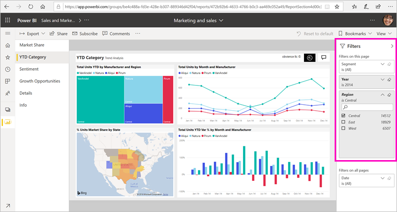
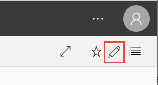
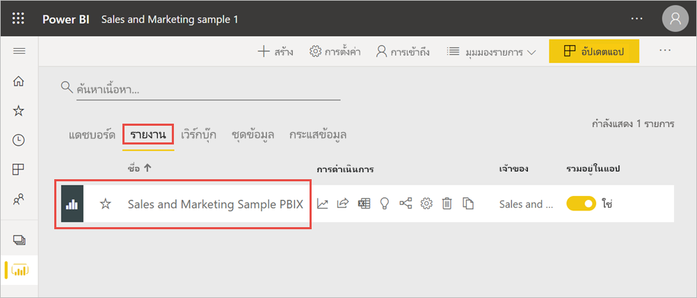
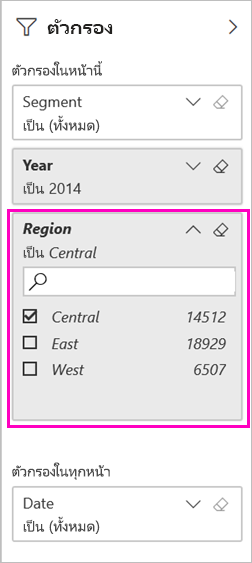
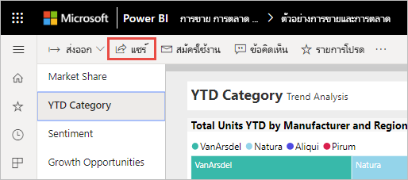
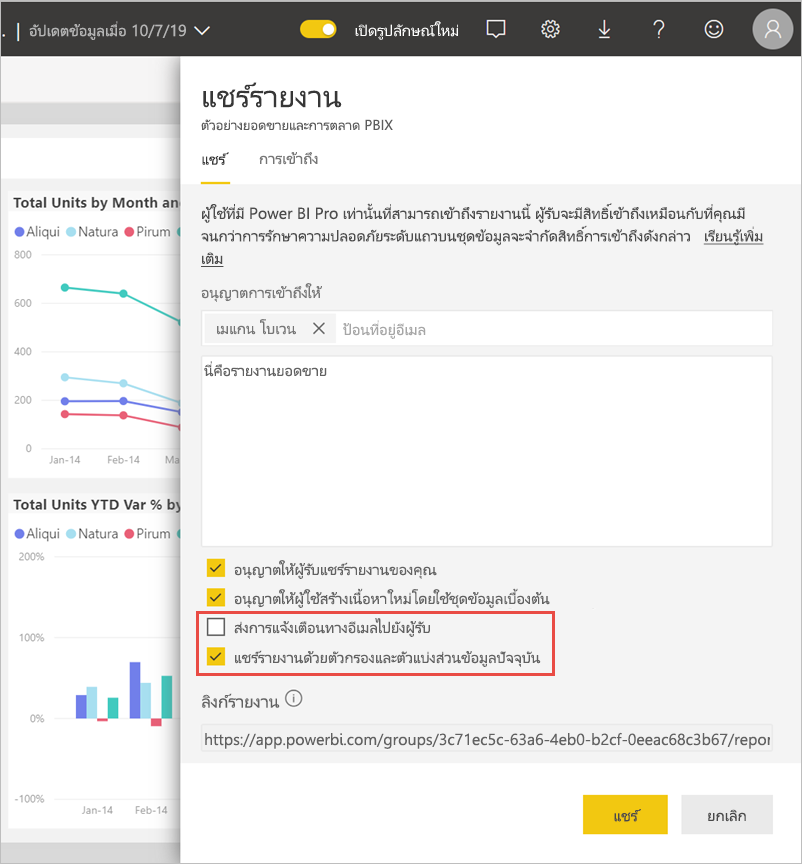
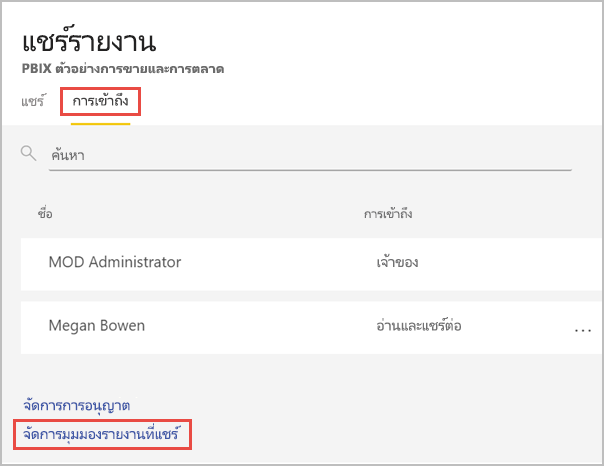

# กรองและแชร์รายงาน Power BI
*แชร์*เป็นวิธีที่ดีเมื่อต้องให้บางคนสามารถเข้าถึงแดชบอร์ดและรายงานของคุณ จะเกิดอะไรขึ้นถ้าคุณต้องการแชร์รายงานที่ถูกกรอง คุณอาจต้องการให้รายงานแสดงเฉพาะข้อมูลสำหรับเมือง หรือพนักงานขาย หรือปีที่เฉพาะเจาะจง บทความนี้อธิบายวิธีการกรองรายงานและการแชร์เวอร์ชันที่กรองแล้วของรายงาน อีกวิธีหนึ่งในการแชร์รายงานที่กรองแล้วคือการ [เพิ่มพารามิเตอร์คิวรีไปยัง URL ของรายงาน](service-url-filters.md) ในทั้งสองกรณี รายงานจะถูกกรองเมื่อผู้รับเปิดเป็นครั้งแรก พวกเขาสามารถล้างตัวเลือกตัวกรองในรายงานได้

Power BI ยังนำเสนอ[วิธีอื่นๆ เพื่อที่จะทำงานร่วมกันและเผยแพร่แดชบอร์ดและรายงาน](service-how-to-collaborate-distribute-dashboards-reports.md) ด้วยการแชร์ คุณและผู้รับของคุณต้องมี[สิทธิ์การใช้งาน Power BI Pro](../fundamentals/service-features-license-type.md)หรือเนื้อหาจำเป็นต้องเป็นแบบ[ความจุพรีเมียม](../admin/service-premium-what-is.md) 

## ติดตามพร้อมด้วยข้อมูลตัวอย่าง

บทความนี้ใช้แอปแม่แบบตัวอย่างการตลาดและการขาย ต้องการลองใช้หรือไม่ 

1. ติดตั้ง [แอปแม่แบบตัวอย่างการตลาดและการขาย](https://appsource.microsoft.com/product/power-bi/microsoft-retail-analysis-sample.salesandmarketingsample?tab=Overview)
2. เลือกแอปและเลือก **สำรวจแอป**

   

3. เลือกไอคอนรูปดินสอเพื่อเปิดพื้นที่ทำงานที่คุณติดตั้งด้วยแอป

    

4. ในรายการเนื้อหาพื้นที่ทำงาน ให้เลือก **รายงาน** จากนั้นเลือกรายงาน **ตัวอย่าง PBIX การขายและการตลาด**

    

    ในตอนนี้คุณก็พร้อมที่จะติดตามไปด้วยแล้ว

## ตั้งค่าตัวกรองในรายงาน

เปิดรายงานใน[มุมมองการแก้ไข](../consumer/end-user-reading-view.md)และใช้ตัวกรอง

ในตัวอย่างนี้ เรากำลังกรองหน้าประเภท YTD ของแอปแม่แบบตัวอย่างการตลาดและการขายเพื่อแสดงเฉพาะค่าที่**ภูมิภาค**นั้นคือ**ภาคกลาง** 
 

บันทึกรายงาน

## แชร์รายงานี่กรองแล้ว

1. เลือก **แชร์**

   

2. ล้าง **ส่งการแจ้งเตือนทางอีเมลไปยังผู้รับ** เพื่อที่คุณจะสามารถส่งการเชื่อมโยงที่ถูกกรองแล้วไปแทน เลือก **แชร์รายงานด้วยตัวกรองและตัวแบ่งส่วนข้อมูลปัจจุบัน**จากนั้นเลือก **แชร์**

    

4. เลือก **แชร์** อีกครั้ง

   

5. เลือกแท็บ **การเข้าถึง** จากนั้นเลือก **จัดการมุมมองรายงานที่แชร์**

    

6. คลิกขวาที่ URL ที่คุณต้องการ แล้วเลือก **คัดลอกลิงก์**

    

7. เมื่อคุณแชร์ลิงก์นี้ ผู้รับจะเห็นรายงานที่กรองแล้วของคุณ 

## ขั้นตอนถัดไป
* [วิธีการแชร์งานของคุณใน Power BI](service-how-to-collaborate-distribute-dashboards-reports.md)
* [แชร์แดชบอร์ด](service-share-dashboards.md)
* มีคำถามเพิ่มเติมหรือไม่ [ลองไปที่ชุมชน Power BI](https://community.powerbi.com/)
* มีคำติชมหรือไม่ ไปที่[ไซต์ชุมชน Power BI](https://community.powerbi.com/) พร้อมกับคำแนะนำของคุณ
