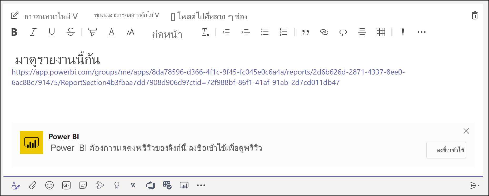
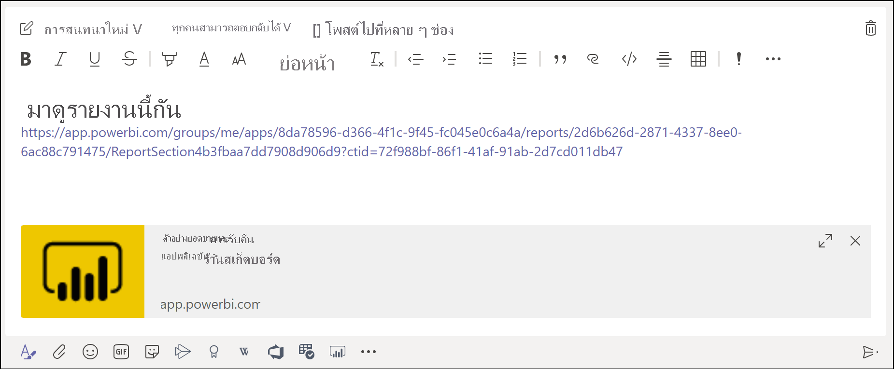
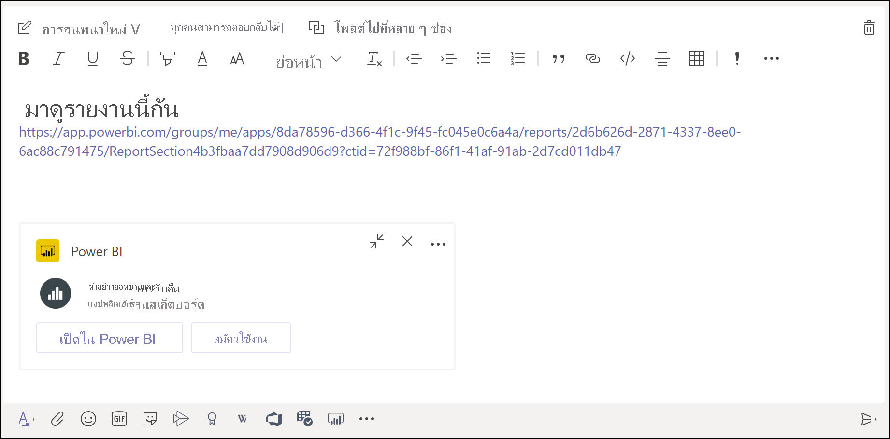

# รับตัวอย่างลิงก์ Power BI ใน Microsoft Teams

เมื่อคุณวางลิงก์ไปยังรายงาน แดชบอร์ด และแอปของคุณลงในกล่องข้อความ Microsoft Teams การแสดงตัวอย่างลิงก์จะแสดงข้อมูลเกี่ยวกับลิงก์ดังกล่าว การแสดงตัวอย่างลิงก์มีไว้สำหรับรายการต่อไปนี้ใน Power BI:

- รายงาน
- แดชบอร์ด
- แอป

บริการการแสดงตัวอย่างลิงก์ต้องการให้ผู้ใช้ของคุณลงชื่อเข้าใช้ หากต้องการออกจากระบบ ให้เลือกไอคอน **Power BI** ที่ด้านล่างของกล่องข้อความ จากนั้นเลือก**ออกจากระบบ**

ดู[การทำงานร่วมกันใน Microsoft Teams ด้วย Power BI](service-collaborate-microsoft-teams.md) สำหรับพื้นหลังเกี่ยวกับวิธีที่ระบบ Power Bi และ Teams ทำงานร่วมกัน รวมถึงข้อกำหนดต่าง ๆ ที่คุณต้องปฏิบัติตามด้วย

## รับตัวอย่างลิงก์

ทำตามขั้นตอนเหล่านี้เพื่อรับการแสดงตัวอย่างลิงก์สำหรับเนื้อหาในบริการของ Power BI

1. คัดลอกลิงก์ไปยังรายงาน แดชบอร์ด หรือแอปในบริการของ Power BI ตัวอย่างเช่น คัดลอกลิงก์จากแถบที่อยู่เบราว์เซอร์

1. วางลิงก์ในกล่องข้อความของ Microsoft Teams ลงชื่อเข้าใช้บริการการแสดงตัวอย่างลิงก์ถ้าได้รับพร้อมท์ คุณอาจต้องรอสองสามวินาในการโหลดการแสดงตัวอย่างลิงก์

    

1. การแสดงตัวอย่างลิงก์พื้นฐานจะปรากฏขึ้นหลังจากลงชื่อเข้าใช้เรียบร้อยแล้ว

    

1. เลือกไอคอน**ขยาย**เพื่อแสดงการ์ดแสดงตัวอย่างแบบผสม

    

1. การ์ดแสดงตัวอย่างลิงก์แบบผสมจะแสดงลิงก์และปุ่มการดำเนินการที่เกี่ยวข้อง

    

1. ส่งข้อความ

## ปัญหาและขีดจำกัดที่ทราบแล้ว

- การลงชื่อเข้าระบบครั้งเดียวไม่ได้รับการรองรับสำหรับบริการการแสดงตัวอย่างลิงก์
- การแสดงตัวอย่างลิงก์ไม่ทำงานในแชทการประชุมหรือแชนเนลส่วนตัว
- ดูปัญหาอื่น ๆ ที่หัวข้อ[ปัญหาที่ทราบแล้วและข้อจำกัดต่าง ๆ](service-collaborate-microsoft-teams.md#known-issues-and-limitations) ในบทความ “ทำงานร่วมกันใน Microsoft Teams"

## ขั้นตอนถัดไป

- [ทำงานร่วมกันใน Microsoft Teams ด้วย Power BI](service-collaborate-microsoft-teams.md)

มีคำถามเพิ่มเติมหรือไม่ [ลองถามชุมชน Power BI](https://community.powerbi.com/)
