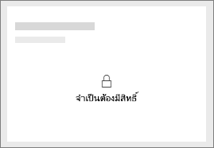
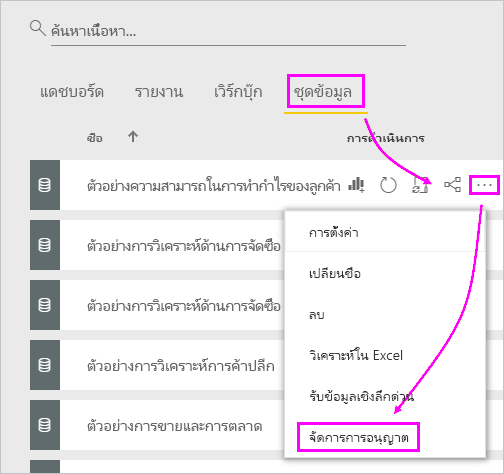
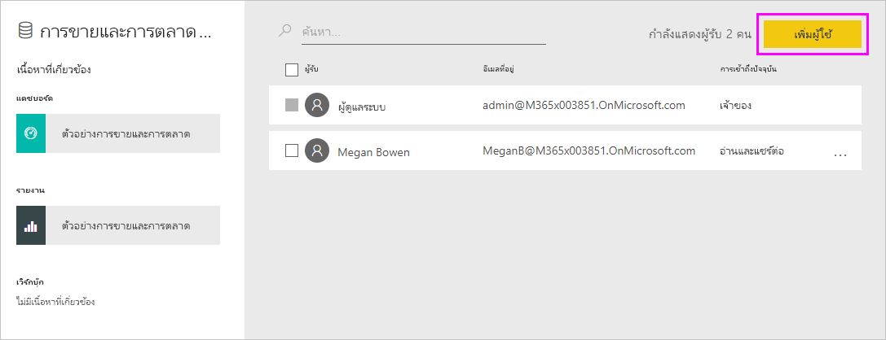
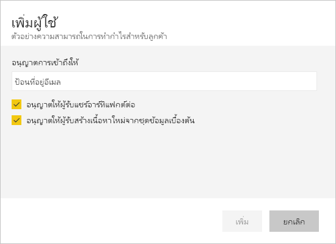

# แก้ไขปัญหาการแชร์แดชบอร์ดและรายงาน

ต่อไปนี้คือปัญหาทั่วไปบางอย่างที่อาจเกิดขึ้นเมื่อคุณแชร์แดชบอร์ดหรือรายงาน หรือเมื่อมีผู้อื่นแชร์กับคุณ 

## ผู้รับแดชบอร์ดจะเห็นไอคอนล็อกในไทล์

บุคคลที่คุณแชรให้อาจเห็นไทล์ในแดชบอร์ด หรือข้อความ "ต้องมีการให้อนุญาต" ถูกล็อก เมื่อพวกเขาพยายามดูรายงาน

ถ้าเป็นเช่นนั้น คุณจำเป็นต้องให้สิทธิ์ในชุดข้อมูลด้านในแก่พวกเขา

1. ไปที่แท็บ**ชุดข้อมูล**ในรายการของคุณเนื้อหา

1. เลือกจุดไข่ปลา ( **...** ) ถัดจากชุดข้อมูล > จากนั้นเลือก **จัดการการอนุญาต**

    

1. เลือก**เพิ่มผู้ใช้**

    

1. ใส่อยู่อีเมลแบบเต็มของบุคคล กลุ่มการเผยแพร่หรือกลุ่มความปลอดภัยของคุณ คุณไม่สามารถใช้ร่วมกับรายการการแจกแจงแบบไดนามิก

    

1. เลือก**เพิ่ม**

## ฉันไม่สามารถแชร์แดชบอร์ดหรือรายงาน

เมื่อต้องแชร์แดชบอร์ดหรือรายงาน คุณต้องได้รับอนุญาตแชร์เนื้อหาเบื้องต้นใด ๆ ที่เกี่ยวข้องกับรายงานและชุดข้อมูล ถ้าคุณเห็นข้อความบอกว่า คุณไม่สามารถแชร์ได้ ขอให้ผู้เขียนรายงานให้แชร์สิทธิ์สำหรับรายงานและชุดข้อมูลเหล่านั้นแก่คุณอีกครั้ง

## ฉันไม่สามารถเข้าถึงแดชบอร์ดหรือรายงานได้

ถ้าคุณเห็นข้อความ "ขอสิทธิ์การเข้าถึง" เมื่อคุณเลือกที่ลิงก์ไปยังรายงานหรือแดชบอร์ด แสดงว่าคุณไม่มีสิทธิ์ในการเข้าดูรายการ คุณจำเป็นต้อง [ขอสิทธิ์การเข้าถึง](service-request-access.md)

## ขั้นตอนถัดไป

- [แชร์แดชบอร์ดและรายงาน Power BI กับเพื่อนร่วมงานและคนอื่นๆ](service-share-dashboards.md)
- [ฉันควรทำงานร่วมกัน และแชร์แดชบอร์ดและรายงานได้อย่างไร](service-how-to-collaborate-distribute-dashboards-reports.md)
-  [แชร์รายงาน Power BI ที่ถูกกรอง](service-share-reports.md)
- มีคำถามหรือไม่ [ลองไปที่ชุมชน Power BI](https://community.powerbi.com/)
