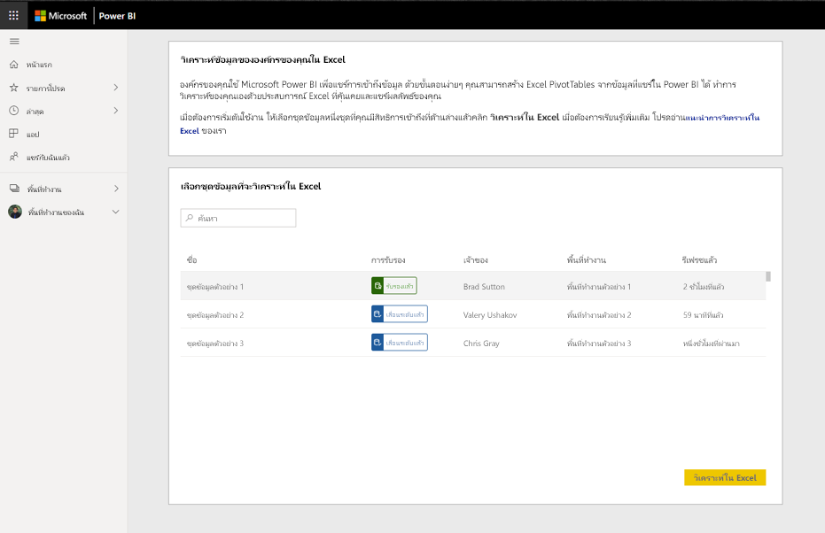
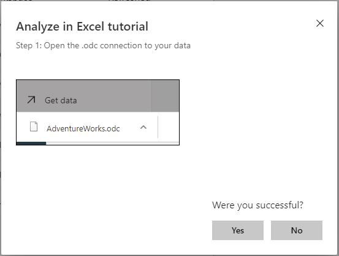
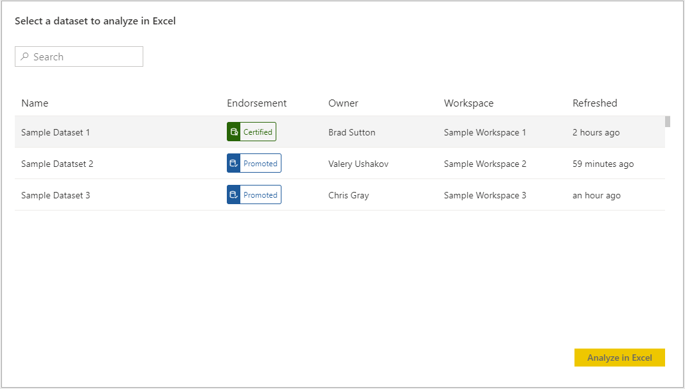
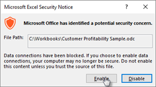

# บทช่วยสอน: ใช้ Power BI Analyze ใน Excel โดยเริ่มต้นใน Excel

องค์กรของคุณใช้ประโยชน์จาก Power BI เพื่อแชร์การเข้าถึงข้อมูล คุณเริ่มคุณลักษณะ Power BI Analyze ใน Excel จาก Excel เพื่อสร้าง PivotTables และ PivotCharts ใน Excel คุณลักษณะดังกล่าวสามารถนำบริบทเพิ่มเติมมาสู่การวิเคราะห์ของคุณหรือลดเวลาในการค้นหาและนำเข้าชุดข้อมูลที่เกี่ยวข้อง

หากต้องการเริ่มต้นใช้งานชุดข้อมูล Power BI ใน Excel เลือก "Analyze ใน Excel" คุณได้รับคำแนะนำให้สร้าง PivotTable ที่ใช้ข้อมูล  

คุณสามารถค้นหาชุดข้อมูลเพิ่มเติมที่องค์กรของคุณแชร์ได้โดยการกลับไปยังหน้าชุดข้อมูล

ถ้าคุณพบปัญหาที่จุดใดก็ตาม ให้เลือก **ไม่** ในขั้นตอนที่เหมาะสมในโฟลว์ด้านล่างและให้คำติชมในแบบฟอร์มที่เชื่อมโยงอยู่  

ในบทช่วยสอนนี้ คุณจะเรียนรู้วิธีการ:

> [!div class="checklist"]
> * ดาวน์โหลดไฟล์ ODC จากหน้าชุดข้อมูล Power BI
> * เปิดใช้งานการเข้าถึงชุดข้อมูลของคุณจาก Excel
> * เริ่มต้นใช้ชุดข้อมูลเพื่อสร้าง PivotTables แผนภูมิ และแผ่นงาน

## ข้อกำหนดเบื้องต้น

เพื่อดำเนินบทช่วยสอนให้เสร็จสิ้น คุณต้องมี:

* บัญชี Power BI ถ้าคุณไม่ได้ลงทะเบียน Power BI ให้[ลงทะเบียนรุ่นทดลองใช้ฟรี](https://app.powerbi.com/signupredirect?pbi_source=web)ก่อนที่คุณจะเริ่มต้นใช้งาน

* ตรวจสอบให้แน่ใจว่าคุณทำความเข้าใจขั้นตอนทั้งหมดที่แสดงในบทช่วยสอน [เริ่มต้นใช้งานบริการของ Power BI](https://docs.microsoft.com/power-bi/service-get-started)

* คุณจำเป็นต้องมีชุดข้อมูล Power BI Premium และสิทธิ์การใช้งาน Power BI Pro โปรดเยี่ยมชม [Power BI Premium คืออะไร?](https://docs.microsoft.com/power-bi/service-premium-what-is) สำหรับข้อมูลเพิ่มเติม

* รายการทั้งหมดของข้อกำหนดเบื้องต้นอาจพบได้ในเอกสารที่ครอบคลุม [การวิเคราะห์ใน Excel](https://docs.microsoft.com/power-bi/service-analyze-in-excel#requirements)

* [การสมัครใช้งาน Microsoft Office E5 ](https://www.microsoft.com/microsoft-365/business/office-365-enterprise-e5-business-software?activetab=pivot%3aoverviewtab)ที่ใช้งานอยู่

## เริ่มใช้งาน

เริ่มต้นใน Excel เลือกตัวเลือกในการสร้าง PivotTables ด้วยข้อมูล Power BI ที่ใช้ร่วมกันและนำทางไปยังหน้าชุดข้อมูล Power BI

ในขณะที่ใช้การวิเคราะห์ในเวิร์กโฟลว์ Excel คุณจะเห็นพร้อมท์หลายรายการเพื่อให้คำแนะนำแก่คุณ พร้อมระบุว่าคุณดำเนินการแต่ละขั้นตอนเสร็จสมบูรณ์แล้วหรือไม่ หากคุณพบปัญหาในขั้นตอนใดก็ตามให้เลือก **ไม่** และให้คำติชมของคุณในแบบฟอร์มที่สอดคล้องกัน

## ดาวน์โหลดและเปิดไฟล์ ODC

เลือกชุดข้อมูลของคุณจากรายการที่สอดคล้องกันและพื้นที่ทำงานที่เกี่ยวข้อง และจากนั้นคลิกวิเคราะห์ใน Excel Power BI สร้างไฟล์ ODC และดาวน์โหลดจากเบราว์เซอร์ไปยังคอมพิวเตอร์ของคุณ

เมื่อคุณเปิดไฟล์ใน Excel รายการ PivotTable และเขตข้อมูลจะปรากฏพร้อมกับตาราง เขตข้อมูล และหน่วยวัดจากชุดข้อมูล Power BI คุณสามารถสร้าง Pivottable แผนภูมิ และวิเคราะห์ชุดข้อมูลในทำนองเดียวกับที่คุณจะดำเนินการกับชุดข้อมูลภายในเครื่องใน Excel

## เปิดใช้งานการเชื่อมต่อข้อมูล

ในการวิเคราะห์ข้อมูล Power BI ใน Excel คุณอาจได้รับพร้อมท์ให้เชื่อถือการเชื่อมต่อ ผู้ดูแลระบบสามารถปิดการใช้งานการวิเคราะห์ใน Excel ที่มีชุดข้อมูลภายในองค์กรที่ถูกติดตั้งในฐานข้อมูล Analysis Services (AS) จาก Power BI ได้

## ติดตั้งการอัปเดตและการรับรองความถูกต้อง

คุณยังอาจจำเป็นต้องรับรองความถูกต้องกับบัญชี Power BI ของคุณในครั้งแรกที่คุณเปิดไฟล์ ODC ใหม่  ถ้าคุณพบปัญหา โปรดไปที่เอกสารที่ครอบคลุม [การวิเคราะห์ ใน Excel](https://docs.microsoft.com/power-bi/service-analyze-in-excel#sign-in-to-power-bi ) สำหรับข้อมูลเพิ่มเติมหรือคลิก ไม่ ในระหว่างเวิร์กโฟลว์

## ทำการวิเคราะห์

คล้ายกับสมุดงานภายในเครื่องอื่นๆ การวิเคราะห์ใน Excel ช่วยให้คุณสามารถสร้าง PivotTables แผนภูมิ เพิ่มข้อมูล และสร้างแผ่นงานต่างๆ ที่มีมุมมองลงในข้อมูลของคุณได้ การวิเคราะห์ใน Excel จะแสดงข้อมูลทุกระดับในรายละเอียดกับผู้ใช้ทุกคนที่มีสิทธิ์ในการเข้าถึงชุดข้อมูล คุณสามารถบันทึกสมุดงานนี้ได้ แต่ไม่สามารถเผยแพร่หรือนำเข้ากลับไปยัง Power BI หรือแชร์กับผู้ใช้อื่นในองค์กรของคุณได้ สำหรับข้อมูลเพิ่มเติมและกรณีใช้งานอื่นๆ โปรดเยี่ยมชม [การวิเคราะห์ใน Excel](https://docs.microsoft.com/power-bi/service-analyze-in-excel#analyze-away)

## ล้างแหล่งข้อมูล

การโต้ตอบกับ Power BI Service และหน้าชุดข้อมูลถูกจำกัดให้ดาวน์โหลดไฟล์ ODC และคลิกผ่านเวิร์กโฟลว์ หากคุณมีปัญหาในขั้นตอนเหล่านี้ คลิก **ไม่** ในขั้นตอนที่เหมาะสมและให้คำติชมในแบบฟอร์มที่เชื่อมโยง ฟอร์มประกอบด้วยลิงก์เชื่อมโยงไปยังข้อมูลเพิ่มเติมเกี่ยวกับปัญหานั้น โปรดลองเข้าหน้าชุดข้อมูลใหม่อีกครั้งในเพื่อทำขั้นตอนนี้ซ้ำ หรือเลือกชุดข้อมูลอื่น

## ขั้นตอนถัดไป

คุณอาจสนใจบทความต่อไปนี้:

* [ใช้ตัวเจาะเข้าถึงรายละเอียดข้ามรายงานใน Power BI Desktop](https://docs.microsoft.com/power-bi/desktop-cross-report-drill-through)

* [การใช้ตัวแบ่งส่วนข้อมูล Power BI Desktop](https://docs.microsoft.com/power-bi/visuals/power-bi-visualization-slicers)
