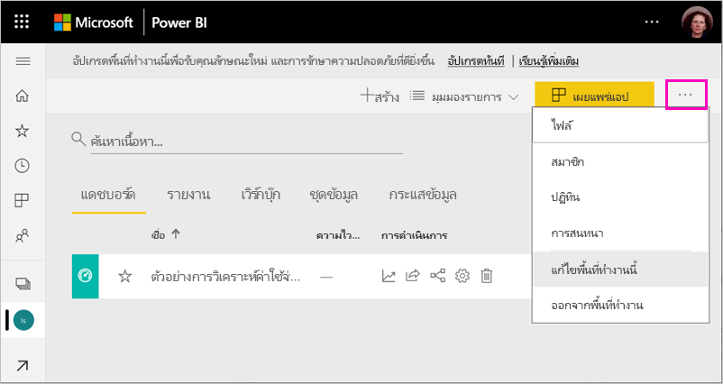
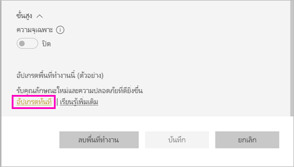
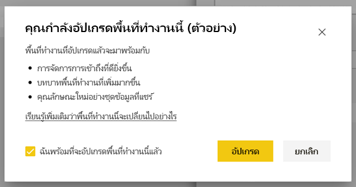
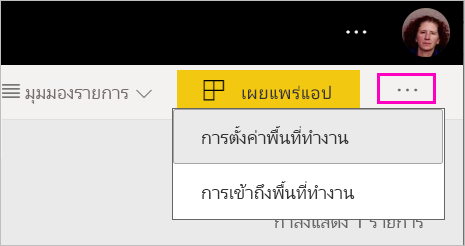
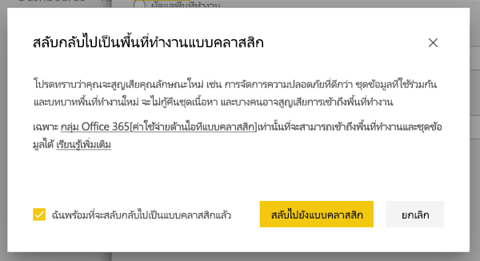

# อัปเกรดพื้นที่ทำงานแบบคลาสสิกเป็นพื้นที่งานใหม่ใน Power BI

บทความนี้อธิบายวิธีการอัปเกรดหรือ *โยกย้าย* พื้นที่ทำงานแบบคลาสสิกเป็นการใช้งานพื้นที่ทำงานใหม่ คุณสามารถอัปเกรดพื้นที่ทำงานแบบคลาสสิกใดๆ ก็ได้ พื้นที่ทำงานใหม่มีบทบาทพื้นที่ทำงานที่ละเอียดมากขึ้นเพื่อให้คุณสามารถจัดการการเข้าถึงเนื้อหาได้ดีขึ้น คุณยังมีความยืดหยุ่นในการจัดการพื้นที่ทำงานที่อัปเกรดได้มากขึ้นเนื่องจากมีการเชื่อมต่อกับกลุ่ม Office 365 เดิมได้อย่างอิสระมากขึ้น ดูข้อมูลเกี่ยวกับ[การใช้งานพื้นที่ทำงานใหม่](service-new-workspaces.md) 

>[!NOTE]
>การอัปเกรดพื้นที่ทำงานจะพร้อมใช้งานเป็นการแสดงตัวอย่างแบบสาธารณะ 

แต่อาจมีการเปลี่ยนแปลงในพื้นที่ทำงานที่คุณจำเป็นต้องทราบและวางแผน ตัวอย่างเช่น ชุดเนื้อหาไม่รองรับในพื้นที่ทำงานใหม่ โปรดดูหัวข้อ [ข้อควรพิจารณาและข้อจำกัดของการอัปเกรด](#upgrade-considerations-and-limitations)ภายในบทความนี้

## สิ่งที่ต้องทำหลังจากอัปเกรด

คุณควรทำสิ่งต่างๆ หลายอย่าง*หลังจาก* อัปเกรด วิธีที่ดีที่สุดคือการวางแผน *ก่อน*คุณอัปเกรด ดังนี้
- ตรวจสอบรายการการเข้าถึงและทำความเข้าใจ[สิทธิ์ หลังจากการอัปเกรด](#permissions-after-upgrade)
- ตรวจสอบ[รายชื่อผู้ติดต่อ](#modify-the-contact-list)และตรวจสอบให้แน่ใจว่ามีการตั้งค่าตามที่คุณต้องการ
- หากคุณยังไม่ได้วางแผน โปรดดูข้อมูลเกี่ยวกับ[การใช้งานพื้นที่ทำงานใหม่](service-new-workspaces.md)

## อัปเกรดพื้นที่ทำงานแบบคลาสสิก

ผู้ดูแลพื้นที่ทำงานต่างๆ สามารถอัปเกรดพื้นที่ทำงานได้ สำหรับพื้นที่ทำงานแบบคลาสสิก หากเป็นเป็นผู้ดูแลพื้นที่ทำงาน คุณจะต้องเป็นเจ้าของกลุ่ม Office 365 พื้นฐาน หากต้องการอัปเกรดพื้นที่ทำงาน ให้ทำตามขั้นตอนต่อไปนี้

1. ในรายการเนื้อหาพื้นที่ทำงาน ให้เลือก**ตัวเลือกเพิ่มเติม** ( **...** ) > **แก้ไขพื้นที่ทำงานนี้**

    

1. ขยาย**ขั้นสูง**และเลือก**อัปเกรดทันที**

    

1. ตรวจสอบข้อมูลของกล่องโต้ตอบ คุณจะเห็นคำเตือนหากเผยแพร่หรือติดตั้งชุดเนื้อหาในพื้นที่ทำงานแล้ว เมื่อคุณพร้อมแล้ว ให้เลือก**ฉันพร้อมที่จะอัปเกรดพื้นที่ทำงานนี้** แล้วเลือก **อัปเกรด**

    

2. ในระหว่างการอัปเกรด คุณจะเห็นข้อความ**การอัปเกรด** โดยปกติแล้วจะใช้เวลาน้อยกว่า 1 นาทีในการอัปเกรดพื้นที่ทำงานของคุณ

1. หลังจากเสร็จสิ้นการอัปเกรด คุณจะเห็นกล่องโต้ตอบ**สำเร็จ** เราขอแนะนำให้อ่าน[จัดระเบียบการทำงานในพื้นที่ทำงานใหม่ใน Power BI](service-new-workspaces.md) เพื่อให้คุ้นเคยกับวิธีการใช้งานพื้นที่ทำงานใหม่ที่แตกต่างจากพื้นที่ทำการแบบคลาสสิก

### ผลกระทบต่อผู้ใช้พื้นที่ทำงานรายอื่น

เราขอแนะนำให้อัปเกรดในช่วงนอกเวลางานเมื่อจำนวนผู้ใช้ดูหรือแก้ไขรายการในพื้นที่ทำงานน้อยลง

ผู้ใช้ที่กำลังใช้พื้นที่ทำงานจะถูกขอให้รีเฟรชเบราว์เซอร์ ผู้ใช้ที่กำลังแก้ไขรายงานจะได้มีตัวเลือกในการบันทึกก่อนที่จะรีเฟรช

## ข้อควรพิจารณาและข้อจำกัดของการอัปเกรด

- URL และรหัส ของพื้นที่ทำงานของคุณ เนื้อหาที่มี และแอปที่เผยแพร่จากพื้นที่ทำงานจะไม่เปลี่ยนแปลง เนื้อหาจากชุดเนื้อหาที่ติดตั้งในพื้นที่ทำงานจะได้รับการจัดการแยกต่างหาก ดู[ชุดเนื้อหาระหว่างอัปเกรด](#content-packs-during-upgrade)ในบทความนี้สำหรับรายละเอียด
- ชุดเนื้อหาไม่รองรับในการใช้งานพื้นที่ทำงานใหม่ อ่านหัวข้อเกี่ยวกับ[ชุดเนื้อหาที่เผยแพร่](#published-content-packs)หรือ[ชุดเนื้อหาที่ติดตั้ง](#installed-content-packs)เพื่อดูข้อมูลเกียวกับวิธีการจัดการระหว่างอัปเกรด เราขอแนะนำให้ลบชุดเนื้อหาที่ติดตั้งหรือเผยแพร่ในพื้นที่ทำงานของคุณก่อนที่คุณจะทำการอัปเกรด
- กลุ่ม Office 365 สำหรับพื้นที่ทำงานแบบคลาสสิกขจะไม่ได้รับผลกระทบจากการอัปเกรดพื้นที่ทำงานใน Power BI ทีมงาน, เว็บไซต์  SharePoint, กล่องจดหมาย หรือทรัพยากรอื่นๆที่จัดการโดย Office 365 จะไม่มีการเปลี่ยนแปลง ทั้งหมดจะยังคงใช้งานได้เหมือนเดิมหลังจากอัปเกรดพื้นที่ทำงาน Power BI กลุ่ม Office 365 จะยังคงอยู่เหมือนก่อนหน้านี้
- มีการเปลี่ยนแปลงวิธีการรักษาความปลอดภัยพื้นที่ทำงานของคุณหลังจากการอัปเกรด โปรดดูหัวข้อ[สิทธิ์พื้นที่ทำงานหลังอัปเกรด](#permissions-after-upgrade)สำหรับรายละเอียดเพิ่มเติม
- ตัวเลือกในการ**ย้อนกลับไปยังพื้นที่ทำงานแบบคลาสสิก**จะยังมีให้เลือกในกรณีที่คุณต้องการ แต่จะไม่คืนค่าบางลักษณะของพื้นที่ทำงานก่อนที่จะอัปเกรด หากเริ่มใช้ฟีเจอร์ที่ทำงานเฉพาะในพื้นที่ทำงานใหม่เท่านั้น คุณจะไม่ย้อนกลับไปไม่ได้ ตัวเลือกย้อนกลับจะใช้ได้เป็นเวลา 30 วันหลังจากอัปเกรด

## สิทธิ์หลังจากอัปเกรด

เลือก**สิทธิ์เข้าถึง**ในแถบเมนูที่ด้านบนของรายการเนื้อหาพื้นที่ทำงานเพื่อตรวจสอบสิทธิ์หลังจากอัปเกรด

ระบบจะเพิ่มเจ้าของกลุ่ม Office 365 แต่ละรายไปยังบทบาทผู้ดูแลระบบสำหรับพื้นที่ทำงานที่อัปเกรด กลุ่ม Office 365 ก็จะถูกเพิ่มไปยังบทบาทพื้นที่ทำงานด้วยเช่นกัน บทบาทที่เพิ่มจะขึ้นอยู่กับว่าพื้นที่ทำงานแบบคลาสสิกเป็นประเภท*อ่านอย่างเดียว*หรือ*อ่านและเขียน*

- เมื่อตั้งค่าพื้นที่ทำงานเป็น**สมาชิกสามารถแก้ไขเนื้อหา Power BI** กลุ่ม Office 365 หลังจากอัปเกรดจะเพิ่มไปยังรายการสิทธิ์เข้าถึงพื้นที่ทำงานด้วยบทบาท**สมาชิก**
- เมื่อตั้งค่าพื้นที่ทำงานเป็น**สมาชิกดูเนื้อหา Power BI ได้เท่านั้น** กลุ่ม Office 365 หลังจากอัปเกรดจะเพิ่มไปยังรายการสิทธิ์เข้าถึงพื้นที่ทำงานด้วยบทบาท**ผู้ชม**

เนื่องจากกลุ่ม Office 365 ได้รับบทบาทในพื้นที่ทำงาน ผู้ใช้ใดๆ ที่เพิ่มไปยังกลุ่ม Office 365 หลังจากอัปเกรดจะมีบทบาทนั้นในพื้นที่ทำงาน แต่หากคุณเพิ่มเจ้าของใหม่ไปยังกลุ่ม Office 365 หลังจากอัปเกรด เจ้าของนั้นก็จะไม่มีบทบาทผู้ดูแลระบบสำหรับพื้นที่ทำงาน

### ความแตกต่างระหว่างบทบาทก่อนและหลังอัปเกรด

บทบาทพื้นที่ทำงานจะแตกต่างในพื้นที่ทำงานแบบคลาสสิกและแบบใหม่ การใช้งานพื้นที่ทำงานใหม่ช่วยให้คุณสามารถกำหนดบทบาทพื้นที่ทำงานให้กับกลุ่ม Office 365, กลุ่มรักษาความปลอดภัย หรือรายการแจกจ่ายได้

- **สมาชิก**สามารถแชร์แต่ละรายการและให้สิทธิ์เข้าถึงพื้นที่ทำงานทั้งหมดผ่านบทบาทสมาชิก ผู้สนับสนุน หรือผู้ชมได้
- **ผู้ชม**สามารถดูเนื้อหาได้เท่านั้นและไม่สามารถส่งออกข้อมูลเบื้องต้นหรือวิเคราะห์ใน Excel สำหรับชุดข้อมูลพื้นที่ทำงานใดๆ ได้เว้นแต่ว่าจะมีสิทธิ์ในการสร้าง

ผู้ใช้ใดๆ ที่มีสิทธิ์เข้าถึงรายการในพื้นที่ทำงานผ่านสิทธิ์การแชร์หรือสิทธิ์ของแอปจะเข้าถึงรายการเหล่านั้นได้ต่อไป ทุกคนที่มีสิทธิ์เข้าถึงพื้นที่ทำงานจะมีสิทธิ์เข้าถึงแอปที่เผยแพร่จากพื้นที่ทำงาน ผู้ใช้เหล่านี้ไม่ได้อยู่ในรายการสิทธิ์เข้าถึงแอป

เราขอแนะนำให้ประเมินว่าจะใช้บทบาทผู้สนับสนุนใหม่หรือไม่ หลังจากอัปเกรด คุณสามารถเปลี่ยนกลุ่ม Office 365 ให้มีบทบาทผู้สนับสนุนในบานหน้าต่างสิทธิ์เข้าถึง

หลังอัปเกรด คุณอาจพิจารณาการสร้างกลุ่มการรักษาความปลอดภัยหรือ Office  365 หรือรายการแจกจ่ายสำหรับผู้ดูแลพื้นที่ทำงาน แทนการจัดการสิทธิ์เข้าถึงผ่านการมอบหมายบทบาทให้กับผู้ใช้แต่ละราย

อ่านเพิ่มเติมเกี่ยวกับ[บทบาทในพื้นที่ทำงานใหม่](service-new-workspaces.md#roles-in-the-new-workspaces)

## การออกใบอนุญาตหลังอัปเกรด

ผู้ใช้ในบทบาทผู้ดูแลระบบ สมาชิก หรือผู้สนับสนุนของพื้นที่ทำงานจะต้องมีใบอนุญาต Power BI Pro เพื่อเข้าถึงพื้นที่ทำงาน

หากพื้นที่ทำงานอยู่ในความจุที่ใช้ร่วมกัน ผู้ใช้ในบทบาทพื้นที่งานของผู้ชมต้องมีใบอนุญาต Power BI Pro เพื่อเข้าถึงพื้นที่ใช้งานเช่นกัน แต่หากพื้นที่ทำงานอยู่ในความจุแบบพรีเมียม ผู้ใช้ในบทบามผู้ชมก็ไม่จำเป็นต้องมีใบอนุญาต Pro เพื่อเข้าถึงพื้นที่ทำงาน

## ฟีเจอร์พื้นที่ทำงานใหม่

พื้นที่ทำงานใหม่มีฟีเจอร์ที่พื้นที่ทำงานแบบคลาสสิกไม่มี สิ่งที่แตกต่างกันคือความสามารถในการตั้งค่ารายชื่อผู้ติดต่อที่แตกต่างจากผู้ดูแลระบบหรือเจ้าของพื้นที่ทำงาน สิ่งที่มีเหมือนกันคือคุณยังคงเชื่อมต่อกับไลบรารีเอกสาร SharePoint ของกลุ่ม Office 365 ได้ 

### แก้ไขรายชื่อผู้ติดต่อ

1. เลือก**การตั้งค่า**ในแถบเมนูที่ด้านบนของรายการเนื้อหาพื้นที่ทำงานเพื่อเข้าถึงการตั้งค่าพื้นที่ทำงาน

    

2. ในหัวข้อ**ขั้นสูง** **รายชื่อผู้ติดต่อ**ของพื้นที่ทำงานจะถูกกำหนดค่าเป็นกลุ่ม Office 365 ที่มีการอัปเกรดพื้นที่ทำงาน คุณจะเพิ่มผู้ใช้หรือกลุ่มไปยังรายชื่อผู้ติดต่อหรือสลับไปยังผู้ดูแลระบบพื้นที่ทำงานได้

    

### OneDrive ของพื้นที่ทำงาน 

หลังจากอัปเกรด **OneDrive** ของพื้นที่ทำงานจะเชื่อมต่อกับไลบรารีเอกสาร SharePoint ของกลุ่ม Office 365 ไลบรารีเอกสารจะแสดงเป็นตัวเลือก **OneDrive** ใน**รับข้อมูล > ไฟล์** โปรดทราบว่าผู้ใช้พื้นที่ทำงานบางรายอาจไม่ได้รับสิทธิ์เช้าถึงไลบรารีเอกสารนั้นหากไม่ได้อยู่ในกลุ่ม Office  365

## ชุดเนื้อหาระหว่างอัปเกรด

พื้นที่งานใหม่ไม่รองรับชุดเนื้อหา แต่ใช้แอปและชุดข้อมูลที่แชร์เพื่อเผยแพร่เนื้อหาในพื้นที่ทำงานได้ เราขอแนะนำให้ลบชุดเนื้อหาที่เผยแพร่หรือติดตั้งออกจากพื้นที่ทำงานก่อนที่จะอัปเกรด แต่หากมีการเผยแพร่หรือติดตั้งชุดเนื้อหาเมื่อคุณอัปเกรด กระบวนการอัปเกรดจะพยายามรักษาเนื้อหาตามที่อธิบายไว้ด้านล่าง  ไม่มีวิธีการคืนค่าชุดเนื้อหาหรือความสัมพันธ์ของเนื้อหาไปยังชุดเนื้อหาหลังจากที่คุณอัปเกรด

### ชุดเนื้อหาที่เผยแพร่

ชุดเนื้อหาที่เผยแพร่จากพื้นที่ทำงานจะถูกลบออกในระหว่างอัปเกรด คุณจะไม่สามารถเผยแพร่หรืออัปเดตได้หลังจากอัปเกรด แม้ว่าคุณจะย้อนกลับไปยังพื้นที่ทำงานแบบคลาสสิกก็ตาม หากผู้อื่นติดตั้งชุดเนื้อหาของคุณในพื้นที่ทำงานของตนเองหลังจากอัปเกรด พวกเขาจะเห็นสำเนาของเนื้อหาชุดเนื้อหาในพื้นที่ทำงานของตนเอง ดูหัวข้อ**ชุดเนื้อหาที่ติดตั้ง**สำหรับรายละเอียดเพิ่มเติม

### ชุดเนื้อหาที่ติดตั้ง

เมื่อคุณอัปเกรดพื้นที่ทำงานชหรือพื้นที่ทำงานที่อัปเกรดชุดเนื้อหาที่เผยแพร่ การเปลี่ยนแปลงสำคัญจะเกิดขึ้นกับชุดเนื้อหาที่ติดตั้ง หลังจากอัปเกรด พื้นที่ทำงานของคุณจะมีสำเนาของเนื้อหาชุดเนื้อหา ซึ่งเชื่อมต่อกับชุดข้อมูลต้นฉบับในพื้นที่ทำงานเดิม

แต่มีการเปลี่ยนแปลงที่สำคัญ ดังนี้

- ไม่มีการอัปเดตเนื้อหาเมื่อมีการอัปเดตใดๆ
- URL และตัวระบุรายการจะเปลี่ยนแปลงและต้องใช้บุ๊กมาร์กหรือลิงก์ที่คุณแชร์กับผู้อื่นเพื่ออัปเดต
- การกำหนดค่าของผู้ใช้ ในชุดเนื้อหาต้นฉบับจากพื้นที่ทำงานของคุณจะสูญหายไป การกำหนดค่า ได้แก่ การสมัครใช้งาน การแจ้งเตือน บุ๊กมาร์กส่วนตัว ตัวกรองแบบถาวร และรายการโปรด
- ผู้ใช้ใหม่อาจไม่มีสิทธิ์ในการเข้าถึงชุดข้อมูลที่อยู่ในชุดเนื้อหา คุณจำเป็นต้องทำงานกับเจ้าของชุดข้อมูลเพื่อตรวจสอบว่าผู้ใช้พื้นที่ทำงานมีสิทธิ์เข้าถึงข้อมูล

## ย้อนกลับไปยังพื้นที่ทำงานแบบคลาสสิก

ในฐานะที่เป็นส่วนหนึ่งของการอัปเกรด คุณมีตัวเลือกที่จะย้อนกลับไปยังพื้นที่ทำงานแบบคลาสสิกเป็นเวลา 30 วันหลังจากอัปเกรด ความสามารถนี้จะคืนค่าการเชื่อมโยงของเนื้อหาพื้นที่ทำงานด้วยกลุ่ม Office 365 เดิม ซึ่งใช้ได้ในกรณีที่องค์กรของคุณพบปัญหาใหญ่ในการใช้งานพื้นที่ทำงานใหม่ แต่ก็มีข้อจำกัดเช่นกัน โปรดอ่าน[ข้อควรพิจารณาสำหรับการเปลี่ยนกลับไปใช้แบบคลาสสิก](#considerations-for-switching-back-to-classic)ในบทความนี้ก่อน

หากต้องการย้อนกลับ คุณต้องเป็นเจ้าของกลุ่ม Office 365 ที่เชื่อมโยงกับพื้นที่ทำงานก่อนอัปเกรด ทำตามขั้นตอนเหล่านี้

1. ในรายการเนื้อหาพื้นที่ทำงาน ให้เลือก**ตัวเลือกเพิ่มเติม** ( **…** )  > **การตั้งค่าพื้นที่ทำงาน**

    

1. ขยาย**ขั้นสูง**และเลือก**เปลี่ยนกลับไปใช้แบบคลาสสิก** หากตัวเลือกนี้ใช่ไม่ได้ โปรดดู[ข้อควรพิจารณาสำหรับการเปลี่ยนกลับไปใช้แบบคลาสสิก](#considerations-for-switching-back-to-classic)ในบทความนี้

    

1. เมื่อคุณพร้อม ให้เลือกช่อง**ฉันพร้อมเปลี่ยนกลับไปใช้แบบคลาสสิก** และเลือก**เปลี่ยนไปใช้แบบคลาสสิก** คุณอาจเห็นคำเตือนหรือตัวบล็อกในกล่องโต้ตอบนี้ อ่าน[ข้อควรพิจารณาสำหรับการเปลี่ยนกลับ](#considerations-for-switching-back-to-classic)ในบทความนี้้หากคุณพบปัญหาเหล่านี้

    

1. เมื่อเปลี่ยนกลับไปใช้สำเร็จ คุณจะเห็นกล่องโต้ตอบการยืนยัน

    

### อควรพิจารณาสำหรับการเปลี่ยนกลับไปใช้แบบคลาสสิก

คุณจะเปลี่ยนกลับไปใช้ไม่ได้หากรายการเกี่ยวกับพื้นที่ทำงานต่อไปนี้เป็นจริง

- กลุ่ม Office 365 ถูกลบ
- ระยะเวลามากว่า 30 วันตั้งแต่คุณอัปเกรด
- ชุดข้อมูลในพื้นที่ทำงานมีการใช้งานในรายงานหรือแดชบอร์ดในพื้นที่งานอื่นๆ เหตุการณ์นี้เกิดขึ้นได้อย่างไร สมมติว่าคุณได้เผยแพร่ชุดเนื้อหาจากพื้นที่ทำงานก่อนที่จะอัปเกรดและมีคนติดตั้งชุดเนื้อหาในพื้นที่ทำงานอื่น ทันทีหลังจากการอัปเกรด ชุดข้อมูลจะถูกใช้โดยรายงานและแดชบอร์ดที่อยู่ในชุดเนื้อหานั้น
- พื้นที่ทำงานเป็นส่วนหนึ่งของไปป์ไลน์การจัดการวงจรของแอปพลิเคชัน
- พื้นที่ทำงานใช้สำหรับแอปแบบแม่แบบ
- พื้นที่ทำงานใช้ความสามารถของแบบจำลองขนาดใหญ่
- พื้นที่ทำงานใช้ฟีเจอร์เมตริกการใช้งานใหม่

เมื่อเปลี่ยนกลับไปใช้พื้นที่ทำงานแบบคลาสสิก ระบบจะไม่คืนค่าสำเนาพื้นที่ทำงานดั้งเดิม การเปลี่ยนแปลงมีดังต่อไปนี้

- สิทธิ์สำหรับพื้นที่ทำงานได้รับการตั้งค่าโดยกลุ่ม Office 365 ซึ่งเชื่อมต่อกับพื้นที่ทำงานที่อัปเกรด
  - ผู้ดูแลใดของกลุ่ม Office 365 จะเป็นผู้ดูแลระบบของพื้นที่ทำงานแบบคลาสสิก
  - สมาชิกใดของกลุ่ม Office 365 จะกลายเป็นสมาชิกของพื้นที่ทำงานแบบคลาสสิก หากตั้งค่าพื้นที่ทำงานแบบคลาสสิกเป็น**สมาชิกอ่านเนื้อหา Power BI ได้เท่านั้น** ระบบจะคืนค่าการตั้งค่านี้
  - ผู้ใช้หรือกลุ่มผู้ใช้ใด ๆ ที่เพิ่มไปยังพื้นที่ทำงานหลังจากการอัปเกรดเสร็จสมบูรณ์ (นอกกลุ่ม Office 365) จะสูญเสียสิทธิ์เข้าถึงพื้นที่ทำงาน เพิ่มลงในกลุ่ม office 365 เพื่อให้เข้าถึงได้ โปรดทราบว่ากลุ่ม Office 365 ไม่อนุญาตให้มีกลุ่มที่การรักษาความปลอดภัยหรือกลุ่มการแจกจ่ายที่ซ้อนกันในการเป็นสมาชิก
  - ผู้ใช้ที่ได้รับสิทธิ์เข้าถึงแอปสำหรับพื้นที่ทำงานจะยังคงเข้าถึงแอปได้
  - ผู้ใช้ที่ได้รับสิทธิ์เข้าถึงรายการในพื้นที่ทำงานผ่านการแชร์จะยังคงเข้าถึงได้
- ชุดเนื้อหาที่เผยแพร่จากพื้นที่ทำงานแบบคลาสสิกก่อนอัปเกรดจะไม่คืนค่า
- ชุดเนื้อหาที่ติดตั้งในพื้นที่ทำงานคลาสสิกก่อนอัปเกรดจะไม่คืนค่า
- การสมัครสมาชิกที่สร้างขึ้นโดยผู้ใช้ในพื้นที่ทำงานหลังจากอัปเกรดจะถูกลบออก การสมัครใช้งานที่มีอยู่ก่อนอัปเกรดจะยังคงใช้งานได้ต่อไป
- การแจ้งเตือนข้อมูลจะไม่ถูกเก็บไว้ ไฟล์เหล่านี้จะถูกลบออก
- หากคุณเปลี่ยนชื่อพื้นที่ทำงานหลังจากอัปเกรด ชื่อของพื้นที่ทำงานจะถูกคืนค่าให้ตรงกับชื่อของกลุ่ม Office 365
- การดำเนินการที่กำลังดำเนินอยู่ เช่น การรีเฟรชจะไม่ได้รับผลกระทบจากการอัปเกรดพื้นที่ทำงาน

## จัดการการย้ายข้อมูลไปยังพื้นที่ทำงานใหม่สำหรับผู้ที่เป็นเจ้าของ 

บางองค์กรต้องการย้ายพื้นที่ทำงานหลายรายการหรือทั้งหมดไปยังพื้นที่ทำงานใหม่ เครื่องมือการอัปเกรดพื้นที่ทำงานมุ่งเน้นไปที่การเปิดใช้งานผู้ดูแลระบบพื้นที่ทำงานเพื่ออัปเกรด สำหรับองค์กรที่ต้องการจัดการกระบวนการดังกล่าว พวกเขาสามารถทำตามขั้นตอนต่อไปนี้ได้

1. รายการพื้นที่ทำงานในพอร์ทัลผู้ดูแลระบบ Power BI และ API ที่สอดคล้องกันจะแสดงรายการของพื้นที่ทำงานทั้งหมดใน Power BI พื้นที่ทำงานแบบคลาสสิกจะแสดงเป็นกลุ่มชนิดในรายการ
2. ทำงานร่วมกับเจ้าของกลุ่ม Office 365 แต่ละคนหรือกับผู้ดูแลระบบ Office 365 ของคุณเพื่อให้พวกเขาอัปเกรดพื้นที่ทำงาน ถ้าคุณต้องการอัปเกรดพื้นที่ทำงาน คุณจะต้องเป็นเจ้าของกลุ่ม

ความสามารถในการอัปเกรดพื้นที่ทำงานจะไม่มีเครื่องมือสำหรับการอัปเกรดเป็นกลุ่มหรือทางโปรแกรม นอกจากนี้กลุ่ม Office 365 ใหม่ที่สร้างขึ้นในองค์กรของคุณจะยังคงปรากฏใน Power BI 
   
   
## รับทราบปัญหาแล้ว

มีปัญหาที่ทราบหลายอย่างที่คุณอาจพบ:
- หลังจากการอัปเกรด ผู้ใช้อาจเห็นกล่องโต้ตอบคำเตือน "ความล้มเหลวในการโหลดแบบจำลอง" ข้อความนี้แสดงอย่างไม่ถูกต้องและสามารถละเว้นได้ 
- หลังจากการอัปเกรด ชื่อพื้นที่ทำงานบางชื่อจะแตกต่างจากรุ่นก่อนที่จะอัปเกรด เมื่อเหตุการณ์นี้เกิดขึ้น ชื่อพื้นที่ทำงานจะแปลงกลับเป็นชื่อก่อนหน้าสำหรับพื้นที่ทำงาน หรือชื่อพื้นที่ทำงานจะเป็นค่าว่าง เมื่อต้องการแก้ไขปัญหานี้ ให้เปลี่ยนชื่อพื้นที่ทำงานเป็นชื่อที่ต้องการ
- หลังจากการอัปเกรดพื้นที่ทำงานที่มีชุดเนื้อหาที่ติดตั้งไว้ คุณอาจเห็นแดชบอร์ดเพิ่มเติมในพื้นที่ทำงานที่ไม่สามารถมองเห็นได้ก่อนการอัปเกรด ปัญหานี้เกิดขึ้นในบางกรณีที่ชุดเนื้อหายังไม่ได้รับการอัปเดตเมื่อเร็ว ๆ นี้ คุณสามารถลบแดชบอร์ดเหล่านี้ได้อย่างปลอดภัย

## ขั้นตอนถัดไป

* [จัดการงานในประสบการณ์พื้นที่ทำงานใหม่](service-new-workspaces.md)
* [สร้างพื้นที่ทำงานใหม่](service-create-the-new-workspaces.md)
* [สร้างพื้นที่ทำงานแบบคลาสสิก](service-create-workspaces.md)
* มีคำถามหรือไม่ [ลองถามชุมชน Power BI](https://community.powerbi.com/)
